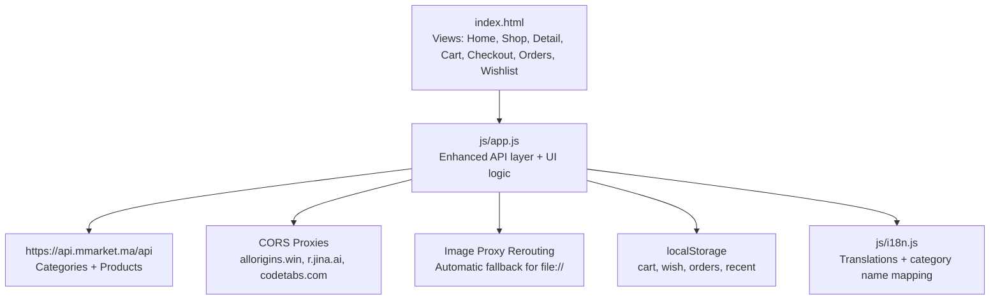
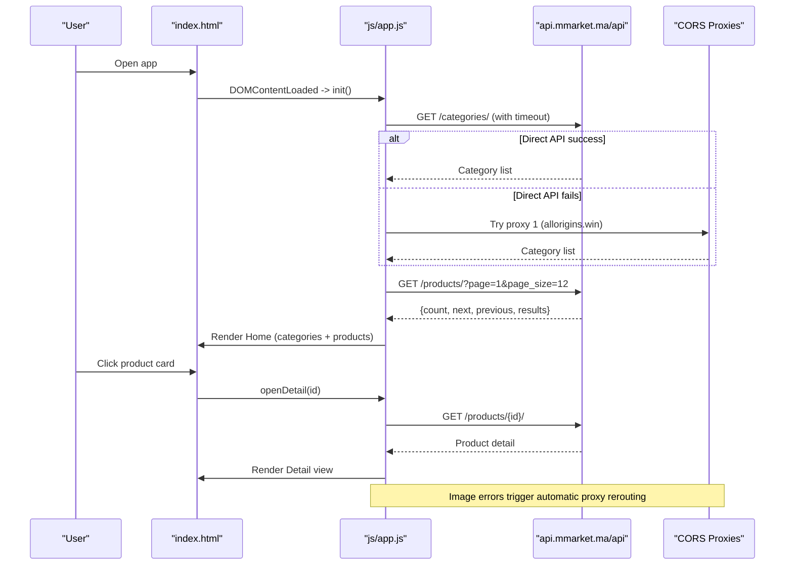
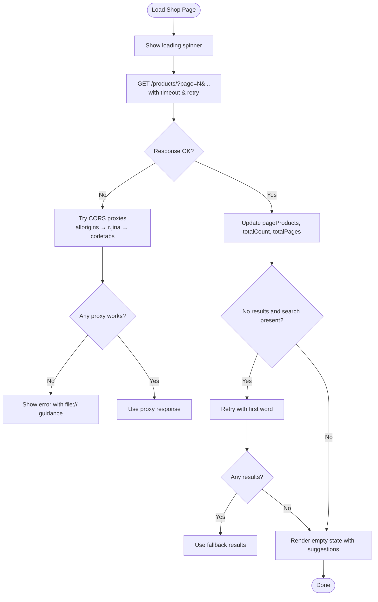
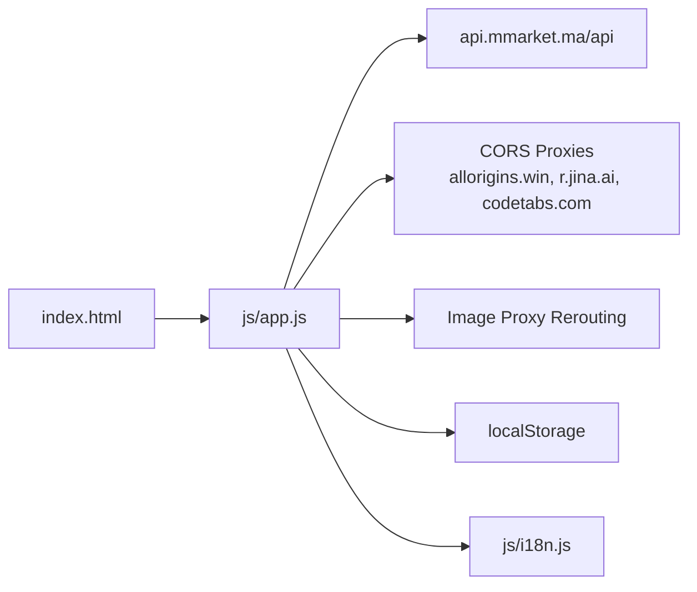

# API Integration

<cite>
**Referenced Files in This Document**
- [app.js](file://js/app.js)
- [index.html](file://index.html)
- [i18n.js](file://js/i18n.js)
</cite>

## Update Summary
**Changes Made**
- Enhanced network layer with comprehensive CORS proxy fallback system
- Added automatic image proxy rerouting for file:// protocol compatibility
- Implemented centralized apiJSON() function with retry strategies and timeout handling
- Improved error handling with specific file:// protocol detection and guidance
- Updated network request management to handle multiple proxy services

## Table of Contents
1. [Introduction](#introduction)
2. [Project Structure](#project-structure)
3. [Core Components](#core-components)
4. [Architecture Overview](#architecture-overview)
5. [Detailed Component Analysis](#detailed-component-analysis)
6. [Dependency Analysis](#dependency-analysis)
7. [Performance Considerations](#performance-considerations)
8. [Troubleshooting Guide](#troubleshooting-guide)
9. [Conclusion](#conclusion)
10. [Appendices](#appendices)

## Introduction
This document describes the enhanced external service integration for AM MARKET with the product catalog API at https://api.mmarket.ma/api. The application now features a robust CORS proxy fallback system, automatic image proxy rerouting, centralized API request handling with retry strategies, timeout management, and improved error handling specifically designed for file:// protocol usage. It covers endpoints used to fetch categories and products, request/response schemas inferred from usage, error handling strategies, data caching mechanisms, network request management, loading states, offline behavior considerations, examples of API calls made by the application, data transformation processes, integration patterns for displaying product information, security considerations, rate limiting approaches, debugging techniques, and guidance for extending or modifying the integration.

## Project Structure
The integration is implemented as a client-side JavaScript module that:
- Loads UI views via index.html
- Fetches categories and products from the remote API with automatic CORS proxy fallback
- Caches product details locally in memory
- Persists cart, wishlist, orders, and recently viewed items in localStorage
- Renders lists, detail pages, and checkout summaries using fetched data
- Handles image loading through automatic proxy rerouting for file:// protocol compatibility

**Diagram sources**
- [index.html:1-477](file://index.html#L1-L477)
- [app.js:1-1158](file://js/app.js#L1-L1158)
- [i18n.js:282-346](file://js/i18n.js#L282-L346)

**Section sources**
- [index.html:1-477](file://index.html#L1-L477)
- [app.js:1-1158](file://js/app.js#L1-L1158)

## Core Components
- **Enhanced API Layer**: Centralized apiJSON() function with timeout handling and retry strategies
- **CORS Proxy System**: Multiple proxy services (allorigins.win, r.jina.ai, codetabs.com) for automatic fallback
- **Image Proxy Rerouting**: Automatic image loading through proxies when direct access fails
- **Data fetching functions**:
  - Categories: fetches top-level categories (excluding a specific ID)
  - Products: paginated listing with optional category filter and search query
  - Product detail: fetches a single product by ID with in-memory caching
- **UI state and rendering**:
  - Maintains current page, filters, sort order, and total counts
  - Renders home categories, product grids, pagination, and detail view
- **Local storage**:
  - Persists cart, wishlist, orders, and recently viewed items
- **Internationalization**:
  - Uses i18n keys for user-facing messages and maps category names to English display names

**Section sources**
- [app.js:7-84](file://js/app.js#L7-L84)
- [app.js:117-183](file://js/app.js#L117-L183)
- [app.js:539-583](file://js/app.js#L539-L583)
- [app.js:586-698](file://js/app.js#L586-L698)
- [app.js:700-832](file://js/app.js#L700-L832)
- [app.js:874-924](file://js/app.js#L874-L924)
- [app.js:926-1158](file://js/app.js#L926-L1158)
- [i18n.js:282-346](file://js/i18n.js#L282-L346)

## Architecture Overview
The application follows an enhanced client-side architecture with robust network resilience:
- Views are toggled based on user actions
- Data is fetched on demand with automatic CORS proxy fallback and retry strategies
- Images are automatically rerouted through proxies when direct access fails
- UI updates reflect local state changes and API responses
- Errors are caught and surfaced to users with localized messages and file:// protocol guidance

**Diagram sources**
- [app.js:926-1158](file://js/app.js#L926-L1158)
- [app.js:117-183](file://js/app.js#L117-L183)
- [app.js:586-698](file://js/app.js#L586-L698)

## Detailed Component Analysis

### Enhanced API Endpoints Used
- **Categories**
  - Endpoint: GET /categories/
  - Purpose: Retrieve top-level categories; excludes a specific category ID
  - Response shape used: Array or object with results array; each item includes id, name, parent_id, product_count
  - Usage: Called during initialization to populate sidebar and category grid
  - **Enhancement**: Automatic CORS proxy fallback with timeout handling

- **Products (listing)**
  - Endpoint: GET /products/?include_descendants=true&page={page}&page_size=12&category={categoryId?}&search={query?}
  - Purpose: Paginated product listing with optional category and search filters
  - Response shape used: Object with count, next, previous, results; each result includes fields like id, name, price, image_url, brand_name, discount_percent, original_price, is_available, is_promo, weight_volume, description, category/category_name
  - Usage: Called to render home products, shop listings, and pagination
  - **Enhancement**: Retry strategy with multiple proxy services

- **Product detail**
  - Endpoint: GET /products/{id}/
  - Purpose: Retrieve detailed product information
  - Response shape used: Same fields as listing plus additional detail fields
  - Usage: Called when opening product detail view; also cached in memory
  - **Enhancement**: Timeout protection and automatic proxy fallback

**Section sources**
- [app.js:117-183](file://js/app.js#L117-L183)
- [app.js:539-583](file://js/app.js#L539-L583)
- [app.js:586-698](file://js/app.js#L586-L698)

### Enhanced Request Flow and Loading States
- **Initialization flow**:
  - Fetch categories and first page of products with timeout protection
  - On failure, show localized error message with file:// protocol guidance
  - Automatic CORS proxy fallback if direct API access fails

- **Shop page flow**:
  - Show spinner while loading
  - Fetch products with filters and search using centralized apiJSON()
  - If no results, attempt smart fallback using the first word of the search query
  - Update pagination and product grid
  - On failure, show localized error and hide pagination

- **Detail view flow**:
  - Show spinner while loading
  - Fetch product detail with timeout protection; cache it in memory
  - Render detail content and related products
  - On failure, show localized "not found" message

**Diagram sources**
- [app.js:545-583](file://js/app.js#L545-L583)
- [app.js:135-151](file://js/app.js#L135-L151)

**Section sources**
- [app.js:539-583](file://js/app.js#L539-L583)
- [app.js:926-1158](file://js/app.js#L926-L1158)

### Data Transformation and Display
- **Category icons**:
  - If the API returns a generic icon, the app substitutes a curated mapping based on category names (French and English)
- **Price formatting**:
  - Prices are parsed and rounded, then appended with currency symbol
- **Brand and availability**:
  - Brand name displayed if present; otherwise default label
  - Availability badge derived from is_available flag
- **Promotions**:
  - Discount percent and original price used to show sale badges and strikethrough pricing
- **Related products**:
  - Filtered from already loaded products by matching category or category_name; falls back to other products if needed
- **Image handling**:
  - Automatic proxy rerouting for images that fail to load due to CORS restrictions

**Section sources**
- [app.js:10-59](file://js/app.js#L10-L59)
- [app.js:145-148](file://js/app.js#L145-L148)
- [app.js:206-241](file://js/app.js#L206-L241)
- [app.js:586-698](file://js/app.js#L586-L698)
- [app.js:154-162](file://js/app.js#L154-L162)
- [i18n.js:282-346](file://js/i18n.js#L282-L346)

### Caching Mechanisms
- **In-memory product cache**:
  - A dictionary keyed by product ID stores fetched product details to avoid repeated network calls
- **Client-side filtering**:
  - After fetching a page, the app applies client-side filters (price range, availability, promo, brand) and sorting without additional network requests
- **LocalStorage persistence**:
  - Cart, wishlist, orders, and recently viewed items are persisted to localStorage for resilience across sessions
- **Image caching**:
  - Browser handles image caching; proxy rerouting only occurs on initial load failures

**Section sources**
- [app.js:61-84](file://js/app.js#L61-L84)
- [app.js:135-142](file://js/app.js#L135-L142)
- [app.js:339-361](file://js/app.js#L339-L361)
- [app.js:700-832](file://js/app.js#L700-L832)

### Enhanced Network Request Management
- **Base URL**:
  - All API calls use a single base URL constant for consistency
- **Query parameters**:
  - Pagination uses page and page_size; category and search are appended conditionally
- **Timeout handling**:
  - 8-second timeout for direct API calls, 6-second timeout for proxy calls using AbortController
- **Error handling**:
  - Each fetch checks response.ok and throws descriptive errors on failure
  - UI catches errors and shows localized messages; pagination is hidden on shop errors
  - File:// protocol detection provides specific guidance for local file usage
- **Retry strategy**:
  - Smart fallback search retries with the first word of the query when initial search yields no results
  - Automatic CORS proxy fallback with multiple services (allorigins.win → r.jina.ai → codetabs.com)
- **Image proxy rerouting**:
  - Global error listener automatically reroutes blocked images through available binary proxies

**Section sources**
- [app.js:7-8](file://js/app.js#L7-L8)
- [app.js:117-183](file://js/app.js#L117-L183)
- [app.js:545-583](file://js/app.js#L545-L583)
- [app.js:926-1158](file://js/app.js#L926-L1158)
- [app.js:154-162](file://js/app.js#L154-L162)

### Offline Behavior Considerations
- **Current behavior**:
  - The app does not implement explicit offline detection or caching of full product catalogs
  - If the network fails, UI displays localized error messages with file:// protocol guidance
  - CORS proxy fallback provides additional resilience against network restrictions
- **Recommendations**:
  - Add navigator.online checks to disable network-dependent features when offline
  - Cache critical assets and last successful product pages in localStorage or IndexedDB for limited offline browsing
  - Provide clear messaging indicating offline mode and available actions
  - Consider implementing service workers for advanced offline capabilities

[No sources needed since this section provides general guidance]

### Examples of API Calls Made from the Application
- **Fetch categories**:
  - GET https://api.mmarket.ma/api/categories/
  - With automatic CORS proxy fallback if blocked
- **Fetch products (home/shop)**:
  - GET https://api.mmarket.ma/api/products/?include_descendants=true&page=1&page_size=12
  - With filters: &category={id}&search={encoded_query}
  - With timeout protection and retry strategies
- **Fetch product detail**:
  - GET https://api.mmarket.ma/api/products/{id}/
  - With in-memory caching to avoid duplicate requests
- **Image loading**:
  - Automatic rerouting through CORS proxies when direct image access fails

**Section sources**
- [app.js:117-183](file://js/app.js#L117-L183)
- [app.js:539-583](file://js/app.js#L539-L583)
- [app.js:154-162](file://js/app.js#L154-L162)

### Integration Patterns for Displaying Product Information
- **Card rendering**:
  - Product cards include image, title, brand, price, discount badge, and action buttons (add to cart, wishlist)
  - Images automatically reroute through proxies if initial load fails
- **Detail rendering**:
  - Displays brand, name, category, weight/volume, availability, price(s), description, quantity controls, and call-to-action buttons
  - Related products section with automatic fallback to similar items
- **Related products**:
  - Shows up to four related items from the same category or fallback set
  - Graceful degradation if related product loading fails

**Section sources**
- [app.js:206-241](file://js/app.js#L206-L241)
- [app.js:586-698](file://js/app.js#L586-L698)

### Security Considerations
- **Input sanitization**:
  - User-visible strings are escaped before insertion into HTML to prevent XSS
- **HTTPS**:
  - API base URL uses HTTPS to protect data in transit
- **No sensitive credentials**:
  - Authentication is not part of this integration; login/signup flows are local-only in this codebase
- **CORS proxy security**:
  - Trusted proxy services are used for CORS bypass
  - Binary proxies are specifically used for image loading to maintain security
- **Recommendations**:
  - Validate and sanitize any user inputs passed to the API (e.g., search queries)
  - Implement Content Security Policy headers to restrict resource loading
  - Avoid logging sensitive data in console or toast messages
  - Monitor proxy service reliability and have fallback strategies

**Section sources**
- [app.js:156-160](file://js/app.js#L156-L160)
- [app.js:7-8](file://js/app.js#L7-L8)
- [app.js:120-126](file://js/app.js#L120-L126)

### Rate Limiting Approaches
- **Current approach**:
  - No explicit rate limiting or retry/backoff logic is implemented beyond basic timeout handling
- **Recommendations**:
  - Debounce search input to reduce rapid requests
  - Implement exponential backoff and retry on transient errors (network timeouts, 5xx responses)
  - Respect server hints (if any) such as Retry-After headers
  - Consider client-side request queuing to avoid overwhelming the API
  - Add request deduplication for concurrent identical requests

[No sources needed since this section provides general guidance]

### Debugging Techniques for API-Related Issues
- **Console logging**:
  - Errors are logged to the console; inspect network tab for request URLs and responses
- **UI feedback**:
  - Loading spinners indicate active requests; error messages guide troubleshooting
  - File:// protocol detection provides specific guidance for local development
- **Fallback behaviors**:
  - Smart search fallback helps identify whether issues are due to query formulation or API availability
  - CORS proxy fallback helps diagnose network vs. CORS-related issues
- **Image debugging**:
  - Automatic proxy rerouting logs help identify image loading issues
  - Fallback placeholder images ensure UI remains functional
- **Recommendations**:
  - Add structured logging for request start/end times and payloads
  - Capture and store failed requests for later inspection
  - Use browser dev tools to simulate offline mode and test error paths
  - Monitor proxy service performance and availability

**Section sources**
- [app.js:545-583](file://js/app.js#L545-L583)
- [app.js:926-1158](file://js/app.js#L926-L1158)
- [app.js:154-162](file://js/app.js#L154-L162)

### Extending the Integration
- **Adding new endpoints**:
  - Define a new fetch function following existing patterns (build URL, call apiJSON(), handle errors, return normalized data)
  - Integrate into relevant views and update UI state accordingly
- **Modifying data flows**:
  - Extend query parameters for new filters or sorts
  - Update client-side filtering/sorting logic to incorporate new fields
  - Ensure caching strategy accounts for new data types
- **Adding new proxy services**:
  - Extend the PROXIES array with new proxy configurations
  - Configure appropriate unwrap functions for different proxy response formats
- **Internationalization**:
  - Add new i18n keys for labels and messages; map category names if needed
- **Enhancing timeout handling**:
  - Adjust timeout values based on endpoint performance requirements
  - Implement more sophisticated retry strategies for critical operations

**Section sources**
- [app.js:117-183](file://js/app.js#L117-L183)
- [app.js:339-361](file://js/app.js#L339-L361)
- [app.js:120-126](file://js/app.js#L120-L126)
- [i18n.js:282-346](file://js/i18n.js#L282-L346)

## Dependency Analysis
The integration has clear dependencies between UI, logic, and external services with enhanced network resilience:
- index.html depends on js/app.js for behavior and js/i18n.js for translations
- js/app.js depends on the external API for data and localStorage for persistence
- js/app.js includes automatic CORS proxy fallback for network resilience
- js/app.js implements automatic image proxy rerouting for file:// protocol compatibility
- js/i18n.js provides translation keys and category name mappings used by js/app.js

**Diagram sources**
- [index.html:1-477](file://index.html#L1-L477)
- [app.js:1-1158](file://js/app.js#L1-L1158)
- [i18n.js:282-346](file://js/i18n.js#L282-L346)

**Section sources**
- [index.html:1-477](file://index.html#L1-L477)
- [app.js:1-1158](file://js/app.js#L1-L1158)
- [i18n.js:282-346](file://js/i18n.js#L282-L346)

## Performance Considerations
- **Pagination**:
  - Requests are paginated with page_size=12 to limit payload size
- **Client-side filtering**:
  - Filters and sorting are applied locally to reduce unnecessary network calls
- **Caching**:
  - Product details are cached in memory to avoid duplicate requests
  - Browser handles image caching; proxy rerouting only occurs on initial load failures
- **Image handling**:
  - Images use lazy loading and fallback placeholders to improve perceived performance
  - Automatic proxy rerouting ensures images load even in restricted environments
- **Network optimization**:
  - Timeout handling prevents hanging requests
  - Multiple proxy services provide redundancy and faster fallback options
- **Recommendations**:
  - Consider debouncing search input
  - Implement request deduplication for concurrent identical requests
  - Preload frequently accessed categories or products on idle
  - Monitor proxy service performance and optimize fallback order

[No sources needed since this section provides general guidance]

## Troubleshooting Guide
Common issues and resolutions:
- **API failures**:
  - Check network connectivity and CORS settings
  - Inspect console errors and network tab for status codes
  - Verify endpoint URLs and query parameters
  - Automatic CORS proxy fallback should handle most CORS issues
- **Empty results**:
  - Use smart fallback search; adjust query terms
  - Confirm category filters and availability settings
- **Missing images**:
  - Automatic proxy rerouting should resolve CORS-related image loading issues
  - Ensure image URLs are valid; fallback placeholder will display if broken
- **Localization issues**:
  - Verify i18n keys exist and are correctly mapped
- **File:// protocol issues**:
  - Look for specific error messages indicating file:// protocol detection
  - Try running through http://localhost or using an Incognito window
  - Check browser extensions that might block network requests
- **Proxy service failures**:
  - Multiple proxy services provide redundancy; check which proxies are available
  - Monitor network tab to see which proxy is being used for fallback

**Section sources**
- [app.js:545-583](file://js/app.js#L545-L583)
- [app.js:926-1158](file://js/app.js#L926-L1158)
- [app.js:154-162](file://js/app.js#L154-L162)

## Conclusion
AM MARKET integrates with the product catalog API through enhanced fetch calls for categories and products, featuring a robust CORS proxy fallback system, automatic image proxy rerouting, centralized API request handling with timeout protection, and improved error handling specifically designed for file:// protocol usage. The implementation supports pagination, search, filtering, and detail views, while persisting user state locally. The enhanced network layer provides resilience against CORS restrictions, network timeouts, and various deployment scenarios. To further enhance resilience and performance, consider adding offline support, rate limiting, and improved caching strategies. Extensibility is straightforward by following established patterns for fetching, transforming, and displaying data.

[No sources needed since this section summarizes without analyzing specific files]

## Appendices

### Enhanced API Schema Summary (Inferred from Usage)
- **Categories**
  - Fields: id, name, parent_id, product_count
  - Notes: Top-level categories have parent_id null; one category ID is excluded
  - **Enhancement**: Automatic CORS proxy fallback with timeout handling
- **Products (listing)**
  - Fields: id, name, price, image_url, brand_name, discount_percent, original_price, is_available, is_promo, weight_volume, description, category/category_name
  - Pagination: count, next, previous, results
  - **Enhancement**: Retry strategy with multiple proxy services and timeout protection
- **Product detail**
  - Same fields as listing; used for rich display and related product selection
  - **Enhancement**: In-memory caching and timeout protection

**Section sources**
- [app.js:117-183](file://js/app.js#L117-L183)
- [app.js:206-241](file://js/app.js#L206-L241)
- [app.js:586-698](file://js/app.js#L586-L698)

### CORS Proxy Configuration
The application uses multiple CORS proxy services for automatic fallback:
- **Primary proxy**: allorigins.win (supports both JSON and binary content)
- **Secondary proxy**: r.jina.ai (JSON only, optimized for text content)
- **Tertiary proxy**: allorigins.win/get (wrapped JSON format requiring unwrapping)
- **Quaternary proxy**: codetabs.com (supports both JSON and binary content)

Each proxy is configured with appropriate timeout values and response format handling to ensure maximum reliability across different network environments.

**Section sources**
- [app.js:120-126](file://js/app.js#L120-L126)

### Timeout and Retry Configuration
- **Direct API calls**: 8-second timeout using AbortController
- **Proxy calls**: 6-second timeout for faster failure detection
- **Image loading**: Automatic retry through available binary proxies
- **Search fallback**: Smart retry with first word of search query when no results found

These timeout values balance responsiveness with reliability, ensuring the application remains usable even under poor network conditions.

**Section sources**
- [app.js:128-151](file://js/app.js#L128-L151)
- [app.js:154-162](file://js/app.js#L154-L162)
- [app.js:645-658](file://js/app.js#L645-L658)