# Architecture

<cite>
**Referenced Files in This Document**
- [index.html](file://index.html)
- [login.html](file://login.html)
- [app.js](file://js/app.js)
- [i18n.js](file://js/i18n.js)
- [style.css](file://css/style.css)
- [login.css](file://css/login.css)
</cite>

## Table of Contents
1. Introduction
2. Project Structure
3. Core Components
4. Architecture Overview
5. Detailed Component Analysis
6. Dependency Analysis
7. Performance Considerations
8. Troubleshooting Guide
9. Conclusion

## Introduction
AM MARKET is a Single Page Application (SPA) built with vanilla JavaScript, HTML, and CSS. It provides a client-side routing experience across multiple views (Home, Shop, Detail, Cart, Checkout, Orders, Wishlist) without full page reloads. The application integrates with an external product API at api.mmarket.ma to fetch categories and products, while user state such as cart, wishlist, orders, and recent items is persisted in localStorage. Internationalization supports English and French with language preference stored locally. The UI follows a mobile-first responsive design using Bootstrap utilities and custom styles.

## Project Structure
The project is organized by feature boundaries:
- HTML entry points define the SPA shell and login page structure.
- JavaScript modules implement routing, data fetching, rendering, and persistence.
- CSS files provide responsive styling and visual polish.

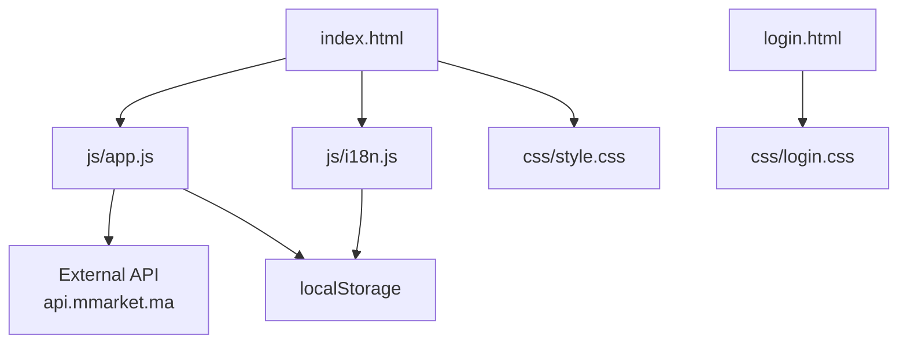

**Diagram sources**
- [index.html:1-414](file://index.html#L1-L414)
- [login.html:1-230](file://login.html#L1-L230)
- [app.js:1-1048](file://js/app.js#L1-L1048)
- [i18n.js:1-418](file://js/i18n.js#L1-L418)
- [style.css:1-1271](file://css/style.css#L1-L1271)
- [login.css:1-384](file://css/login.css#L1-L384)

**Section sources**
- [index.html:1-414](file://index.html#L1-L414)
- [login.html:1-230](file://login.html#L1-L230)
- [app.js:1-1048](file://js/app.js#L1-L1048)
- [i18n.js:1-418](file://js/i18n.js#L1-L418)
- [style.css:1-1271](file://css/style.css#L1-L1271)
- [login.css:1-384](file://css/login.css#L1-L384)

## Core Components
- Client-side router: Manages view switching between Home, Shop, Detail, Cart, Checkout, Orders, Wishlist via DOM visibility and active states.
- Data layer: Fetches categories and products from api.mmarket.ma; caches product details for performance.
- State management: Persists cart, wishlist, orders, and recently viewed items in localStorage; updates UI badges accordingly.
- i18n engine: Provides EN/FR translations, placeholder/title localization, and dynamic string interpolation; persists language choice.
- UI rendering: Generates product cards, detail pages, filters, pagination, and order summaries; binds events via delegation.
- Styling: Responsive layout, component-specific styles, animations, and mobile bottom toolbar.

**Section sources**
- [app.js:176-194](file://js/app.js#L176-L194)
- [app.js:117-142](file://js/app.js#L117-L142)
- [app.js:61-114](file://js/app.js#L117-L142)
- [i18n.js:8-336](file://js/i18n.js#L8-L336)
- [i18n.js:376-418](file://js/i18n.js#L376-L418)
- [style.css:576-585](file://css/style.css#L576-L585)

## Architecture Overview
The SPA uses a simple but effective architecture:
- Views are sections within index.html toggled by showView.
- Navigation is handled through event delegation on elements with data-view attributes.
- Data flows from the external API into in-memory caches and then into rendered components.
- User actions update localStorage-backed state and trigger re-renders.

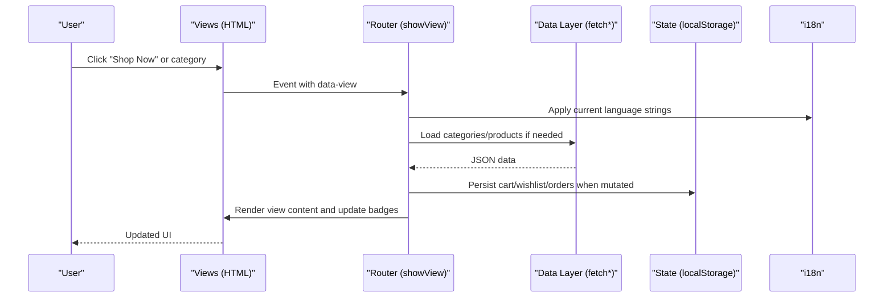

**Diagram sources**
- [index.html:15-57](file://index.html#L15-L57)
- [index.html:77-290](file://index.html#L77-L290)
- [app.js:176-194](file://js/app.js#L176-L194)
- [app.js:117-142](file://js/app.js#L117-L142)
- [app.js:926-1048](file://js/app.js#L926-L1048)
- [i18n.js:376-418](file://js/i18n.js#L376-L418)

## Detailed Component Analysis

### Client-Side Routing and View Management
- Views are defined as sections with IDs like homeView, shopView, detailView, etc., and toggled by adding/removing an active class.
- Navigation is delegated to handle dynamically created elements, ensuring consistent behavior across all views.
- Mobile tab bar maps tabs to views and handles special cases like account navigation and search focus.

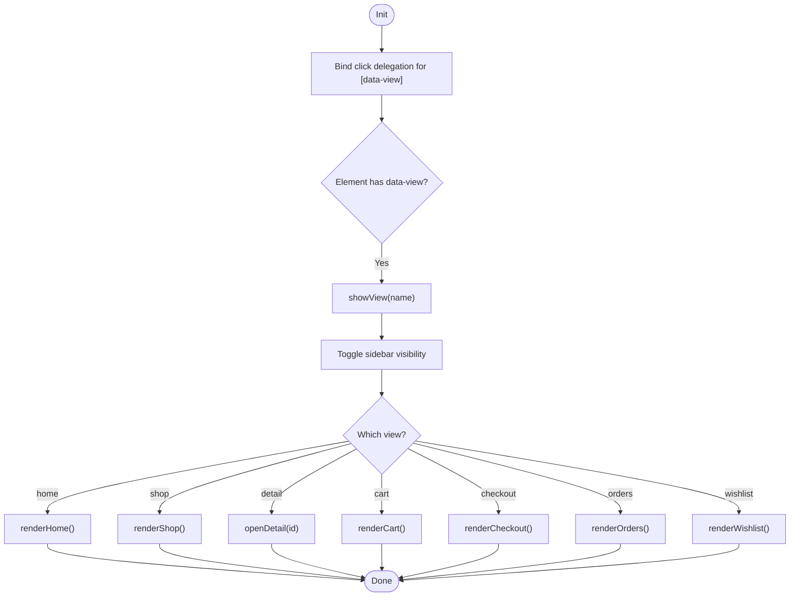

**Diagram sources**
- [app.js:176-194](file://js/app.js#L176-L194)
- [app.js:926-953](file://js/app.js#L926-L953)

**Section sources**
- [app.js:176-194](file://js/app.js#L176-L194)
- [app.js:926-953](file://js/app.js#L926-L953)

### Data Flow from External API to DOM
- Categories are fetched once and cached in memory; product lists are paginated and cached per page.
- Product detail requests use a simple object cache to avoid redundant network calls.
- Search queries are sent to the API; if no results, a smart fallback suggests searching by the first word.
- Rendering functions generate HTML fragments and bind card interactions.

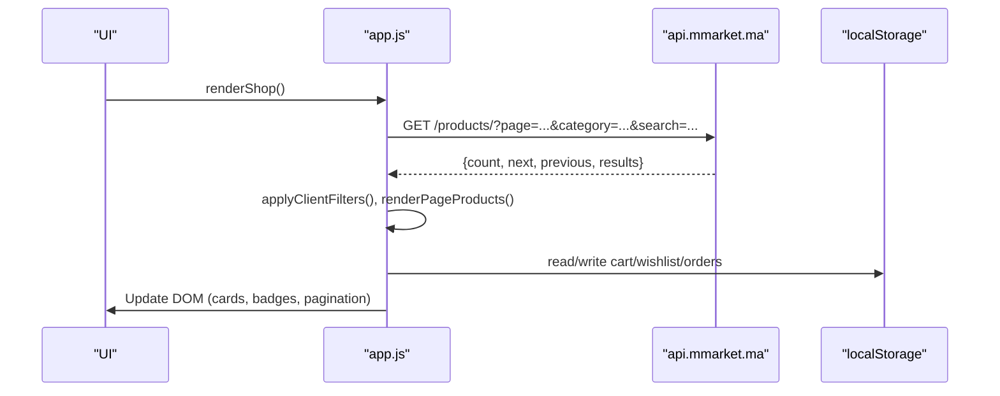

**Diagram sources**
- [app.js:117-142](file://js/app.js#L117-L142)
- [app.js:339-410](file://js/app.js#L339-L410)
- [app.js:539-583](file://js/app.js#L539-L583)
- [app.js:61-114](file://js/app.js#L61-L114)

**Section sources**
- [app.js:117-142](file://js/app.js#L117-L142)
- [app.js:339-410](file://js/app.js#L339-L410)
- [app.js:539-583](file://js/app.js#L539-L583)

### State Management with localStorage
- Keys include cart, wishlist, orders, and recently viewed items.
- Mutations persist immediately and trigger badge updates and view refreshes where necessary.
- Recent items are limited to a small list and updated on product detail visits.

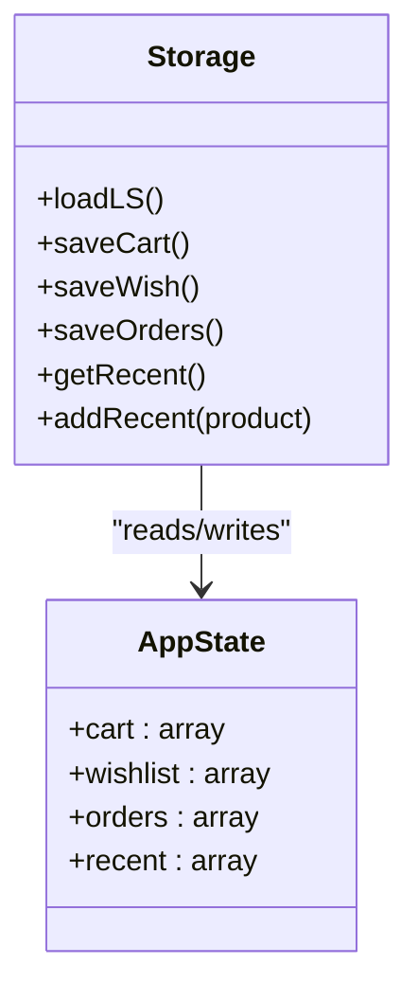

**Diagram sources**
- [app.js:61-114](file://js/app.js#L61-L114)

**Section sources**
- [app.js:61-114](file://js/app.js#L61-L114)

### Event Delegation Patterns for UI Interactions
- Global click delegation handles navigation via data-view attributes.
- Product cards bind add-to-cart and wishlist toggle actions efficiently.
- Filters and sort controls update state and re-render the product list without reloading.

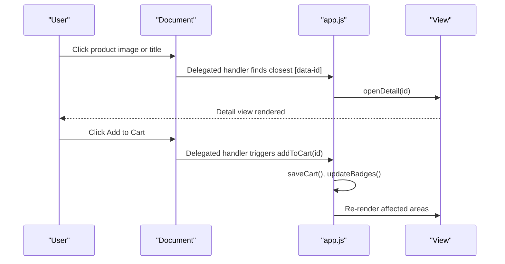

**Diagram sources**
- [app.js:243-263](file://js/app.js#L243-L263)
- [app.js:701-726](file://js/app.js#L701-L726)
- [app.js:926-953](file://js/app.js#L926-L953)

**Section sources**
- [app.js:243-263](file://js/app.js#L243-L263)
- [app.js:701-726](file://js/app.js#L701-L726)
- [app.js:926-953](file://js/app.js#L926-L953)

### Separation of Concerns: HTML, CSS, JS
- HTML defines semantic structure and view containers; minimal inline logic.
- CSS encapsulates layout, typography, animations, and responsive rules.
- JavaScript centralizes business logic, data fetching, and rendering.

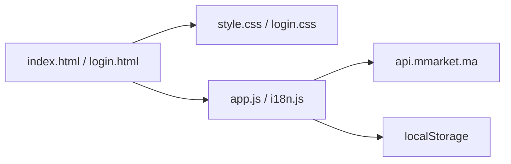

**Diagram sources**
- [index.html:1-414](file://index.html#L1-L414)
- [login.html:1-230](file://login.html#L1-L230)
- [style.css:1-1271](file://css/style.css#L1-L1271)
- [login.css:1-384](file://css/login.css#L1-L384)
- [app.js:1-1048](file://js/app.js#L1-L1048)
- [i18n.js:1-418](file://js/i18n.js#L1-L418)

**Section sources**
- [index.html:1-414](file://index.html#L1-L414)
- [login.html:1-230](file://login.html#L1-L230)
- [style.css:1-1271](file://css/style.css#L1-L1271)
- [login.css:1-384](file://css/login.css#L1-L384)
- [app.js:1-1048](file://js/app.js#L1-L1048)
- [i18n.js:1-418](file://js/i18n.js#L1-L418)

### Internationalization (i18n)
- Static text is localized via data-i18n, data-i18n-html, data-i18n-ph, and data-i18n-title attributes.
- Dynamic strings are interpolated using t(key, vars).
- Language preference is persisted in localStorage and applied globally; a custom event notifies components to refresh localized content.

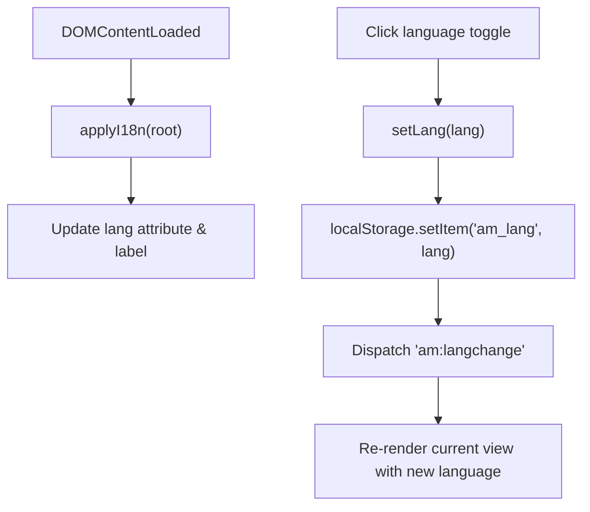

**Diagram sources**
- [i18n.js:376-418](file://js/i18n.js#L376-L418)
- [app.js:1031-1045](file://js/app.js#L1031-L1045)

**Section sources**
- [i18n.js:8-336](file://js/i18n.js#L8-L336)
- [i18n.js:376-418](file://js/i18n.js#L376-L418)
- [app.js:1031-1045](file://js/app.js#L1031-L1045)

### Responsive Design and Mobile-First Approach
- Mobile bottom toolbar provides quick access to Home, Search, Cart, Favorites, and Account.
- Sidebar is hidden on smaller screens; main content adapts via grid classes.
- Styles ensure touch-friendly targets and readable typography across devices.

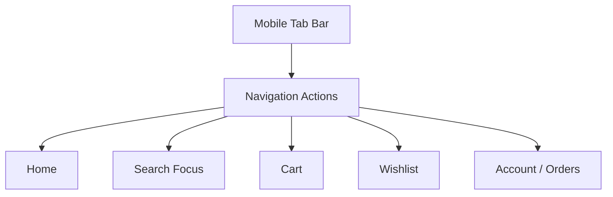

**Diagram sources**
- [index.html:372-403](file://index.html#L372-L403)
- [app.js:939-953](file://js/app.js#L939-L953)

**Section sources**
- [index.html:372-403](file://index.html#L372-L403)
- [app.js:939-953](file://js/app.js#L939-L953)

### System Boundaries and Integration Patterns
- External boundary: api.mmarket.ma for categories and products.
- Internal boundary: In-memory caches and localStorage for state.
- Integration pattern: RESTful fetch calls with error handling and graceful degradation; local fallback suggestions improve search UX.

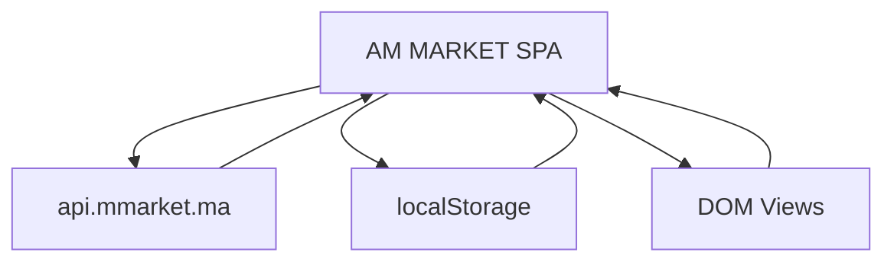

**Diagram sources**
- [app.js:117-142](file://js/app.js#L117-L142)
- [app.js:61-114](file://js/app.js#L61-L114)
- [index.html:1-414](file://index.html#L1-L414)

**Section sources**
- [app.js:117-142](file://js/app.js#L117-L142)
- [app.js:61-114](file://js/app.js#L61-L114)
- [index.html:1-414](file://index.html#L1-L414)

## Dependency Analysis
- app.js depends on i18n.js for localized strings and on the external API for data.
- HTML references both CSS files and JS modules; Bootstrap and Font Awesome are loaded via CDN.
- login.html includes its own script block for form handling and uses i18n.js for labels.

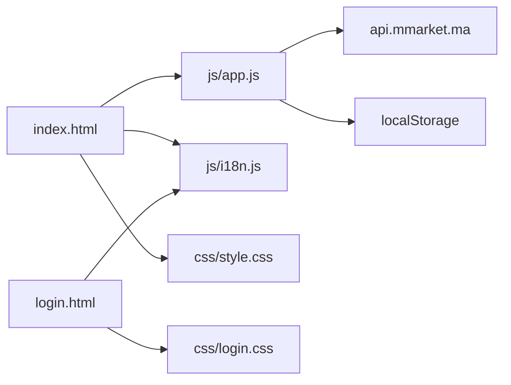

**Diagram sources**
- [index.html:1-414](file://index.html#L1-L414)
- [login.html:1-230](file://login.html#L1-L230)
- [app.js:1-1048](file://js/app.js#L1-L1048)
- [i18n.js:1-418](file://js/i18n.js#L1-L418)
- [style.css:1-1271](file://css/style.css#L1-L1271)
- [login.css:1-384](file://css/login.css#L1-L384)

**Section sources**
- [index.html:1-414](file://index.html#L1-L414)
- [login.html:1-230](file://login.html#L1-L230)
- [app.js:1-1048](file://js/app.js#L1-L1048)
- [i18n.js:1-418](file://js/i18n.js#L1-L418)
- [style.css:1-1271](file://css/style.css#L1-L1271)
- [login.css:1-384](file://css/login.css#L1-L384)

## Performance Considerations
- Pagination reduces initial payload size; only 12 products per page are loaded.
- Product detail caching avoids repeated network requests for the same item.
- Client-side filtering and sorting operate on in-memory arrays for responsiveness.
- Lazy loading images and placeholders mitigate bandwidth usage.
- Badge updates are optimized to avoid unnecessary DOM churn.

[No sources needed since this section provides general guidance]

## Troubleshooting Guide
- Network errors: If API calls fail, the UI displays localized error messages and disables features that depend on data.
- Empty results: When search returns no matches, the app suggests trying the first word or browsing all products.
- LocalStorage issues: State reads are wrapped in try/catch to prevent crashes on corrupted storage.
- Image failures: Images fall back to placeholder URLs to maintain layout integrity.

**Section sources**
- [app.js:1009-1017](file://js/app.js#L1009-L1017)
- [app.js:422-481](file://js/app.js#L422-L481)
- [app.js:61-95](file://js/app.js#L61-L95)
- [app.js:206-241](file://js/app.js#L206-L241)

## Conclusion
AM MARKET implements a pragmatic SPA architecture that balances simplicity and functionality. Client-side routing, modular JavaScript, and clear separation of concerns enable a responsive, internationalized shopping experience. Data flows cleanly from the external API to in-memory caches and finally to the DOM, while localStorage ensures persistent user state. The design prioritizes mobile usability, efficient rendering, and robust error handling, making it suitable for real-world deployment with minimal complexity.

[No sources needed since this section summarizes without analyzing specific files]