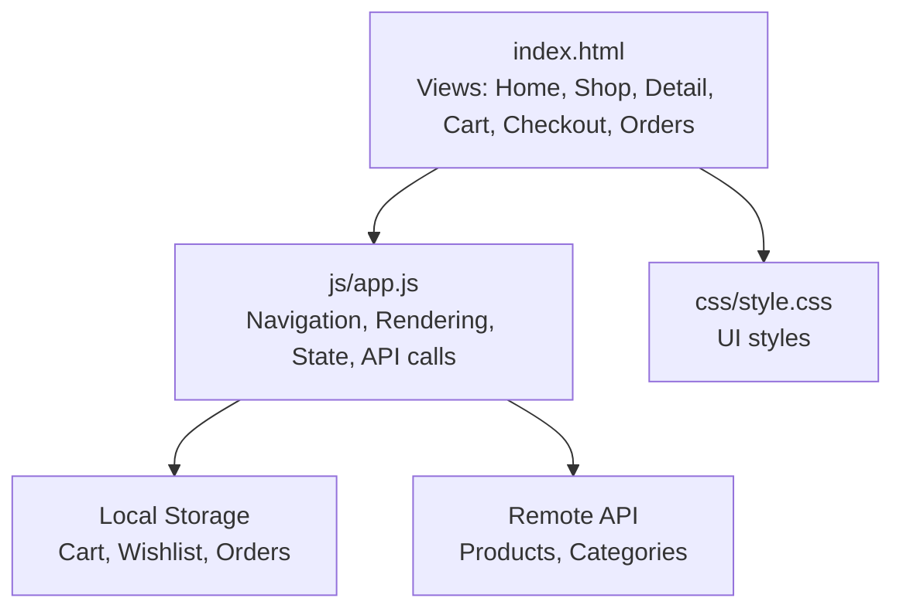
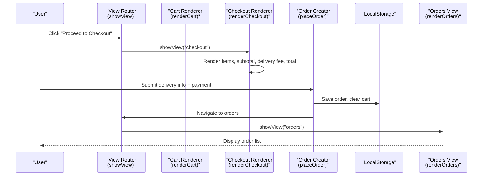
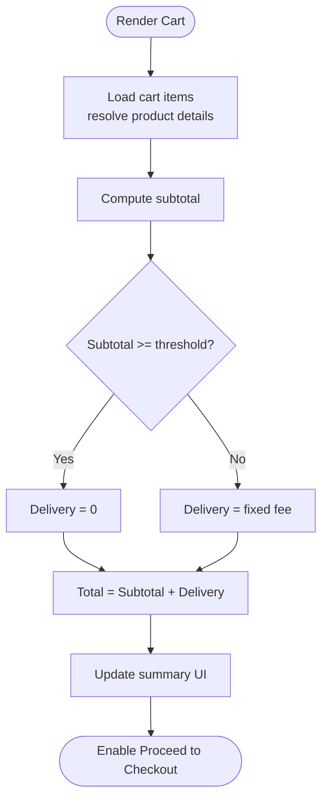
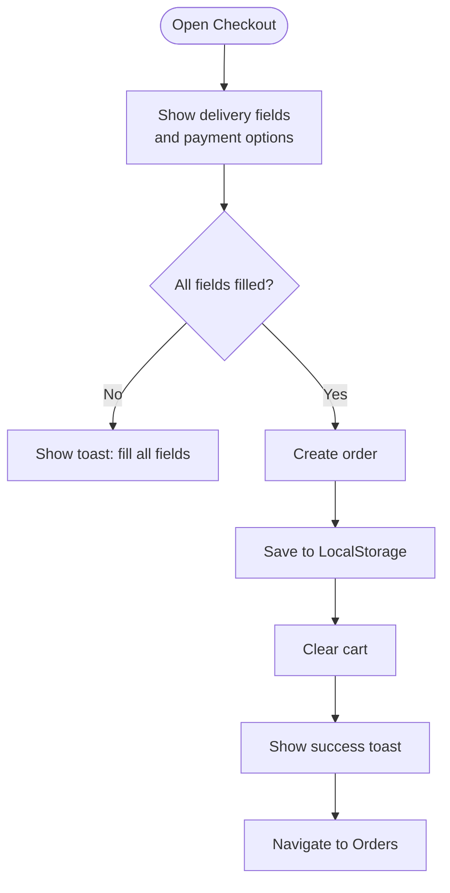
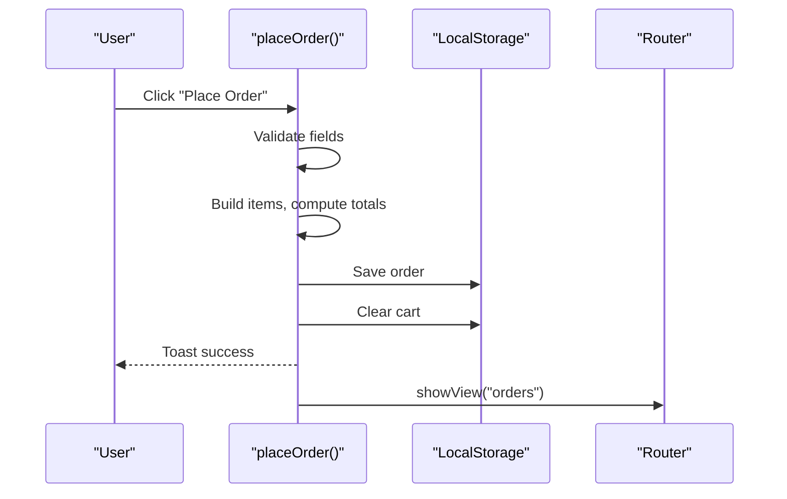
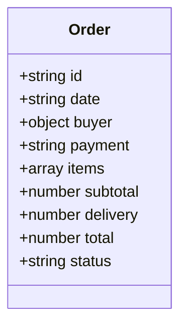
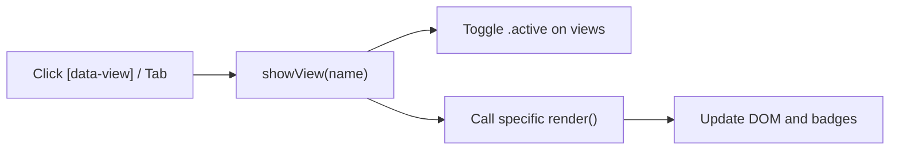
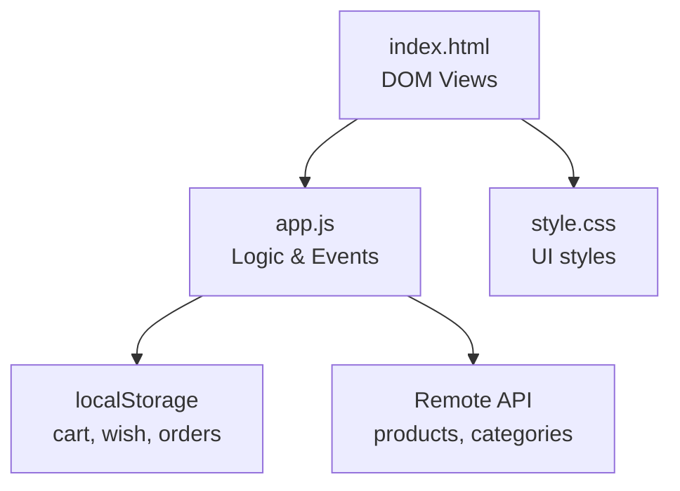

# Checkout Process

<cite>
**Referenced Files in This Document**
- [index.html](file://index.html)
- [app.js](file://js/app.js)
- [style.css](file://css/style.css)
- [login.html](file://login.html)
</cite>

## Table of Contents
1. [Introduction](#introduction)
2. [Project Structure](#project-structure)
3. [Core Components](#core-components)
4. [Architecture Overview](#architecture-overview)
5. [Detailed Component Analysis](#detailed-component-analysis)
6. [Dependency Analysis](#dependency-analysis)
7. [Performance Considerations](#performance-considerations)
8. [Troubleshooting Guide](#troubleshooting-guide)
9. [Conclusion](#conclusion)

## Introduction
This document explains the multi-step checkout process in AM MARKET, from cart review to order confirmation. It covers delivery information collection, payment method selection (Cash on Delivery and Cards), order summary calculations, form validation, delivery fee logic, and how orders are created and stored. It also documents the checkout UI components, step navigation, error handling for failed checkouts, integration with order history, and the relationship between checkout and order management.

## Project Structure
The checkout experience is implemented as a single-page application with multiple views:
- Cart view: reviews items, updates quantities, shows subtotal, delivery fee, and total.
- Checkout view: collects delivery details, selects payment method, and displays an order summary.
- Orders view: lists previously placed orders.

**Diagram sources**
- [index.html:217-282](file://index.html#L217-L282)
- [app.js:176-194](file://js/app.js#L176-L194)
- [app.js:808-872](file://js/app.js#L808-L872)
- [app.js:874-895](file://js/app.js#L874-L895)

**Section sources**
- [index.html:217-282](file://index.html#L217-L282)
- [app.js:176-194](file://js/app.js#L176-L194)

## Core Components
- Cart state and rendering: manages items, quantities, subtotal, and enables/disables checkout based on cart contents.
- Delivery fee calculation: free delivery above a threshold; otherwise a fixed fee.
- Checkout form: collects name, phone, email, address, city, and payment method.
- Order creation: validates inputs, builds order object, persists to local storage, clears cart, and navigates to orders.
- Order history: renders saved orders with date, items, totals, and payment labels.

Key responsibilities and behaviors are implemented in the JavaScript module that drives view rendering and user interactions.

**Section sources**
- [app.js:700-805](file://js/app.js#L700-L805)
- [app.js:808-872](file://js/app.js#L808-L872)
- [app.js:874-895](file://js/app.js#L874-L895)

## Architecture Overview
The checkout flow is driven by client-side routing between views and uses localStorage for persistence. The remote API provides product data used during cart and checkout rendering.

**Diagram sources**
- [app.js:176-194](file://js/app.js#L176-L194)
- [app.js:740-798](file://js/app.js#L740-L798)
- [app.js:808-872](file://js/app.js#L808-L872)
- [app.js:874-895](file://js/app.js#L874-L895)

## Detailed Component Analysis

### Cart Review and Summary Calculations
- Items are rendered with images, names, per-unit price, quantity controls, and remove actions.
- Subtotal is computed from item prices and quantities.
- Delivery fee is determined by a threshold rule: free if subtotal meets or exceeds the threshold; otherwise a fixed fee.
- Grand total equals subtotal plus delivery fee.
- The “Proceed to Checkout” button is enabled only when the cart has items.

**Diagram sources**
- [app.js:728-738](file://js/app.js#L728-L738)
- [app.js:740-798](file://js/app.js#L740-L798)
- [app.js:800-805](file://js/app.js#L800-L805)

**Section sources**
- [app.js:728-738](file://js/app.js#L728-L738)
- [app.js:740-798](file://js/app.js#L740-L798)
- [app.js:800-805](file://js/app.js#L800-L805)

### Checkout Form: Delivery Information and Payment Selection
- Fields: full name, phone, email, address, city. All fields are required.
- Payment methods: Cash on Delivery (default) and Credit/Debit Card.
- Order summary panel shows line items, subtotal, delivery fee, and total.

**Diagram sources**
- [index.html:237-276](file://index.html#L237-L276)
- [app.js:808-872](file://js/app.js#L808-L872)

**Section sources**
- [index.html:237-276](file://index.html#L237-L276)
- [app.js:808-872](file://js/app.js#L808-L872)

### Order Creation and Persistence
- On successful submission, an order object is created with:
  - Unique ID, timestamp, buyer details, selected payment method, items array, subtotal, delivery fee, total, and status.
- The order is inserted at the beginning of the orders list and persisted to localStorage.
- The cart is cleared and the user is redirected to the orders view.

**Diagram sources**
- [app.js:834-872](file://js/app.js#L834-L872)
- [app.js:874-895](file://js/app.js#L874-L895)

**Section sources**
- [app.js:834-872](file://js/app.js#L834-L872)
- [app.js:874-895](file://js/app.js#L874-L895)

### Order History Integration
- The orders view lists each order with:
  - Order number and date
  - Items summary
  - Total amount and payment label
  - Status text (localized where available)
- If no orders exist, a message prompts the user to start shopping.

**Diagram sources**
- [app.js:855-865](file://js/app.js#L855-L865)
- [app.js:874-895](file://js/app.js#L874-L895)

**Section sources**
- [app.js:855-865](file://js/app.js#L855-L865)
- [app.js:874-895](file://js/app.js#L874-L895)

### Navigation Between Views
- Navigation is handled via a central router that toggles active views and triggers view-specific render functions.
- Mobile tab bar maps tabs to views and enforces login gating for account-related actions.

**Diagram sources**
- [app.js:176-194](file://js/app.js#L176-L194)
- [app.js:927-953](file://js/app.js#L927-L953)

**Section sources**
- [app.js:176-194](file://js/app.js#L176-L194)
- [app.js:927-953](file://js/app.js#L927-L953)

### UI Components and Styling
- Checkout section includes two cards: one for delivery information and payment selection, another for order summary.
- Styles provide consistent spacing, typography, and responsive layout using Bootstrap classes and custom CSS variables.
- Buttons and badges follow a cohesive design system for primary actions and counts.

**Section sources**
- [index.html:237-276](file://index.html#L237-L276)
- [style.css:1-14](file://css/style.css#L1-L14)
- [style.css:105-128](file://css/style.css#L105-L128)
- [style.css:556-585](file://css/style.css#L556-L585)

## Dependency Analysis
- index.html defines the DOM structure for all views including cart, checkout, and orders.
- app.js orchestrates:
  - Data fetching from the remote API for products and categories.
  - Local state management for cart, wishlist, and orders via localStorage.
  - Event binding for navigation, search, filters, and checkout submission.
- style.css provides visual styling for components across views.

**Diagram sources**
- [index.html:217-282](file://index.html#L217-L282)
- [app.js:116-142](file://js/app.js#L116-L142)
- [app.js:88-99](file://js/app.js#L88-L99)
- [app.js:927-1029](file://js/app.js#L927-L1029)

**Section sources**
- [index.html:217-282](file://index.html#L217-L282)
- [app.js:88-99](file://js/app.js#L88-L99)
- [app.js:116-142](file://js/app.js#L116-L142)
- [app.js:927-1029](file://js/app.js#L927-L1029)

## Performance Considerations
- Product caching: product details are cached to avoid repeated network requests during cart and checkout rendering.
- Lazy loading: product images use lazy loading attributes to improve initial page load.
- Efficient re-renders: view-specific render functions update only necessary DOM sections.
- Minimal state: lightweight objects stored in localStorage reduce overhead.

[No sources needed since this section provides general guidance]

## Troubleshooting Guide
- Empty cart: attempting to open checkout redirects back to cart; proceed button remains disabled until items are added.
- Missing delivery info: submitting without required fields shows a toast prompting to fill all fields.
- Network errors: failures to fetch categories or products display localized error messages in the UI.
- No orders: orders view shows a friendly empty state with a call-to-action to browse products.

**Section sources**
- [app.js:740-749](file://js/app.js#L740-L749)
- [app.js:834-845](file://js/app.js#L834-L845)
- [app.js:1009-1017](file://js/app.js#L1009-L1017)
- [app.js:874-880](file://js/app.js#L874-L880)

## Conclusion
AM MARKET implements a streamlined, client-side checkout flow that guides users from cart review through delivery information and payment selection to order confirmation. Delivery fees are calculated based on cart totals, and orders are persisted locally and displayed in the order history. The architecture separates concerns cleanly between UI markup, styling, and application logic, enabling maintainable updates and a responsive user experience.