# Core Features

<cite>
**Referenced Files in This Document**
- [index.html](file://index.html)
- [login.html](file://login.html)
- [js/app.js](file://js/app.js)
- [js/i18n.js](file://js/i18n.js)
</cite>

## Table of Contents
1. [Introduction](#introduction)
2. [Project Structure](#project-structure)
3. [Core Components](#core-components)
4. [Architecture Overview](#architecture-overview)
5. [Detailed Component Analysis](#detailed-component-analysis)
6. [Dependency Analysis](#dependency-analysis)
7. [Performance Considerations](#performance-considerations)
8. [Troubleshooting Guide](#troubleshooting-guide)
9. [Conclusion](#conclusion)

## Introduction
AM MARKET is a client-side e-commerce application that provides product browsing, search, cart and wishlist management, checkout, order history, user authentication UI, and bilingual support (English/French). It integrates with a remote API for product data and categories, while using localStorage to persist user state such as cart, wishlist, orders, recent items, and language preference. The app follows an event-driven approach: DOM events trigger view updates, filters, and API calls; i18n changes dispatch custom events to refresh the UI consistently.

## Project Structure
The project is organized into HTML pages, CSS styles, and JavaScript modules:
- index.html: Main storefront with views for Home, Shop, Product Detail, Cart, Checkout, Orders, and Wishlist.
- login.html: Authentication page with sign-in and sign-up forms.
- js/app.js: Application logic for routing, data fetching, filtering, cart/wishlist/orders, and rendering.
- js/i18n.js: Internationalization module providing English and French strings and utilities.

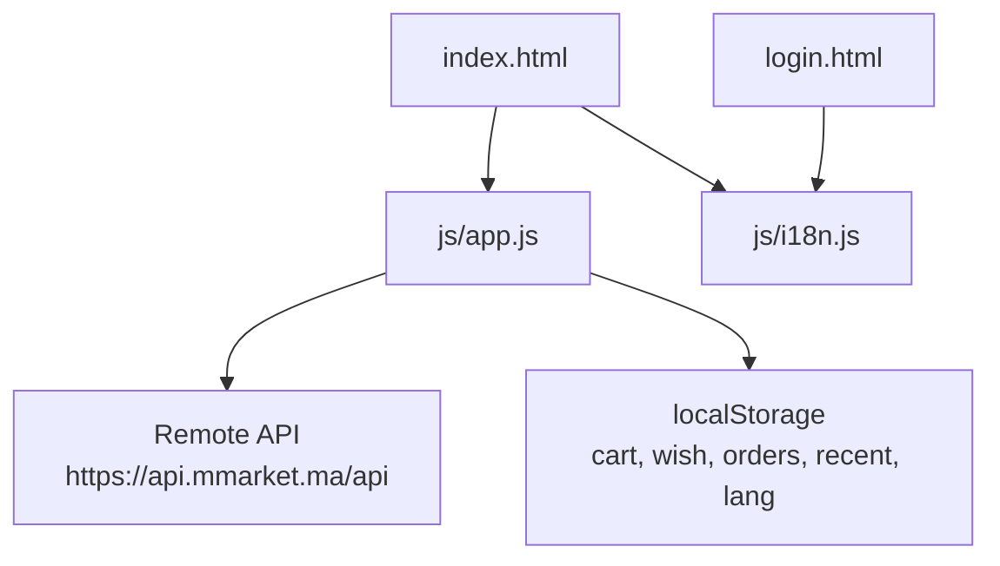

**Diagram sources**
- [index.html:1-414](file://index.html#L1-L414)
- [login.html:1-230](file://login.html#L1-L230)
- [js/app.js:1-1048](file://js/app.js#L1-L1048)
- [js/i18n.js:1-418](file://js/i18n.js#L1-L418)

**Section sources**
- [index.html:1-414](file://index.html#L1-L414)
- [login.html:1-230](file://login.html#L1-L230)
- [js/app.js:1-1048](file://js/app.js#L1-L1048)
- [js/i18n.js:1-418](file://js/i18n.js#L1-L418)

## Core Components
- Product catalog browsing with category filtering and pagination
- Real-time search with smart fallback suggestions
- Shopping cart with quantity controls and order summary
- Wishlist for saving favorite products
- Multi-step checkout with delivery info and payment method selection
- Order history tracking stored locally
- User authentication UI with validation and session persistence
- Bilingual support (English/French) with dynamic UI updates

Key implementation highlights:
- Data fetching from a remote API for categories and products
- Client-side filtering by price range, availability, promotion, brand, and sorting
- State persisted via localStorage for cart, wishlist, orders, recent items, and language
- Event-driven navigation and UI updates across views
- i18n system with static attributes and dynamic string interpolation

**Section sources**
- [js/app.js:117-142](file://js/app.js#L117-L142)
- [js/app.js:339-410](file://js/app.js#L339-L410)
- [js/app.js:700-805](file://js/app.js#L700-L805)
- [js/app.js:897-924](file://js/app.js#L897-L924)
- [js/app.js:834-895](file://js/app.js#L834-L895)
- [js/i18n.js:8-336](file://js/i18n.js#L8-L336)

## Architecture Overview
AM MARKET uses a single-page architecture with multiple views managed by a central router function. Data flows from the remote API into memory caches and then into the DOM. User interactions (clicks, input changes) trigger handlers that update state and re-render relevant sections. Language switching triggers a custom event that refreshes all views.

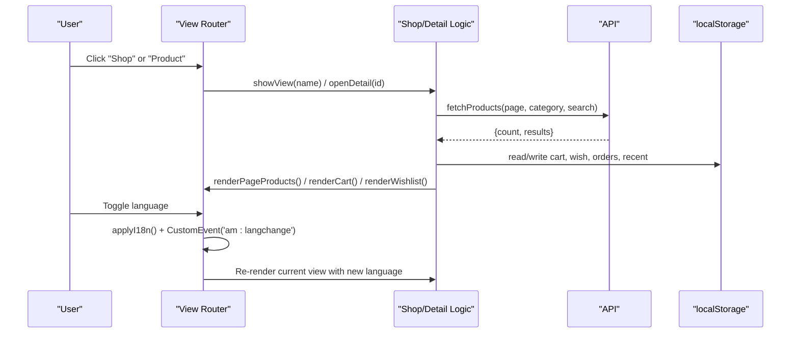

**Diagram sources**
- [js/app.js:176-194](file://js/app.js#L176-L194)
- [js/app.js:539-583](file://js/app.js#L539-L583)
- [js/app.js:586-669](file://js/app.js#L586-L669)
- [js/app.js:927-1048](file://js/app.js#L927-L1048)
- [js/i18n.js:376-418](file://js/i18n.js#L376-L418)

## Detailed Component Analysis

### Product Catalog Browsing with Category Filtering
- User workflow:
  - Browse categories on the home page or sidebar.
  - Navigate to the shop view to see paginated products.
  - Apply filters: category, price range, availability, promotions, brand.
  - Sort by default, price ascending/descending, or name.
- Implementation approach:
  - Categories are fetched once and cached; rendered in sidebar and home grid.
  - Products are fetched per page with optional category and search query.
  - Client-side filters refine the current page’s product list; sorting is applied locally.
  - Pagination renders a windowed set of page links based on total count.
- Data flow:
  - fetchCategories loads top-level categories (excluding a specific ID).
  - fetchProducts returns paginated results; counts drive pagination.
  - Filters modify the in-memory list without additional network calls.
- Integration points:
  - Remote API endpoints for categories and products.
  - Local storage not used for catalog data; only for user state.

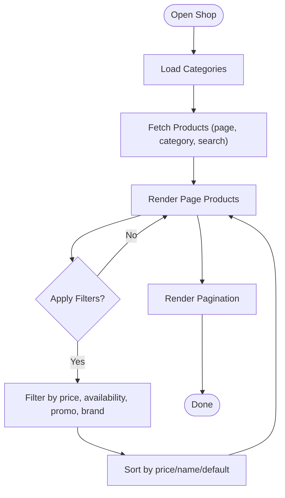

**Diagram sources**
- [js/app.js:117-133](file://js/app.js#L117-L133)
- [js/app.js:339-410](file://js/app.js#L339-L410)
- [js/app.js:483-529](file://js/app.js#L483-L529)
- [js/app.js:539-583](file://js/app.js#L539-L583)

**Section sources**
- [js/app.js:117-133](file://js/app.js#L117-L133)
- [js/app.js:266-336](file://js/app.js#L266-L336)
- [js/app.js:339-410](file://js/app.js#L339-L410)
- [js/app.js:483-529](file://js/app.js#L483-L529)
- [js/app.js:539-583](file://js/app.js#L539-L583)

### Real-Time Search Functionality
- User workflow:
  - Type a query in the header search box and press Enter or click search.
  - Results appear in the shop view with pagination.
  - If no exact match, the app suggests searching by the first word.
- Implementation approach:
  - Search query is sent to the API with category context if any.
  - Smart fallback retries with the first word when full query yields zero results.
  - Empty results display suggestions and quick actions to clear or browse all.
- Data flow:
  - Input change sets searchQ and navigates to shop view.
  - loadShopPage calls fetchProducts with search parameter.
  - Suggestions update UI dynamically without reloading.
- Integration points:
  - Remote API search endpoint.
  - i18n keys for messages and placeholders.

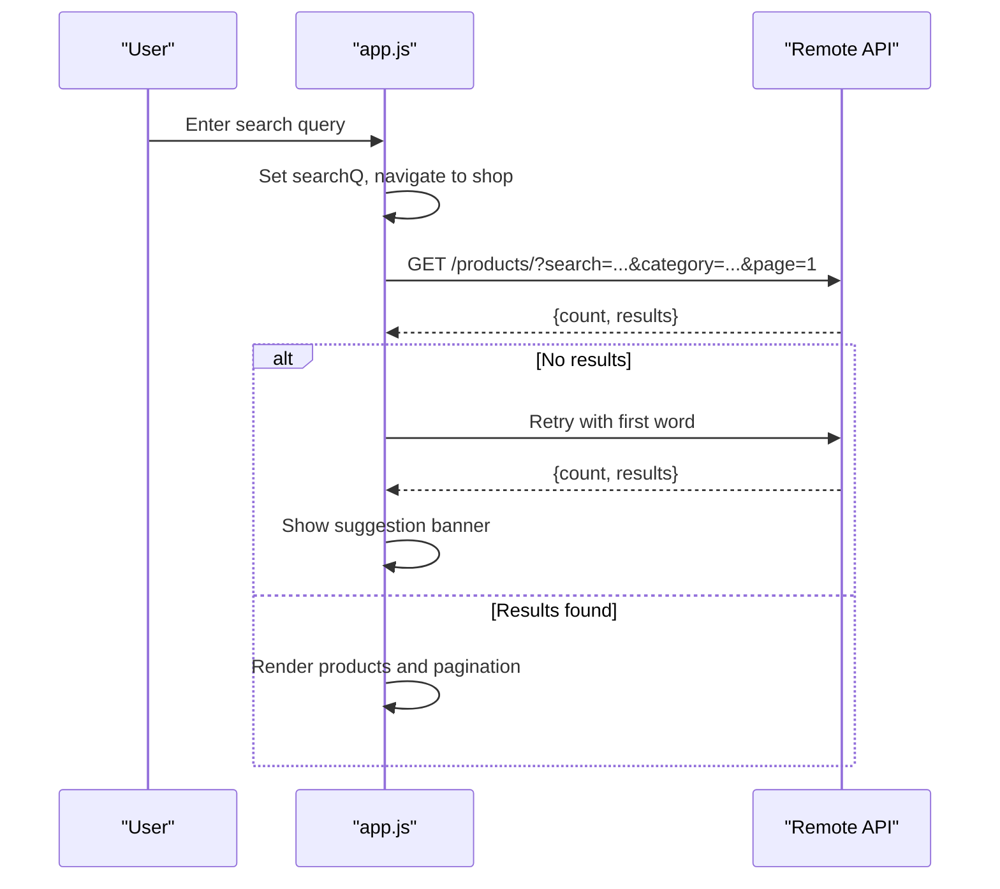

**Diagram sources**
- [js/app.js:955-966](file://js/app.js#L955-L966)
- [js/app.js:545-583](file://js/app.js#L545-L583)
- [js/app.js:412-481](file://js/app.js#L412-L481)

**Section sources**
- [js/app.js:955-966](file://js/app.js#L955-L966)
- [js/app.js:545-583](file://js/app.js#L545-L583)
- [js/app.js:412-481](file://js/app.js#L412-L481)

### Shopping Cart Management with Quantity Controls
- User workflow:
  - Add products to cart from product cards or detail page.
  - Adjust quantities in the cart view; remove items if needed.
  - View order summary with subtotal, delivery fee, and total.
  - Proceed to checkout when cart is non-empty.
- Implementation approach:
  - Cart state is an array of {id, qty}, persisted to localStorage.
  - Quantities updated via plus/minus buttons and direct input; removal filters out the item.
  - Delivery fee is free for orders over a threshold; otherwise a fixed fee applies.
  - Summary recalculates on every change.
- Data flow:
  - addToCart merges or increments quantity; saveCart persists and updates badges.
  - updateQty modifies quantity or removes item; re-renders cart and summary.
  - renderCart ensures product details are available via cache or fetch.
- Integration points:
  - Product cache populated during browsing/detail; lazy-loaded for cart items.
  - i18n labels for each step and message.

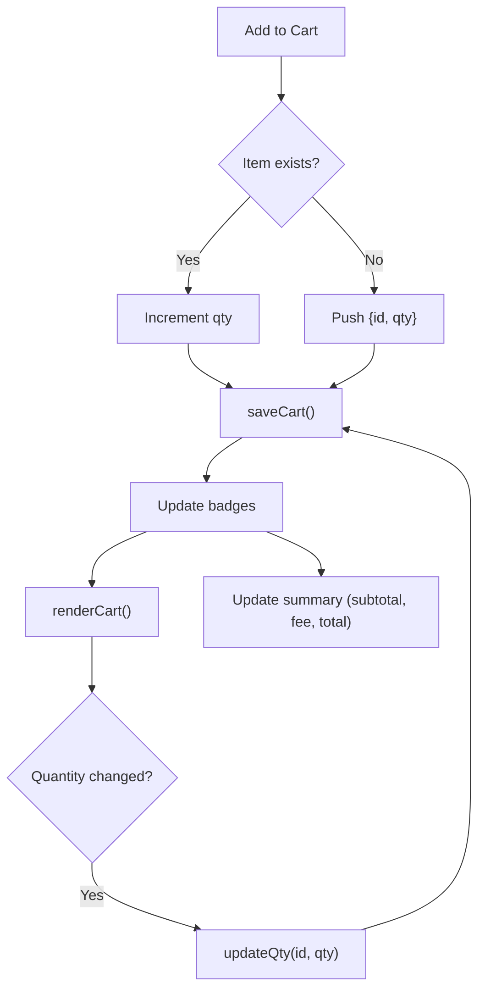

**Diagram sources**
- [js/app.js:700-738](file://js/app.js#L700-L738)
- [js/app.js:740-805](file://js/app.js#L740-L805)
- [js/app.js:162-173](file://js/app.js#L162-L173)

**Section sources**
- [js/app.js:700-738](file://js/app.js#L700-L738)
- [js/app.js:740-805](file://js/app.js#L740-L805)
- [js/app.js:162-173](file://js/app.js#L162-L173)

### Wishlist Functionality
- User workflow:
  - Toggle favorites from product cards or detail page.
  - View saved items in the wishlist section.
  - Remove items or add them back to the cart.
- Implementation approach:
  - Wishlist stores product IDs as strings; persisted to localStorage.
  - toggleWish adds/removes IDs and shows toast feedback.
  - renderWishlist resolves product details from cache or fetches them individually.
- Data flow:
  - Badge updates reflect wishlist length.
  - When viewing wishlist, missing product details are fetched on demand.
- Integration points:
  - i18n labels for empty states and actions.

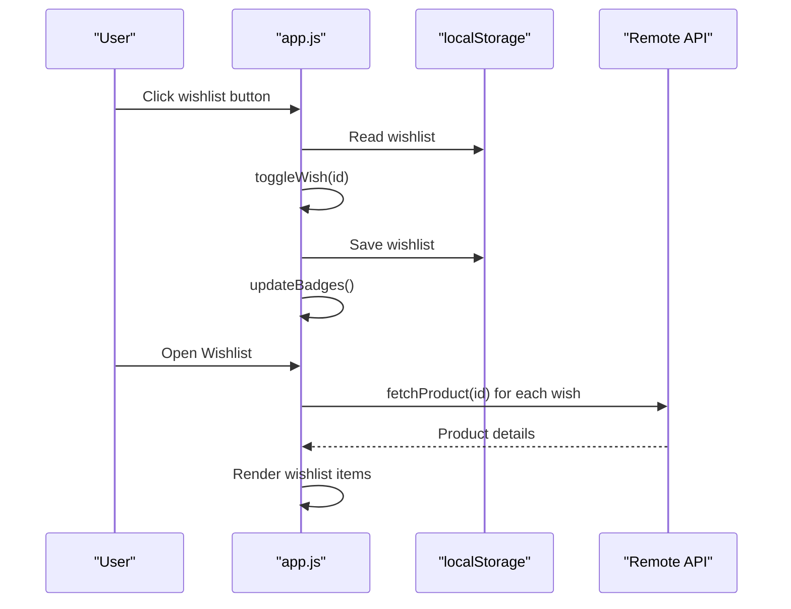

**Diagram sources**
- [js/app.js:897-924](file://js/app.js#L897-L924)
- [js/app.js:162-173](file://js/app.js#L162-L173)

**Section sources**
- [js/app.js:897-924](file://js/app.js#L897-L924)
- [js/app.js:162-173](file://js/app.js#L162-L173)

### Multi-Step Checkout Process
- User workflow:
  - Review cart and proceed to checkout.
  - Fill delivery information and select payment method.
  - Place order; view confirmation and redirect to order history.
- Implementation approach:
  - renderCheckout validates cart presence and computes totals.
  - placeOrder validates required fields, builds order object, saves to localStorage, clears cart, and navigates to orders.
  - Delivery fee logic applies free shipping above a threshold.
- Data flow:
  - Cart items resolved to product details for summary.
  - Order stored with buyer info, items, totals, and status.
- Integration points:
  - i18n labels for form fields and messages.

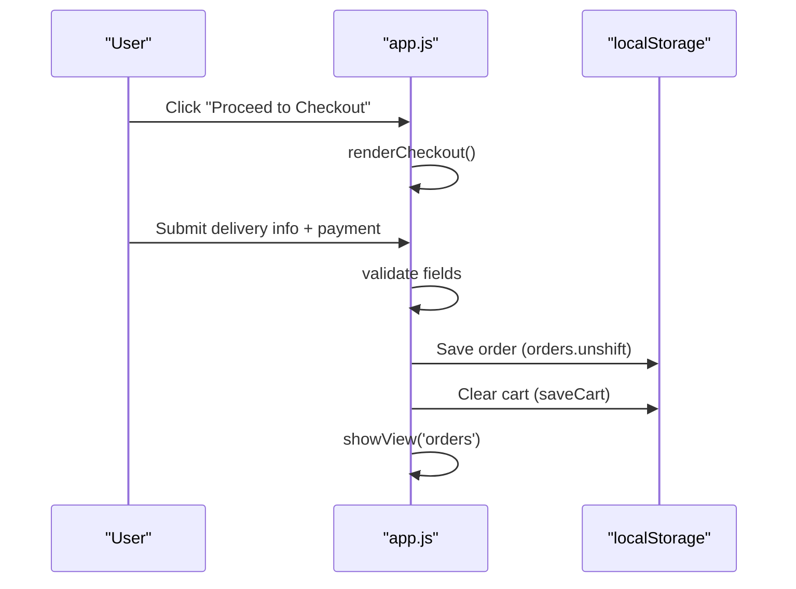

**Diagram sources**
- [js/app.js:807-832](file://js/app.js#L807-L832)
- [js/app.js:834-872](file://js/app.js#L834-L872)

**Section sources**
- [js/app.js:807-832](file://js/app.js#L807-L832)
- [js/app.js:834-872](file://js/app.js#L834-L872)

### Order History Tracking
- User workflow:
  - View past orders with date, items, totals, and payment method.
  - See localized status labels.
- Implementation approach:
  - Orders stored in localStorage as an array; newest first.
  - renderOrders formats dates according to current language locale and maps statuses to i18n keys.
- Data flow:
  - After placing an order, the app navigates to orders view which renders the list.
- Integration points:
  - i18n keys for order number, status, and labels.

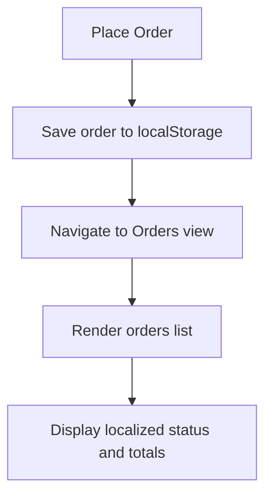

**Diagram sources**
- [js/app.js:834-872](file://js/app.js#L834-L872)
- [js/app.js:874-895](file://js/app.js#L874-L895)

**Section sources**
- [js/app.js:834-872](file://js/app.js#L834-L872)
- [js/app.js:874-895](file://js/app.js#L874-L895)

### User Authentication System
- User workflow:
  - Access login page from account dropdown or mobile tab.
  - Sign in or create an account with validation.
  - On success, store user info in localStorage and return to store.
- Implementation approach:
  - Forms validate email format and password length.
  - Success sets am_user in localStorage and redirects to index.html.
  - Brand panel text switches between login/signup modes with animations.
- Data flow:
  - Validation errors highlight inputs and show toast messages.
  - Successful auth triggers welcome toast and navigation.
- Integration points:
  - i18n keys for labels, placeholders, and messages.

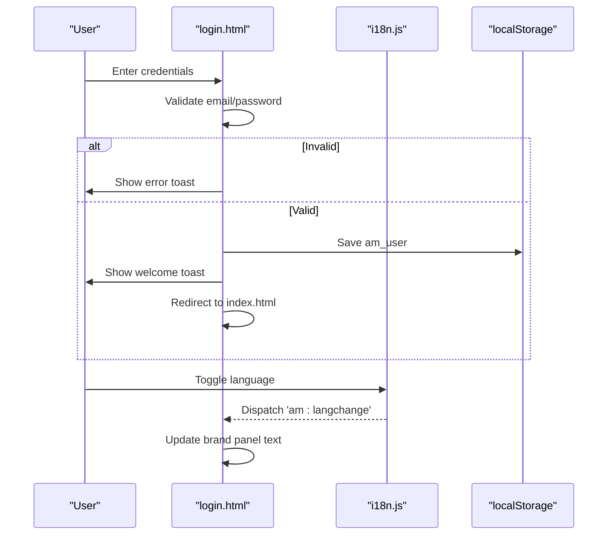

**Diagram sources**
- [login.html:190-218](file://login.html#L190-L218)
- [login.html:121-150](file://login.html#L121-L150)
- [js/i18n.js:376-418](file://js/i18n.js#L376-L418)

**Section sources**
- [login.html:190-218](file://login.html#L190-L218)
- [login.html:121-150](file://login.html#L121-L150)
- [js/i18n.js:376-418](file://js/i18n.js#L376-L418)

### Bilingual Support (English/French)
- User workflow:
  - Toggle language via globe button in header or login page.
  - All UI elements update instantly to the selected language.
- Implementation approach:
  - i18n module maintains dictionaries for EN and FR.
  - Static attributes data-i18n, data-i18n-html, data-i18n-ph, data-i18n-title are processed at runtime.
  - Dynamic strings use t(key, vars) with placeholder substitution.
  - Language preference persisted in localStorage; custom event triggers re-rendering.
- Data flow:
  - setLang writes language to localStorage and dispatches 'am:langchange'.
  - app.js listens to this event and re-renders the current view with updated labels.
- Integration points:
  - Category names translated for English display.
  - All user-facing strings centralized in i18n module.

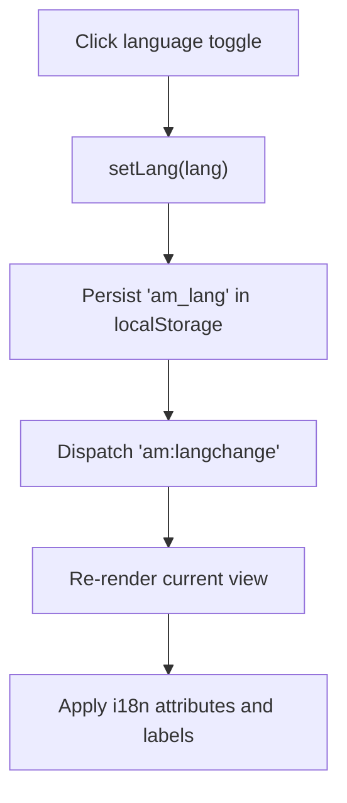

**Diagram sources**
- [js/i18n.js:376-418](file://js/i18n.js#L376-L418)
- [js/app.js:1031-1045](file://js/app.js#L1031-L1045)

**Section sources**
- [js/i18n.js:8-336](file://js/i18n.js#L8-L336)
- [js/i18n.js:376-418](file://js/i18n.js#L376-L418)
- [js/app.js:1031-1045](file://js/app.js#L1031-L1045)

## Dependency Analysis
- Views depend on app.js for routing and rendering.
- app.js depends on i18n.js for labels and category translations.
- Both pages depend on Bootstrap and Font Awesome via CDN.
- app.js depends on the remote API for categories and products.
- State dependencies:
  - localStorage keys: am_cart, am_wish, am_orders, am_recent, am_lang, am_user.
  - In-memory caches: categories, products, productCache, pageProducts.

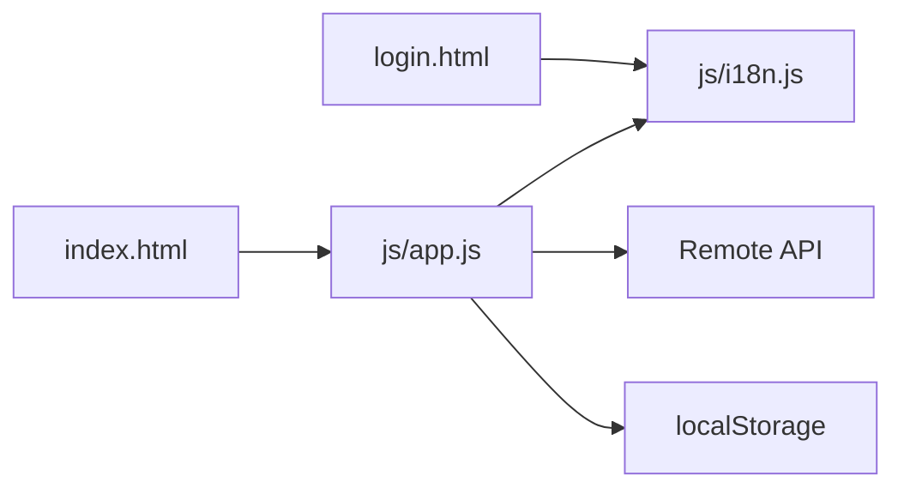

**Diagram sources**
- [index.html:1-414](file://index.html#L1-L414)
- [login.html:1-230](file://login.html#L1-L230)
- [js/app.js:1-1048](file://js/app.js#L1-L1048)
- [js/i18n.js:1-418](file://js/i18n.js#L1-L418)

**Section sources**
- [js/app.js:61-86](file://js/app.js#L61-L86)
- [js/app.js:117-142](file://js/app.js#L117-L142)
- [js/i18n.js:376-418](file://js/i18n.js#L376-L418)

## Performance Considerations
- Pagination reduces initial payload size; only 12 products per page are loaded.
- Product detail caching avoids repeated fetches for the same product.
- Client-side filtering and sorting operate on in-memory lists to avoid extra network calls.
- Lazy loading of product images with fallback placeholders improves perceived performance.
- Recent items limited to a small list to keep localStorage lightweight.
- Avoid unnecessary re-renders by updating only affected DOM nodes (e.g., badges, summaries).

[No sources needed since this section provides general guidance]

## Troubleshooting Guide
- API failures:
  - If categories or products fail to load, the UI displays localized error messages.
  - Check network connectivity and ensure the API endpoint is reachable.
- Empty search results:
  - Use suggested terms or clear the search to browse all products.
- Cart or wishlist not updating:
  - Verify localStorage permissions and that saveCart/saveWish functions execute.
- Checkout disabled:
  - Ensure the cart has items; proceed to checkout only when enabled.
- Language not applying:
  - Confirm the language toggle dispatches the custom event and that the current view re-renders.

**Section sources**
- [js/app.js:1008-1017](file://js/app.js#L1008-L1017)
- [js/app.js:412-481](file://js/app.js#L412-L481)
- [js/app.js:740-805](file://js/app.js#L740-L805)
- [js/app.js:1031-1045](file://js/app.js#L1031-L1045)

## Conclusion
AM MARKET delivers a cohesive shopping experience through a well-structured client-side architecture. It combines remote data integration with local state management to provide fast, responsive interactions. The event-driven design ensures consistent UI updates across features like catalog browsing, search, cart, wishlist, checkout, orders, authentication, and bilingual support. Developers can extend functionality by adding new filters, integrating additional APIs, or enhancing localization coverage while maintaining the established patterns.

[No sources needed since this section summarizes without analyzing specific files]