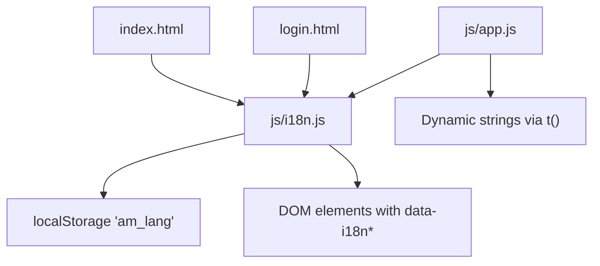
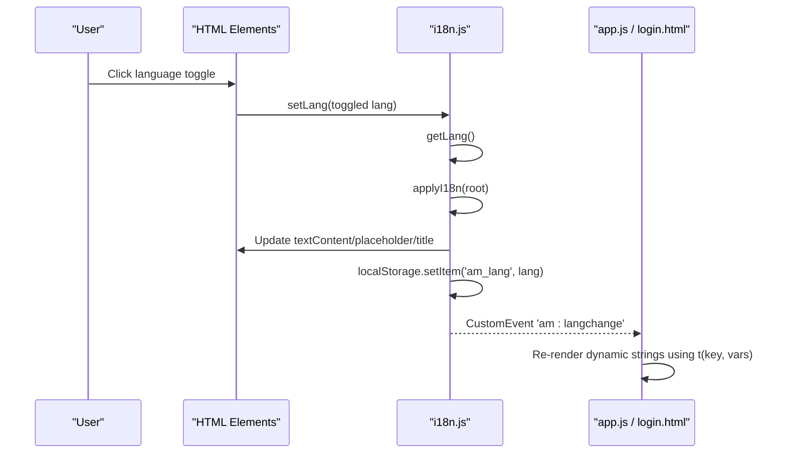
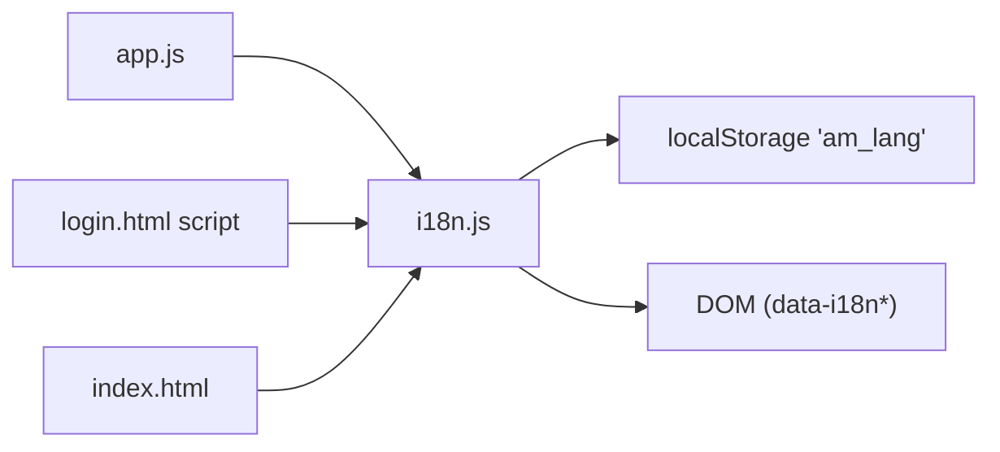

# Internationalization System

<cite>
**Referenced Files in This Document**
- [i18n.js](file://js/i18n.js)
- [app.js](file://js/app.js)
- [index.html](file://index.html)
- [login.html](file://login.html)
</cite>

## Table of Contents
1. [Introduction](#introduction)
2. [Project Structure](#project-structure)
3. [Core Components](#core-components)
4. [Architecture Overview](#architecture-overview)
5. [Detailed Component Analysis](#detailed-component-analysis)
6. [Dependency Analysis](#dependency-analysis)
7. [Performance Considerations](#performance-considerations)
8. [Troubleshooting Guide](#troubleshooting-guide)
9. [Conclusion](#conclusion)
10. [Appendices](#appendices)

## Introduction
This document explains the internationalization (i18n) system that supports English and French across the application. It covers translation file structure, language switching, dynamic content updates, safe HTML rendering with whitelisted keys, category name translations from French to English, persistence of language preference, default language detection, integration patterns used throughout the app, and best practices for maintaining multilingual content.

## Project Structure
The i18n system is implemented as a small, self-contained module and integrated into both pages:
- Translation data and runtime logic live in a single JavaScript module.
- Static UI text uses declarative attributes on HTML elements.
- Dynamic strings are produced at runtime via a translation function.
- Language preference is persisted in browser storage and applied on load.

**Diagram sources**
- [index.html:31-33](file://index.html#L31-L33)
- [login.html:17-19](file://login.html#L17-L19)
- [i18n.js:376-417](file://js/i18n.js#L376-L417)
- [app.js:230-234](file://js/app.js#L230-L234)

**Section sources**
- [i18n.js:1-418](file://js/i18n.js#L1-L418)
- [index.html:1-414](file://index.html#L1-L414)
- [login.html:1-230](file://login.html#L1-L230)
- [app.js:1-800](file://js/app.js#L1-L800)

## Core Components
- Translation dictionary: Two language dictionaries are defined with matching keys for all user-facing strings.
- Safe HTML whitelist: Only specific keys are allowed to render HTML via a dedicated attribute.
- Category mapping: A mapping converts API-provided French category names to English display names when needed.
- Runtime functions:
  - Get current language from storage or default.
  - Translate a key with optional variable interpolation.
  - Apply translations to static elements and update DOM attributes.
  - Set or toggle language and persist the choice.
  - Dispatch a custom event to notify other components of language changes.

Key responsibilities:
- Centralized source of truth for UI text.
- Consistent language switching without page reload.
- Secure handling of HTML content by restricting which keys can be rendered as HTML.
- Bridging between API data (French categories) and localized display.

**Section sources**
- [i18n.js:8-336](file://js/i18n.js#L8-L336)
- [i18n.js:338-417](file://js/i18n.js#L338-L417)

## Architecture Overview
The i18n architecture separates concerns cleanly:
- Data layer: Translation dictionaries and category mapping.
- Service layer: Functions to read/write language, translate strings, and apply them to the DOM.
- Integration layer: HTML attributes drive static translations; JS code calls the translation function for dynamic content.

**Diagram sources**
- [i18n.js:376-417](file://js/i18n.js#L376-L417)
- [index.html:31-33](file://index.html#L31-L33)
- [login.html:17-19](file://login.html#L17-L19)
- [app.js:230-234](file://js/app.js#L230-L234)

## Detailed Component Analysis

### Translation Dictionary and Keys
- The dictionary contains two top-level language objects with identical keys for consistent coverage.
- Keys are organized by feature area (header, shop, detail, cart, checkout, orders, wishlist, footer, login).
- Variable placeholders use a simple token format for runtime substitution.

Best practices observed:
- One-to-one key alignment across languages ensures completeness.
- Keys are descriptive and grouped logically for maintainability.
- Placeholders are explicit and reusable across messages.

**Section sources**
- [i18n.js:8-336](file://js/i18n.js#L8-L336)

### Language Persistence and Default Detection
- Current language is read from a specific storage key and validated against supported values.
- If no valid preference exists, a default language is selected.
- On language change, the new value is written back to storage.

Behavioral notes:
- The stored value is checked strictly to ensure only supported languages are accepted.
- The document’s root language attribute is updated to reflect the active locale.

**Section sources**
- [i18n.js:376-379](file://js/i18n.js#L376-L379)
- [i18n.js:404-408](file://js/i18n.js#L404-L408)

### Static Translations via Attributes
- Text nodes: Use a dedicated attribute to set element text content.
- Placeholders: Use an attribute to set input placeholders.
- Tooltips: Use an attribute to set element titles.
- HTML content: Use a separate attribute for trusted HTML-only for whitelisted keys.

Security model:
- Only developer-controlled constants are allowed to render HTML.
- No user or network data is ever interpolated into HTML through this mechanism.

Integration points:
- The application includes many elements with these attributes across both pages.
- The i18n module scans the DOM to apply translations automatically.

**Section sources**
- [i18n.js:388-402](file://js/i18n.js#L388-L402)
- [index.html:25-51](file://index.html#L25-L51)
- [index.html:66-124](file://index.html#L66-L124)
- [index.html:136-190](file://index.html#L136-L190)
- [index.html:204-231](file://index.html#L204-L231)
- [index.html:244-272](file://index.html#L244-L272)
- [index.html:280-287](file://index.html#L280-L287)
- [index.html:305-345](file://index.html#L305-L345)
- [index.html:374-401](file://index.html#L374-L401)
- [login.html:15-97](file://login.html#L15-L97)

### Dynamic Translations in Application Logic
- The application calls the translation function to produce localized strings at runtime.
- Variables are passed to support plural-like counts and contextual messages.
- Examples include product card actions, search results messaging, and error states.

Patterns:
- Use the translation function where strings are generated programmatically.
- Combine with escaping utilities for any user-generated content before insertion.

**Section sources**
- [app.js:230-234](file://js/app.js#L230-L234)
- [app.js:412-481](file://js/app.js#L412-L481)
- [app.js:545-583](file://js/app.js#L545-L583)
- [app.js:586-669](file://js/app.js#L586-L669)
- [app.js:701-726](file://js/app.js#L701-L726)
- [app.js:740-798](file://js/app.js#L740-L798)

### Category Name Translations (French to English)
- When displaying category names derived from the API, the system translates French names to English based on the current language.
- In French mode, the original API name is shown; in English mode, it maps to a curated English label.

Implementation highlights:
- Normalizes input to handle case and whitespace variations.
- Falls back to the original name if no mapping exists.

**Section sources**
- [i18n.js:341-374](file://js/i18n.js#L341-L374)
- [app.js:269-274](file://js/app.js#L269-L274)
- [app.js:318-327](file://js/app.js#L318-L327)
- [app.js:363-376](file://js/app.js#L363-L376)
- [app.js:531-537](file://js/app.js#L531-L537)
- [app.js:613-617](file://js/app.js#L613-L617)

### Language Switching Mechanism
- A button with a specific attribute triggers language toggling.
- Toggling writes the new language to storage, re-applies translations, and emits a custom event.
- Both pages listen for this event to refresh dynamic content tied to language.

Flow:
- User clicks language toggle.
- Storage is updated.
- DOM is refreshed with localized strings.
- Event listeners in other scripts respond to the change.

**Section sources**
- [i18n.js:404-417](file://js/i18n.js#L404-L417)
- [index.html:31-33](file://index.html#L31-L33)
- [login.html:17-19](file://login.html#L17-L19)
- [login.html:140](file://login.html#L140)

### Safe HTML Rendering with Whitelisted Keys
- Only a predefined set of keys can be rendered as HTML via a dedicated attribute.
- This prevents accidental injection of untrusted markup while allowing controlled formatting for static content.

Security considerations:
- The whitelist is explicit and minimal.
- The implementation checks the key before setting innerHTML.

**Section sources**
- [i18n.js:338-339](file://js/i18n.js#L338-L339)
- [i18n.js:391-396](file://js/i18n.js#L391-L396)
- [index.html:84](file://index.html#L84)
- [index.html:355](file://index.html#L355)

### Pluralization and Formatting
- Simple variable interpolation is supported via placeholders.
- For plural forms, create separate keys per count scenario or implement conditional selection in calling code.
- Currency and units are formatted separately in the application logic to keep localization concerns focused.

Recommendations:
- Keep pluralization rules explicit in keys when possible.
- Use dedicated formatters for numbers and currencies to avoid mixing concerns.

**Section sources**
- [i18n.js:381-386](file://js/i18n.js#L381-L386)
- [app.js:145-148](file://js/app.js#L145-L148)

### Integration Patterns Throughout the Application
- Static text: Declarative attributes on HTML elements.
- Dynamic text: Calls to the translation function within rendering logic.
- Events: Listening to language change events to refresh computed UI.
- Category display: Using a helper to map API category names to localized labels.

Examples:
- Product cards use translated tooltips and messages.
- Shop views show localized counts and suggestions.
- Login page updates brand copy dynamically on language change.

**Section sources**
- [app.js:230-234](file://js/app.js#L230-L234)
- [app.js:412-481](file://js/app.js#L412-L481)
- [app.js:545-583](file://js/app.js#L545-L583)
- [login.html:123-140](file://login.html#L123-L140)

## Dependency Analysis
The i18n module has minimal dependencies and integrates tightly with the DOM and storage APIs. Other modules depend on it for localized strings and category display.

**Diagram sources**
- [i18n.js:376-417](file://js/i18n.js#L376-L417)
- [app.js:230-234](file://js/app.js#L230-L234)
- [login.html:123-140](file://login.html#L123-L140)
- [index.html:31-33](file://index.html#L31-L33)

**Section sources**
- [i18n.js:376-417](file://js/i18n.js#L376-L417)
- [app.js:230-234](file://js/app.js#L230-L234)
- [login.html:123-140](file://login.html#L123-L140)
- [index.html:31-33](file://index.html#L31-L33)

## Performance Considerations
- Scanning the DOM for translation attributes occurs once on load and again on language switch.
- Prefer batching updates when possible to minimize reflows.
- Avoid heavy computations inside translation paths; keep string replacement efficient.
- Cache computed localized strings if reused frequently in tight loops.

[No sources needed since this section provides general guidance]

## Troubleshooting Guide
Common issues and resolutions:
- Missing translation key: The system falls back to the English key or returns the key itself. Ensure the key exists in both language dictionaries.
- HTML not rendering: Verify the key is included in the whitelist and used with the correct attribute.
- Language not persisting: Check that storage is available and not blocked by browser settings.
- Category names not translating: Confirm the API returns expected French names and that the mapping includes the exact normalized key.

Operational tips:
- Use the custom event to debug language changes and verify listeners are attached.
- Validate that elements have the correct attributes and IDs referenced by the i18n logic.

**Section sources**
- [i18n.js:381-386](file://js/i18n.js#L381-L386)
- [i18n.js:391-396](file://js/i18n.js#L391-L396)
- [i18n.js:404-417](file://js/i18n.js#L404-L417)

## Conclusion
The i18n system provides a lightweight, secure, and extensible foundation for supporting English and French. It combines declarative static translations with dynamic runtime translations, persists user preferences, and safely handles HTML content through a strict whitelist. Category names from the API are localized consistently, and the event-driven design allows seamless integration across the application.

[No sources needed since this section summarizes without analyzing specific files]

## Appendices

### How to Add a New Language
Steps:
1. Add a new top-level object to the translation dictionary with all required keys.
2. Provide translations for every key present in existing languages to maintain consistency.
3. Update the language validation to accept the new language code.
4. Update the language toggle UI to include the new option.
5. Test static and dynamic translations across all views.

**Section sources**
- [i18n.js:8-336](file://js/i18n.js#L8-L336)
- [i18n.js:376-379](file://js/i18n.js#L376-L379)
- [i18n.js:404-417](file://js/i18n.js#L404-L417)

### How to Extend Existing Translations
Guidelines:
- Add new keys in logical groups aligned with features.
- Mirror keys across languages immediately to prevent missing translations.
- Use descriptive keys that indicate context and purpose.
- Introduce variables for dynamic parts to reduce duplication.

**Section sources**
- [i18n.js:8-336](file://js/i18n.js#L8-L336)

### Handling Pluralization and Formatting
Approach:
- Create separate keys for different plural forms when necessary.
- Use conditional logic in calling code to select the appropriate key based on counts.
- Format numbers and currency using dedicated formatters to keep localization concerns isolated.

**Section sources**
- [i18n.js:381-386](file://js/i18n.js#L381-L386)
- [app.js:145-148](file://js/app.js#L145-L148)

### Key Naming Conventions and Best Practices
- Use lowercase, snake_case keys for readability and consistency.
- Group keys by feature area to simplify maintenance.
- Include context in keys when ambiguity could arise (e.g., “add_to_cart” vs “remove_from_wishlist”).
- Keep placeholders explicit and consistent across languages.
- Avoid embedding formatting or layout in translation strings; use CSS and templates instead.

**Section sources**
- [i18n.js:8-336](file://js/i18n.js#L8-L336)