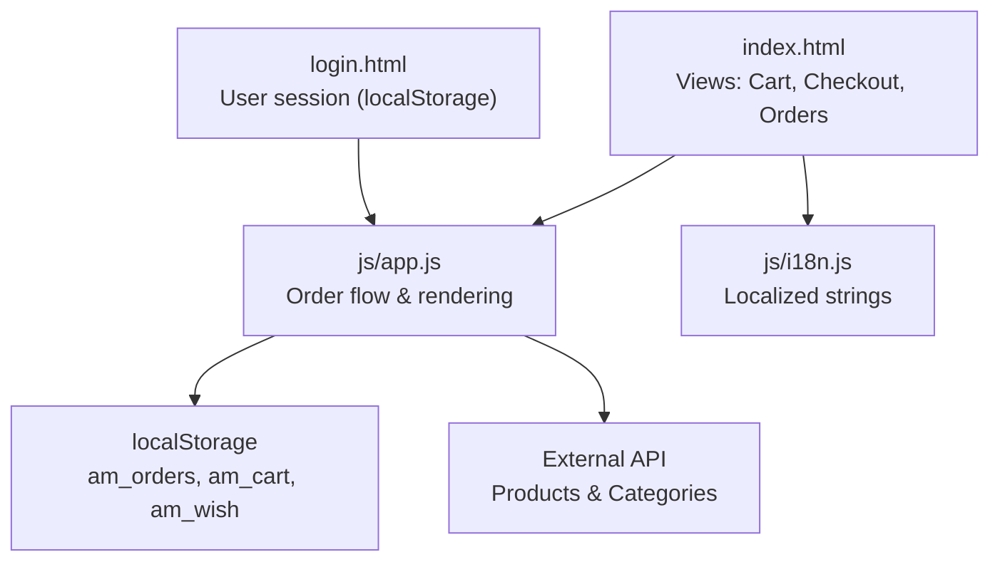
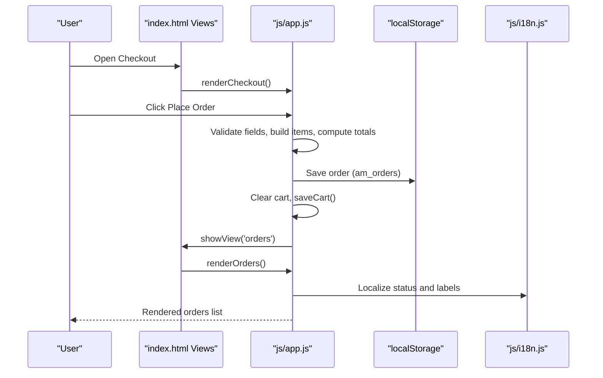
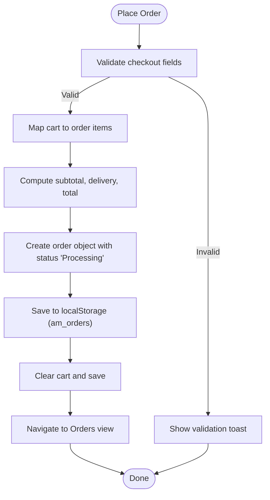
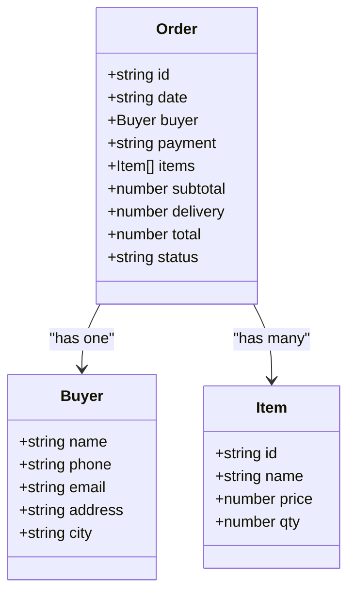
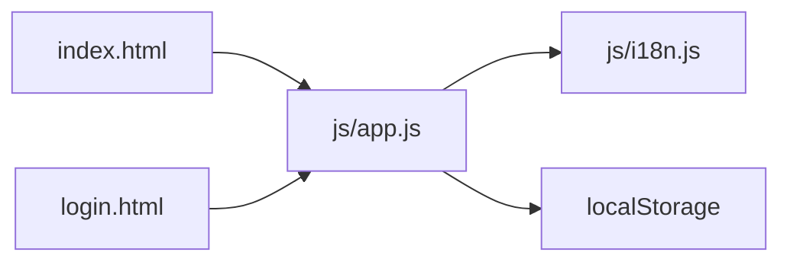

# Order Management

<cite>
**Referenced Files in This Document**
- [index.html](file://index.html)
- [login.html](file://login.html)
- [app.js](file://js/app.js)
- [i18n.js](file://js/i18n.js)
</cite>

## Table of Contents
1. Introduction
2. Project Structure
3. Core Components
4. Architecture Overview
5. Detailed Component Analysis
6. Dependency Analysis
7. Performance Considerations
8. Troubleshooting Guide
9. Conclusion

## Introduction
This document explains the order management system for the marketplace application. It covers how orders are created during checkout, persisted locally, displayed in the orders view, and navigated by users. It also documents order data structure, status handling, filtering and history navigation, and the relationship between orders and user accounts.

## Project Structure
The order management spans HTML views, JavaScript logic, and internationalization:
- index.html defines the main application shell including the Orders view container and Checkout form.
- login.html handles authentication and stores a simple user profile in localStorage to gate access to the Orders view.
- js/app.js implements all client-side logic: cart, wishlist, orders creation, persistence, rendering, and navigation.
- js/i18n.js provides localized strings used across the app, including order-related labels and statuses.

**Diagram sources**
- [index.html:237-282](file://index.html#L237-L282)
- [login.html:182-218](file://login.html#L182-L218)
- [app.js:834-895](file://js/app.js#L834-L895)
- [i18n.js:107-115](file://js/i18n.js#L107-L115)

**Section sources**
- [index.html:237-282](file://index.html#L237-L282)
- [login.html:182-218](file://login.html#L182-L218)
- [app.js:834-895](file://js/app.js#L834-L895)
- [i18n.js:107-115](file://js/i18n.js#L107-L115)

## Core Components
- Order creation: Validates checkout inputs, builds an order object from cart items, calculates totals, sets initial status, and persists to localStorage.
- Order persistence: Orders stored under a dedicated key; loaded on app start to restore state.
- Orders list rendering: Displays each order with ID, date, items summary, total, payment method, and localized status.
- Navigation and gating: Accessing Orders via account tab redirects to login if no user is present; otherwise shows orders.
- Internationalization: All labels and statuses are localized using i18n keys.

Key responsibilities and behaviors are implemented in the following files:
- Order creation and persistence: [app.js:834-872](file://js/app.js#L834-L872), [app.js:89-98](file://js/app.js#L89-L98)
- Orders view rendering: [app.js:874-895](file://js/app.js#L874-L895)
- View routing and guards: [app.js:176-194](file://js/app.js#L176-L194), [app.js:940-953](file://js/app.js#L940-L953)
- Localization keys for orders: [i18n.js:107-115](file://js/i18n.js#L107-L115)

**Section sources**
- [app.js:834-872](file://js/app.js#L834-L872)
- [app.js:89-98](file://js/app.js#L89-L98)
- [app.js:874-895](file://js/app.js#L874-L895)
- [app.js:176-194](file://js/app.js#L176-L194)
- [app.js:940-953](file://js/app.js#L940-L953)
- [i18n.js:107-115](file://js/i18n.js#L107-L115)

## Architecture Overview
The order management follows a client-side SPA pattern:
- Views are sections within index.html toggled by showView.
- The Orders view is rendered when navigating to orders or after placing an order.
- Orders are created in the checkout flow and saved to localStorage.
- The app loads existing orders on startup and renders them when needed.
- User account presence controls access to the Orders view.

**Diagram sources**
- [index.html:237-282](file://index.html#L237-L282)
- [app.js:808-832](file://js/app.js#L808-L832)
- [app.js:834-872](file://js/app.js#L834-L872)
- [app.js:874-895](file://js/app.js#L874-L895)
- [i18n.js:107-115](file://js/i18n.js#L107-L115)

## Detailed Component Analysis

### Order Data Model and Persistence
- Storage keys:
  - Orders: am_orders
  - Cart: am_cart
  - Wishlist: am_wish
- Load/save utilities:
  - loadLS reads cart, wishlist, orders from localStorage into memory arrays.
  - saveOrders writes current orders array back to localStorage.
- Order object shape:
  - id: unique order identifier
  - date: ISO timestamp
  - buyer: { name, phone, email, address, city }
  - payment: string (e.g., Cash on Delivery, Card)
  - items: array of { id, name, price, qty }
  - subtotal: number
  - delivery: number
  - total: number
  - status: string (e.g., Processing)

Implementation references:
- Keys and storage functions: [app.js:61-66](file://js/app.js#L61-L66), [app.js:89-98](file://js/app.js#L89-L98)
- Order creation and persistence: [app.js:834-872](file://js/app.js#L834-L872)

Complexity notes:
- Saving orders is O(1) write to localStorage.
- Loading orders on init is O(n) parse where n is number of orders.

**Section sources**
- [app.js:61-66](file://js/app.js#L61-L66)
- [app.js:89-98](file://js/app.js#L89-L98)
- [app.js:834-872](file://js/app.js#L834-L872)

### Checkout Flow and Order Creation
- Validation: Ensures required fields are filled; shows toast if missing.
- Items mapping: Converts cart entries to order items with product details resolved from cache or products list.
- Totals: Computes subtotal and delivery fee; total equals subtotal plus delivery.
- Status: Sets initial status to Processing.
- Side effects: Clears cart, saves orders, shows success toast, navigates to orders view.

References:
- Checkout rendering and totals: [app.js:808-832](file://js/app.js#L808-L832)
- Place order logic: [app.js:834-872](file://js/app.js#L834-L872)

**Diagram sources**
- [app.js:834-872](file://js/app.js#L834-L872)
- [app.js:808-832](file://js/app.js#L808-L832)

**Section sources**
- [app.js:808-832](file://js/app.js#L808-L832)
- [app.js:834-872](file://js/app.js#L834-L872)

### Orders List Rendering and History Navigation
- Empty state: Shows message and call-to-action to browse products.
- Order cards: Display order number, date, items summary, total, payment method, and localized status.
- Date formatting: Uses locale-aware date formatting based on current language.
- Status localization: Maps order status to localized label via i18n keys.

References:
- Orders view container: [index.html:278-282](file://index.html#L278-L282)
- Orders rendering: [app.js:874-895](file://js/app.js#L874-L895)
- Localization keys: [i18n.js:107-115](file://js/i18n.js#L107-L115)

**Diagram sources**
- [app.js:834-872](file://js/app.js#L834-L872)
- [app.js:874-895](file://js/app.js#L874-L895)

**Section sources**
- [index.html:278-282](file://index.html#L278-L282)
- [app.js:874-895](file://js/app.js#L874-L895)
- [i18n.js:107-115](file://js/i18n.js#L107-L115)

### Order Status Management
- Initial status: Set to Processing upon order placement.
- Localized display: Status is mapped to localized text using i18n keys prefixed with status_ and lowercased status value.
- Extensibility: Additional statuses can be added by defining corresponding i18n keys and updating order status values.

References:
- Status assignment: [app.js:855-865](file://js/app.js#L855-L865)
- Status localization: [app.js:881-894](file://js/app.js#L881-L894)
- i18n keys: [i18n.js:107-115](file://js/i18n.js#L107-L115)

**Section sources**
- [app.js:855-865](file://js/app.js#L855-L865)
- [app.js:881-894](file://js/app.js#L881-L894)
- [i18n.js:107-115](file://js/i18n.js#L107-L115)

### Relationship Between Orders and User Accounts
- Account gating: Navigating to the Orders view via the mobile account tab checks for a saved user in localStorage; if absent, redirects to login.
- User session: Login/signup stores a minimal user profile in localStorage; this acts as a session indicator for accessing Orders.

References:
- Account tab guard: [app.js:940-953](file://js/app.js#L940-L953)
- User session storage: [login.html:182-218](file://login.html#L182-L218)

**Section sources**
- [app.js:940-953](file://js/app.js#L940-L953)
- [login.html:182-218](file://login.html#L182-L218)

### Order Filtering and History Navigation
- Filtering: The Orders view currently displays all orders without built-in filters (e.g., by status or date). Filtering could be added by extending renderOrders to accept query parameters and re-render accordingly.
- History navigation: Users navigate to Orders via header dropdown or mobile account tab; the view lists orders chronologically with newest first due to unshift insertion.

References:
- Orders view entry points: [index.html:42-52](file://index.html#L42-L52), [index.html:398-402](file://index.html#L398-L402)
- Orders rendering: [app.js:874-895](file://js/app.js#L874-L895)

[No sources needed since this section proposes conceptual enhancements beyond current implementation]

### Integration with Checkout Completion Flow
- After successful order placement, the app clears the cart, persists the order, shows a success toast, and switches to the Orders view so users can immediately see their new order.

References:
- Checkout completion: [app.js:834-872](file://js/app.js#L834-L872)

**Section sources**
- [app.js:834-872](file://js/app.js#L834-L872)

## Dependency Analysis
- Views depend on app.js for rendering and behavior.
- app.js depends on i18n.js for localized strings and on localStorage for persistence.
- Login page influences Orders access through a simple session flag.

**Diagram sources**
- [index.html:237-282](file://index.html#L237-L282)
- [login.html:182-218](file://login.html#L182-L218)
- [app.js:834-895](file://js/app.js#L834-L895)
- [i18n.js:107-115](file://js/i18n.js#L107-L115)

**Section sources**
- [index.html:237-282](file://index.html#L237-L282)
- [login.html:182-218](file://login.html#L182-L218)
- [app.js:834-895](file://js/app.js#L834-L895)
- [i18n.js:107-115](file://js/i18n.js#L107-L115)

## Performance Considerations
- localStorage operations are synchronous and fast for small datasets; ensure orders remain compact.
- Avoid unnecessary re-renders by only calling renderOrders when switching to the orders view or after placing an order.
- For large order histories, consider pagination or virtualization to improve rendering performance.

[No sources needed since this section provides general guidance]

## Troubleshooting Guide
- Orders not visible after checkout:
  - Verify that placeOrder runs and calls saveOrders.
  - Check localStorage for the orders key and ensure it contains valid JSON.
- Incorrect order status display:
  - Ensure i18n includes the expected status key mapping.
  - Confirm the order status string matches the localized key format.
- Access denied to Orders:
  - Confirm user session exists in localStorage; if missing, redirect to login.

**Section sources**
- [app.js:834-872](file://js/app.js#L834-L872)
- [app.js:874-895](file://js/app.js#L874-L895)
- [app.js:940-953](file://js/app.js#L940-L953)
- [i18n.js:107-115](file://js/i18n.js#L107-L115)

## Conclusion
The order management system provides a complete client-side workflow: create orders during checkout, persist them locally, and display them in a clear, localized orders view. Orders are tied to a simple user session for access control. While filtering is not yet implemented in the orders view, the architecture supports easy extension. The system leverages localStorage for persistence and i18n for multilingual support, ensuring a smooth user experience across languages.

[No sources needed since this section summarizes without analyzing specific files]