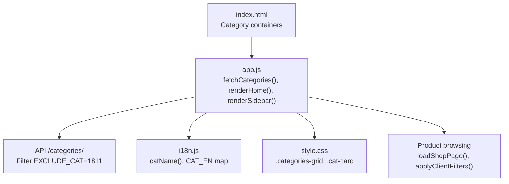
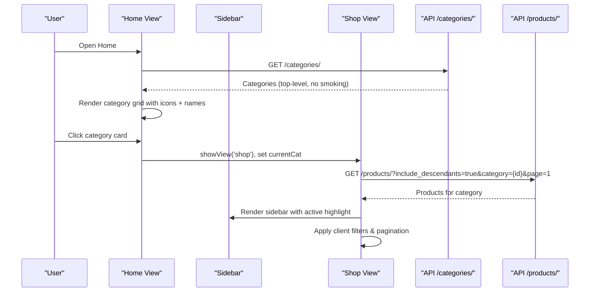
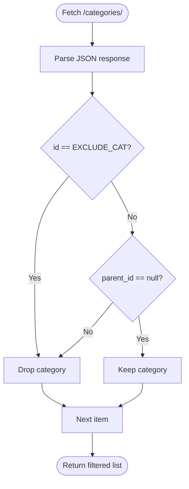
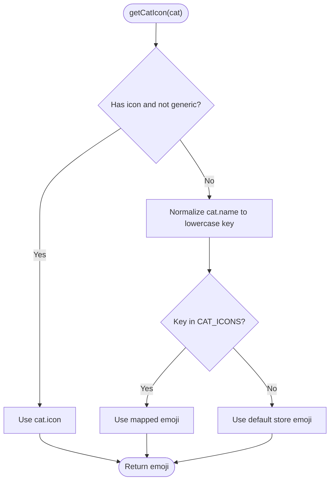
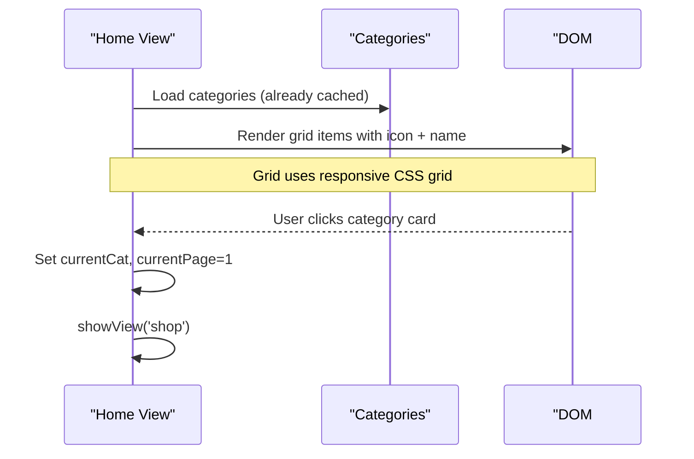
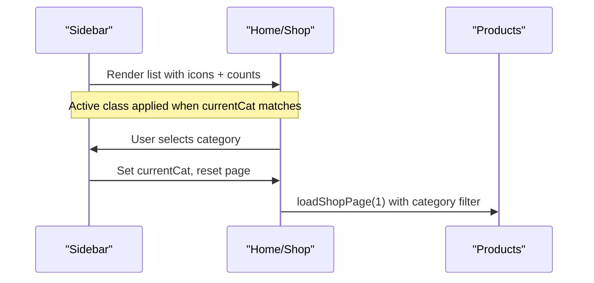
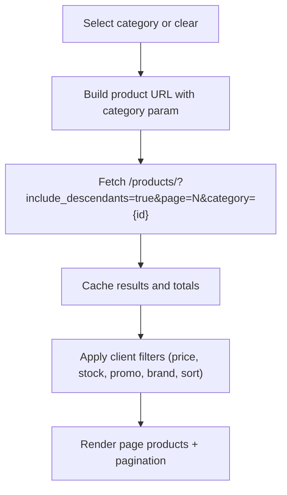
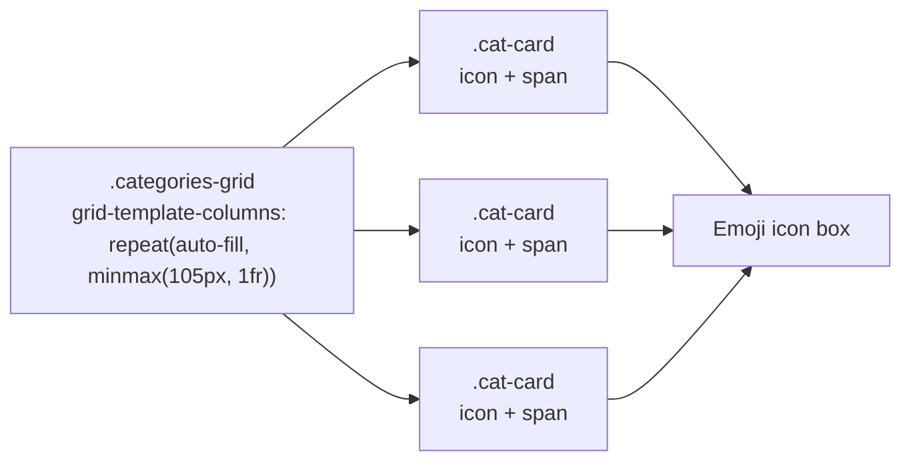
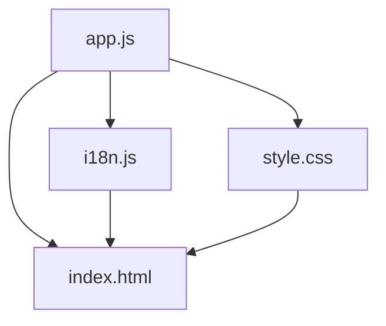

# Category Management

<cite>
**Referenced Files in This Document**
- [app.js](file://js/app.js)
- [i18n.js](file://js/i18n.js)
- [index.html](file://index.html)
- [style.css](file://css/style.css)
</cite>

## Table of Contents
1. [Introduction](#introduction)
2. [Project Structure](#project-structure)
3. [Core Components](#core-components)
4. [Architecture Overview](#architecture-overview)
5. [Detailed Component Analysis](#detailed-component-analysis)
6. [Dependency Analysis](#dependency-analysis)
7. [Performance Considerations](#performance-considerations)
8. [Troubleshooting Guide](#troubleshooting-guide)
9. [Conclusion](#conclusion)

## Introduction
This document explains the category management system in AM MARKET with a focus on:
- Fetching categories from the API and filtering out smoking products (category ID 1811).
- Rendering categories with emoji icons, including a mapping that supports both French and English names and fallbacks for missing icons.
- The selection workflow from the home page grid to sidebar navigation and how category filtering integrates with product browsing.
- Examples of category data structure, icon assignment logic, and the responsive category grid layout.

## Project Structure
The category system spans HTML structure, CSS styling, and JavaScript logic:
- HTML defines the category grid container, sidebar list, and shop filters.
- CSS styles the responsive category grid and interactive elements.
- JavaScript fetches categories, filters them, assigns icons, renders UI, and wires interactions.

**Diagram sources**
- [index.html:62-72](file://index.html#L62-L72)
- [index.html:90-110](file://index.html#L90-L110)
- [index.html:141-177](file://index.html#L141-L177)
- [app.js:117-124](file://js/app.js#L117-L124)
- [app.js:266-286](file://js/app.js#L266-L286)
- [app.js:316-336](file://js/app.js#L316-L336)
- [app.js:545-583](file://js/app.js#L545-L583)
- [app.js:339-361](file://js/app.js#L339-L361)
- [i18n.js:341-374](file://js/i18n.js#L341-L374)
- [style.css:328-366](file://css/style.css#L328-L366)

**Section sources**
- [index.html:62-72](file://index.html#L62-L72)
- [index.html:90-110](file://index.html#L90-L110)
- [index.html:141-177](file://index.html#L141-L177)
- [app.js:117-124](file://js/app.js#L117-L124)
- [app.js:266-286](file://js/app.js#L266-L286)
- [app.js:316-336](file://js/app.js#L316-L336)
- [app.js:545-583](file://js/app.js#L545-L583)
- [app.js:339-361](file://js/app.js#L339-L361)
- [i18n.js:341-374](file://js/i18n.js#L341-L374)
- [style.css:328-366](file://css/style.css#L328-L366)

## Core Components
- Category fetching and exclusion: Retrieves top-level categories and excludes the smoking category by ID.
- Icon mapping: Assigns emoji icons per category name with support for French and English keys and a generic fallback.
- Home grid rendering: Displays up to 12 categories with icons and localized names; clicking navigates to the shop view with the selected category.
- Sidebar rendering: Lists all categories with icons and counts; selecting updates current category and reloads shop results.
- Shop integration: Category selection drives product queries and client-side filters.

**Section sources**
- [app.js:117-124](file://js/app.js#L117-L124)
- [app.js:11-59](file://js/app.js#L11-L59)
- [app.js:266-286](file://js/app.js#L266-L286)
- [app.js:316-336](file://js/app.js#L316-L336)
- [app.js:545-583](file://js/app.js#L545-L583)
- [i18n.js:341-374](file://js/i18n.js#L341-L374)

## Architecture Overview
The category flow connects API data to UI components and user interactions:

**Diagram sources**
- [app.js:117-124](file://js/app.js#L117-L124)
- [app.js:266-286](file://js/app.js#L266-L286)
- [app.js:316-336](file://js/app.js#L316-L336)
- [app.js:545-583](file://js/app.js#L545-L583)

## Detailed Component Analysis

### Category Data Model and Filtering
- Source: Top-level categories are fetched from the API endpoint.
- Exclusion: Any category with ID equal to the smoking constant is removed.
- Result: Only root categories (no parent) are kept for display and filtering.

**Diagram sources**
- [app.js:117-124](file://js/app.js#L117-L124)

**Section sources**
- [app.js:117-124](file://js/app.js#L117-L124)

### Category Icon Mapping System
- Priority: Use the category’s own icon if present and not a generic placeholder.
- Name-based mapping: Match against a dictionary keyed by normalized lowercase names (French and English variants).
- Fallback: If no match, use a default store icon emoji.

**Diagram sources**
- [app.js:11-59](file://js/app.js#L11-L59)

**Section sources**
- [app.js:11-59](file://js/app.js#L11-L59)

### Home Page Category Grid
- Rendering: Up to 12 categories are rendered into a responsive grid using Bootstrap classes.
- Icons and names: Each card shows an emoji icon and a localized category name via the i18n helper.
- Interaction: Clicking a card sets the current category and navigates to the shop view.

**Diagram sources**
- [index.html:90-110](file://index.html#L90-L110)
- [app.js:266-286](file://js/app.js#L266-L286)
- [style.css:328-366](file://css/style.css#L328-L366)

**Section sources**
- [index.html:90-110](file://index.html#L90-L110)
- [app.js:266-286](file://js/app.js#L266-L286)
- [style.css:328-366](file://css/style.css#L328-L366)

### Sidebar Navigation
- Rendering: The sidebar lists all categories with their icons and product counts.
- Active state: Highlights the currently selected category.
- Interaction: Selecting a category sets the current category and loads the shop view.

**Diagram sources**
- [index.html:62-72](file://index.html#L62-L72)
- [app.js:316-336](file://js/app.js#L316-L336)
- [app.js:545-583](file://js/app.js#L545-L583)

**Section sources**
- [index.html:62-72](file://index.html#L62-L72)
- [app.js:316-336](file://js/app.js#L316-L336)
- [app.js:545-583](file://js/app.js#L545-L583)

### Category Filtering Integration with Product Browsing
- Query building: When a category is selected, product requests include the category parameter and descendants flag to include subcategories.
- Client-side filters: Price range, availability, promotions, brand, and sorting refine the displayed results.
- Pagination: Results are paginated with a Google-style window around the current page.

**Diagram sources**
- [app.js:126-133](file://js/app.js#L126-L133)
- [app.js:339-361](file://js/app.js#L339-L361)
- [app.js:545-583](file://js/app.js#L545-L583)
- [app.js:483-529](file://js/app.js#L483-L529)

**Section sources**
- [app.js:126-133](file://js/app.js#L126-L133)
- [app.js:339-361](file://js/app.js#L339-L361)
- [app.js:483-529](file://js/app.js#L483-L529)
- [app.js:545-583](file://js/app.js#L545-L583)

### Responsive Category Grid Layout
- Grid: Uses CSS Grid with auto-fill and minimum column width to adapt to screen sizes.
- Cards: Each category card includes an icon box and label with hover effects and shadows.
- Accessibility: Labels are readable and consistent across breakpoints.

**Diagram sources**
- [style.css:328-366](file://css/style.css#L328-L366)

**Section sources**
- [style.css:328-366](file://css/style.css#L328-L366)

## Dependency Analysis
- app.js depends on:
  - index.html for DOM nodes (#homeCategories, #sidebar, #categoryList, #shopProducts, etc.).
  - i18n.js for category name localization and translation utilities.
  - style.css for visual presentation of grids and cards.
- i18n.js provides:
  - catName(name) to translate French API names to English when needed.
  - Translation strings used throughout UI labels.

**Diagram sources**
- [app.js:266-286](file://js/app.js#L266-L286)
- [app.js:316-336](file://js/app.js#L316-L336)
- [i18n.js:341-374](file://js/i18n.js#L341-L374)
- [index.html:62-72](file://index.html#L62-L72)
- [index.html:90-110](file://index.html#L90-L110)
- [style.css:328-366](file://css/style.css#L328-L366)

**Section sources**
- [app.js:266-286](file://js/app.js#L266-L286)
- [app.js:316-336](file://js/app.js#L316-L336)
- [i18n.js:341-374](file://js/i18n.js#L341-L374)
- [index.html:62-72](file://index.html#L62-L72)
- [index.html:90-110](file://index.html#L90-L110)
- [style.css:328-366](file://css/style.css#L328-L366)

## Performance Considerations
- Caching: Product details are cached after first fetch to avoid repeated network calls during detail and related views.
- Pagination: Limits initial product loading to a fixed page size to reduce payload and improve perceived performance.
- Client-side filtering: Applies price, availability, promotion, brand, and sort filters locally for instant feedback without extra requests.
- Image handling: Lazy loading and error fallbacks prevent broken images from impacting layout.

[No sources needed since this section provides general guidance]

## Troubleshooting Guide
- No categories shown:
  - Verify API connectivity and that the categories endpoint returns data.
  - Ensure the exclusion filter does not remove all categories (only ID 1811 is excluded).
- Missing icons:
  - If a category lacks an icon or has a generic one, the system falls back to name-based mapping; ensure category names match keys in the mapping table.
  - For unmatched names, a default store icon is used.
- Category not filtering products:
  - Confirm that the selected category ID is correctly passed to the product query.
  - Check that include_descendants is enabled so subcategories are included.
- Language mismatch:
  - Category names are localized via i18n; ensure the language setting is correct and that translations exist for UI labels.

**Section sources**
- [app.js:117-124](file://js/app.js#L117-L124)
- [app.js:11-59](file://js/app.js#L11-L59)
- [app.js:545-583](file://js/app.js#L545-L583)
- [i18n.js:341-374](file://js/i18n.js#L341-L374)

## Conclusion
AM MARKET’s category management system efficiently retrieves top-level categories, excludes restricted content, and presents them with meaningful emoji icons and localized names. Users can navigate from the home grid to the shop view and leverage sidebar filters to browse relevant products. The design balances responsiveness, clarity, and performance while providing robust fallbacks for missing icons and smooth integration with product discovery features.