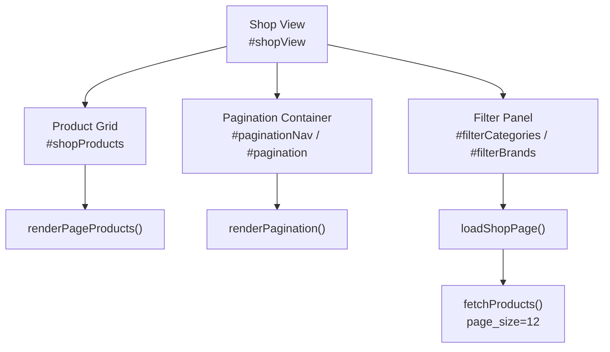
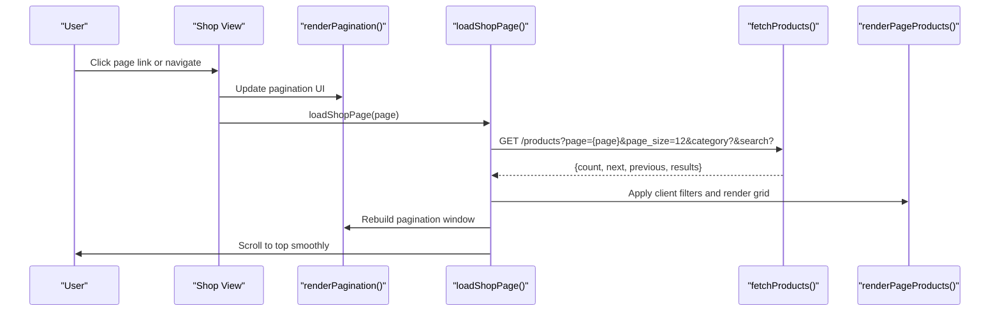
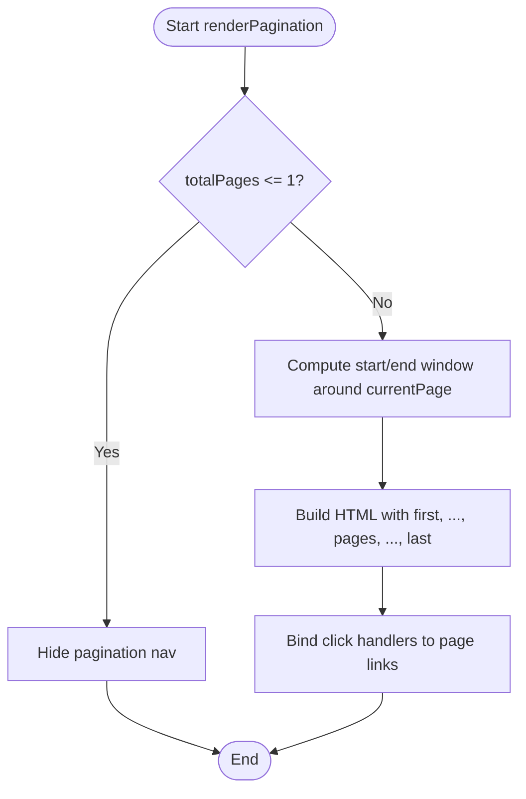
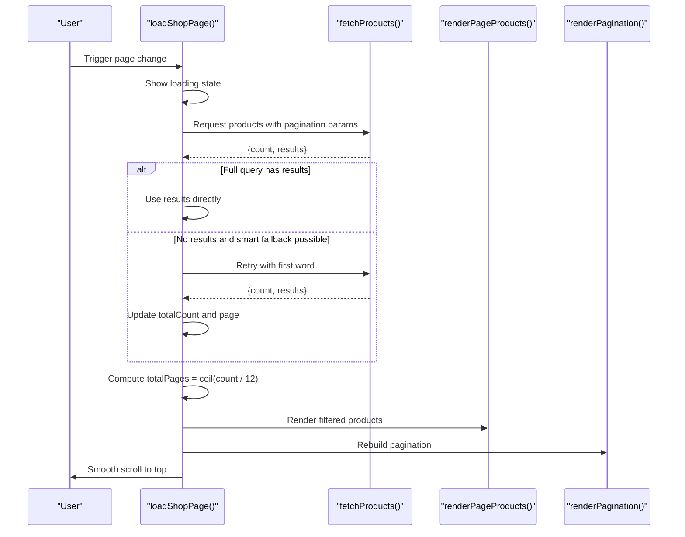
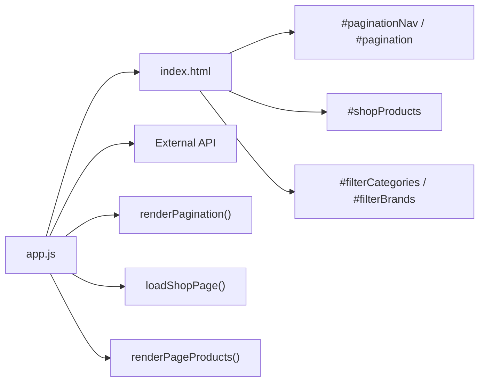

# Pagination & Navigation

<cite>
**Referenced Files in This Document**
- [app.js](file://js/app.js)
- [index.html](file://index.html)
</cite>

## Table of Contents
1. [Introduction](#introduction)
2. [Project Structure](#project-structure)
3. [Core Components](#core-components)
4. [Architecture Overview](#architecture-overview)
5. [Detailed Component Analysis](#detailed-component-analysis)
6. [Dependency Analysis](#dependency-analysis)
7. [Performance Considerations](#performance-considerations)
8. [Troubleshooting Guide](#troubleshooting-guide)
9. [Conclusion](#conclusion)

## Introduction
This document explains the pagination system that implements a Google-style page window around the current page, along with first/last shortcuts, ellipsis indicators for large catalogs, and disabled states at boundaries. It also covers how product loading is managed via API calls with pagination parameters, error handling, loading states, page size configuration (12 products per page), total count calculation, and integration with search and category filtering. Finally, it documents smooth scrolling behavior and URL state considerations.

## Project Structure
The application is a single-page interface built with Bootstrap and Font Awesome. The shop view contains:
- A filter sidebar for categories, price range, availability, promotions, and brands.
- A product grid area where paginated results are rendered.
- A pagination control area that renders the smart page window.

**Diagram sources**
- [index.html:132-198](file://index.html#L132-L198)
- [app.js:483-529](file://js/app.js#L483-L529)
- [app.js:545-583](file://js/app.js#L545-L583)
- [app.js:126-133](file://js/app.js#L126-L133)

**Section sources**
- [index.html:132-198](file://index.html#L132-L198)
- [app.js:126-133](file://js/app.js#L126-L133)

## Core Components
- renderPagination(): Renders a Google-style window of pages centered around the current page, includes first/last shortcuts, ellipses when needed, and disables boundary navigation appropriately.
- loadShopPage(page): Fetches products from the API with pagination parameters, handles loading and error states, computes total pages based on a fixed page size, integrates with search and category filters, and triggers rendering and smooth scroll.
- fetchProducts(page, categoryId, search): Builds the API request URL with page_size=12 and optional category and search query parameters.
- renderPageProducts(suggestion): Applies client-side filters to the current page’s products and updates the product grid and result counts.

Key behaviors:
- Page size is fixed at 12 products per page.
- Total pages are calculated as ceil(totalCount / 12).
- Search and category selection reset to page 1 before loading.
- Smooth scrolling to top occurs after successful loads.

**Section sources**
- [app.js:483-529](file://js/app.js#L483-L529)
- [app.js:545-583](file://js/app.js#L545-L583)
- [app.js:126-133](file://js/app.js#L126-L133)
- [app.js:412-481](file://js/app.js#L412-L481)

## Architecture Overview
The pagination flow connects user interactions to data fetching and UI updates:

**Diagram sources**
- [app.js:483-529](file://js/app.js#L483-L529)
- [app.js:545-583](file://js/app.js#L545-L583)
- [app.js:126-133](file://js/app.js#L126-L133)
- [app.js:412-481](file://js/app.js#L412-L481)

## Detailed Component Analysis

### renderPagination(): Smart Windowing and Boundaries
- Window logic: Computes start and end indices to show up to five visible pages centered around the current page.
- First/last shortcuts: Always include links to page 1 and totalPages when appropriate.
- Ellipsis indicators: Inserted when there are hidden pages between the first shortcut and the window, or between the window and the last shortcut.
- Disabled states: Previous button disabled on page 1; Next button disabled on the last page.
- Event binding: Attaches click handlers to page links to trigger loadShopPage for valid page numbers.

**Diagram sources**
- [app.js:483-529](file://js/app.js#L483-L529)

**Section sources**
- [app.js:483-529](file://js/app.js#L483-L529)

### loadShopPage(page): API Calls, Loading States, Error Handling
- Sets current page and shows a loading spinner while data is being fetched.
- Calls fetchProducts with page, current category, and search query.
- Stores results in pageProducts and totalCount from the API response.
- Implements a smart search fallback: if the full query returns zero results, retries with the first word of the query (when applicable).
- Calculates totalPages using ceil(totalCount / 12).
- Updates filter panel, product grid, and pagination.
- Scrolls to the top smoothly after successful load.
- On error, displays an error message and hides pagination.

**Diagram sources**
- [app.js:545-583](file://js/app.js#L545-L583)
- [app.js:126-133](file://js/app.js#L126-L133)

**Section sources**
- [app.js:545-583](file://js/app.js#L545-L583)
- [app.js:126-133](file://js/app.js#L126-L133)

### Integration with Search and Category Filtering
- Search:
  - User input is trimmed and stored in searchQ.
  - Navigates to shop view and resets to page 1.
  - Passes searchQ to fetchProducts to get server-side filtered results.
- Category:
  - Selecting a category sets currentCat and resets to page 1.
  - Category selection triggers loadShopPage(1) to refresh results.
- Client-side filters:
  - Price range, availability, promotion, and brand filters refine the current page’s products without additional API calls.
  - Sorting changes re-render the product grid with the selected order.

**Section sources**
- [app.js:955-966](file://js/app.js#L955-L966)
- [app.js:363-410](file://js/app.js#L363-L410)
- [app.js:339-361](file://js/app.js#L339-L361)
- [app.js:412-481](file://js/app.js#L412-L481)

### Page Size Configuration and Total Count Calculation
- Page size is fixed at 12 products per page via the API parameter page_size=12.
- Total pages are computed as Math.ceil(totalCount / 12), ensuring at least one page even when totalCount is zero.
- Result count display reflects either the server-provided totalCount or the number of items currently shown.

**Section sources**
- [app.js:126-133](file://js/app.js#L126-L133)
- [app.js:570-576](file://js/app.js#L570-L576)
- [app.js:412-420](file://js/app.js#L412-L420)

### Smooth Scrolling Behavior
- After each successful page load, the viewport scrolls to the top with smooth behavior to improve UX.
- Additional smooth scroll is used when navigating views or focusing the search input on mobile.

**Section sources**
- [app.js:577-577](file://js/app.js#L577-L577)
- [app.js:193-193](file://js/app.js#L193-L193)
- [app.js:944-945](file://js/app.js#L944-L945)

### URL State Management
- The current implementation does not update the browser URL or handle history entries for pagination.
- As a result, sharing a direct link to a specific page or using back/forward navigation will not reflect the active page.
- Recommended enhancement:
  - Update URL with query parameters such as ?page=2 and pushState on page changes.
  - On app initialization, read the page parameter and load the corresponding page.
  - Listen for popstate events to keep the UI in sync with browser history.

[No sources needed since this section provides general guidance]

## Dependency Analysis
The pagination system depends on several components and DOM elements:

**Diagram sources**
- [index.html:132-198](file://index.html#L132-L198)
- [app.js:483-529](file://js/app.js#L483-L529)
- [app.js:545-583](file://js/app.js#L545-L583)
- [app.js:412-481](file://js/app.js#L412-L481)

**Section sources**
- [index.html:132-198](file://index.html#L132-L198)
- [app.js:483-529](file://js/app.js#L483-L529)
- [app.js:545-583](file://js/app.js#L545-L583)
- [app.js:412-481](file://js/app.js#L412-L481)

## Performance Considerations
- Server-side pagination reduces payload size by returning only 12 products per page.
- Client-side filters avoid extra network requests but operate on the current page’s subset; consider moving heavy sorting/filtering to the server if datasets grow significantly.
- Product caching improves detail view performance and related product rendering.
- Avoid excessive DOM manipulations by batching updates within render functions.

[No sources needed since this section provides general guidance]

## Troubleshooting Guide
Common issues and resolutions:
- Pagination not showing:
  - Ensure totalPages > 1; pagination is hidden when there is only one page.
  - Verify that the API returns a valid count and results array.
- Disabled buttons always active:
  - Confirm currentPage is correctly set and bounded between 1 and totalPages.
  - Check event bindings on pagination links.
- Empty results:
  - If search returns no results, the smart fallback may retry with the first word; verify searchQ and API behavior.
  - Clear filters and retry to isolate whether the issue is with search or category selection.
- Errors during load:
  - On API failure, an error message is displayed and pagination is hidden; check network connectivity and API endpoints.

**Section sources**
- [app.js:483-529](file://js/app.js#L483-L529)
- [app.js:545-583](file://js/app.js#L545-L583)
- [app.js:126-133](file://js/app.js#L126-L133)

## Conclusion
The pagination system delivers a responsive, efficient browsing experience by combining server-side pagination with a Google-style page window. It supports first/last shortcuts, ellipsis indicators, and boundary-disabled states. The loadShopPage function manages API calls, loading and error states, and integrates seamlessly with search and category filters. With a fixed page size of 12 products per page and robust total count calculations, users can navigate large catalogs comfortably. For enhanced shareability and history support, integrating URL state management is recommended.