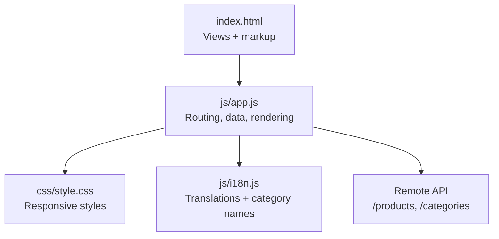
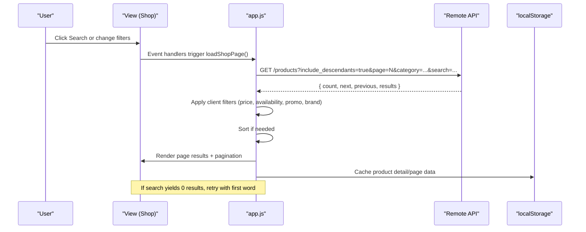
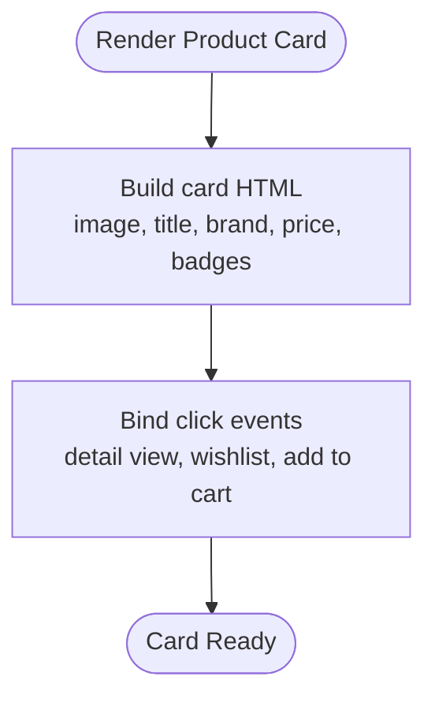
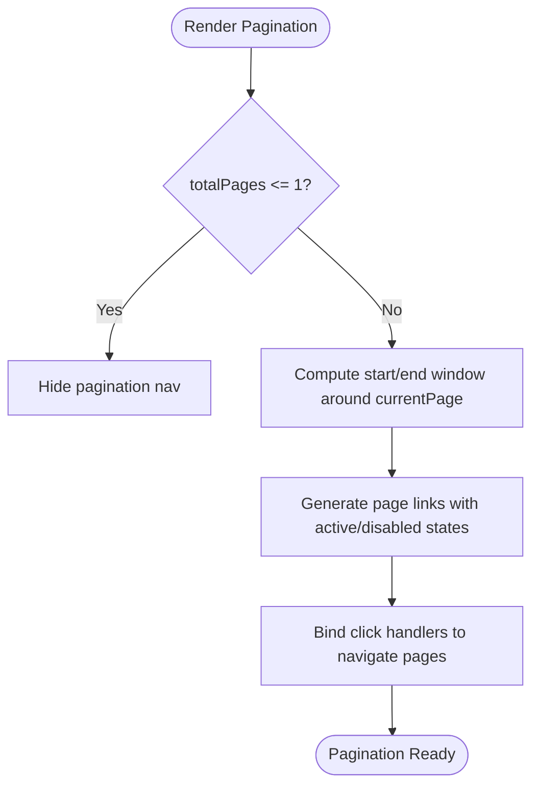
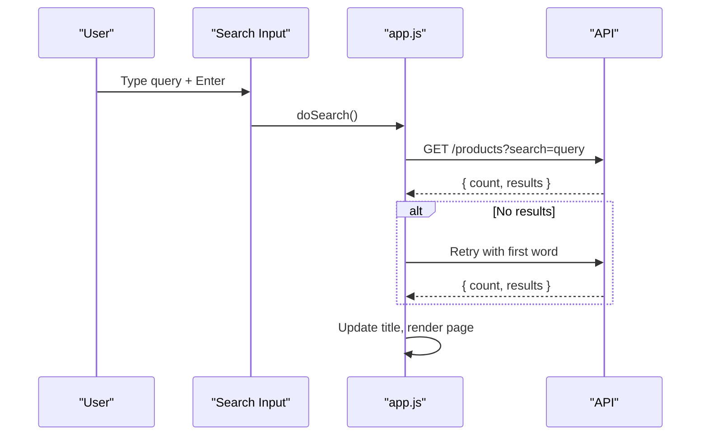
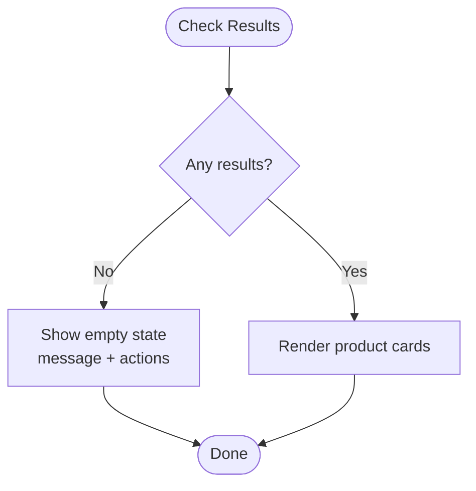
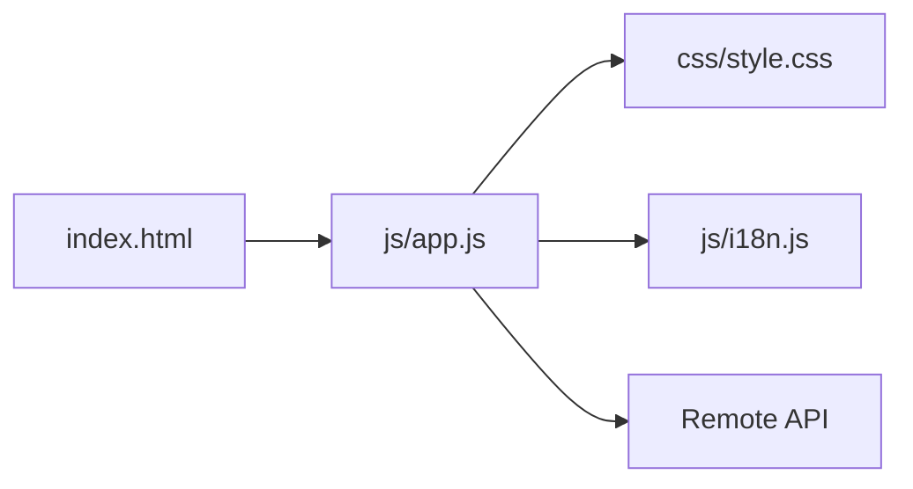

# Product Browsing & Display

<cite>
**Referenced Files in This Document**
- [index.html](file://index.html)
- [app.js](file://js/app.js)
- [style.css](file://css/style.css)
- [i18n.js](file://js/i18n.js)
</cite>

## Table of Contents
1. [Introduction](#introduction)
2. [Project Structure](#project-structure)
3. [Core Components](#core-components)
4. [Architecture Overview](#architecture-overview)
5. [Detailed Component Analysis](#detailed-component-analysis)
6. [Dependency Analysis](#dependency-analysis)
7. [Performance Considerations](#performance-considerations)
8. [Troubleshooting Guide](#troubleshooting-guide)
9. [Conclusion](#conclusion)

## Introduction
This document explains the product browsing and display functionality of the application, focusing on:
- Responsive product card grid (2 columns on mobile, 3 on tablet, 4 on desktop)
- Product image handling with lazy loading and error fallbacks
- Discount badges and promotional indicators
- Brand information display
- Pagination with Google-style page windowing
- Search integration and empty state handling
- Data caching and performance optimizations
- Responsive design patterns across screen sizes

## Project Structure
The product browsing UI is built with a simple client-side architecture:
- HTML defines views for Home, Shop, Detail, Cart, Checkout, Orders, Wishlist
- JavaScript manages data fetching from a remote API, rendering, filtering, pagination, and interactions
- CSS provides responsive layout and styling for cards, filters, and navigation
- i18n supports English and French text and category names

**Diagram sources**
- [index.html:74-199](file://index.html#L74-L199)
- [app.js:116-142](file://js/app.js#L116-L142)
- [style.css:375-513](file://css/style.css#L375-L513)
- [i18n.js:341-374](file://js/i18n.js#L341-L374)

**Section sources**
- [index.html:1-414](file://index.html#L1-L414)
- [app.js:1-1048](file://js/app.js#L1-L1048)
- [style.css:1-1271](file://css/style.css#L1-L1271)
- [i18n.js:1-418](file://js/i18n.js#L1-L418)

## Core Components
- Product card renderer: builds a responsive card with image, brand, price, discount/promo badge, and actions (wishlist, add to cart). Uses native lazy loading and an error fallback image.
- Shop view: fetches paginated products, applies client-side filters (price range, availability, promo, brand), sorts, and renders results with pagination.
- Search: integrates with the remote API search; includes smart fallback when full query returns no results.
- Empty state: shows friendly messaging and suggestions when no products match criteria.
- Caching: caches individual product details and recent pages to reduce network calls.

Key implementation references:
- Card HTML generation and binding: [cardHTML:206-241](file://js/app.js#L206-L241), [bindCards:243-263](file://js/app.js#L243-L263)
- Shop rendering and pagination: [renderPageProducts:412-481](file://js/app.js#L412-L481), [renderPagination:483-529](file://js/app.js#L483-L529)
- Search and smart fallback: [loadShopPage:545-583](file://js/app.js#L545-L583)
- Caching: [productCache usage:135-142](file://js/app.js#L135-L142), [page-level cache:571-572](file://js/app.js#L571-L572)

**Section sources**
- [app.js:206-263](file://js/app.js#L206-L263)
- [app.js:412-583](file://js/app.js#L412-L583)

## Architecture Overview
The browsing flow connects user interactions to data retrieval and UI updates:

**Diagram sources**
- [app.js:545-583](file://js/app.js#L545-L583)
- [app.js:339-361](file://js/app.js#L339-L361)
- [app.js:483-529](file://js/app.js#L483-L529)

## Detailed Component Analysis

### Product Card Rendering System
- Grid responsiveness:
  - Mobile: 2 columns via Bootstrap classes
  - Tablet: 3 columns
  - Desktop: 4 columns
- Image handling:
  - Native lazy loading attribute for performance
  - Error fallback to placeholder image
- Discount and promo badges:
  - Percentage discount badge when discount_percent > 0
  - Promo badge when is_promo is true
- Brand display:
  - Shows brand_name if present; otherwise defaults to store name
- Actions:
  - Wishlist toggle with visual state
  - Add to cart button

References:
- Responsive column classes: [col-6 col-md-4 col-xl-3:214-214](file://js/app.js#L214-L214)
- Lazy loading and error fallback: [loading="lazy", onerror fallback:218-219](file://js/app.js#L218-L219)
- Badges logic: [discount and promo conditions:209-216](file://js/app.js#L209-L216)
- Brand display: [brand_name fallback:223-223](file://js/app.js#L223-L223)
- Action bindings: [bindCards:243-263](file://js/app.js#L243-L263)

**Diagram sources**
- [app.js:206-263](file://js/app.js#L206-L263)

**Section sources**
- [app.js:206-263](file://js/app.js#L206-L263)
- [style.css:375-513](file://css/style.css#L375-L513)

### Responsive Grid Layout
- The product grid uses Bootstrap’s responsive grid classes to adapt columns:
  - Mobile: 2 columns
  - Tablet: 3 columns
  - Desktop: 4 columns
- Cards use consistent aspect ratio images and hover effects for better UX.

References:
- Column classes: [col-6 col-md-4 col-xl-3:214-214](file://js/app.js#L214-L214)
- Card styling and hover: [product-card, product-img:375-438](file://css/style.css#L375-L438)

**Section sources**
- [app.js:214-214](file://js/app.js#L214-L214)
- [style.css:375-438](file://css/style.css#L375-L438)

### Product Image Handling
- Lazy loading:
  - Uses native browser lazy loading to defer offscreen images
- Error fallback:
  - Replaces broken images with a placeholder URL
- Detail view also uses fallback for large images

References:
- Lazy loading and fallback: [loading="lazy", onerror:218-219](file://js/app.js#L218-L219)
- Detail image fallback: [onerror in detail view:604-605](file://js/app.js#L604-L605)

**Section sources**
- [app.js:218-219](file://js/app.js#L218-L219)
- [app.js:604-605](file://js/app.js#L604-L605)

### Discount Badges and Promotional Indicators
- Discount percentage badge appears when discount_percent > 0
- Promo badge appears when is_promo is true
- Both are visually distinct and positioned at the top-left of the card

References:
- Badge logic: [discount and promo conditions:209-216](file://js/app.js#L209-L216)
- Styling: [badge-disc, badge-promo:392-408](file://css/style.css#L392-L408)

**Section sources**
- [app.js:209-216](file://js/app.js#L209-L216)
- [style.css:392-408](file://css/style.css#L392-L408)

### Brand Information Display
- Displays brand_name when available
- Falls back to store name if brand is missing
- Shown below the product title in the card and prominently in the detail view

References:
- Card brand: [brand_name fallback:223-223](file://js/app.js#L223-L223)
- Detail brand: [brand display in detail:610-610](file://js/app.js#L610-L610)

**Section sources**
- [app.js:223-223](file://js/app.js#L223-L223)
- [app.js:610-610](file://js/app.js#L610-L610)

### Pagination System (Google-style Page Windowing)
- Displays a window of pages around the current page
- Handles first/last page shortcuts and ellipsis
- Disables prev/next when at boundaries

References:
- Window calculation and HTML generation: [renderPagination:483-529](file://js/app.js#L483-L529)

**Diagram sources**
- [app.js:483-529](file://js/app.js#L483-L529)

**Section sources**
- [app.js:483-529](file://js/app.js#L483-L529)

### Product Search Integration
- Integrates with the remote API search endpoint
- Updates shop title and breadcrumb based on search query
- Includes smart fallback: if full query returns no results, retries with the first word

References:
- Search handler: [doSearch:956-966](file://js/app.js#L956-L966)
- Smart fallback: [first-word retry:555-568](file://js/app.js#L555-L568)
- Title update: [updateShopTitle:531-537](file://js/app.js#L531-L537)

**Diagram sources**
- [app.js:956-966](file://js/app.js#L956-L966)
- [app.js:555-568](file://js/app.js#L555-L568)
- [app.js:531-537](file://js/app.js#L531-L537)

**Section sources**
- [app.js:956-966](file://js/app.js#L956-L966)
- [app.js:555-568](file://js/app.js#L555-L568)
- [app.js:531-537](file://js/app.js#L531-L537)

### Empty State Handling
- When no products match criteria, displays:
  - Friendly message and subtext
  - Clear search and browse all buttons
  - Suggested search terms
- Provides quick actions to refine or reset filters

References:
- Empty state template and actions: [renderPageProducts empty branch:422-460](file://js/app.js#L422-L460)

**Diagram sources**
- [app.js:422-460](file://js/app.js#L422-L460)

**Section sources**
- [app.js:422-460](file://js/app.js#L422-L460)

### Product Data Caching
- In-memory cache for individual product details by ID
- Page-level cache for current page products to avoid re-fetching
- Recent products stored in localStorage for quick access

References:
- Detail cache: [fetchProduct with cache:135-142](file://js/app.js#L135-L142)
- Page cache: [pageProducts assignment:551-552](file://js/app.js#L551-L552)
- Recent list: [addRecent/getRecent:100-114](file://js/app.js#L100-L114)

**Section sources**
- [app.js:135-142](file://js/app.js#L135-L142)
- [app.js:551-552](file://js/app.js#L551-L552)
- [app.js:100-114](file://js/app.js#L100-L114)

### Performance Optimizations
- Lazy loading images to reduce initial payload
- Client-side filtering and sorting to minimize re-renders
- Pagination limits results per page (12 items)
- Caching reduces repeated network requests
- Efficient DOM updates via innerHTML batched per section

References:
- Lazy loading: [loading="lazy":218-218](file://js/app.js#L218-L218)
- Pagination size: [page_size=12:127-127](file://js/app.js#L127-L127)
- Filtering/sorting: [applyClientFilters:339-361](file://js/app.js#L339-L361)
- Caching: [productCache usage:135-142](file://js/app.js#L135-L142)

**Section sources**
- [app.js:218-218](file://js/app.js#L218-L218)
- [app.js:127-127](file://js/app.js#L127-L127)
- [app.js:339-361](file://js/app.js#L339-L361)
- [app.js:135-142](file://js/app.js#L135-L142)

### Responsive Design Patterns
- Uses Bootstrap grid for responsive columns
- Sticky filter panel on larger screens
- Mobile bottom toolbar for primary navigation
- Consistent spacing and typography across breakpoints

References:
- Grid classes: [col-6 col-md-4 col-xl-3:214-214](file://js/app.js#L214-L214)
- Sticky filters: [filters-panel sticky-top:144-144](file://index.html#L144-L144)
- Mobile toolbar: [mobile-tabbar:373-403](file://index.html#L373-L403)

**Section sources**
- [app.js:214-214](file://js/app.js#L214-L214)
- [index.html:144-144](file://index.html#L144-L144)
- [index.html:373-403](file://index.html#L373-L403)

## Dependency Analysis
- Views depend on app.js for data and rendering
- app.js depends on style.css for visuals and i18n.js for localized strings and category names
- Remote API provides categories and products

**Diagram sources**
- [index.html:74-199](file://index.html#L74-L199)
- [app.js:116-142](file://js/app.js#L116-L142)
- [style.css:375-513](file://css/style.css#L375-L513)
- [i18n.js:341-374](file://js/i18n.js#L341-L374)

**Section sources**
- [index.html:74-199](file://index.html#L74-L199)
- [app.js:116-142](file://js/app.js#L116-L142)
- [style.css:375-513](file://css/style.css#L375-L513)
- [i18n.js:341-374](file://js/i18n.js#L341-L374)

## Performance Considerations
- Prefer lazy loading for images to improve initial load time
- Use pagination to limit DOM size and network payloads
- Cache frequently accessed product details to reduce API calls
- Batch DOM updates by constructing HTML strings before insertion
- Debounce or throttle search input if expanding to real-time search

[No sources needed since this section provides general guidance]

## Troubleshooting Guide
- Images not loading:
  - Ensure valid image URLs; fallback will show placeholder
  - Check network tab for 404 errors
- No products shown:
  - Verify search query and filters; use “Clear search” or “Browse all”
  - Check API connectivity; error messages displayed in UI
- Pagination not updating:
  - Confirm totalPages calculation and current page state
  - Ensure event listeners bound to pagination links

References:
- Error handling in product fetch: [catch blocks:311-313](file://js/app.js#L311-L313), [shop load catch:578-582](file://js/app.js#L578-L582)
- Empty state actions: [clear/browse handlers:440-460](file://js/app.js#L440-L460)

**Section sources**
- [app.js:311-313](file://js/app.js#L311-L313)
- [app.js:578-582](file://js/app.js#L578-L582)
- [app.js:440-460](file://js/app.js#L440-L460)

## Conclusion
The product browsing and display system combines responsive design, efficient data handling, and user-friendly features such as search, filtering, pagination, and clear empty states. Lazy loading and caching optimize performance, while consistent branding and promotions enhance the shopping experience. The modular structure allows easy extension and maintenance.

[No sources needed since this section summarizes without analyzing specific files]