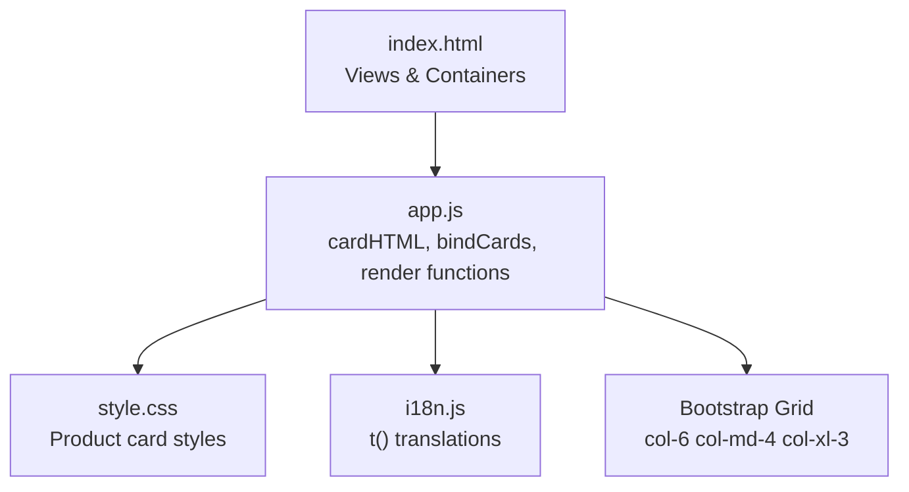
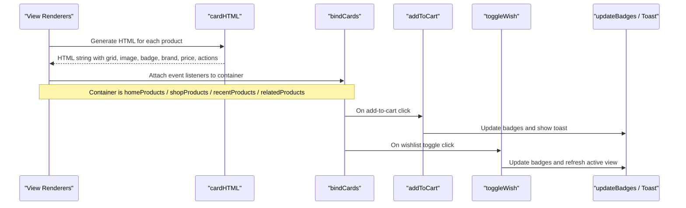
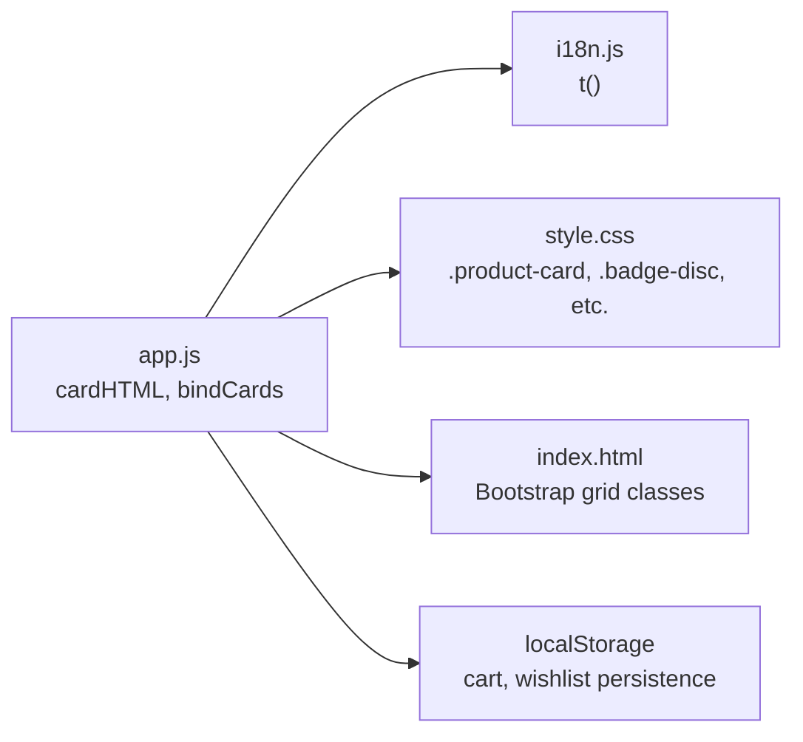

# Product Card Rendering

<cite>
**Referenced Files in This Document**
- [app.js](file://js/app.js)
- [style.css](file://css/style.css)
- [index.html](file://index.html)
- [i18n.js](file://js/i18n.js)
</cite>

## Table of Contents
1. [Introduction](#introduction)
2. [Project Structure](#project-structure)
3. [Core Components](#core-components)
4. [Architecture Overview](#architecture-overview)
5. [Detailed Component Analysis](#detailed-component-analysis)
6. [Dependency Analysis](#dependency-analysis)
7. [Performance Considerations](#performance-considerations)
8. [Troubleshooting Guide](#troubleshooting-guide)
9. [Conclusion](#conclusion)

## Introduction
This document explains the product card rendering system used to display products across the application. It focuses on how responsive Bootstrap grid layouts are generated, how product images are handled with lazy loading and error fallbacks, how discount badges and promotional items are shown, how brand information is rendered, and how prices are formatted with strikethrough for discounted items. It also covers wishlist button state management, add-to-cart functionality, and event binding through the bindCards function. Finally, it outlines the responsive design patterns and mobile-first approach applied to the card layout.

## Project Structure
The product card rendering logic lives primarily in the main JavaScript file, with styling provided by a dedicated stylesheet and markup containers defined in the HTML. Internationalization strings are managed separately.

**Diagram sources**
- [index.html:77-125](file://index.html#L77-L125)
- [app.js:205-263](file://js/app.js#L205-L263)
- [style.css:375-513](file://css/style.css#L375-L513)
- [i18n.js:381-402](file://js/i18n.js#L381-L402)

**Section sources**
- [index.html:77-125](file://index.html#L77-L125)
- [app.js:205-263](file://js/app.js#L205-L263)
- [style.css:375-513](file://css/style.css#L375-L513)
- [i18n.js:381-402](file://js/i18n.js#L381-L402)

## Core Components
- cardHTML(p): Generates a single product card’s HTML string using Bootstrap grid classes and includes image handling, discount/promo badge logic, brand name, price formatting, and action buttons.
- bindCards(container): Attaches click handlers to cards and their action buttons (add-to-cart and wishlist toggle), and navigates to the product detail view when appropriate.
- formatPrice(v): Formats numeric prices into localized currency strings.
- updateBadges(): Updates cart and wishlist counts displayed in the header and mobile toolbar.
- addToCart(id, qty): Adds or increments an item in the cart stored in localStorage and shows a toast notification.
- toggleWish(id): Toggles a product’s presence in the wishlist stored in localStorage and updates UI accordingly.

Key responsibilities:
- Responsive grid: Each card uses Bootstrap column classes to adapt from two columns on small screens to three on medium and four on extra-large screens.
- Image handling: Uses native lazy loading and an inline error handler to show a placeholder if the image fails to load.
- Discount and promo badges: Shows percentage discounts when available; otherwise shows a promotional badge for flagged items.
- Brand rendering: Displays the brand name if present; otherwise falls back to a default brand label.
- Price formatting: Shows current price and strikethrough original price when applicable.
- Event binding: Centralizes event listeners for navigation, adding to cart, and toggling wishlist.

**Section sources**
- [app.js:205-263](file://js/app.js#L205-L263)
- [app.js:145-148](file://js/app.js#L145-L148)
- [app.js:162-173](file://js/app.js#L162-L173)
- [app.js:701-708](file://js/app.js#L701-L708)
- [app.js:897-904](file://js/app.js#L897-L904)

## Architecture Overview
The rendering pipeline connects data to the DOM via reusable functions:

**Diagram sources**
- [app.js:205-263](file://js/app.js#L205-L263)
- [app.js:302-314](file://js/app.js#L302-L314)
- [app.js:412-481](file://js/app.js#L412-L481)
- [app.js:701-708](file://js/app.js#L701-L708)
- [app.js:897-904](file://js/app.js#L897-L904)

## Detailed Component Analysis

### cardHTML Function
Responsibilities:
- Builds a responsive Bootstrap grid wrapper around each card using col-6 col-md-4 col-xl-3.
- Renders product image with lazy loading and an error fallback to a placeholder URL.
- Computes and displays discount badge based on discount_percent; if no percentage but item is promotional, shows a promo badge.
- Renders brand_name if present; otherwise defaults to a brand label.
- Formats current price and conditionally renders original price with strikethrough when it is greater than the current price.
- Includes wishlist button with correct icon style based on whether the item is already in the wishlist.
- Includes add-to-cart button.

Responsive behavior:
- Mobile-first: Two columns on small screens (col-6), three on medium (col-md-4), four on extra-large (col-xl-3).

Image handling:
- Uses loading="lazy" for performance.
- Inline onerror handler replaces broken images with a placeholder.

Discount and promo logic:
- If discount_percent > 0, shows percentage badge.
- Else if is_promo is true, shows a promotional badge.

Brand rendering:
- Displays brand_name when available; otherwise shows a default brand label.

Price formatting:
- Uses formatPrice to convert numbers to currency strings.
- Shows original price with strikethrough when it exists and is higher than the current price.

Wishlist button state:
- Checks wishlist array for the product id to set active class and icon style.

Add-to-cart button:
- Carries data-id for the product and triggers addToCart on click.

**Section sources**
- [app.js:205-241](file://js/app.js#L205-L241)
- [app.js:145-148](file://js/app.js#L145-L148)
- [style.css:375-513](file://css/style.css#L375-L513)

### bindCards Function
Responsibilities:
- Attaches click handlers to elements carrying data-id to open the product detail view, excluding clicks on action buttons.
- Binds add-to-cart button clicks to addToCart with event propagation stopped to avoid triggering card navigation.
- Binds wishlist button clicks to toggleWish, stops propagation, and refreshes the currently active view (home, shop, or wishlist) to reflect changes.

Event flow:
- Card body click opens detail view.
- Add-to-cart click updates cart and UI.
- Wishlist toggle updates wishlist and refreshes relevant views.

**Section sources**
- [app.js:243-263](file://js/app.js#L243-L263)

### Wishlist Button State Management
State source:
- The wishlist array persisted in localStorage determines whether a product is marked as wished.

Visual state:
- When wished, the button gets an active class and a solid heart icon; otherwise, it shows a regular outline heart.

Interaction:
- Clicking toggles the item in the wishlist, persists changes, updates badges, and refreshes the active view to reflect the new state.

**Section sources**
- [app.js:205-241](file://js/app.js#L205-L241)
- [app.js:897-904](file://js/app.js#L897-L904)
- [app.js:162-173](file://js/app.js#L162-L173)

### Add-to-Cart Functionality
Behavior:
- Adds the product to the cart or increments quantity if already present.
- Persists cart to localStorage and updates badges.
- Shows a toast notification confirming the addition.

Integration:
- Triggered by the add-to-cart button bound in bindCards.

**Section sources**
- [app.js:701-708](file://js/app.js#L701-L708)
- [app.js:162-173](file://js/app.js#L162-L173)

### Price Formatting and Discount Display
Formatting:
- formatPrice converts numeric values to rounded currency strings with a currency suffix.

Discount display:
- Percentage discounts are computed from discount_percent and shown as a badge.
- Original price is shown with strikethrough when it exists and is greater than the current price.

Promotional items:
- When no percentage discount but the item is promotional, a promotional badge is shown instead.

**Section sources**
- [app.js:145-148](file://js/app.js#L145-L148)
- [app.js:205-241](file://js/app.js#L205-L241)

### Responsive Design Patterns and Mobile-First Approach
Grid usage:
- Each card is wrapped in a Bootstrap column class that adapts per breakpoint:
  - col-6: Two columns on small screens.
  - col-md-4: Three columns on medium screens.
  - col-xl-3: Four columns on extra-large screens.

Styling:
- Cards use consistent spacing, hover effects, and aspect-ratio images for visual consistency.
- Badges and action buttons are styled for clarity and touch-friendly sizing.

Mobile-first:
- Base styles target smaller screens first and enhance for larger breakpoints using media queries implicitly via Bootstrap classes.

**Section sources**
- [app.js:213-214](file://js/app.js#L213-L214)
- [style.css:375-513](file://css/style.css#L375-L513)

## Dependency Analysis
The product card rendering depends on several modules and utilities:

- i18n.js provides translation strings used in titles and tooltips.
- style.css defines visual appearance for cards, badges, and buttons.
- index.html provides Bootstrap CSS and container elements where cards are rendered.
- localStorage stores cart and wishlist state, influencing UI badges and button states.

**Diagram sources**
- [app.js:205-263](file://js/app.js#L205-L263)
- [i18n.js:381-402](file://js/i18n.js#L381-L402)
- [style.css:375-513](file://css/style.css#L375-L513)
- [index.html:77-125](file://index.html#L77-L125)

**Section sources**
- [app.js:205-263](file://js/app.js#L205-L263)
- [i18n.js:381-402](file://js/i18n.js#L381-L402)
- [style.css:375-513](file://css/style.css#L375-L513)
- [index.html:77-125](file://index.html#L77-L125)

## Performance Considerations
- Lazy loading: Images use loading="lazy" to defer offscreen image loading, improving initial page load time.
- Error fallback: Inline onerror handler ensures a placeholder image is shown if the source fails, preventing broken image icons.
- Efficient re-renders: bindCards attaches listeners once per container; after wishlist toggles, only the active view is refreshed to minimize DOM work.
- Badge updates: updateBadges minimizes DOM writes by checking current text content before updating.

[No sources needed since this section provides general guidance]

## Troubleshooting Guide
Common issues and resolutions:
- Images not displaying:
  - Verify image_url from the API is valid.
  - Check network requests for 404 errors.
  - Confirm the placeholder URL is reachable.
- Wishlist state not updating:
  - Ensure localStorage is accessible and not blocked by browser settings.
  - Confirm toggleWish is called and saveWish persists changes.
- Add-to-cart not working:
  - Verify bindCards is called after rendering cards.
  - Check that addToCart receives a valid product id.
  - Confirm updateBadges runs to reflect cart count changes.
- Discounts not showing:
  - Validate discount_percent and original_price fields from the API.
  - Ensure conditional checks compare numeric values correctly.

**Section sources**
- [app.js:205-241](file://js/app.js#L205-L241)
- [app.js:243-263](file://js/app.js#L243-L263)
- [app.js:897-904](file://js/app.js#L897-L904)
- [app.js:162-173](file://js/app.js#L162-L173)

## Conclusion
The product card rendering system combines a clean separation of concerns—data-driven HTML generation, centralized event binding, and modular styling—to deliver a responsive, user-friendly shopping experience. It leverages Bootstrap’s mobile-first grid for adaptive layouts, implements robust image handling with lazy loading and fallbacks, and provides clear visual cues for discounts and promotions. Wishlist and cart interactions are persistent and synchronized across views, ensuring consistent state and feedback. The architecture supports maintainability and scalability while keeping performance considerations in mind.

[No sources needed since this section summarizes without analyzing specific files]