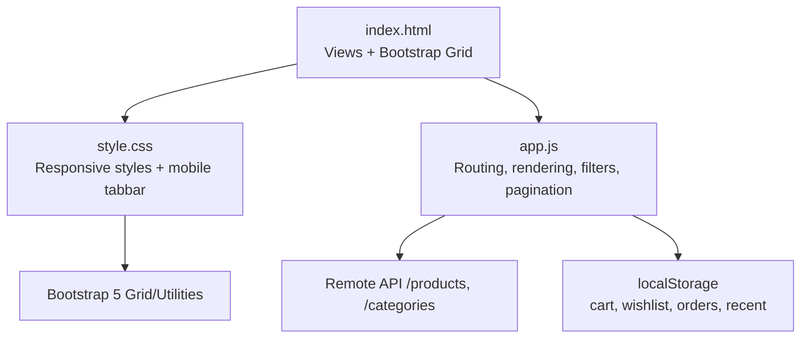
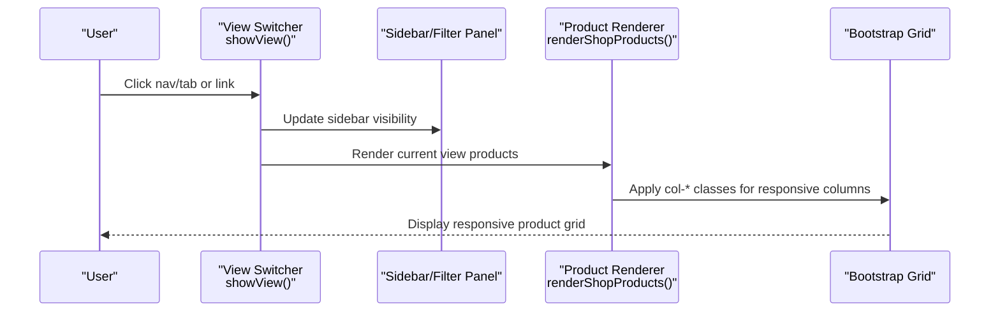
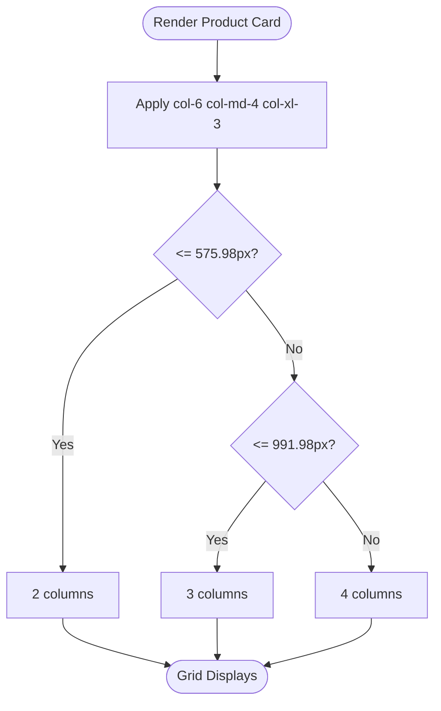
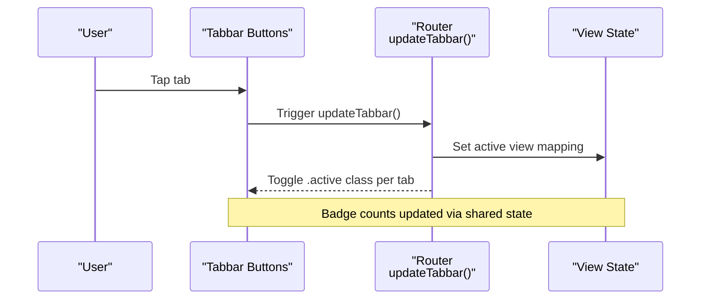
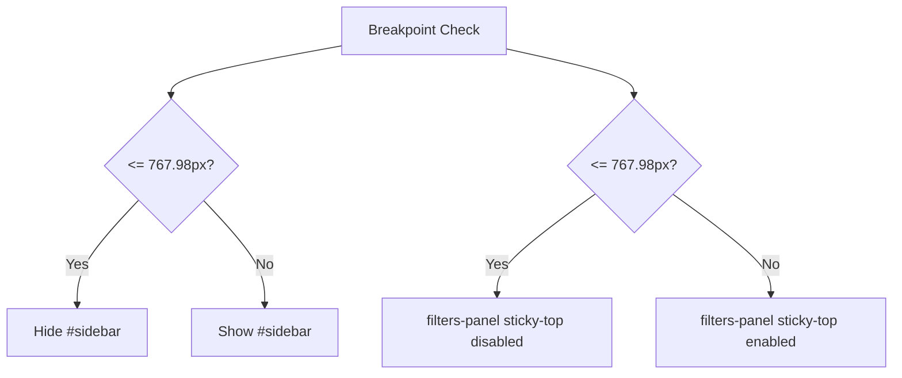
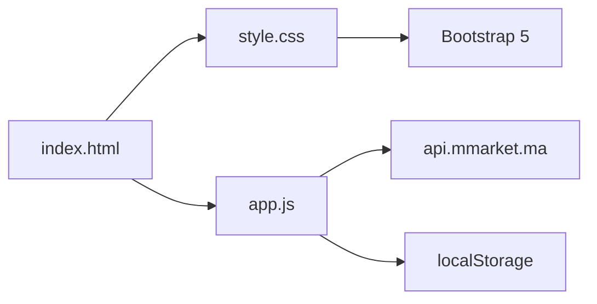

# Responsive Layout & Mobile

<cite>
**Referenced Files in This Document**
- [index.html](file://index.html)
- [style.css](file://css/style.css)
- [app.js](file://js/app.js)
- [login.html](file://login.html)
</cite>

## Table of Contents
1. Introduction
2. Project Structure
3. Core Components
4. Architecture Overview
5. Detailed Component Analysis
6. Dependency Analysis
7. Performance Considerations
8. Troubleshooting Guide
9. Conclusion

## Introduction
This document explains the responsive design implementation for product browsing across mobile, tablet, and desktop breakpoints. It covers Bootstrap grid usage, mobile-first CSS strategies, adaptive layouts for product cards and sidebar visibility, mobile-specific navigation with a bottom tabbar, touch-friendly interactions, responsive typography scaling, performance optimizations for mobile devices (image handling and reduced DOM manipulation), cross-browser compatibility considerations, and testing approaches for different screen sizes.

## Project Structure
The project uses a single-page layout with multiple views (home, shop, detail, cart, checkout, orders, wishlist). Bootstrap 5 provides the grid and utilities; custom CSS enhances responsiveness and mobile UX; JavaScript manages data fetching, view switching, filtering, pagination, and UI state.

**Diagram sources**
- [index.html:1-414](file://index.html#L1-L414)
- [style.css:1-1271](file://css/style.css#L1-L1271)
- [app.js:1-1048](file://js/app.js#L1-L1048)

**Section sources**
- [index.html:1-414](file://index.html#L1-L414)
- [style.css:1-1271](file://css/style.css#L1-L1271)
- [app.js:1-1048](file://js/app.js#L1-L1048)

## Core Components
- Bootstrap grid-based layout with responsive columns for product grids and content sections.
- Mobile-only bottom tabbar for primary navigation on small screens.
- Sidebar categories that are hidden on smaller screens and shown on larger ones.
- Product cards with responsive image containers and action buttons optimized for touch.
- Filters panel with sticky behavior on desktop and scrollable lists on mobile.
- Pagination component adapted for various widths.
- View transitions and back-to-top button with mobile positioning adjustments.

**Section sources**
- [index.html:60-291](file://index.html#L60-L291)
- [style.css:375-585](file://css/style.css#L375-L585)
- [style.css:826-857](file://css/style.css#L826-L857)
- [style.css:1149-1271](file://css/style.css#L1149-L1271)
- [app.js:175-203](file://js/app.js#L175-L203)

## Architecture Overview
The application follows a client-side routing pattern driven by JavaScript. Views are toggled via classes, and the mobile tabbar syncs with the active view. The Bootstrap grid adapts column counts based on breakpoints to achieve the desired number of product columns per screen size.

**Diagram sources**
- [app.js:175-203](file://js/app.js#L175-L203)
- [app.js:205-263](file://js/app.js#L205-L263)
- [index.html:141-197](file://index.html#L141-L197)

## Detailed Component Analysis

### Bootstrap Grid Usage and Breakpoints
- Product cards use responsive column classes to achieve:
  - Mobile: 2 columns
  - Tablet: 3 columns
  - Desktop: 4 columns
- These are implemented using Bootstrap’s responsive utility classes within the card container rows.

**Diagram sources**
- [app.js:205-241](file://js/app.js#L205-L241)

**Section sources**
- [app.js:205-241](file://js/app.js#L205-L241)

### Mobile-Specific Navigation Patterns (Bottom Tabbar)
- A fixed bottom toolbar appears only on small screens, providing quick access to Home, Search, Cart, Favorites, and Account.
- The center cart item is elevated as a floating action button with animated pulse and badge updates.
- The tabbar hides header actions (dropdowns and icons) on mobile to reduce clutter.
- Active tab state is synchronized with the current view.

**Diagram sources**
- [index.html:372-403](file://index.html#L372-L403)
- [style.css:1149-1271](file://css/style.css#L1149-L1271)
- [app.js:196-203](file://js/app.js#L196-L203)

**Section sources**
- [index.html:372-403](file://index.html#L372-L403)
- [style.css:1149-1271](file://css/style.css#L1149-L1271)
- [app.js:196-203](file://js/app.js#L196-L203)

### Touch-Friendly Interface Elements
- Product card action buttons (wishlist and add-to-cart) are sized for comfortable tapping.
- Quantity controls in detail and cart views use large, accessible buttons and inputs.
- Range sliders for price filtering have enhanced thumb sizing for better touch interaction.
- Sticky headers and panels adjust behavior on mobile to avoid overlapping content.

**Section sources**
- [style.css:490-513](file://css/style.css#L490-L513)
- [style.css:531-555](file://css/style.css#L531-L555)
- [style.css:1057-1072](file://css/style.css#L1057-L1072)
- [style.css:833-847](file://css/style.css#L833-L847)

### Adaptive Layout Strategies
- Sidebar visibility: Hidden on screens below a certain breakpoint; visible on larger screens.
- Filters panel: Sticky on desktop; becomes static and scrollable on mobile.
- Hero banner and trust badges adapt font sizes and spacing for smaller screens.
- Categories grid uses auto-fill minmax to reflow gracefully across widths.

**Diagram sources**
- [style.css:826-847](file://css/style.css#L826-L847)

**Section sources**
- [style.css:826-847](file://css/style.css#L826-L847)

### Viewport-Specific Optimizations
- Header layout wraps and reorders search box on mobile to improve usability.
- Logo height reduces progressively at smaller breakpoints.
- Back-to-top button position adjusts to avoid overlap with the mobile tabbar.
- Body padding increases on mobile to prevent content from being hidden behind the fixed tabbar.

**Section sources**
- [style.css:833-857](file://css/style.css#L833-L857)
- [style.css:906-933](file://css/style.css#L906-L933)
- [style.css:1260-1271](file://css/style.css#L1260-L1271)

### Mobile-First CSS Approach
- Base styles define defaults for all screens.
- Media queries progressively enhance layout and typography for larger screens.
- Responsive typography scales hero headings and category grids according to viewport width.

**Section sources**
- [style.css:1-28](file://css/style.css#L1-L28)
- [style.css:201-287](file://css/style.css#L201-L287)
- [style.css:826-857](file://css/style.css#L826-L857)

### Responsive Typography Scaling
- Hero heading font size decreases on smaller screens to maintain readability and fit.
- Category grid items scale icon sizes and spacing for compact displays.
- Consistent line-height and letter-spacing ensure legibility across devices.

**Section sources**
- [style.css:239-250](file://css/style.css#L239-L250)
- [style.css:848-857](file://css/style.css#L848-L857)

### Image Optimization and Reduced DOM Manipulation
- Images use lazy loading to defer offscreen images until needed.
- Placeholder fallbacks handle missing images gracefully without breaking layout.
- Product list rendering batches HTML generation and binds events once per container to minimize reflows.
- Local caching of product details avoids redundant network requests.

**Section sources**
- [app.js:205-241](file://js/app.js#L205-L241)
- [app.js:243-263](file://js/app.js#L243-L263)
- [app.js:135-142](file://js/app.js#L135-L142)

### Cross-Browser Compatibility Considerations
- Uses widely supported CSS features (flexbox, grid, aspect-ratio) with fallbacks where applicable.
- Custom scrollbar styling targets WebKit but maintains functional scrolling in other browsers.
- Range slider thumbs styled for both WebKit and Firefox to ensure consistent touch feedback.
- Backdrop blur used for tabbar with vendor prefixes for broader support.

**Section sources**
- [style.css:1026-1036](file://css/style.css#L1026-L1036)
- [style.css:1057-1072](file://css/style.css#L1057-L1072)
- [style.css:1149-1166](file://css/style.css#L1149-L1166)

### Testing Approaches for Different Screen Sizes
- Use browser devtools device emulation to verify column counts and layout at key breakpoints:
  - Mobile: ~360–480px (2 columns)
  - Tablet: ~768–991px (3 columns)
  - Desktop: >= 1200px (4 columns)
- Validate mobile tabbar visibility and interactions below 768px.
- Confirm sidebar visibility above the corresponding breakpoint.
- Test touch targets and form controls on actual devices when possible.
- Verify lazy-loaded images and placeholder fallbacks under poor network conditions.

[No sources needed since this section provides general guidance]

## Dependency Analysis
- index.html depends on Bootstrap CSS/JS and Font Awesome for icons.
- style.css extends Bootstrap utilities and defines responsive rules and mobile tabbar.
- app.js orchestrates data fetching, view rendering, and UI state, interacting with localStorage and the remote API.

**Diagram sources**
- [index.html:1-12](file://index.html#L1-L12)
- [index.html:409-411](file://index.html#L409-L411)
- [app.js:116-142](file://js/app.js#L116-L142)
- [app.js:88-98](file://js/app.js#L88-L98)

**Section sources**
- [index.html:1-12](file://index.html#L1-L12)
- [index.html:409-411](file://index.html#L409-L411)
- [app.js:88-98](file://js/app.js#L88-L98)
- [app.js:116-142](file://js/app.js#L116-L142)

## Performance Considerations
- Lazy loading of images reduces initial payload and improves perceived performance on mobile networks.
- Batched DOM updates and event delegation minimize reflows and repaints during rendering.
- Local caching of product details prevents repeated API calls for the same resources.
- Avoid heavy animations on low-end devices; prefer subtle transitions and hardware-accelerated properties.
- Keep media queries minimal and targeted to reduce CSS parsing overhead.

[No sources needed since this section provides general guidance]

## Troubleshooting Guide
- If product grid shows incorrect column counts, verify responsive classes applied to card wrappers and check breakpoint thresholds.
- If mobile tabbar overlaps content, ensure body padding-bottom is applied and back-to-top positioning is adjusted.
- If filters panel sticks incorrectly on mobile, confirm sticky-top behavior is disabled in the relevant media query.
- If images fail to load, validate placeholder fallbacks and ensure onerror handlers are present.
- If tabbar does not reflect active view, check view mapping and active class toggling logic.

**Section sources**
- [style.css:826-847](file://css/style.css#L826-L847)
- [style.css:1260-1271](file://css/style.css#L1260-L1271)
- [app.js:196-203](file://js/app.js#L196-L203)

## Conclusion
The responsive design leverages Bootstrap’s grid and mobile-first CSS to deliver an optimal experience across devices. The mobile bottom tabbar streamlines navigation on small screens, while adaptive layouts ensure product cards, sidebars, and filters remain usable and performant. Careful attention to image optimization, reduced DOM manipulation, and cross-browser compatibility supports reliable performance and accessibility. Testing across breakpoints and devices ensures consistency and quality.

[No sources needed since this section summarizes without analyzing specific files]