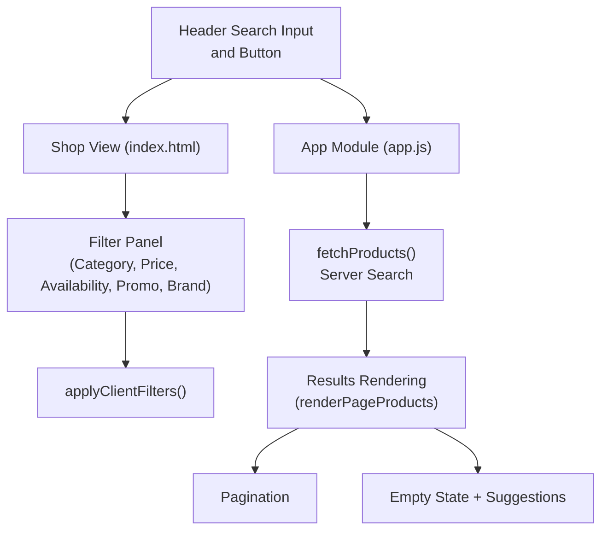
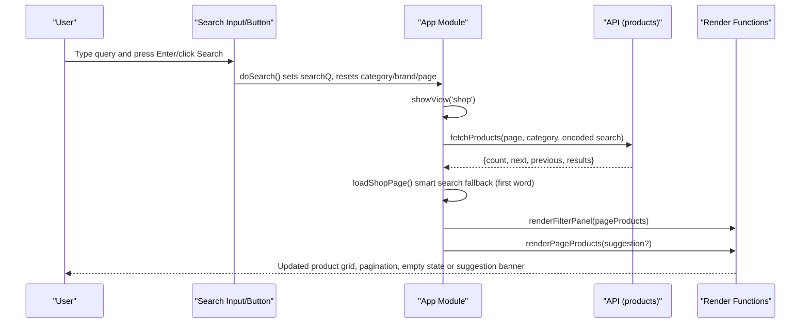
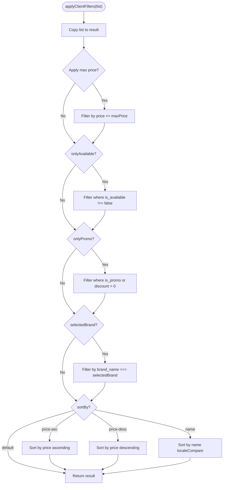
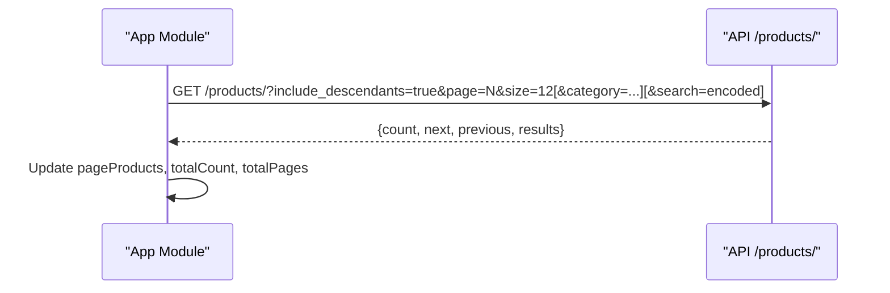
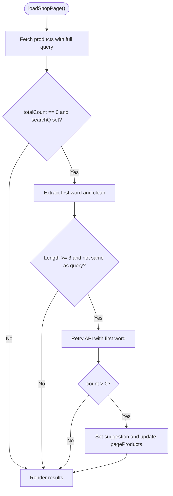
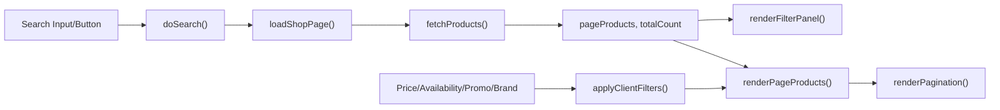

# Search & Filtering

<cite>
**Referenced Files in This Document**
- [app.js](file://js/app.js)
- [index.html](file://index.html)
</cite>

## Table of Contents
1. [Introduction](#introduction)
2. [Project Structure](#project-structure)
3. [Core Components](#core-components)
4. [Architecture Overview](#architecture-overview)
5. [Detailed Component Analysis](#detailed-component-analysis)
6. [Dependency Analysis](#dependency-analysis)
7. [Performance Considerations](#performance-considerations)
8. [Troubleshooting Guide](#troubleshooting-guide)
9. [Conclusion](#conclusion)

## Introduction
This document explains the search and filtering system implemented in the application. It covers:
- Client-side filtering via applyClientFilters for price range, availability, promotions, and brand filters
- Server-side search integration with the API, including query parameter encoding and result handling
- Smart search fallback that suggests results based on the first word when a full query returns no results
- Empty state handling with helpful suggestions
- Integration between the search input and category filtering
- Real-time filter updates and performance optimizations

## Project Structure
The search and filtering features are primarily implemented in the main JavaScript module and wired up through the HTML layout. The key elements include:
- A global search input and button in the header
- A shop view with a sidebar containing filters (category, price, availability, promotion, brand)
- Product listing area with pagination and sorting controls
- Event handlers that update state and re-render results in real time

**Diagram sources**
- [index.html:23-28](file://index.html#L23-L28)
- [index.html:141-197](file://index.html#L141-L197)
- [app.js:126-133](file://js/app.js#L126-L133)
- [app.js:339-360](file://js/app.js#L339-L360)
- [app.js:412-481](file://js/app.js#L412-L481)
- [app.js:955-966](file://js/app.js#L955-L966)

**Section sources**
- [index.html:23-28](file://index.html#L23-L28)
- [index.html:141-197](file://index.html#L141-L197)
- [app.js:126-133](file://js/app.js#L126-L133)
- [app.js:339-360](file://js/app.js#L339-L360)
- [app.js:412-481](file://js/app.js#L412-L481)
- [app.js:955-966](file://js/app.js#L955-L966)

## Core Components
- Client-side filtering function that applies price, availability, promotion, brand, and sort constraints to the current page’s product list
- Server-side search integration that encodes the search query and fetches paginated results from the API
- Smart search fallback that extracts the first word from a multi-word query and retries the server search if the full query yields no results
- Empty state UI with actionable suggestions and clear/browse actions
- Real-time filter bindings that update the product grid instantly without full page reloads

Key responsibilities:
- Maintain shared state variables for search query, selected category, brand, price limit, availability flag, promotion flag, and sort order
- Re-render the product grid and filter panel whenever any filter or search changes
- Provide user feedback via empty states and suggestion banners

**Section sources**
- [app.js:68-85](file://js/app.js#L68-L85)
- [app.js:339-360](file://js/app.js#L339-L360)
- [app.js:412-481](file://js/app.js#L412-L481)
- [app.js:955-966](file://js/app.js#L955-L966)

## Architecture Overview
The search flow integrates client-side interactions with server-side data retrieval and local filtering:

**Diagram sources**
- [app.js:955-966](file://js/app.js#L955-L966)
- [app.js:126-133](file://js/app.js#L126-L133)
- [app.js:545-583](file://js/app.js#L545-L583)
- [app.js:412-481](file://js/app.js#L412-L481)

## Detailed Component Analysis

### Client-Side Filtering: applyClientFilters
Purpose:
- Filter the current page’s products by maximum price, availability, promotion status, and selected brand
- Sort the filtered list by default, price ascending/descending, or name

Behavior:
- Always applies price cap from the slider
- Optionally filters out unavailable items when enabled
- Optionally restricts to promotional items
- Optionally restricts to a specific brand
- Applies sorting rules when selected

Complexity:
- Time complexity is O(n) for filtering and O(n log n) for sorting per call
- Space complexity is O(n) due to creating a new array copy before filtering

Optimization opportunities:
- Avoid unnecessary copies by filtering in place when safe
- Debounce rapid filter changes if needed (currently immediate updates are acceptable for small pages)

**Diagram sources**
- [app.js:339-360](file://js/app.js#L339-L360)

**Section sources**
- [app.js:339-360](file://js/app.js#L339-L360)

### Server-Side Search Integration
Responsibilities:
- Build the API URL with proper query parameters
- Encode the search query to ensure safe transmission
- Fetch paginated results and maintain total count and page state

Implementation highlights:
- Base URL includes pagination and optional category
- Search query is appended only when present and properly encoded
- Returns structured response with count and results used for rendering and pagination

Error handling:
- Throws errors on non-ok responses; callers catch and display error messages

**Diagram sources**
- [app.js:126-133](file://js/app.js#L126-L133)

**Section sources**
- [app.js:126-133](file://js/app.js#L126-L133)

### Smart Search Fallback
When a full query returns zero results, the system attempts a more lenient search using the first meaningful word:
- Extracts the first word from the query
- Removes punctuation like apostrophes
- Ensures minimum length and that it differs from the original query
- Retries the API with the first word and displays a suggestion banner if results are found
- Provides an action to switch to searching only by the suggested term

**Diagram sources**
- [app.js:545-583](file://js/app.js#L545-L583)

**Section sources**
- [app.js:545-583](file://js/app.js#L545-L583)

### Empty State Handling
When no products match the current filters or search:
- Displays a friendly message indicating no results
- Offers quick actions to clear the search or browse all products
- Provides clickable suggestion buttons to try popular terms
- Binds event listeners to reset state and reload results

Integration:
- The empty state appears within the product grid container
- Actions update shared state (search query, category) and trigger re-fetching

**Section sources**
- [app.js:422-460](file://js/app.js#L422-L460)

### Search Input and Category Filtering Integration
- Searching clears the active category and brand to focus on text-based discovery
- Selecting a category navigates to the shop view and resets pagination
- The filter panel dynamically reflects the current category selection and allows switching categories
- Clearing filters resets all state and reloads the shop view

Event wiring:
- Search input triggers doSearch on click or Enter key
- Category radio inputs update currentCat and reload the shop page
- Brand radio inputs update selectedBrand and re-render the current page

**Section sources**
- [app.js:955-966](file://js/app.js#L955-L966)
- [app.js:329-335](file://js/app.js#L329-L335)
- [app.js:378-385](file://js/app.js#L378-L385)
- [app.js:403-408](file://js/app.js#L403-L408)

### Real-Time Filter Updates
Real-time behavior:
- Price slider updates the price label and immediately re-renders the product grid
- Availability and promotion checkboxes toggle filters and re-render instantly
- Sorting dropdown changes the sort order and re-renders without network calls
- Brand selection updates the selected brand and re-renders the current page

Performance characteristics:
- Immediate updates provide responsive UX
- Sorting and filtering operate on the current page’s product list for speed
- Network requests are only triggered by search or category changes

**Section sources**
- [app.js:968-1006](file://js/app.js#L968-L1006)
- [app.js:339-360](file://js/app.js#L339-L360)

## Dependency Analysis
The search and filtering system depends on:
- DOM elements for search input, filter controls, and product grid
- Shared state variables for search query, category, brand, price, availability, promotion, and sort
- API endpoints for fetching categories and products
- Rendering functions for updating the UI based on state changes

**Diagram sources**
- [app.js:955-966](file://js/app.js#L955-L966)
- [app.js:126-133](file://js/app.js#L126-L133)
- [app.js:339-360](file://js/app.js#L339-L360)
- [app.js:412-481](file://js/app.js#L412-L481)
- [app.js:483-529](file://js/app.js#L483-L529)

**Section sources**
- [app.js:126-133](file://js/app.js#L126-L133)
- [app.js:339-360](file://js/app.js#L339-L360)
- [app.js:412-481](file://js/app.js#L412-L481)
- [app.js:483-529](file://js/app.js#L483-L529)
- [app.js:955-966](file://js/app.js#L955-L966)

## Performance Considerations
- Client-side filtering runs on the current page’s product list, minimizing overhead
- Sorting uses native array methods; consider stable sort requirements if names contain special characters
- Smart search fallback avoids excessive network calls by limiting retry to the first word with basic validation
- Empty state actions avoid additional network calls unless necessary
- Debouncing could be considered for rapid filter changes if the dataset grows significantly

[No sources needed since this section provides general guidance]

## Troubleshooting Guide
Common issues and resolutions:
- No results displayed:
  - Verify search query and category selection
  - Use “Clear” to reset filters and search
  - Try suggested terms in the empty state
- Smart search not triggering:
  - Ensure the query has at least two words and the first word meets length criteria
  - Confirm API returns results for the first word
- Filters not updating:
  - Check that event listeners are bound to filter controls
  - Ensure renderPageProducts is called after filter state changes
- API errors:
  - Inspect network responses and handle non-ok statuses gracefully
  - Display user-friendly error messages and disable pagination during failures

**Section sources**
- [app.js:422-460](file://js/app.js#L422-L460)
- [app.js:545-583](file://js/app.js#L545-L583)
- [app.js:968-1006](file://js/app.js#L968-L1006)

## Conclusion
The search and filtering system combines robust client-side filtering with efficient server-side search integration. It provides a responsive user experience through real-time filter updates, intelligent fallback suggestions, and helpful empty states. The architecture maintains clear separation between state management, API interaction, and rendering, enabling scalability and maintainability.

[No sources needed since this section summarizes without analyzing specific files]