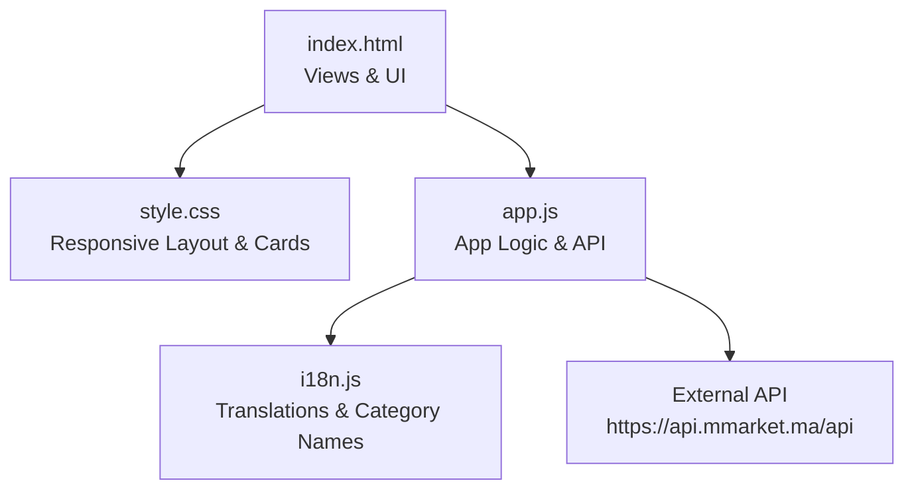
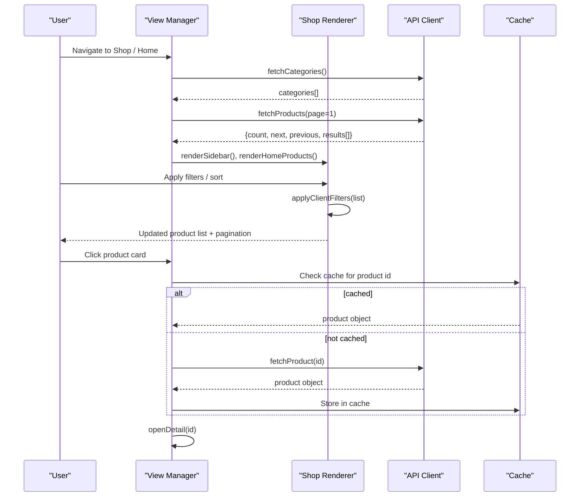
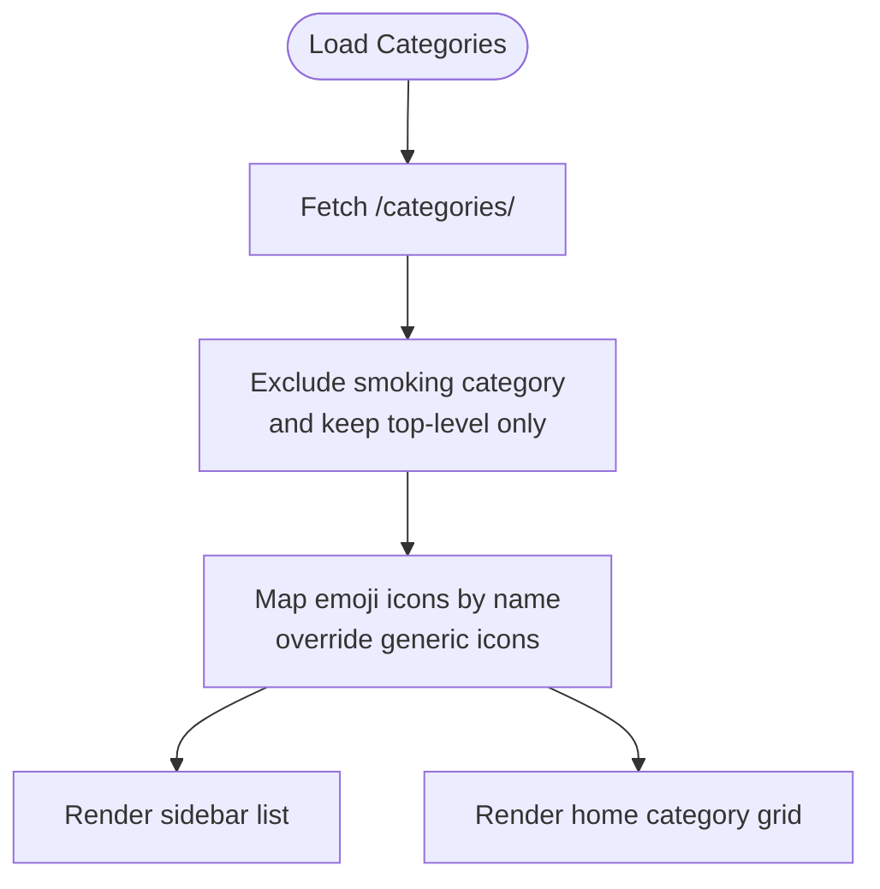
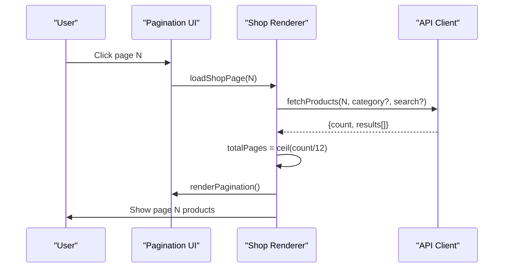
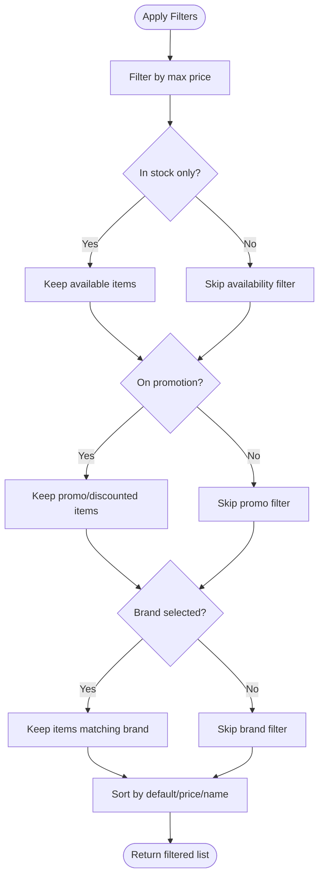
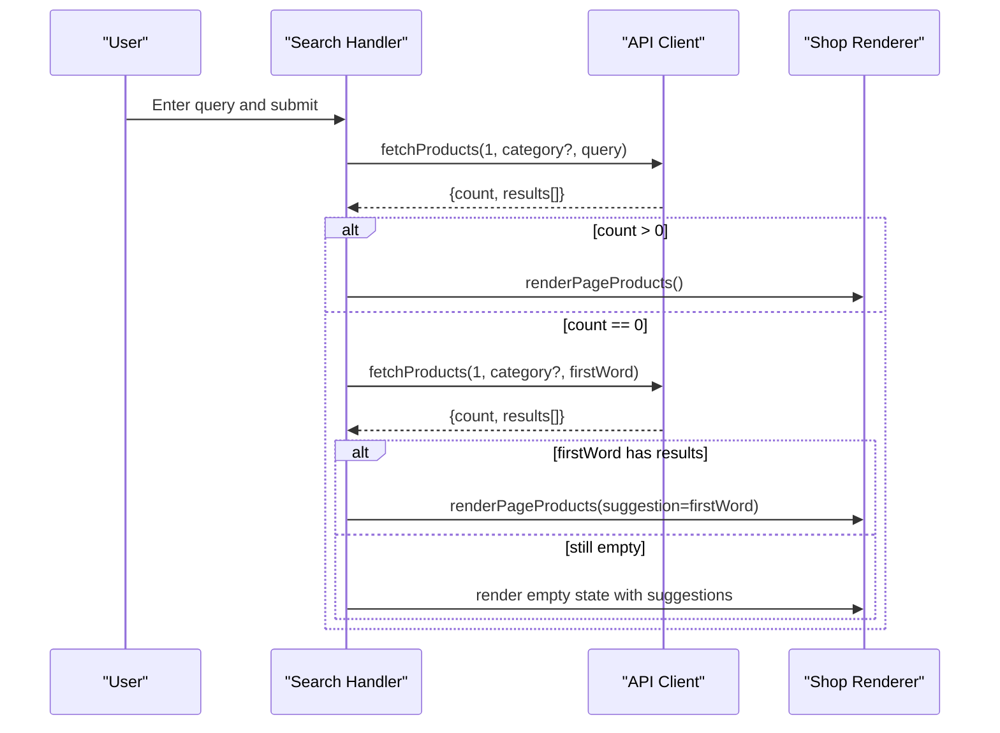
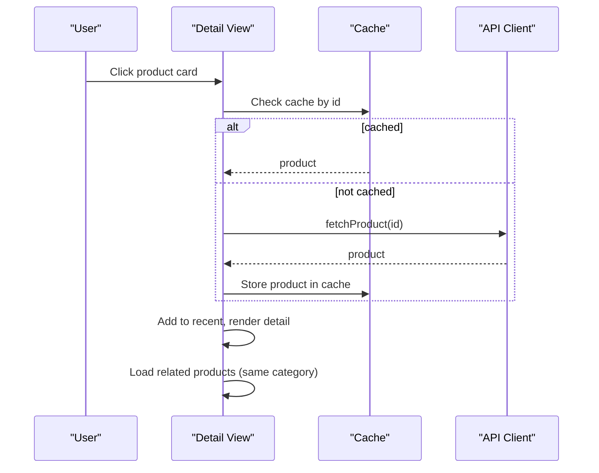
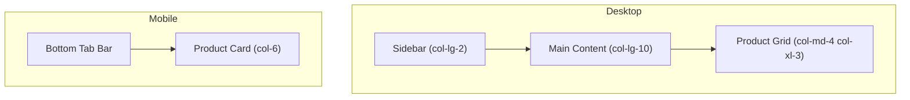
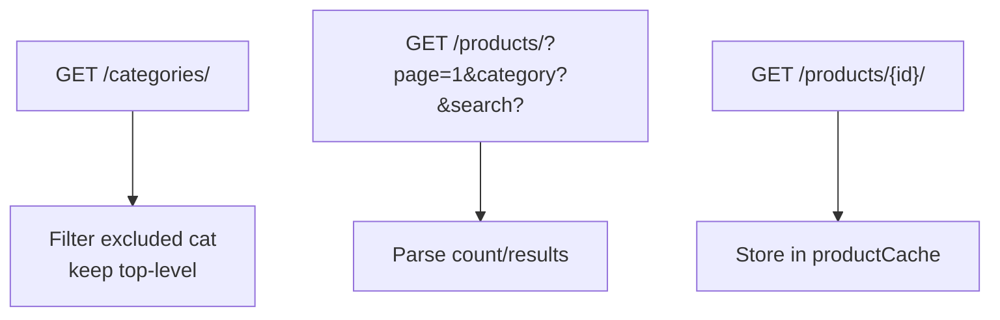
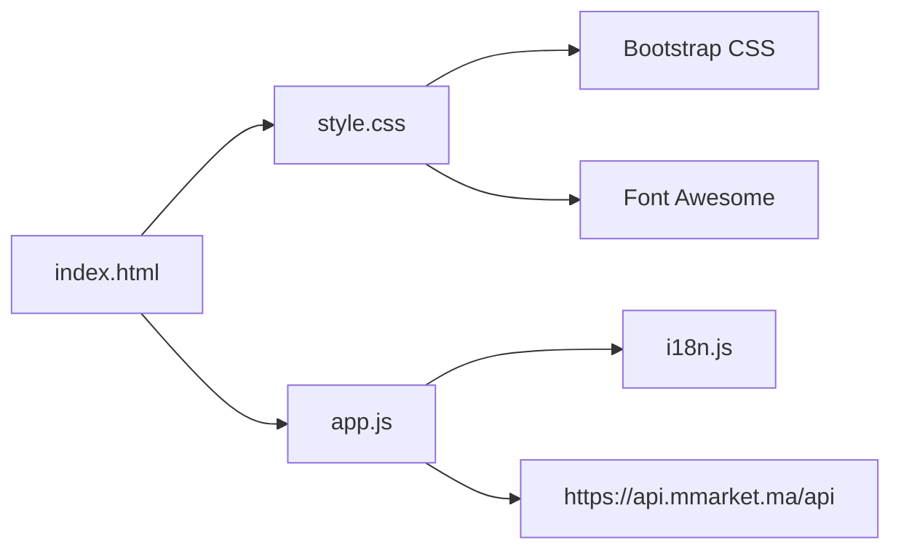

# Product Catalog System

<cite>
**Referenced Files in This Document**
- [index.html](file://index.html)
- [app.js](file://js/app.js)
- [style.css](file://css/style.css)
- [i18n.js](file://js/i18n.js)
</cite>

## Table of Contents
1. [Introduction](#introduction)
2. [Project Structure](#project-structure)
3. [Core Components](#core-components)
4. [Architecture Overview](#architecture-overview)
5. [Detailed Component Analysis](#detailed-component-analysis)
6. [Dependency Analysis](#dependency-analysis)
7. [Performance Considerations](#performance-considerations)
8. [Troubleshooting Guide](#troubleshooting-guide)
9. [Conclusion](#conclusion)
10. [Appendices](#appendices)

## Introduction
This document explains the AM MARKET product catalog system implemented as a client-side application. It covers category management with emoji icons, product browsing with pagination, advanced filtering (price range, availability, brand, promotions), real-time search with smart suggestions and fallback behavior, and product detail views. It also documents API integration patterns for fetching categories and products, client-side filtering implementation, caching mechanisms for product data, and the responsive grid layout system. Examples include filter combinations, search behavior with suggestion fallbacks, and performance optimizations such as lazy loading and data caching.

## Project Structure
The project is organized into three primary layers:
- HTML structure defines views for Home, Shop, Detail, Cart, Checkout, Orders, and Wishlist, plus a sticky header with search and navigation, a sidebar for categories, and a mobile tab bar.
- CSS provides a responsive design system using Bootstrap utilities and custom styles for cards, grids, badges, and animations.
- JavaScript implements application logic including API calls, state management, view rendering, filtering, pagination, search, and i18n.

**Diagram sources**
- [index.html:15-410](file://index.html#L15-L410)
- [style.css:16-585](file://css/style.css#L16-L585)
- [app.js:116-142](file://js/app.js#L116-L142)
- [i18n.js:341-418](file://js/i18n.js#L341-L418)

**Section sources**
- [index.html:15-410](file://index.html#L15-L410)
- [style.css:16-585](file://css/style.css#L16-L585)
- [app.js:116-142](file://js/app.js#L116-L142)
- [i18n.js:341-418](file://js/i18n.js#L341-L418)

## Core Components
- Categories and Icons: Fetches top-level categories from the API, excludes a specific category, and maps emojis to category names when the API does not provide suitable icons.
- Products Listing: Paginates results from the API, supports sorting and client-side filters, and renders product cards with lazy-loaded images.
- Search and Suggestions: Real-time search via API; if no results are found, it falls back to searching by the first word and shows a suggestion banner.
- Detail View: Displays full product details, quantity selector, add-to-cart/buy-now actions, wishlist toggle, and related products within the same category.
- Cart, Checkout, Orders, Wishlist: LocalStorage-backed persistence for cart items, wishlist, and orders; checkout computes totals and delivery fees based on subtotal thresholds.
- Internationalization: Supports English and French with dynamic translation and localized category names.

**Section sources**
- [app.js:11-59](file://js/app.js#L11-L59)
- [app.js:116-142](file://js/app.js#L116-L142)
- [app.js:205-263](file://js/app.js#L205-L263)
- [app.js:338-481](file://js/app.js#L338-L481)
- [app.js:585-698](file://js/app.js#L585-L698)
- [app.js:700-872](file://js/app.js#L700-L872)
- [i18n.js:8-171](file://js/i18n.js#L8-L171)
- [i18n.js:173-335](file://js/i18n.js#L173-L335)
- [i18n.js:341-418](file://js/i18n.js#L341-L418)

## Architecture Overview
The application follows a simple client-side architecture:
- The HTML defines multiple views that are toggled by a view manager.
- The app initializes by loading categories and initial products from the API, then renders the home view.
- User interactions trigger API calls or local state updates, followed by re-rendering relevant sections.
- Data caching minimizes redundant network requests for product details.

**Diagram sources**
- [app.js:116-142](file://js/app.js#L116-L142)
- [app.js:175-194](file://js/app.js#L175-L194)
- [app.js:265-314](file://js/app.js#L265-L314)
- [app.js:338-481](file://js/app.js#L338-L481)
- [app.js:585-698](file://js/app.js#L585-L698)

## Detailed Component Analysis

### Category Management with Emoji Icons
- Categories are fetched from the API and filtered to exclude a specific category ID. Only top-level categories (no parent) are shown.
- A mapping table assigns emoji icons to known category names in both French and English. If the API returns generic icons, the mapping overrides them.
- The sidebar and home category grid display categories with their mapped icons and product counts.

**Diagram sources**
- [app.js:116-124](file://js/app.js#L116-L124)
- [app.js:11-59](file://js/app.js#L11-L59)
- [app.js:316-336](file://js/app.js#L316-L336)
- [app.js:265-286](file://js/app.js#L265-L286)

**Section sources**
- [app.js:11-59](file://js/app.js#L11-L59)
- [app.js:116-124](file://js/app.js#L116-L124)
- [app.js:316-336](file://js/app.js#L316-L336)
- [app.js:265-286](file://js/app.js#L265-L286)

### Product Browsing with Pagination
- Products are paginated at 12 per page via the API. The total count determines the number of pages.
- Pagination UI shows a window around the current page with ellipsis for large sets and prev/next controls.
- Sorting options include default, price ascending/descending, and name A–Z. Sorting is applied client-side after fetching the page.

**Diagram sources**
- [app.js:126-133](file://js/app.js#L126-L133)
- [app.js:483-529](file://js/app.js#L483-L529)
- [app.js:545-583](file://js/app.js#L545-L583)

**Section sources**
- [app.js:126-133](file://js/app.js#L126-L133)
- [app.js:483-529](file://js/app.js#L483-L529)
- [app.js:545-583](file://js/app.js#L545-L583)

### Advanced Filtering (Price Range, Availability, Brand, Promotions)
- Price range: A slider limits maximum price; filtering runs client-side on the current page’s products.
- Availability: Checkbox filters out items marked unavailable.
- Promotions: Checkbox includes items flagged as promo or with discount percent greater than zero.
- Brand: Dynamic radio buttons generated from current products; selecting a brand filters client-side.
- Clear Filters: Resets all filters and reloads the shop page.

**Diagram sources**
- [app.js:338-361](file://js/app.js#L338-L361)
- [app.js:363-410](file://js/app.js#L363-L410)
- [app.js:975-1006](file://js/app.js#L975-L1006)

**Section sources**
- [app.js:338-361](file://js/app.js#L338-L361)
- [app.js:363-410](file://js/app.js#L363-L410)
- [app.js:975-1006](file://js/app.js#L975-L1006)

### Real-Time Search with Smart Suggestions and Fallback
- Search triggers an API call with the query string; results are displayed with pagination.
- If no results are found and the query contains more than one word, the app retries with the first word and displays a suggestion banner offering to refine the search.
- Empty states provide quick links to clear search or browse all, plus suggested queries.

**Diagram sources**
- [app.js:955-966](file://js/app.js#L955-L966)
- [app.js:545-583](file://js/app.js#L545-L583)
- [app.js:412-481](file://js/app.js#L412-L481)

**Section sources**
- [app.js:955-966](file://js/app.js#L955-L966)
- [app.js:545-583](file://js/app.js#L545-L583)
- [app.js:412-481](file://js/app.js#L412-L481)

### Product Detail Views
- Detail view loads product data from cache or API, adds the item to recently viewed, and renders image, title, brand, category, weight/volume, availability badge, pricing with discounts, description, quantity selector, and action buttons.
- Related products are computed from the current product list by matching category and supplemented with additional items if needed.

**Diagram sources**
- [app.js:135-142](file://js/app.js#L135-L142)
- [app.js:585-698](file://js/app.js#L585-L698)

**Section sources**
- [app.js:135-142](file://js/app.js#L135-L142)
- [app.js:585-698](file://js/app.js#L585-L698)

### Responsive Grid Layout System
- The layout uses Bootstrap’s grid classes to adapt across screen sizes:
  - Sidebar appears on larger screens and hides on small screens.
  - Product cards use responsive columns to show two on mobile, three on medium, and four on large screens.
  - Hero banner and trust boxes adjust spacing and typography for readability.
- Custom CSS enhances card hover effects, aspect ratios, and visual hierarchy.

**Diagram sources**
- [index.html:60-199](file://index.html#L60-L199)
- [index.html:372-403](file://index.html#L372-L403)
- [style.css:328-366](file://css/style.css#L328-L366)
- [style.css:375-513](file://css/style.css#L375-L513)

**Section sources**
- [index.html:60-199](file://index.html#L60-L199)
- [index.html:372-403](file://index.html#L372-L403)
- [style.css:328-366](file://css/style.css#L328-L366)
- [style.css:375-513](file://css/style.css#L375-L513)

### API Integration Patterns
- Categories: GET /categories/ returns a list; the app filters out a specific category and keeps top-level categories only.
- Products: GET /products/?include_descendants=true&page=N&page_size=12 supports pagination and optional category and search parameters.
- Product Detail: GET /products/{id}/ returns detailed product info; results are cached locally to avoid repeated requests.

**Diagram sources**
- [app.js:116-142](file://js/app.js#L116-L142)

**Section sources**
- [app.js:116-142](file://js/app.js#L116-L142)

### Client-Side Filtering Implementation
- Filtering operates on the current page’s product array, applying price, availability, promotion, and brand constraints before sorting.
- The filter panel dynamically generates brand options based on the current product set and allows resetting filters.

**Section sources**
- [app.js:338-361](file://js/app.js#L338-L361)
- [app.js:363-410](file://js/app.js#L363-L410)
- [app.js:975-1006](file://js/app.js#L975-L1006)

### Caching Mechanisms for Product Data
- Product details are cached in memory keyed by product id to prevent redundant API calls during detail view and related product loading.
- Recent products are persisted in localStorage to quickly render “Recently Viewed” without extra requests.

**Section sources**
- [app.js:135-142](file://js/app.js#L135-L142)
- [app.js:100-114](file://js/app.js#L100-L114)

### Product Card Rendering
- Each product card displays an image with lazy loading, title, brand, price (including old price and discount badge), and action buttons for wishlist and add-to-cart.
- Event binding handles opening detail view, adding to cart, and toggling wishlist status.

**Section sources**
- [app.js:205-263](file://js/app.js#L205-L263)
- [style.css:375-513](file://css/style.css#L375-L513)

### Category Icon Mapping System
- The mapping prioritizes API-provided icons unless they are generic placeholders, then falls back to a predefined emoji map keyed by normalized category names in French and English.
- This ensures consistent and meaningful icons across languages and API variations.

**Section sources**
- [app.js:11-59](file://js/app.js#L11-L59)
- [i18n.js:341-374](file://js/i18n.js#L341-L374)

### How the Catalog Adapts to Different Screen Sizes
- On desktop, a persistent sidebar lists categories alongside the main content area.
- On mobile, a bottom tab bar provides quick access to Home, Search, Cart, Favorites, and Account.
- Product grids collapse to fewer columns on smaller screens, maintaining usability and readability.

**Section sources**
- [index.html:60-199](file://index.html#L60-L199)
- [index.html:372-403](file://index.html#L372-L403)
- [style.css:328-366](file://css/style.css#L328-L366)

## Dependency Analysis
- HTML depends on CSS for styling and on JavaScript for interactivity.
- JavaScript depends on i18n for translations and category name localization.
- JavaScript depends on external API for categories and products.
- CSS depends on Bootstrap and Font Awesome for layout and icons.

**Diagram sources**
- [index.html:7-11](file://index.html#L7-L11)
- [index.html:409-411](file://index.html#L409-L411)
- [app.js:7](file://js/app.js#L7)
- [i18n.js:8-418](file://js/i18n.js#L8-L418)

**Section sources**
- [index.html:7-11](file://index.html#L7-L11)
- [index.html:409-411](file://index.html#L409-L411)
- [app.js:7](file://js/app.js#L7)
- [i18n.js:8-418](file://js/i18n.js#L8-L418)

## Performance Considerations
- Lazy Loading: Images use native lazy loading to reduce initial bandwidth and improve perceived performance.
- Data Caching: Product details are cached in memory to avoid repeated network requests.
- Pagination: Limiting results to 12 per page reduces payload size and improves rendering speed.
- Client-Side Filtering: Applying filters on already-fetched data avoids extra API calls for minor adjustments.
- Debouncing Search: While not implemented here, future enhancements could debounce input to reduce request frequency.
- Minimal DOM Updates: Reusing existing nodes and minimizing reflows helps maintain smooth interactions.

[No sources needed since this section provides general guidance]

## Troubleshooting Guide
- API Errors: If categories or products fail to load, the app displays localized error messages and disables interactive elements accordingly.
- Empty States: When no products match filters or search, the app suggests clearing filters or browsing all, and offers quick suggestion buttons.
- Image Failures: Product images have fallback placeholders to ensure layout stability when images are missing.
- Language Changes: Switching language triggers re-rendering of affected views to reflect updated strings and category names.

**Section sources**
- [app.js:1008-1017](file://js/app.js#L1008-L1017)
- [app.js:412-481](file://js/app.js#L412-L481)
- [app.js:1031-1045](file://js/app.js#L1031-L1045)

## Conclusion
The AM MARKET product catalog system delivers a responsive, user-friendly shopping experience through efficient API integration, robust client-side filtering, and thoughtful caching strategies. Its modular structure separates concerns between HTML, CSS, and JavaScript, while internationalization and adaptive layouts ensure accessibility across devices and languages. Future enhancements may include debounced search, server-side filtering for large datasets, and expanded recommendation algorithms.

[No sources needed since this section summarizes without analyzing specific files]

## Appendices

### Example Filter Combinations
- Price up to 200 DH, In stock only, On promotion, Brand: “Nutella”
- Price up to 500 DH, Availability any, On promotion off, Brand: “Coca-Cola”
- Price up to 1000 DH, In stock only, On promotion on, Brand: All brands

[No sources needed since this section provides conceptual examples]

### Search Behavior with Suggestion Fallbacks
- Query “reese nutella” yields no results; the app retries with “reese” and shows a banner suggesting to search only “reese”.
- Query “coca cola” yields no results; the app retries with “coca” and offers to refine the search.

**Section sources**
- [app.js:545-583](file://js/app.js#L545-L583)
- [app.js:412-481](file://js/app.js#L412-L481)