# Product Detail View

<cite>
**Referenced Files in This Document**
- [index.html](file://index.html)
- [app.js](file://js/app.js)
- [style.css](file://css/style.css)
- [i18n.js](file://js/i18n.js)
</cite>

## Table of Contents
1. [Introduction](#introduction)
2. [Project Structure](#project-structure)
3. [Core Components](#core-components)
4. [Architecture Overview](#architecture-overview)
5. [Detailed Component Analysis](#detailed-component-analysis)
6. [Dependency Analysis](#dependency-analysis)
7. [Performance Considerations](#performance-considerations)
8. [Troubleshooting Guide](#troubleshooting-guide)
9. [Conclusion](#conclusion)

## Introduction
This document explains the product detail view system that renders a single product’s information, pricing, availability, quantity selection, and purchase actions. It also covers wishlist integration, related products recommendations based on category matching, recent products tracking, data caching, error handling for missing products, and responsive layout behavior for mobile devices.

## Project Structure
The application is a single-page interface with multiple views (home, shop, detail, cart, checkout, orders, wishlist). The detail view is one of these views and is dynamically rendered when a user opens a product.

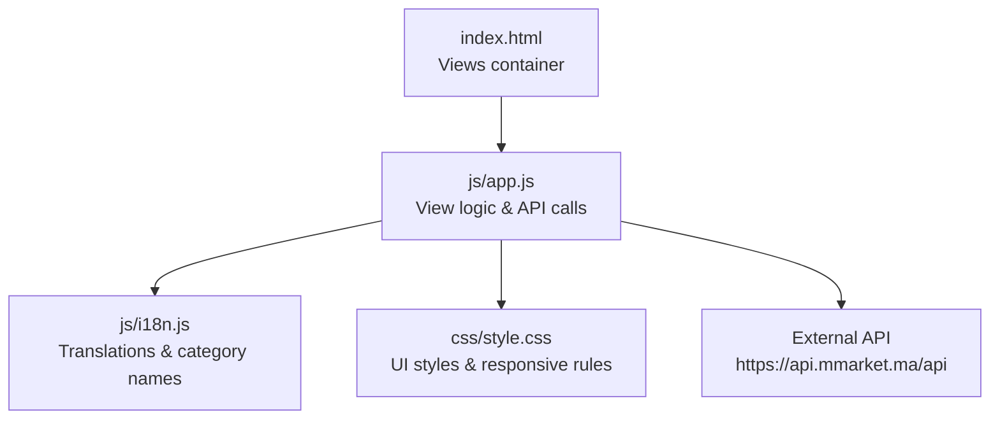

**Diagram sources**
- [index.html:201-215](file://index.html#L201-L215)
- [app.js:585-698](file://js/app.js#L585-L698)
- [i18n.js:370-418](file://js/i18n.js#L370-L418)
- [style.css:514-555](file://css/style.css#L514-L555)

**Section sources**
- [index.html:201-215](file://index.html#L201-L215)
- [app.js:585-698](file://js/app.js#L585-L698)

## Core Components
- Dynamic product detail rendering: loads product by ID, displays name, brand, category, weight/volume, availability status, description, image, and pricing.
- Pricing display: shows current price, strikethrough original price when applicable, and discount badge percentage.
- Quantity selector: increment/decrement controls with min value enforcement.
- Add-to-cart and buy-now actions: add items to cart; buy-now adds item and navigates to checkout.
- Wishlist toggle: add/remove product from wishlist with UI feedback.
- Related products recommendation: shows up to four other products from the same category as the current product.
- Recent products tracking: stores recently viewed products locally and surfaces them on the home page.
- Data caching: caches fetched product details to avoid repeated network requests.
- Error handling: graceful messages when product not found or API fails.
- Responsive layout: adapts grid and typography for mobile via Bootstrap classes and CSS.

**Section sources**
- [app.js:585-698](file://js/app.js#L585-L698)
- [app.js:701-708](file://js/app.js#L701-L708)
- [app.js:897-924](file://js/app.js#L897-L924)
- [app.js:100-114](file://js/app.js#L100-L114)
- [app.js:135-142](file://js/app.js#L135-L142)
- [index.html:201-215](file://index.html#L201-L215)
- [style.css:514-555](file://css/style.css#L514-L555)

## Architecture Overview
The detail view follows a client-side SPA pattern:
- Navigation triggers openDetail(id), which fetches product data, updates breadcrumbs, and renders HTML into the detail section.
- Related products are computed from cached or loaded product lists filtered by category.
- User interactions (quantity changes, add-to-cart, buy-now, wishlist toggle) update local state and persist to localStorage where appropriate.
- i18n provides localized strings and category name translations.

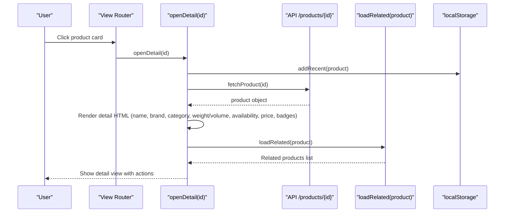

**Diagram sources**
- [app.js:585-698](file://js/app.js#L585-L698)
- [app.js:100-114](file://js/app.js#L100-L114)
- [app.js:135-142](file://js/app.js#L135-L142)

## Detailed Component Analysis

### Dynamic Product Detail Rendering
- Loads product by ID using a cached-first strategy; if not cached, fetches from API and caches result.
- Renders breadcrumb with product name.
- Displays:
  - Brand name (if present)
  - Product name
  - Category badge (localized via i18n mapping)
  - Weight/volume badge (if present)
  - Availability badge (in stock/out of stock)
  - Description text
  - Image with fallback placeholder on error
- Adds event listeners for quantity controls, add-to-cart, buy-now, and wishlist toggle.

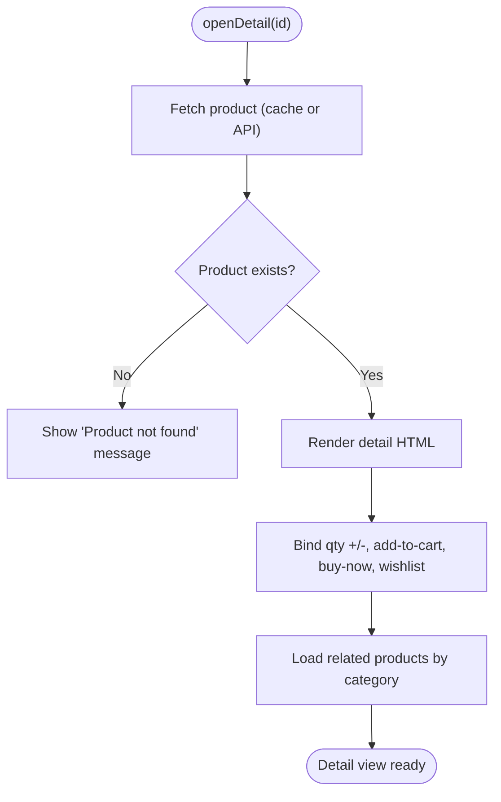

**Diagram sources**
- [app.js:585-669](file://js/app.js#L585-L669)
- [app.js:671-698](file://js/app.js#L671-L698)

**Section sources**
- [app.js:585-669](file://js/app.js#L585-L669)

### Pricing Display with Original Price Strikethrough and Discount Badges
- Current price is always shown.
- If an original price exists and is greater than the current price, it is displayed with a strikethrough style.
- If a discount percentage exists, a discount badge is shown alongside the price.
- Formatting uses a helper to round and append currency unit.

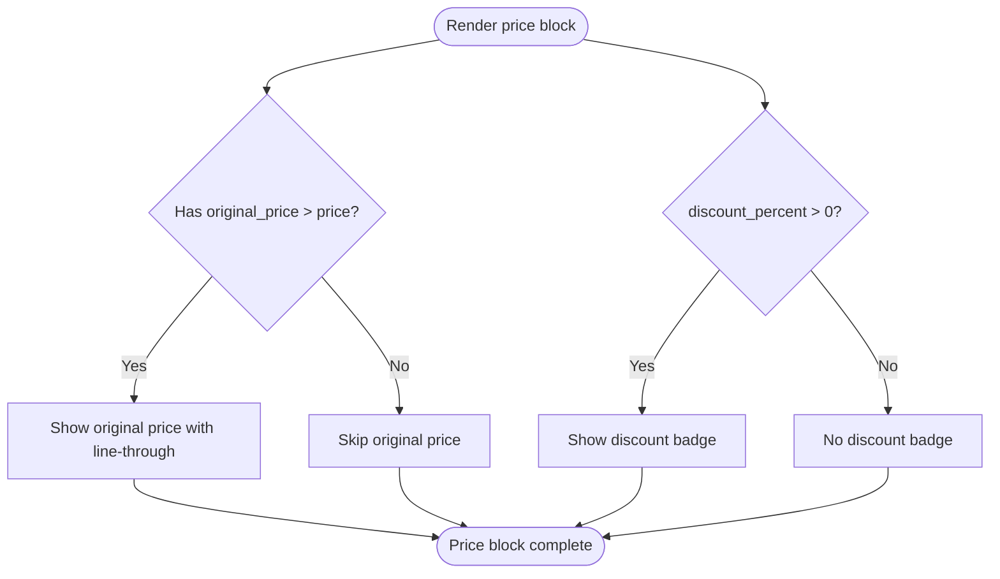

**Diagram sources**
- [app.js:619-623](file://js/app.js#L619-L623)
- [app.js:145-148](file://js/app.js#L145-L148)

**Section sources**
- [app.js:619-623](file://js/app.js#L619-L623)
- [app.js:145-148](file://js/app.js#L145-L148)

### Quantity Selector with Increment/Decrement Controls
- Provides minus and plus buttons around a numeric input.
- Minus button enforces a minimum value of 1.
- Plus button increments the value.
- Values are read when adding to cart or buying now.

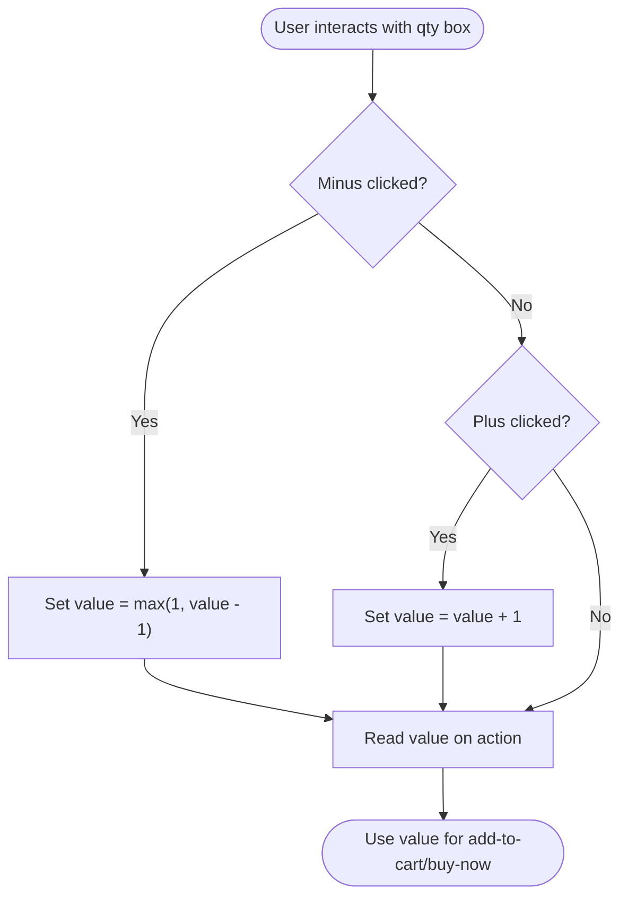

**Diagram sources**
- [app.js:657-661](file://js/app.js#L657-L661)

**Section sources**
- [app.js:657-661](file://js/app.js#L657-L661)

### Add-to-Cart and Buy-Now Functionality
- Add-to-cart:
  - Adds or updates item quantity in the cart array.
  - Persists cart to localStorage.
  - Shows a toast notification.
- Buy-now:
  - Adds item to cart with selected quantity.
  - Navigates to the checkout view.

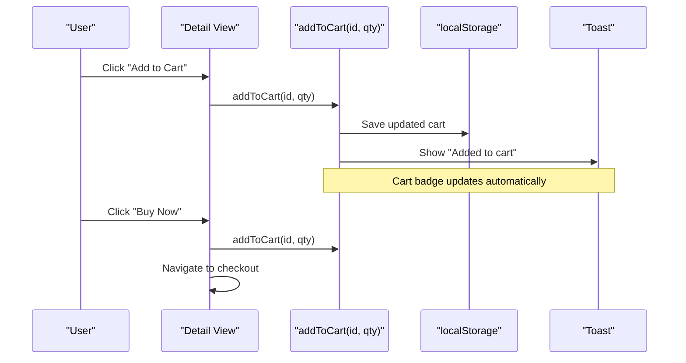

**Diagram sources**
- [app.js:701-708](file://js/app.js#L701-L708)
- [app.js:660-661](file://js/app.js#L660-L661)

**Section sources**
- [app.js:701-708](file://js/app.js#L701-L708)
- [app.js:660-661](file://js/app.js#L660-L661)

### Wishlist Integration with Toggle Functionality
- Toggle function adds or removes the product ID from the wishlist array.
- Updates localStorage and shows a toast notification.
- On wishlist view, product details are resolved from cache or fetched on demand.

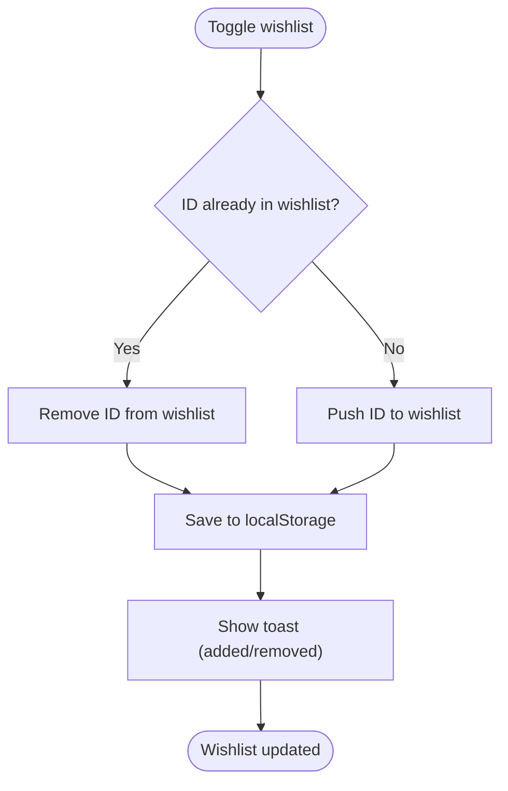

**Diagram sources**
- [app.js:897-904](file://js/app.js#L897-L904)
- [app.js:906-924](file://js/app.js#L906-L924)

**Section sources**
- [app.js:897-904](file://js/app.js#L897-L904)
- [app.js:906-924](file://js/app.js#L906-L924)

### Related Products Recommendation System Based on Category Matching
- Filters the current product list to find other products sharing the same category identifier or category name.
- Limits results to four items.
- If fewer than four are found, fills remaining slots with additional non-duplicate products from the list.
- Hides the related section if no matches exist.

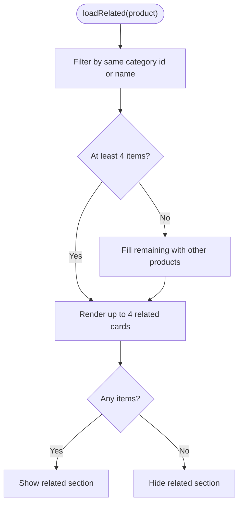

**Diagram sources**
- [app.js:671-698](file://js/app.js#L671-L698)

**Section sources**
- [app.js:671-698](file://js/app.js#L671-L698)

### Recent Products Tracking
- When opening a product detail, the product is added to a recent list stored in localStorage.
- The list is deduplicated by product ID and limited to eight entries.
- Home view renders a “Recently Viewed” section using the stored list.

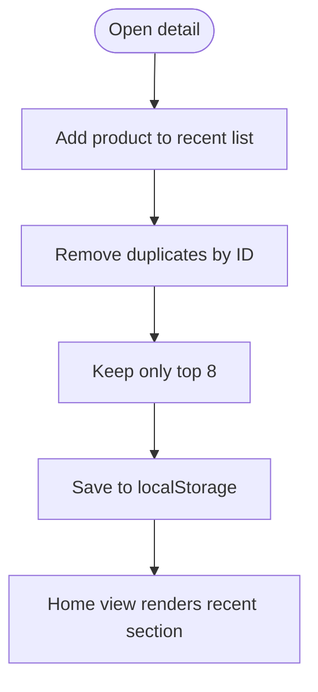

**Diagram sources**
- [app.js:100-114](file://js/app.js#L100-L114)
- [app.js:594-596](file://js/app.js#L594-L596)

**Section sources**
- [app.js:100-114](file://js/app.js#L100-L114)
- [app.js:594-596](file://js/app.js#L594-L596)

### Product Data Caching
- A simple in-memory cache maps product IDs to full product objects.
- Detail view checks cache before making network requests.
- Shop view also populates cache while loading pages to support cart and wishlist rendering without extra calls.

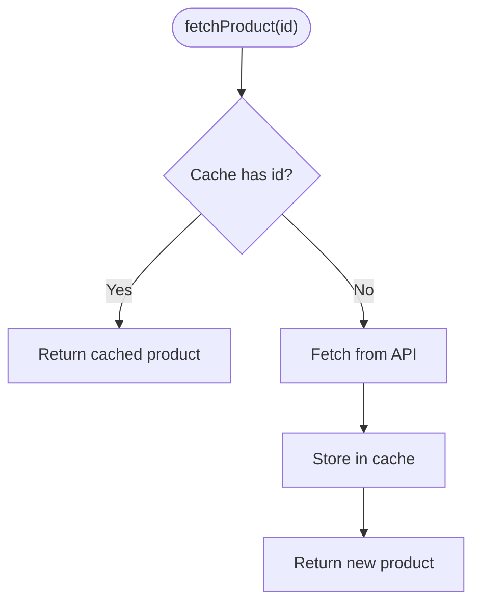

**Diagram sources**
- [app.js:135-142](file://js/app.js#L135-L142)
- [app.js:570-572](file://js/app.js#L570-L572)

**Section sources**
- [app.js:135-142](file://js/app.js#L135-L142)
- [app.js:570-572](file://js/app.js#L570-L572)

### Error Handling for Missing Products
- If fetching a product fails, the detail view replaces content with a localized “Product not found” message.
- Global API errors during initialization show a localized failure message.

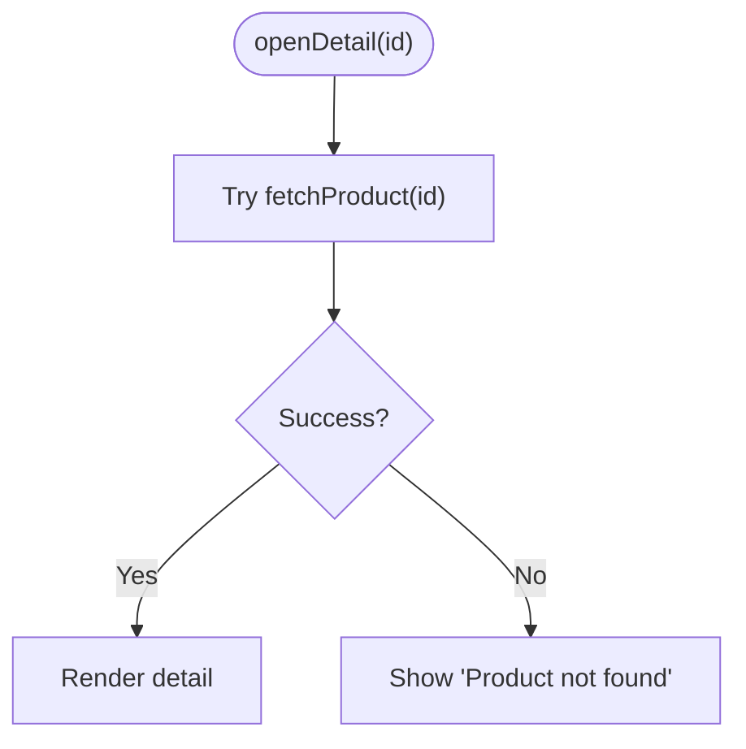

**Diagram sources**
- [app.js:594-668](file://js/app.js#L594-L668)
- [app.js:1009-1017](file://js/app.js#L1009-L1017)

**Section sources**
- [app.js:594-668](file://js/app.js#L594-L668)
- [app.js:1009-1017](file://js/app.js#L1009-L1017)

### Responsive Layout Adaptation for Mobile Devices
- Uses Bootstrap grid classes to adapt columns for different screen sizes.
- Mobile bottom toolbar provides quick access to key views.
- Detail view image and content stack vertically on small screens and align side-by-side on larger screens.
- CSS defines consistent spacing, typography, and interactive states across devices.

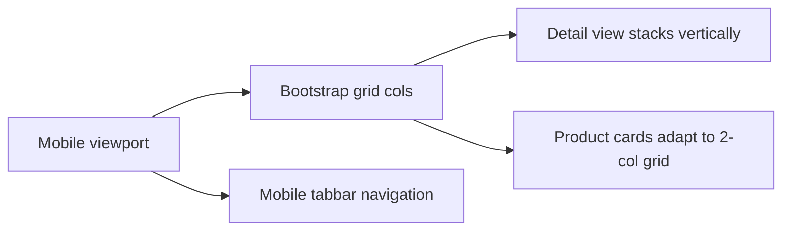

**Diagram sources**
- [index.html:201-215](file://index.html#L201-L215)
- [index.html:372-403](file://index.html#L372-L403)
- [style.css:514-555](file://css/style.css#L514-L555)

**Section sources**
- [index.html:201-215](file://index.html#L201-L215)
- [index.html:372-403](file://index.html#L372-L403)
- [style.css:514-555](file://css/style.css#L514-L555)

## Dependency Analysis
- app.js depends on:
  - index.html DOM structure for views and elements.
  - i18n.js for localized strings and category name translation.
  - style.css for visual presentation and responsive behavior.
  - External API for categories and products.
- i18n.js provides language switching and category name mapping used throughout the app.
- CSS provides reusable components like product cards, detail image area, and quantity controls.

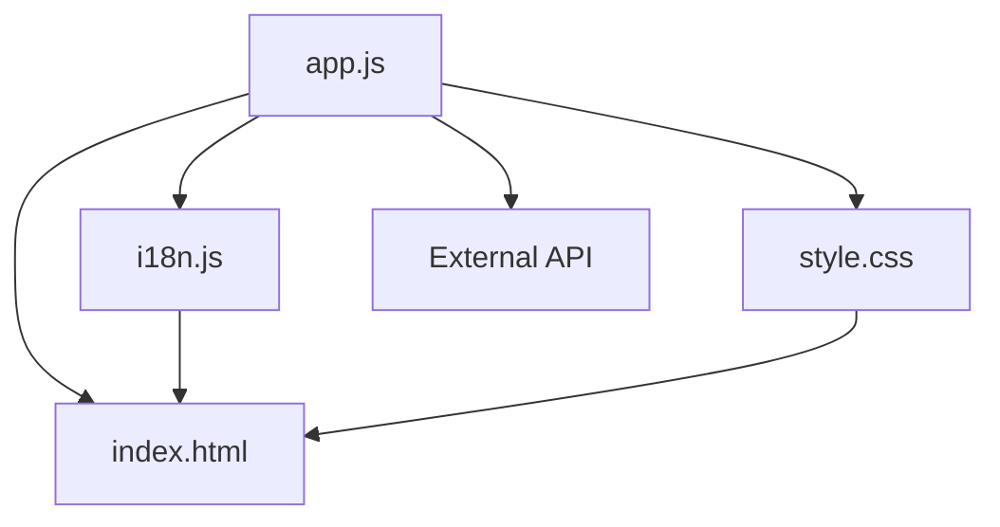

**Diagram sources**
- [app.js:117-142](file://js/app.js#L117-L142)
- [i18n.js:370-418](file://js/i18n.js#L370-L418)
- [style.css:514-555](file://css/style.css#L514-L555)

**Section sources**
- [app.js:117-142](file://js/app.js#L117-L142)
- [i18n.js:370-418](file://js/i18n.js#L370-L418)
- [style.css:514-555](file://css/style.css#L514-L555)

## Performance Considerations
- Caching product details reduces redundant network calls and speeds up repeat visits.
- Client-side filtering and sorting minimize server load for common operations.
- Lazy loading images and placeholders improve perceived performance.
- LocalStorage persistence avoids re-fetching cart, wishlist, and recent items.

[No sources needed since this section provides general guidance]

## Troubleshooting Guide
- Product not found:
  - Occurs when API returns an error for a specific product ID.
  - The view shows a localized message; verify the product ID and network connectivity.
- API failure during initialization:
  - If categories or initial products cannot be loaded, a localized error message is displayed.
  - Check internet connection and API availability.
- Wishlist or cart not updating:
  - Ensure localStorage is enabled and not blocked by browser settings.
  - Verify that badges update after actions; check console for errors.
- Related products not showing:
  - Requires at least one other product in the same category; otherwise the section is hidden.

**Section sources**
- [app.js:594-668](file://js/app.js#L594-L668)
- [app.js:1009-1017](file://js/app.js#L1009-L1017)

## Conclusion
The product detail view integrates dynamic rendering, robust pricing display, intuitive quantity controls, and seamless purchase flows. Wishlist toggling, category-based related recommendations, and recent products tracking enhance user experience. Caching and error handling ensure reliability, while responsive design guarantees usability across devices.

[No sources needed since this section summarizes without analyzing specific files]