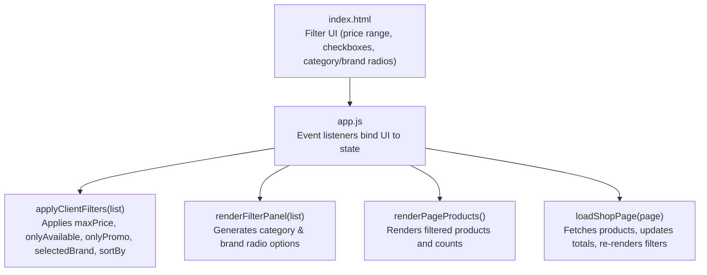
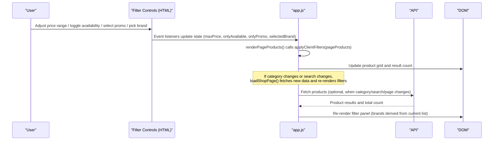
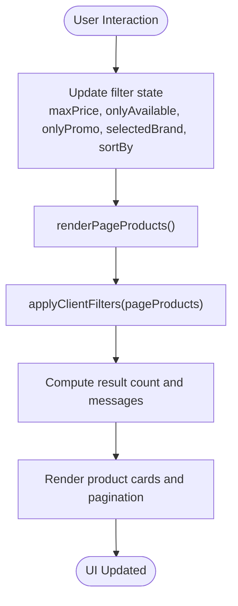
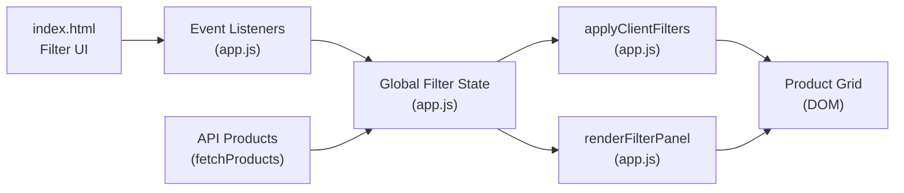

# Client-Side Filtering System

<cite>
**Referenced Files in This Document**
- [app.js](file://js/app.js)
- [index.html](file://index.html)
</cite>

## Table of Contents
1. [Introduction](#introduction)
2. [Project Structure](#project-structure)
3. [Core Components](#core-components)
4. [Architecture Overview](#architecture-overview)
5. [Detailed Component Analysis](#detailed-component-analysis)
6. [Dependency Analysis](#dependency-analysis)
7. [Performance Considerations](#performance-considerations)
8. [Troubleshooting Guide](#troubleshooting-guide)
9. [Conclusion](#conclusion)

## Introduction
This document explains the client-side filtering system used to refine product listings by price, availability, promotions, and brand. It focuses on how filters are applied, how the filter panel is rendered with radio buttons for categories and brands, how brand lists are dynamically generated from product data using Set operations, and how filter combinations work together. It also covers how filters persist across page navigation and maintain state consistency within the application.

## Project Structure
The filtering logic lives primarily in the main JavaScript module, while the HTML defines the filter controls and containers that get populated at runtime.

**Diagram sources**
- [index.html:141-177](file://index.html#L141-L177)
- [app.js:339-361](file://js/app.js#L339-L361)
- [app.js:363-410](file://js/app.js#L363-L410)
- [app.js:412-481](file://js/app.js#L412-L481)
- [app.js:545-583](file://js/app.js#L545-L583)

**Section sources**
- [index.html:141-177](file://index.html#L141-L177)
- [app.js:339-361](file://js/app.js#L339-L361)
- [app.js:363-410](file://js/app.js#L363-L410)
- [app.js:412-481](file://js/app.js#L412-L481)
- [app.js:545-583](file://js/app.js#L545-L583)

## Core Components
- Filter state variables:
  - Price cap: maxPrice
  - Availability: onlyAvailable
  - Promotions: onlyPromo
  - Brand: selectedBrand
  - Sorting: sortBy
- Key functions:
  - applyClientFilters(list): applies all active filters and sorting to a list of products
  - renderFilterPanel(list): renders category and brand radio options; extracts unique brands via Set
  - renderPageProducts(): computes filtered results and renders them
  - loadShopPage(page): fetches products, updates totals, and triggers re-rendering of filters and products

These components collaborate to provide real-time filtering as users interact with the UI.

**Section sources**
- [app.js:68-85](file://js/app.js#L68-L85)
- [app.js:339-361](file://js/app.js#L339-L361)
- [app.js:363-410](file://js/app.js#L363-L410)
- [app.js:412-481](file://js/app.js#L412-L481)
- [app.js:545-583](file://js/app.js#L545-L583)

## Architecture Overview
The filtering architecture follows a reactive pattern: user interactions update global state, which triggers re-rendering of the product grid and filter panels. The flow ensures consistent state across views and pages.

**Diagram sources**
- [index.html:141-177](file://index.html#L141-L177)
- [app.js:339-361](file://js/app.js#L339-L361)
- [app.js:363-410](file://js/app.js#L363-L410)
- [app.js:412-481](file://js/app.js#L412-L481)
- [app.js:545-583](file://js/app.js#L545-L583)
- [app.js:975-1006](file://js/app.js#L975-L1006)

## Detailed Component Analysis

### applyClientFilters(list)
Purpose:
- Applies multiple filter criteria to an input array of products and returns a new filtered array.
- Supports:
  - Price range filtering by maxPrice
  - Availability filtering by onlyAvailable
  - Promotion filtering by onlyPromo
  - Brand filtering by selectedBrand
  - Sorting by sortBy (price ascending/descending, name)

Behavior:
- Creates a shallow copy of the input list to avoid mutating the original.
- Filters by price first, then conditionally by availability, promotion, and brand.
- Sorts the resulting array based on the current sort option.

Complexity:
- Time: O(n) for filtering plus O(n log n) for sorting in worst case.
- Space: O(n) for the new filtered array.

Error handling:
- Safely parses numeric values for price comparisons.
- Handles missing or falsy fields gracefully.

Optimization opportunities:
- Early exit if no filters are active to skip unnecessary processing.
- Memoize sorted results when inputs haven’t changed.

**Section sources**
- [app.js:339-361](file://js/app.js#L339-L361)

### Dynamic Brand Extraction Using Set
Purpose:
- Generate a unique list of brands present in the current product list for rendering brand radio options.

Implementation highlights:
- Extracts brand_name from each product, filters out empty values, and uses Set to deduplicate.
- Sorts the resulting array alphabetically for consistent UI ordering.
- Limits displayed brands to a manageable number for performance and UX.

Edge cases:
- If no brands exist, displays a localized message indicating no brands available.

**Section sources**
- [app.js:388-410](file://js/app.js#L388-L410)

### Filter Panel Rendering (Categories and Brands)
Purpose:
- Render radio buttons for categories and brands, reflecting current selections and allowing user interaction.

Category rendering:
- Renders an “All Categories” option and one per category from the loaded categories list.
- Updates currentCat on selection and resets pagination and brand selection before reloading shop data.

Brand rendering:
- Dynamically generates brand options from the current product list using Set-based extraction.
- Maintains mutual exclusivity via radio buttons grouped by name.
- On selection, updates selectedBrand and re-renders the product grid without full reload.

State synchronization:
- Category changes trigger a full shop reload to respect server-side category filtering.
- Brand changes trigger client-side re-filtering for immediate feedback.

**Section sources**
- [app.js:363-410](file://js/app.js#L363-L410)
- [index.html:141-177](file://index.html#L141-L177)

### Filter Combinations and Interactions
How filters work together:
- Price, availability, promotion, and brand filters are combined using logical AND semantics inside applyClientFilters.
- Sorting is applied after filtering, ensuring results are ordered according to the selected sort option.

Interaction examples:
- Adjusting the price slider immediately narrows visible products.
- Toggling “In stock only” removes unavailable items from view.
- Enabling “On promotion” restricts results to promotional items.
- Selecting a brand further refines the set to that brand’s products.

Persistence across navigation:
- Filter state variables (maxPrice, onlyAvailable, onlyPromo, selectedBrand, sortBy) are maintained in memory during the session.
- When navigating between views (home, shop, detail), these states remain consistent until explicitly cleared.
- Clearing filters resets all states to defaults and reloads the shop page.

**Section sources**
- [app.js:339-361](file://js/app.js#L339-L361)
- [app.js:975-1006](file://js/app.js#L975-L1006)

### Data Flow and Rendering Pipeline

**Diagram sources**
- [app.js:412-481](file://js/app.js#L412-L481)
- [app.js:339-361](file://js/app.js#L339-L361)

## Dependency Analysis
Key dependencies and relationships:
- HTML elements define the filter controls and containers referenced by IDs.
- JavaScript binds event listeners to these controls and updates global state accordingly.
- Functions depend on shared state variables to compute filtered results consistently.
- API calls supply product data that feed into client-side filtering.

**Diagram sources**
- [index.html:141-177](file://index.html#L141-L177)
- [app.js:339-361](file://js/app.js#L339-L361)
- [app.js:363-410](file://js/app.js#L363-L410)
- [app.js:545-583](file://js/app.js#L545-L583)

**Section sources**
- [index.html:141-177](file://index.html#L141-L177)
- [app.js:339-361](file://js/app.js#L339-L361)
- [app.js:363-410](file://js/app.js#L363-L410)
- [app.js:545-583](file://js/app.js#L545-L583)

## Performance Considerations
- Filtering runs on the client side for responsiveness; keep pageProducts size reasonable to avoid heavy computations.
- Brand extraction uses Set for O(n) deduplication; limiting displayed brands improves UI performance.
- Sorting adds O(n log n) overhead; consider debouncing rapid sort changes if needed.
- Avoid unnecessary re-renders by checking if filter state has actually changed before calling render functions.

[No sources needed since this section provides general guidance]

## Troubleshooting Guide
Common issues and resolutions:
- No products shown:
  - Verify that filters are not too restrictive (e.g., very low maxPrice or strict brand selection).
  - Use the clear filters button to reset all states and reload data.
- Brand list not updating:
  - Ensure the current product list contains brand_name values; otherwise, the brand panel will show a localized message.
- Inconsistent state after navigation:
  - Confirm that navigation does not inadvertently reset filter state unless intended.
  - Use the clear filters action to restore default behavior.

**Section sources**
- [app.js:975-1006](file://js/app.js#L975-L1006)
- [app.js:388-410](file://js/app.js#L388-L410)

## Conclusion
The client-side filtering system provides a responsive and intuitive way to refine product listings by price, availability, promotions, and brand. Filters are applied efficiently using a centralized function, and the UI updates in real time. Brand lists are dynamically generated from product data using Set operations to ensure uniqueness and order. Filter state persists across navigation within the session, maintaining consistency until explicitly cleared. This design balances performance and usability, enabling smooth shopping experiences.

[No sources needed since this section summarizes without analyzing specific files]