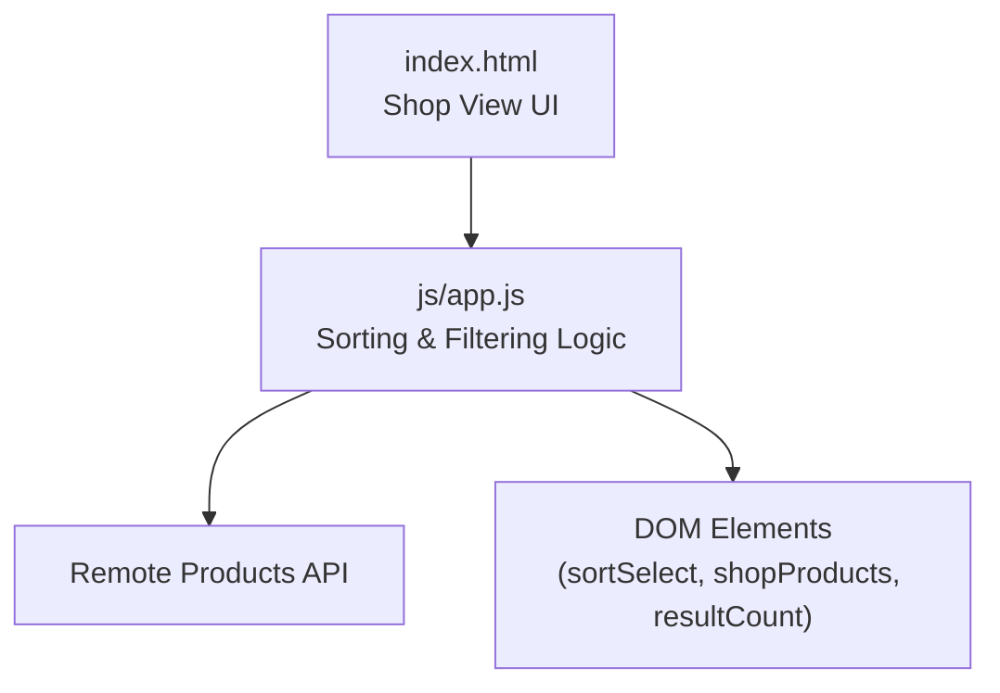
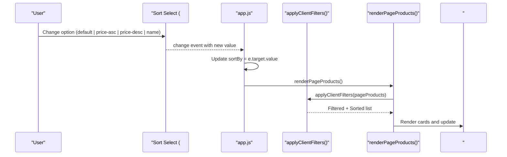
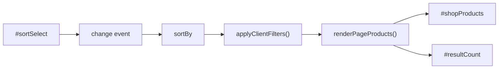

# Product Sorting Options

<cite>
**Referenced Files in This Document**
- [app.js](file://js/app.js)
- [index.html](file://index.html)
</cite>

## Table of Contents
1. [Introduction](#introduction)
2. [Project Structure](#project-structure)
3. [Core Components](#core-components)
4. [Architecture Overview](#architecture-overview)
5. [Detailed Component Analysis](#detailed-component-analysis)
6. [Dependency Analysis](#dependency-analysis)
7. [Performance Considerations](#performance-considerations)
8. [Troubleshooting Guide](#troubleshooting-guide)
9. [Conclusion](#conclusion)

## Introduction
This document explains the product sorting functionality implemented in the shop view. It covers the three supported sorting options:
- Price ascending (price-asc)
- Price descending (price-desc)
- Alphabetical by name (name)

It details how the sortBy variable controls sorting behavior inside applyClientFilters(), how the sort selection integrates with the filter panel UI, and how locale-aware string comparison is used for alphabetical sorting while numeric comparison is used for price sorting. Examples illustrate sorting behavior with different datasets and how sorting works together with other filters such as category, brand, availability, promotion, and price range.

## Project Structure
The sorting feature spans two main files:
- index.html defines the shop view UI including a select element for sorting options.
- js/app.js implements the filtering and sorting logic, event bindings, and rendering pipeline.

**Diagram sources**
- [index.html:132-199](file://index.html#L132-L199)
- [app.js:339-360](file://js/app.js#L339-L360)
- [app.js:412-481](file://js/app.js#L412-L481)
- [app.js:968-971](file://js/app.js#L968-L971)

**Section sources**
- [index.html:132-199](file://index.html#L132-L199)
- [app.js:339-360](file://js/app.js#L339-L360)
- [app.js:412-481](file://js/app.js#L412-L481)
- [app.js:968-971](file://js/app.js#L968-L971)

## Core Components
- Sort control UI: A select dropdown in the shop header provides four options: default, price-asc, price-desc, and name.
- State variable: sortBy holds the current sort mode and influences how products are ordered when rendered.
- Filtering and sorting function: applyClientFilters() applies all active filters and then sorts the resulting list based on sortBy.
- Rendering pipeline: renderPageProducts() calls applyClientFilters() to get the filtered and sorted list and renders it into the product grid.
- Event binding: An event listener updates sortBy from the select element and triggers re-rendering.

Key responsibilities:
- UI-to-state mapping: The select element’s value maps directly to sortBy.
- Data transformation: applyClientFilters() transforms pageProducts into a filtered and sorted array.
- Presentation: renderPageProducts() displays the transformed data and updates counts.

**Section sources**
- [index.html:181-191](file://index.html#L181-L191)
- [app.js:78-79](file://js/app.js#L78-L79)
- [app.js:339-360](file://js/app.js#L339-L360)
- [app.js:412-481](file://js/app.js#L412-L481)
- [app.js:968-971](file://js/app.js#L968-L971)

## Architecture Overview
The sorting flow connects UI interactions to state changes and re-renders:

**Diagram sources**
- [index.html:181-191](file://index.html#L181-L191)
- [app.js:339-360](file://js/app.js#L339-L360)
- [app.js:412-481](file://js/app.js#L412-L481)
- [app.js:968-971](file://js/app.js#L968-L971)

## Detailed Component Analysis

### Sorting Options and Behavior
- Default: No explicit sorting applied; order remains as returned by the API or cached list.
- Price ascending (price-asc): Sorts numerically by price from lowest to highest.
- Price descending (price-desc): Sorts numerically by price from highest to lowest.
- Name (alphabetical): Sorts alphabetically using locale-aware string comparison.

Implementation highlights:
- Numeric comparisons use parseFloat to ensure correct ordering regardless of string formatting.
- Alphabetical comparison uses localeCompare to respect language-specific collation rules.

Examples:
- With prices [120, 99, 150]:
  - price-asc → [99, 120, 150]
  - price-desc → [150, 120, 99]
- With names ["Banana", "apple", "Cherry"]:
  - name (locale-aware) typically yields ["apple", "Banana", "Cherry"] depending on locale settings.

Integration with filters:
- Sorting is applied after filtering by max price, availability, promotions, and brand.
- Category selection affects which products are loaded before sorting.
- Search queries affect which products are loaded before sorting.

**Section sources**
- [app.js:339-360](file://js/app.js#L339-L360)
- [app.js:412-481](file://js/app.js#L412-L481)
- [index.html:181-191](file://index.html#L181-L191)

### How sortBy Controls Sorting in applyClientFilters()
- The function receives a list of products and returns a new list that has been filtered and sorted.
- Sorting branches:
  - If sortBy equals 'price-asc', sort by numeric price ascending.
  - If sortBy equals 'price-desc', sort by numeric price descending.
  - If sortBy equals 'name', sort by name using locale-aware comparison.
- Other values (including 'default') leave the list unsorted beyond filters.

Complexity:
- Sorting runs in O(n log n) time relative to the number of items in the current page slice.
- Filtering runs in O(n) per filter condition.

Edge cases handled:
- Missing or empty names are treated as empty strings during comparison to avoid errors.
- Prices are parsed to numbers to ensure correct numeric ordering.

**Section sources**
- [app.js:339-360](file://js/app.js#L339-L360)

### UI Integration: Sort Selection and Re-rendering
- The select element with id sortSelect contains options for default, price-asc, price-desc, and name.
- On change, an event listener updates the global sortBy variable and calls renderPageProducts().
- renderPageProducts() calls applyClientFilters() to produce the final list and renders it into the product grid.

Flow:
- User selects a sort option.
- sortBy updates.
- renderPageProducts() re-runs filtering and sorting.
- The product grid updates with the newly ordered items.

**Section sources**
- [index.html:181-191](file://index.html#L181-L191)
- [app.js:968-971](file://js/app.js#L968-L971)
- [app.js:412-481](file://js/app.js#L412-L481)

### Locale-Aware String Comparison for Alphabetical Sorting
- The name sort uses localeCompare to compare product names.
- This ensures culturally appropriate ordering (e.g., handling accents and case differences according to the browser’s locale).
- Fallback to empty strings prevents errors if a product lacks a name.

Practical implications:
- In locales where case sensitivity differs, uppercase and lowercase letters may be ordered consistently with user expectations.
- Accented characters are compared according to locale rules rather than raw Unicode code points.

**Section sources**
- [app.js:356-358](file://js/app.js#L356-L358)

### Numeric Comparison for Price Sorting
- Prices are converted to numbers via parseFloat before comparison.
- Ascending order subtracts b from a; descending order subtracts a from b.
- This avoids lexicographic string comparisons that would incorrectly order values like "9" vs "10".

Robustness:
- Non-numeric or missing prices are handled gracefully by parsing; invalid values will not break sorting but may yield unexpected results if data quality is poor.

**Section sources**
- [app.js:356-358](file://js/app.js#L356-L358)

### Combining Sorting with Other Filters
Sorting interacts with multiple filters:
- Category: Determines the initial dataset loaded from the API.
- Brand: Filters to a specific brand before sorting.
- Availability: Excludes out-of-stock items if enabled.
- Promotion: Includes only promotional items if enabled.
- Price range: Limits to items under the selected maximum price.

Order of operations:
1. Load products based on category and search query.
2. Apply client-side filters (price range, availability, promotion, brand).
3. Apply sorting based on sortBy.
4. Render the first 12 items and update the result count.

Example scenarios:
- Scenario A: All categories, no brand, in stock only, promo off, price up to 200 DH, sort by price-asc.
  - Only available items under 200 DH are considered; cheapest appear first.
- Scenario B: Selected category “Beverages”, brand “Coca-Cola”, in stock only, promo on, price up to 150 DH, sort by name.
  - Results include only Coca-Cola beverages that are in stock and on promotion under 150 DH, sorted alphabetically by name.
- Scenario C: Search “chocolate”, any category, no brand filter, sort by price-desc.
  - Results show matching products from most expensive to least expensive.

**Section sources**
- [app.js:339-360](file://js/app.js#L339-L360)
- [app.js:412-481](file://js/app.js#L412-L481)
- [app.js:975-1006](file://js/app.js#L975-L1006)

## Dependency Analysis
The sorting feature depends on:
- UI elements: sortSelect, shopProducts, resultCount.
- Global state: sortBy, pageProducts, totalCount.
- Functions: applyClientFilters(), renderPageProducts(), loadShopPage().
- Event listeners: change handler for sortSelect and input handlers for other filters.

**Diagram sources**
- [index.html:181-191](file://index.html#L181-L191)
- [app.js:339-360](file://js/app.js#L339-L360)
- [app.js:412-481](file://js/app.js#L412-L481)
- [app.js:968-971](file://js/app.js#L968-L971)

**Section sources**
- [app.js:339-360](file://js/app.js#L339-L360)
- [app.js:412-481](file://js/app.js#L412-L481)
- [app.js:968-971](file://js/app.js#L968-L971)

## Performance Considerations
- Sorting complexity: O(n log n) per render due to Array.sort.
- Filtering complexity: O(n) per filter condition; combined filters remain linear in the size of the current page slice.
- Typical page size: 12 items per page; sorting overhead is minimal.
- Recommendations:
  - Keep filter conditions efficient; avoid unnecessary recomputation.
  - Ensure product data has valid numeric prices to prevent parse overhead.
  - Use localeCompare judiciously; it is robust but slightly more expensive than simple comparisons.

[No sources needed since this section provides general guidance]

## Troubleshooting Guide
Common issues and resolutions:
- Sorting does not update:
  - Verify that the sortSelect element exists and the change event is bound.
  - Confirm that sortBy is updated and renderPageProducts() is called.
- Incorrect alphabetical order:
  - Check the browser’s locale; localeCompare respects locale settings.
  - Ensure product names are non-empty; fallback to empty strings prevents errors.
- Price sorting anomalies:
  - Validate that prices are numeric; non-numeric values can cause unexpected ordering.
  - Confirm that prices are parsed with parseFloat before comparison.
- Sorting appears to ignore filters:
  - Remember that sorting is applied after filtering; verify filter states (category, brand, availability, promotion, price range).

**Section sources**
- [app.js:339-360](file://js/app.js#L339-L360)
- [app.js:412-481](file://js/app.js#L412-L481)
- [app.js:968-971](file://js/app.js#L968-L971)

## Conclusion
The product sorting feature provides three clear options—price ascending, price descending, and alphabetical by name—implemented through a straightforward state-driven pipeline. The sortBy variable drives sorting within applyClientFilters(), which is invoked during rendering to present correctly ordered results alongside other active filters. Locale-aware string comparison ensures culturally appropriate alphabetical sorting, while numeric comparisons guarantee accurate price ordering. Together, these mechanisms deliver a responsive and predictable shopping experience across various datasets and filter combinations.

[No sources needed since this section summarizes without analyzing specific files]