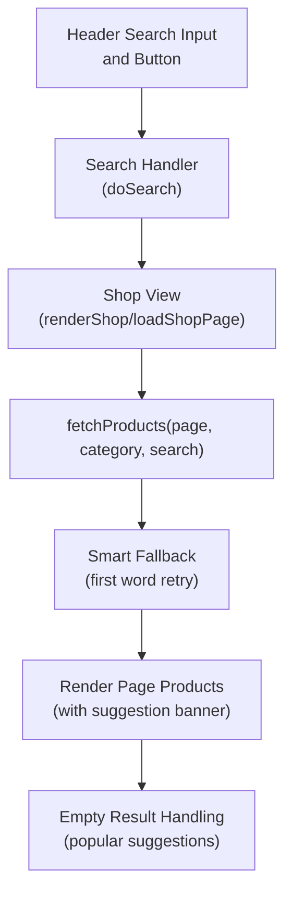
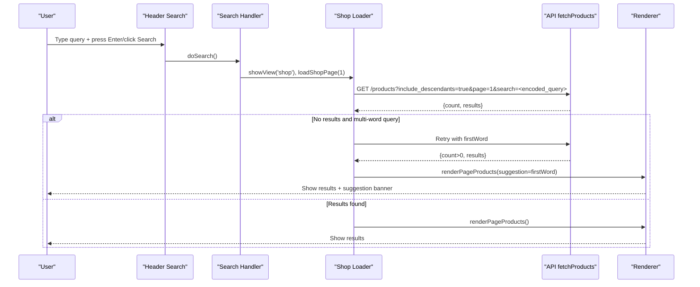
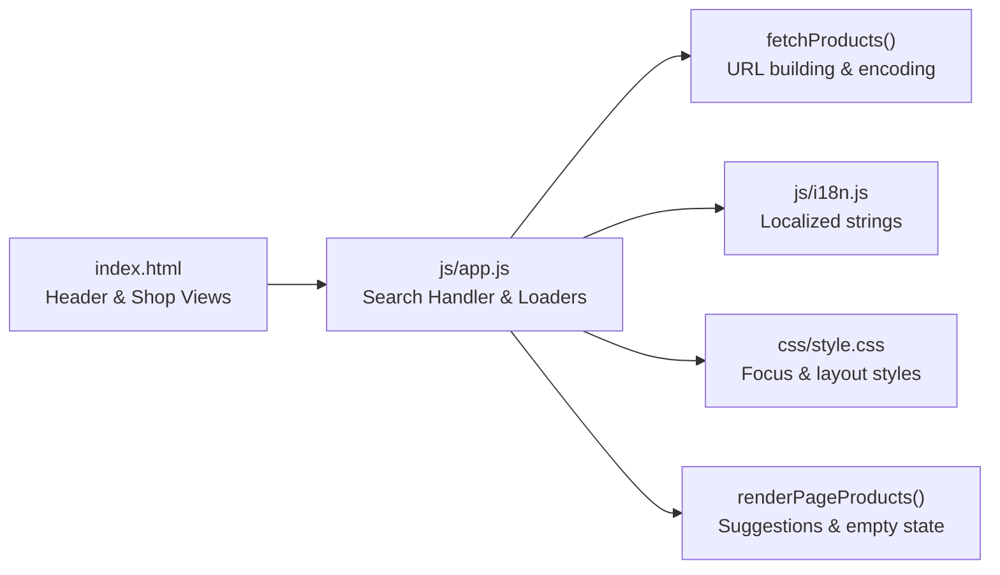

# Real-time Search with Smart Suggestions

<cite>
**Referenced Files in This Document**
- [index.html](file://index.html)
- [app.js](file://js/app.js)
- [style.css](file://css/style.css)
- [i18n.js](file://js/i18n.js)
</cite>

## Table of Contents
1. [Introduction](#introduction)
2. [Project Structure](#project-structure)
3. [Core Components](#core-components)
4. [Architecture Overview](#architecture-overview)
5. [Detailed Component Analysis](#detailed-component-analysis)
6. [Dependency Analysis](#dependency-analysis)
7. [Performance Considerations](#performance-considerations)
8. [Troubleshooting Guide](#troubleshooting-guide)
9. [Conclusion](#conclusion)

## Introduction
This document explains the real-time search functionality and its smart suggestion fallbacks. It covers how user input triggers API calls to fetch products, how URL parameters are encoded, how loading states and empty results are handled, and how the system automatically retries with a simplified query when no results are found. It also documents the suggestion system that proposes popular terms when there are no matches and how users can accept suggestions to refine their search.

## Project Structure
The search feature spans the UI markup, styling, internationalization, and application logic:
- The search input and button live in the header section of the main page.
- The shop view renders product lists, pagination, filters, and empty-result messages.
- Application logic handles search queries, API calls, fallback behavior, and UI updates.
- Styling provides visual feedback for focus states and general layout.
- Internationalization supplies localized strings for messages like “No products found” and suggestion prompts.

**Diagram sources**
- [index.html:23-28](file://index.html#L23-L28)
- [app.js:955-966](file://js/app.js#L955-L966)
- [app.js:545-583](file://js/app.js#L545-L583)
- [app.js:412-481](file://js/app.js#L412-L481)

**Section sources**
- [index.html:23-28](file://index.html#L23-L28)
- [index.html:132-199](file://index.html#L132-L199)
- [app.js:955-966](file://js/app.js#L955-L966)
- [app.js:545-583](file://js/app.js#L545-L583)
- [app.js:412-481](file://js/app.js#L412-L481)
- [style.css:78-103](file://css/style.css#L78-L103)
- [i18n.js:55-65](file://js/i18n.js#L55-L65)

## Core Components
- Search input and trigger: A text input and a search button in the header initiate searches when clicked or when Enter is pressed.
- Search handler: Captures the trimmed query, resets filters, navigates to the shop view, and starts loading results.
- Product fetching: Builds a URL with page, optional category, and an encoded search parameter; returns paginated results.
- Smart fallback: If the full query returns zero results, the system extracts the first meaningful word (minimum length) and retries once; if results exist, it shows a suggestion banner and allows refining the search to that term.
- Rendering and feedback: Displays loading spinners during requests, shows result counts, pagination, and empty-state messaging with suggested popular terms.

**Section sources**
- [index.html:23-28](file://index.html#L23-L28)
- [app.js:955-966](file://js/app.js#L955-L966)
- [app.js:126-133](file://js/app.js#L126-L133)
- [app.js:545-583](file://js/app.js#L545-L583)
- [app.js:412-481](file://js/app.js#L412-L481)

## Architecture Overview
The search flow connects UI events to API calls and then to rendering logic with intelligent fallbacks.

**Diagram sources**
- [app.js:955-966](file://js/app.js#L955-L966)
- [app.js:545-583](file://js/app.js#L545-L583)
- [app.js:126-133](file://js/app.js#L126-L133)
- [app.js:412-481](file://js/app.js#L412-L481)

## Detailed Component Analysis

### Search Input and Trigger
- The header contains a search input and a search button. Pressing Enter or clicking the button triggers the search handler.
- The search handler trims the input value, clears category and brand filters, resets the page, and navigates to the shop view to start loading results.

Key behaviors:
- Triggers on Enter key or button click.
- Resets filters to ensure a clean search context.
- Navigates to the shop view where results are rendered.

**Section sources**
- [index.html:23-28](file://index.html#L23-L28)
- [app.js:955-966](file://js/app.js#L955-L966)

### API Call Construction and URL Encoding
- The product fetcher builds a URL with:
  - include_descendants flag for categories
  - page number
  - optional category filter
  - search parameter encoded using standard URL encoding
- The function returns JSON containing count, next/previous links, and results array.

Encoding details:
- The search string is encoded before being appended to the URL to ensure safe transmission.

**Section sources**
- [app.js:126-133](file://js/app.js#L126-L133)

### Smart Fallback Mechanism
- After fetching results, if the total count is zero and the query has multiple words, the system:
  - Extracts the first word
  - Removes punctuation-like characters
  - Ensures the word meets a minimum length requirement
  - Retries the API call with this simplified query
  - If results are found, displays a suggestion banner indicating the refined search term
  - Allows users to confirm searching only by the suggested term

Behavioral notes:
- The fallback runs only once per search attempt.
- The suggestion banner includes a button to refine the search to the suggested term.

**Section sources**
- [app.js:545-583](file://js/app.js#L545-L583)
- [app.js:412-481](file://js/app.js#L412-L481)

### User Interface Feedback: Loading States and Empty Results
- During loading, a spinner and localized message appear in the shop area.
- When no results are found, an empty state is shown with:
  - A clear search action
  - A browse-all action
  - Popular suggestion buttons for quick refinement (e.g., “reese”, “nutella”, “coca”, “lait”)
- Clicking a suggestion sets the search query, resets pagination, and reloads results.

Visual and UX elements:
- Focus styles on the search input provide clear interaction cues.
- Empty state uses localized strings for consistent messaging across languages.

**Section sources**
- [app.js:545-583](file://js/app.js#L545-L583)
- [app.js:412-481](file://js/app.js#L412-L481)
- [style.css:78-103](file://css/style.css#L78-L103)
- [i18n.js:55-65](file://js/i18n.js#L55-L65)

### Suggestion System and Acceptance Flow
- When no exact match exists, the system may propose a refined search based on the first word of the query.
- Additionally, the empty state presents popular terms as clickable suggestions to help users quickly find relevant products.
- Users can accept these suggestions to immediately refine their search and see updated results.

Acceptance mechanics:
- Clicking a suggestion updates the search query, resets pagination, and triggers a new search.
- The suggestion banner offers a direct way to switch from the original query to the suggested term.

**Section sources**
- [app.js:545-583](file://js/app.js#L545-L583)
- [app.js:412-481](file://js/app.js#L412-L481)

### Search Behavior Patterns and Examples
- Multi-word query with no results:
  - Example: Searching for a specific phrase yields zero results.
  - Behavior: System retries with the first meaningful word; if results exist, a suggestion banner appears.
- Single-word query with results:
  - Example: Searching for a common term like “coca”.
  - Behavior: Direct results are shown without fallback.
- Empty state with popular suggestions:
  - Example: Any query returning zero results shows popular terms (“reese”, “nutella”, “coca”, “lait”).
  - Behavior: Clicking any suggestion refines the search instantly.

These patterns ensure users always receive useful results or actionable guidance.

[No sources needed since this section summarizes observed behavior without analyzing specific files]

## Dependency Analysis
The search feature depends on several components working together:

**Diagram sources**
- [index.html:23-28](file://index.html#L23-L28)
- [index.html:132-199](file://index.html#L132-L199)
- [app.js:955-966](file://js/app.js#L955-L966)
- [app.js:126-133](file://js/app.js#L126-L133)
- [app.js:412-481](file://js/app.js#L412-L481)
- [i18n.js:55-65](file://js/i18n.js#L55-L65)
- [style.css:78-103](file://css/style.css#L78-L103)

**Section sources**
- [index.html:23-28](file://index.html#L23-L28)
- [index.html:132-199](file://index.html#L132-L199)
- [app.js:955-966](file://js/app.js#L955-L966)
- [app.js:126-133](file://js/app.js#L126-L133)
- [app.js:412-481](file://js/app.js#L412-L481)
- [i18n.js:55-65](file://js/i18n.js#L55-L65)
- [style.css:78-103](file://css/style.css#L78-L103)

## Performance Considerations
- Pagination reduces payload size by limiting results per page.
- Client-side filtering applies additional constraints after data retrieval, minimizing server load for minor adjustments.
- The smart fallback performs at most one additional request when necessary, avoiding excessive network calls.
- Localized strings are loaded once and reused, reducing overhead during rendering.

[No sources needed since this section provides general guidance]

## Troubleshooting Guide
Common issues and resolutions:
- No results returned:
  - Check if the query is too specific; try the first word or use popular suggestions.
  - Verify network connectivity and API availability.
- Loading spinner persists:
  - Ensure the search handler is triggered correctly and the shop view is active.
  - Confirm that fetchProducts resolves successfully and returns expected structure.
- Suggestion banner not appearing:
  - Validate that the query has multiple words and the first word meets length requirements.
  - Confirm that the fallback retry returns results greater than zero.

Error handling highlights:
- Network or API errors display localized failure messages.
- Empty states guide users toward alternative actions (clear search, browse all, or try suggestions).

**Section sources**
- [app.js:545-583](file://js/app.js#L545-L583)
- [app.js:412-481](file://js/app.js#L412-L481)
- [i18n.js:55-65](file://js/i18n.js#L55-L65)

## Conclusion
The real-time search feature combines responsive UI interactions, robust API integration, and intelligent fallback logic to deliver a smooth user experience. When full queries return no results, the system automatically attempts a simplified search and guides users with popular suggestions. Clear loading states, localized messaging, and actionable empty-state options ensure users remain engaged and productive throughout their search journey.

[No sources needed since this section summarizes without analyzing specific files]