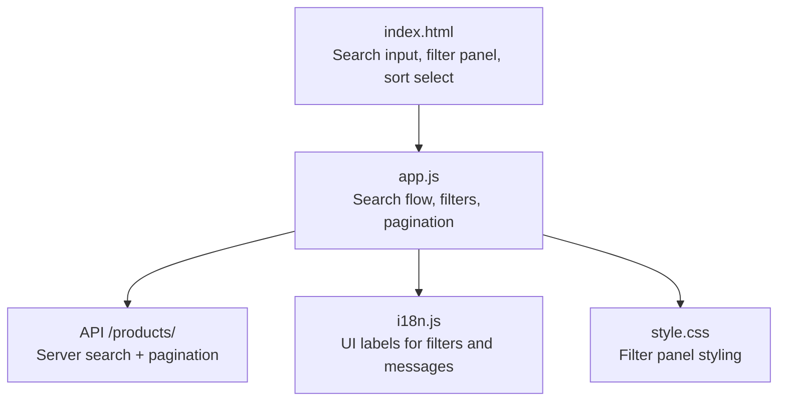
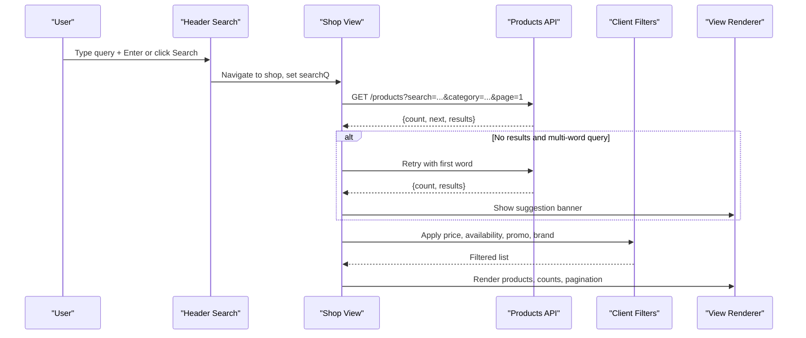
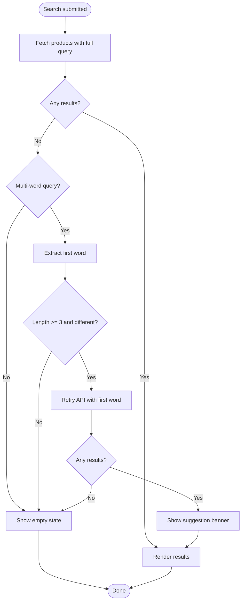
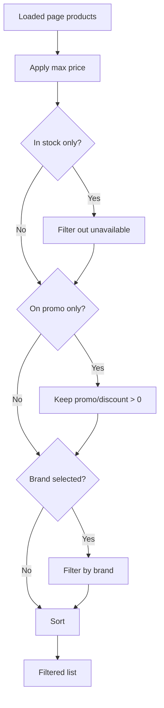
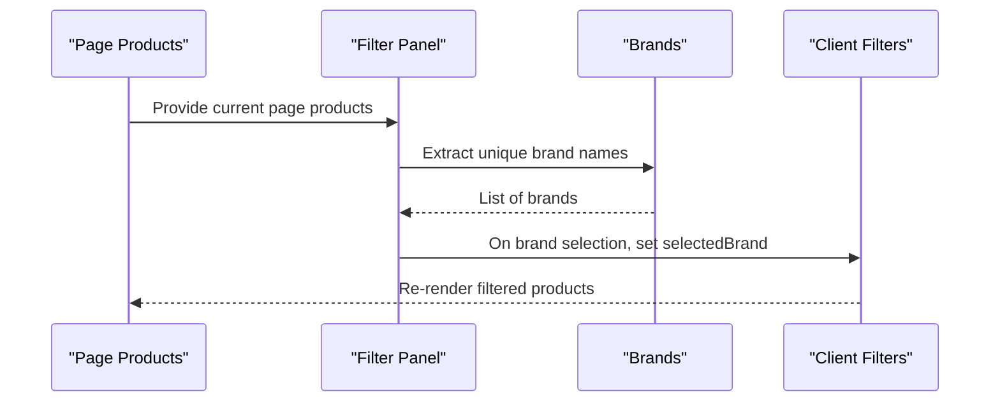
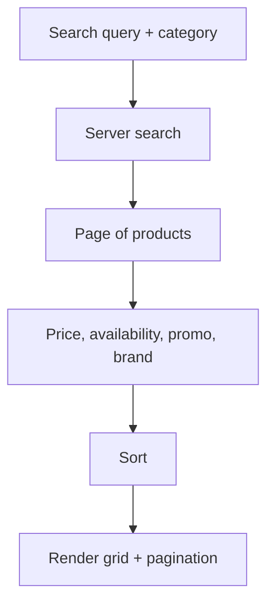
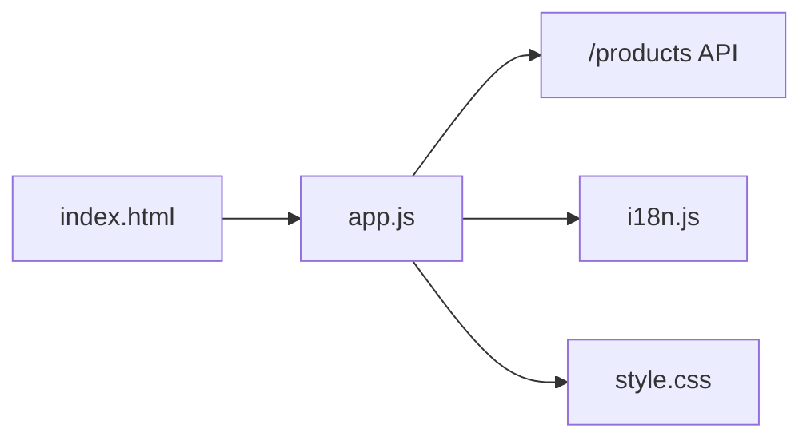

# Search & Filtering

<cite>
**Referenced Files in This Document**
- [index.html](file://index.html)
- [app.js](file://js/app.js)
- [style.css](file://css/style.css)
- [i18n.js](file://js/i18n.js)
</cite>

## Table of Contents
1. Introduction
2. Project Structure
3. Core Components
4. Architecture Overview
5. Detailed Component Analysis
6. Dependency Analysis
7. Performance Considerations
8. Troubleshooting Guide
9. Conclusion

## Introduction
This document explains the search and filtering system implemented for the marketplace application. It covers:
- Real-time search with a smart suggestion fallback that retries using the first word when full queries return no results
- Client-side filtering by price range, availability, promotions, and brand
- Sorting options (price ascending/descending, alphabetical)
- Dynamic filter panel generation and brand extraction from product data
- How filters combine with search queries
- Examples of filter combinations, search behavior patterns, and the user interface for filter controls

## Project Structure
The search and filtering features are primarily implemented in the main JavaScript file, with UI elements defined in the HTML template and styled via CSS. Internationalization strings used by the search and filters are provided by the i18n module.

**Diagram sources**
- [index.html:23-27](file://index.html#L23-L27)
- [index.html:141-197](file://index.html#L141-L197)
- [app.js:955-970](file://js/app.js#L955-L970)
- [app.js:339-410](file://js/app.js#L339-L410)
- [app.js:545-583](file://js/app.js#L545-L583)
- [i18n.js:39-64](file://js/i18n.js#L39-L64)
- [style.css:141-197](file://css/style.css#L141-L197)

**Section sources**
- [index.html:23-27](file://index.html#L23-L27)
- [index.html:141-197](file://index.html#L141-L197)
- [app.js:955-970](file://js/app.js#L955-L970)
- [app.js:339-410](file://js/app.js#L339-L410)
- [app.js:545-583](file://js/app.js#L545-L583)
- [i18n.js:39-64](file://js/i18n.js#L39-L64)
- [style.css:141-197](file://css/style.css#L141-L197)

## Core Components
- Search input and trigger: The header contains a search input and button that initiate server-side search and navigate to the shop view.
- Shop view: Displays products, filter panel, sorting dropdown, result count, and pagination.
- Server search: Uses the API to fetch products based on query and category, returning paginated results.
- Smart suggestion fallback: If the full query returns zero results, the system automatically retries with the first meaningful word from the query.
- Client-side filters: Price range slider, availability checkbox, promotion checkbox, and dynamic brand radio buttons.
- Sorting: Default, price ascending, price descending, name alphabetical.
- Filter panel generation: Dynamically builds category and brand filters from loaded data; brands are extracted from the current page’s products.

**Section sources**
- [index.html:23-27](file://index.html#L23-L27)
- [index.html:141-197](file://index.html#L141-L197)
- [app.js:126-133](file://js/app.js#L126-L133)
- [app.js:339-410](file://js/app.js#L339-L410)
- [app.js:545-583](file://js/app.js#L545-L583)
- [app.js:955-970](file://js/app.js#L955-L970)

## Architecture Overview
The search and filtering pipeline combines server-side search with client-side refinement and sorting.

**Diagram sources**
- [app.js:955-970](file://js/app.js#L955-L970)
- [app.js:545-583](file://js/app.js#L545-L583)
- [app.js:339-410](file://js/app.js#L339-L410)
- [index.html:23-27](file://index.html#L23-L27)
- [index.html:141-197](file://index.html#L141-L197)

## Detailed Component Analysis

### Real-time Search with Smart Suggestion Fallback
- Trigger: Pressing Enter or clicking the search button sets the search query, clears category/brand filters, resets to page 1, and navigates to the shop view.
- Server search: The shop loads products via the API with the current search query and selected category.
- Smart fallback: If the full query yields zero results and the query has multiple words, the system extracts the first word (after removing punctuation), validates length, and retries the API call with that word. If results exist, it displays a suggestion banner offering to switch to searching only that term.
- User control: The suggestion banner includes a button to adopt the suggested term immediately.

**Diagram sources**
- [app.js:955-970](file://js/app.js#L955-L970)
- [app.js:545-583](file://js/app.js#L545-L583)

**Section sources**
- [app.js:955-970](file://js/app.js#L955-L970)
- [app.js:545-583](file://js/app.js#L545-L583)

### Client-Side Filtering
Filters are applied to the currently loaded page of products without additional network calls. They include:
- Price range: Slider limits results to products at or below the selected maximum price.
- Availability: Checkbox to show only in-stock items.
- Promotions: Checkbox to show only items marked as promotional or with a discount percentage greater than zero.
- Brand: Radio buttons dynamically generated from the current page’s products; selecting a brand filters to that brand.

These filters are combined with any active search query and category selection.

**Diagram sources**
- [app.js:339-361](file://js/app.js#L339-L361)

**Section sources**
- [app.js:339-361](file://js/app.js#L339-L361)

### Sorting Options
Sorting is applied after filtering and affects only the current page display:
- Default: No reordering
- Price ascending: Low to high
- Price descending: High to low
- Name alphabetical: A–Z

Sorting does not change server-side results; it reorders the local array before rendering.

**Section sources**
- [app.js:356-358](file://js/app.js#L356-L358)
- [index.html:181-191](file://index.html#L181-L191)

### Filter Panel Generation and Dynamic Brand Extraction
- Category filter: Built from fetched categories; selecting a category resets brand and reloads the shop page.
- Brand filter: Extracted from the current page’s products by collecting unique brand names and sorting them. Up to a limited number are shown initially. Selecting a brand applies an immediate client-side filter without reloading the page.
- Clear filters: Resets price, availability, promotion, brand, search query, and category, then reloads the shop page.

**Diagram sources**
- [app.js:363-410](file://js/app.js#L363-L410)
- [app.js:992-1006](file://js/app.js#L992-L1006)

**Section sources**
- [app.js:363-410](file://js/app.js#L363-L410)
- [app.js:992-1006](file://js/app.js#L992-L1006)

### Combining Filters with Search Queries
- Search query is sent to the server along with optional category.
- After receiving results, client-side filters (price, availability, promotion, brand) further narrow the displayed subset.
- Sorting is applied last to reorder the filtered subset.
- Pagination reflects server-side counts; client filters affect visible items per page.

**Diagram sources**
- [app.js:126-133](file://js/app.js#L126-L133)
- [app.js:339-361](file://js/app.js#L339-L361)
- [app.js:545-583](file://js/app.js#L545-L583)

**Section sources**
- [app.js:126-133](file://js/app.js#L126-L133)
- [app.js:339-361](file://js/app.js#L339-L361)
- [app.js:545-583](file://js/app.js#L545-L583)

### User Interface for Filter Controls
- Search input and button in the header initiate searches.
- Filter panel includes:
  - Category radio buttons
  - Price range slider with label
  - Availability checkbox
  - Promotion checkbox
  - Brand radio buttons (dynamically generated)
  - Clear filters button
- Sorting dropdown allows choosing default, price ascending/descending, or name alphabetical.
- Result count text updates based on filtered results and total server count.

**Section sources**
- [index.html:23-27](file://index.html#L23-L27)
- [index.html:141-197](file://index.html#L141-L197)
- [index.html:181-191](file://index.html#L181-L191)

## Dependency Analysis
- index.html provides DOM structure for search, filters, sorting, and product grid.
- app.js orchestrates:
  - API calls for categories and products
  - Search flow and smart suggestion fallback
  - Client-side filtering and sorting
  - Rendering of filter panels and product lists
  - Event bindings for filters and sorting
- i18n.js supplies localized strings for filter labels, messages, and UI text.
- style.css styles the search box, filter panel, product cards, and responsive layout.

**Diagram sources**
- [index.html:23-27](file://index.html#L23-L27)
- [index.html:141-197](file://index.html#L141-L197)
- [app.js:955-970](file://js/app.js#L955-L970)
- [app.js:339-410](file://js/app.js#L339-L410)
- [i18n.js:39-64](file://js/i18n.js#L39-L64)
- [style.css:141-197](file://css/style.css#L141-L197)

**Section sources**
- [index.html:23-27](file://index.html#L23-L27)
- [index.html:141-197](file://index.html#L141-L197)
- [app.js:955-970](file://js/app.js#L955-L970)
- [app.js:339-410](file://js/app.js#L339-L410)
- [i18n.js:39-64](file://js/i18n.js#L39-L64)
- [style.css:141-197](file://css/style.css#L141-L197)

## Performance Considerations
- Server-side search reduces payload size by fetching only relevant pages.
- Client-side filters avoid extra network requests and provide instant feedback.
- Smart suggestion fallback triggers an additional request only when necessary (no results and multi-word query).
- Brand extraction is computed from the current page’s products, keeping memory usage bounded.
- Sorting is performed locally on small arrays (per page), minimizing overhead.

[No sources needed since this section provides general guidance]

## Troubleshooting Guide
- No results for a query:
  - Try the smart suggestion banner if shown; otherwise clear the search or browse all.
  - Ensure the query has at least three characters in the first word for the fallback to activate.
- Filters not applying:
  - Verify the “Clear filters” button resets state correctly.
  - Confirm that brand radio buttons are present; if none appear, there may be no brand data on the current page.
- Sorting not changing order:
  - Ensure the sort dropdown value is one of the supported options.
- Language changes:
  - After switching language, filter labels and messages update automatically.

**Section sources**
- [app.js:412-481](file://js/app.js#L412-L481)
- [app.js:992-1006](file://js/app.js#L992-L1006)
- [i18n.js:39-64](file://js/i18n.js#L39-L64)

## Conclusion
The search and filtering system blends server-side search with fast, interactive client-side refinements. The smart suggestion fallback improves discoverability when exact matches fail, while the filter panel enables precise control over price, availability, promotions, and brands. Sorting enhances browsing efficiency. Together, these features deliver a responsive and user-friendly shopping experience.

[No sources needed since this section summarizes without analyzing specific files]