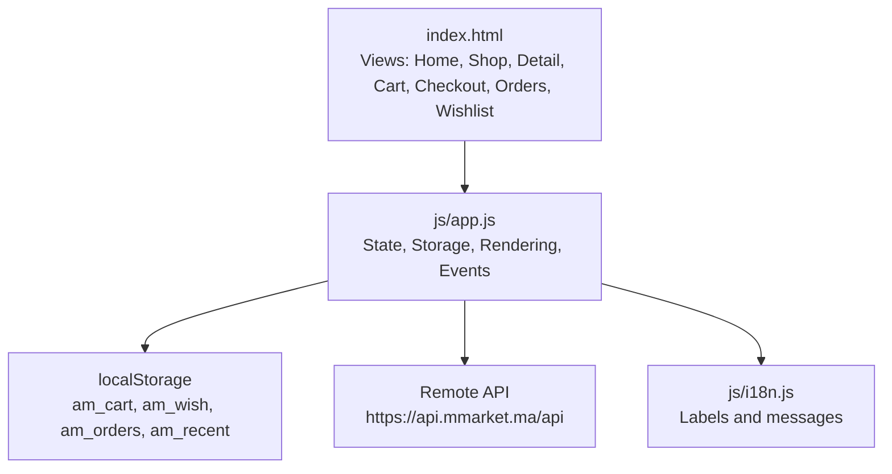
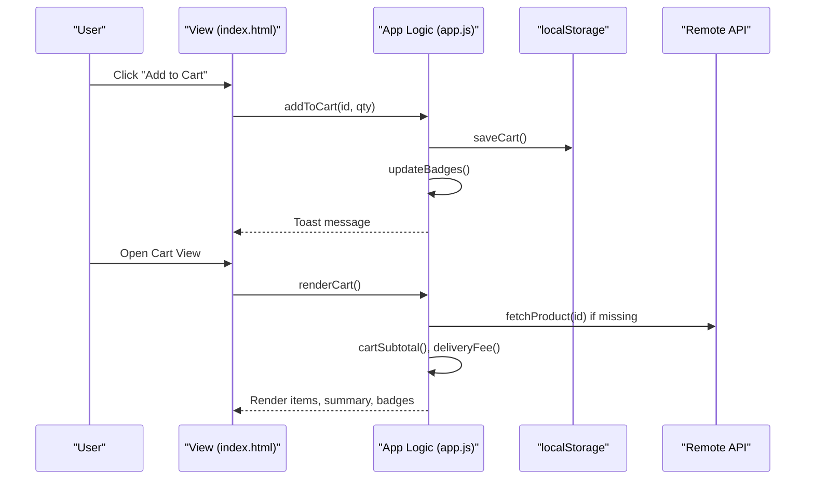

# Shopping Cart Management

<cite>
**Referenced Files in This Document**
- [app.js](file://js/app.js)
- [index.html](file://index.html)
- [i18n.js](file://js/i18n.js)
</cite>

## Table of Contents
1. [Introduction](#introduction)
2. [Project Structure](#project-structure)
3. [Core Components](#core-components)
4. [Architecture Overview](#architecture-overview)
5. [Detailed Component Analysis](#detailed-component-analysis)
6. [Dependency Analysis](#dependency-analysis)
7. [Performance Considerations](#performance-considerations)
8. [Troubleshooting Guide](#troubleshooting-guide)
9. [Conclusion](#conclusion)

## Introduction
This document explains the shopping cart management system implemented in the application. It covers adding items, updating quantities, removing products, calculating totals with delivery fee logic (free delivery over 200 DH), localStorage persistence, real-time UI updates, quantity controls, item validation against available products, and integration with checkout. It also addresses edge cases such as product removal from catalog, quantity limits, and cart synchronization across sessions.

## Project Structure
The cart functionality is primarily implemented in a single-page application:
- index.html defines the views including the cart and checkout sections, plus header badges for cart and wishlist counts.
- js/app.js implements all business logic: state, storage, API calls, rendering, and event handling.
- js/i18n.js provides internationalization used by labels and messages throughout the app.

**Diagram sources**
- [index.html:217-235](file://index.html#L217-L235)
- [index.html:237-276](file://index.html#L237-L276)
- [app.js:61-98](file://app.js#L61-L98)
- [app.js:116-142](file://app.js#L116-L142)
- [i18n.js:8-171](file://i18n.js#L8-L171)

**Section sources**
- [index.html:217-235](file://index.html#L217-L235)
- [index.html:237-276](file://index.html#L237-L276)
- [app.js:61-98](file://app.js#L61-L98)
- [app.js:116-142](file://app.js#L116-L142)
- [i18n.js:8-171](file://i18n.js#L8-L171)

## Core Components
- Cart state and persistence
  - In-memory arrays hold cart, wishlist, orders, and recent items; they are synchronized to localStorage keys am_cart, am_wish, am_orders, am_recent on changes.
  - Functions load and save these values safely with JSON parsing/stringifying and error fallbacks.
- Product data and caching
  - Products and categories are fetched from a remote API and cached in memory for fast lookups during rendering and calculations.
- UI rendering and events
  - Views are toggled via showView; each view has dedicated render functions that update DOM elements like cart items, order summary, and badges.
- Internationalization
  - All user-facing strings are provided through i18n.js and applied dynamically when language changes.

Key responsibilities:
- Add to cart, update quantity, remove item
- Calculate subtotal, delivery fee, and total
- Persist cart to localStorage and reflect changes in UI badges and views
- Validate items against available product data and handle missing products gracefully
- Integrate with checkout flow and order placement

**Section sources**
- [app.js:61-98](file://app.js#L61-L98)
- [app.js:116-142](file://app.js#L116-L142)
- [app.js:162-173](file://app.js#L162-L173)
- [app.js:700-738](file://app.js#L700-L738)
- [app.js:740-805](file://app.js#L740-L805)
- [i18n.js:8-171](file://i18n.js#L8-L171)

## Architecture Overview
The cart system follows a simple client-side architecture:
- State layer: in-memory arrays for cart, wishlist, orders, and recent items.
- Persistence layer: localStorage for cart, wishlist, orders, and recent items.
- Data layer: remote API for categories and products, with local caching.
- Presentation layer: HTML views bound to render functions that update DOM and badges.
- Event layer: delegated click handlers and input listeners drive state changes and re-renders.

**Diagram sources**
- [app.js:700-708](file://app.js#L700-L708)
- [app.js:740-798](file://app.js#L740-L798)
- [app.js:800-805](file://app.js#L800-L805)
- [app.js:162-173](file://app.js#L162-L173)
- [index.html:217-235](file://index.html#L217-L235)

## Detailed Component Analysis

### Cart State and Persistence
- State variables store cart entries as objects with id and qty.
- Persistence functions:
  - loadLS reads and parses localStorage into memory arrays with safe fallbacks.
  - saveCart serializes cart to localStorage and triggers badge updates.
  - saveWish and saveOrders persist wishlist and orders similarly.
- Recent items are tracked separately and persisted under a different key.

Complexity considerations:
- Adding/updating/removing items uses array find/filter operations which are O(n) relative to cart size. For typical cart sizes this is negligible.
- Badge updates compute totals via reduce over cart items, also O(n).

Edge cases handled:
- Malformed or missing localStorage values are caught and reset to empty arrays.
- When saving, errors are avoided by try/catch around JSON operations.

**Section sources**
- [app.js:61-98](file://app.js#L61-L98)
- [app.js:100-114](file://app.js#L100-L114)

### Adding Items to Cart
- addToCart accepts product id and optional quantity.
- If the item exists, its qty increases; otherwise a new entry is pushed.
- After modification, saveCart persists and shows a toast notification.

Validation:
- The function does not validate availability at add time; availability checks occur during detail view and checkout flows.

Quantity limits:
- No explicit upper limit is enforced when adding items; users can increase quantities via controls.

**Section sources**
- [app.js:700-708](file://app.js#L700-L708)

### Updating Quantities
- updateQty handles increment, decrement, and setting exact values.
- If qty becomes zero or less, the item is removed from the cart.
- After update, saveCart persists and renderCart refreshes the UI.

Controls:
- Min value is enforced at the UI level (min="1" on inputs).
- Decrement buttons ensure qty stays at least 1 before calling updateQty.

**Section sources**
- [app.js:710-719](file://app.js#L710-L719)
- [app.js:781-791](file://app.js#L781-L791)

### Removing Products
- removeCart filters out the specified id and persists changes.
- UI is refreshed immediately after removal and a toast confirms the action.

**Section sources**
- [app.js:721-726](file://app.js#L721-L726)

### Calculating Totals and Delivery Fee
- cartSubtotal sums price × qty for each item using cached or fetched product data.
- deliveryFee returns 0 if subtotal is greater than or equal to 200 DH or if subtotal is 0; otherwise returns 20 DH.
- updateSummary displays subtotal, delivery fee (or “Free”), and grand total.

Delivery logic:
- Free delivery threshold is 200 DH.
- Empty cart results in free delivery display.

**Section sources**
- [app.js:728-738](file://app.js#L728-L738)
- [app.js:800-805](file://app.js#L800-L805)

### Real-Time UI Updates and Badges
- updateBadges computes total cart items and wishlist length, then updates multiple badge elements in the header and mobile toolbar.
- Badge animations are triggered by toggling classes to highlight changes.

Scope:
- Both desktop and mobile badges are updated consistently.

**Section sources**
- [app.js:162-173](file://app.js#L162-L173)

### Quantity Controls Interface
- Detail view includes a quantity box with minus, input, and plus buttons.
- Cart view includes per-item quantity controls with minus, input, and plus buttons.
- Inputs enforce minimum values and trigger updateQty on change or button clicks.

Behavior:
- Plus increments qty; minus decrements but ensures minimum of 1.
- Direct input changes are validated and normalized to at least 1.

**Section sources**
- [app.js:627-662](file://app.js#L627-L662)
- [app.js:762-791](file://app.js#L762-L791)

### Cart Rendering System
- renderCart builds the list of items, ensuring product info is present by fetching missing details from the API.
- Each item row shows image, name, unit price, quantity controls, line total, and remove button.
- Summary panel shows subtotal, delivery fee, and total; checkout button is enabled only when cart is non-empty.

Item validation:
- If a product is missing from cache or products list, the code attempts to fetch it; if still missing, a placeholder object is used to avoid crashes.

Empty state:
- When cart is empty, a friendly message and “Continue Shopping” button are shown.

**Section sources**
- [app.js:740-798](file://app.js#L740-L798)

### Integration with Checkout
- renderCheckout validates that the cart is not empty; otherwise redirects to cart view.
- Ensures product prices are available by fetching missing items.
- Displays itemized list, subtotal, delivery fee, and total.
- placeOrder collects form fields, constructs order object with items, totals, and status, saves orders, clears cart, and navigates to orders view.

Validation:
- Required fields are checked; incomplete forms show a toast prompting completion.

**Section sources**
- [app.js:807-832](file://app.js#L807-L832)
- [app.js:834-872](file://app.js#L834-L872)

### Edge Cases and Robustness
- Product removed from catalog:
  - During cart and checkout rendering, missing products are fetched; if unavailable, placeholders are used to keep UI functional.
- Quantity limits:
  - Minimum quantity is enforced at the UI level; no maximum is set, allowing large quantities unless constrained by backend policies.
- Session synchronization:
  - Cart persists across page reloads via localStorage; badges and views reflect stored state on initialization.
- Language changes:
  - On language switch, current view is re-rendered to apply localized labels and messages.

**Section sources**
- [app.js:740-798](file://app.js#L740-L798)
- [app.js:807-832](file://app.js#L807-L832)
- [app.js:927-1045](file://app.js#L927-L1045)

## Dependency Analysis
The cart module depends on:
- index.html for DOM structure and event targets (cart items container, summary elements, badges).
- i18n.js for labels and messages used in UI and toasts.
- Remote API for product and category data, with local caching to minimize network calls.

Coupling and cohesion:
- High cohesion within app.js: cart logic, rendering, and persistence are centralized.
- Loose coupling via DOM selectors and i18n keys; changes to UI structure require corresponding selector updates.

Potential circular dependencies:
- None observed; app.js drives UI updates and does not import other modules beyond i18n utilities.

External integrations:
- Bootstrap components for toasts and layout.
- Font Awesome icons for UI affordances.

**Section sources**
- [index.html:217-235](file://index.html#L217-L235)
- [index.html:237-276](file://index.html#L237-L276)
- [app.js:116-142](file://app.js#L116-L142)
- [i18n.js:8-171](file://i18n.js#L8-L171)

## Performance Considerations
- Caching:
  - ProductCache stores fetched product details to avoid repeated API calls during cart and checkout rendering.
- Efficient updates:
  - Badge updates compute totals once and update multiple elements in a loop.
- Minimal DOM manipulation:
  - Rendering builds HTML strings and assigns innerHTML once per section to reduce reflows.
- Network optimization:
  - Only fetch missing product details when necessary; rely on cached data first.

Recommendations:
- Consider debouncing rapid quantity changes to reduce re-renders.
- Implement pagination-aware loading for large catalogs to improve initial render performance.

[No sources needed since this section provides general guidance]

## Troubleshooting Guide
Common issues and resolutions:
- Cart not updating after adding items:
  - Ensure saveCart is called and updateBadges runs; check browser console for JSON parse errors.
- Incorrect totals or delivery fee:
  - Verify product prices are loaded; missing products may result in zero prices until fetched.
- Checkout blocked:
  - Confirm required fields are filled; incomplete forms prevent order placement.
- Missing product in cart:
  - If a product was removed from the catalog, the system falls back to placeholder data; consider refreshing product cache or removing the item.

Debugging steps:
- Inspect localStorage keys am_cart, am_wish, am_orders to verify persistence.
- Check network requests to the API for failures or missing products.
- Use browser developer tools to inspect DOM elements referenced by selectors.

**Section sources**
- [app.js:61-98](file://app.js#L61-L98)
- [app.js:740-798](file://app.js#L740-L798)
- [app.js:834-872](file://app.js#L834-L872)

## Conclusion
The shopping cart management system provides a robust, client-side solution for managing items, quantities, and totals with persistent storage and real-time UI updates. It integrates seamlessly with the checkout process, enforces delivery fee rules, and handles edge cases gracefully. The modular design centralizes cart logic while leveraging localization and caching for a responsive user experience.

[No sources needed since this section summarizes without analyzing specific files]