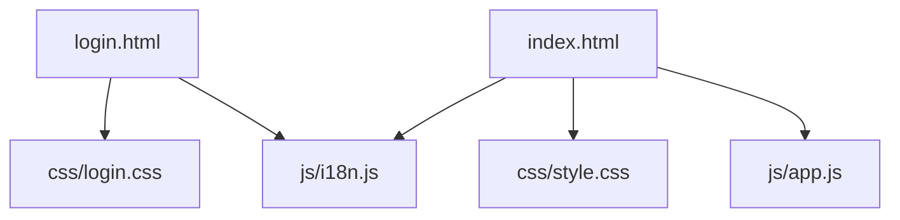
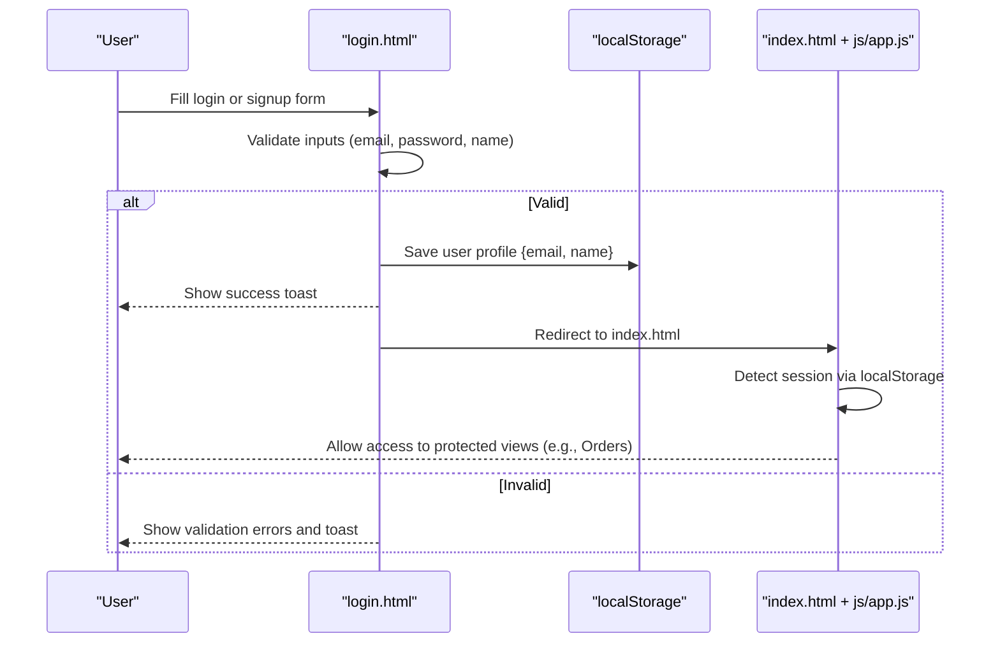
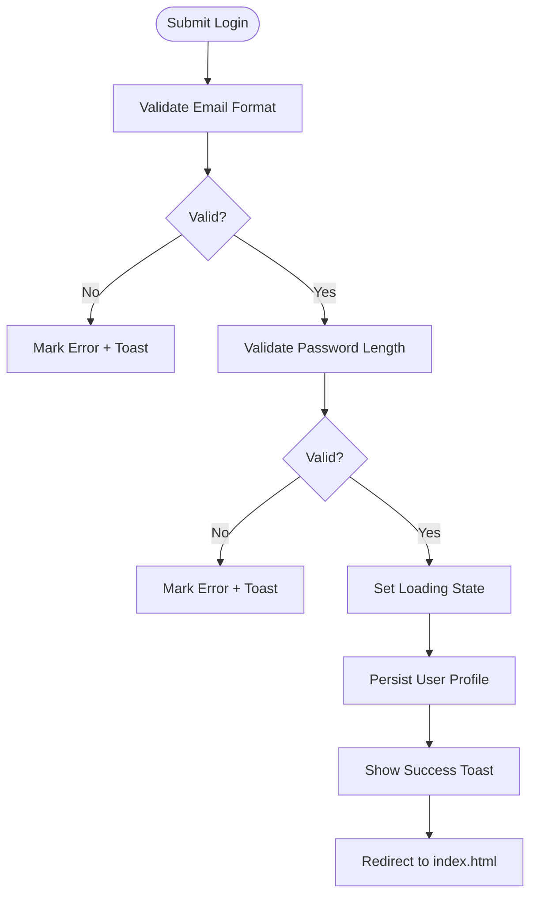
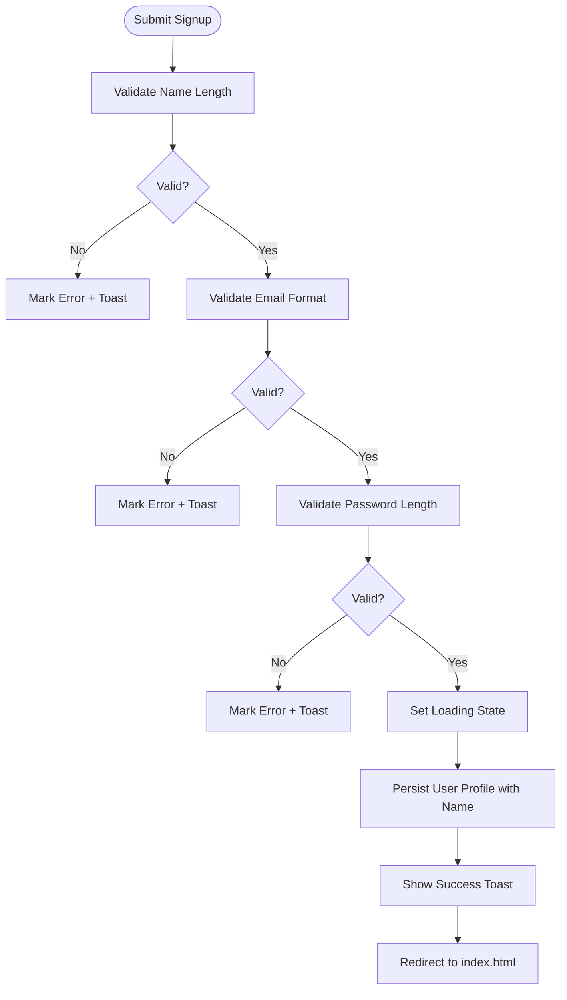
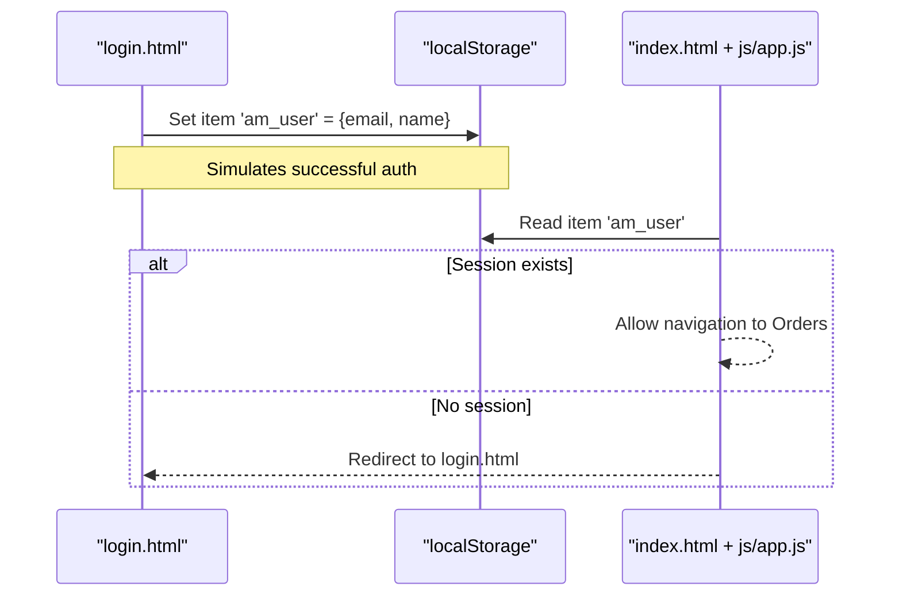
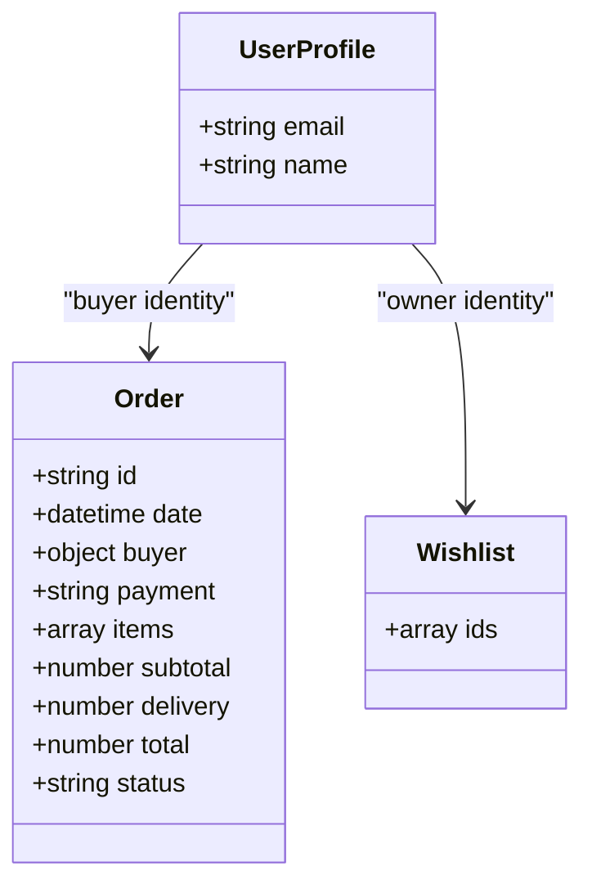
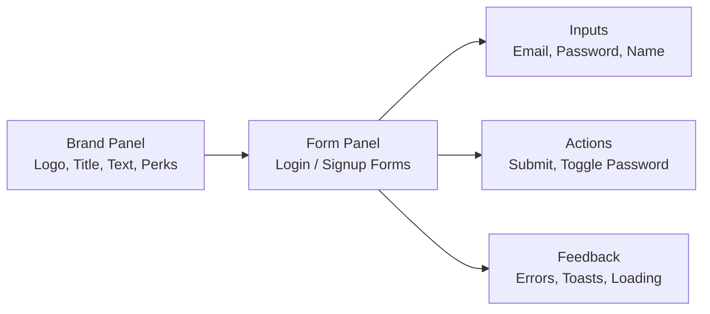
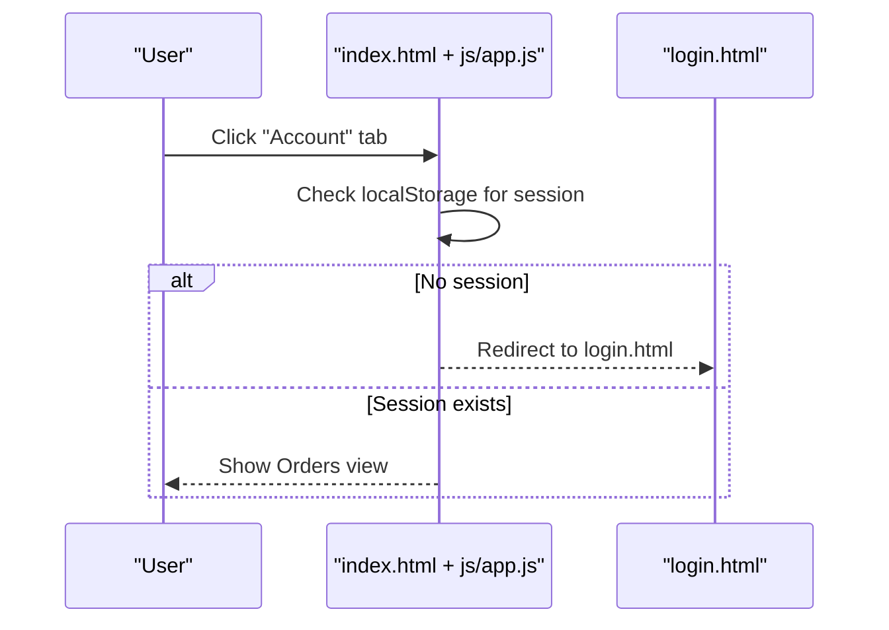
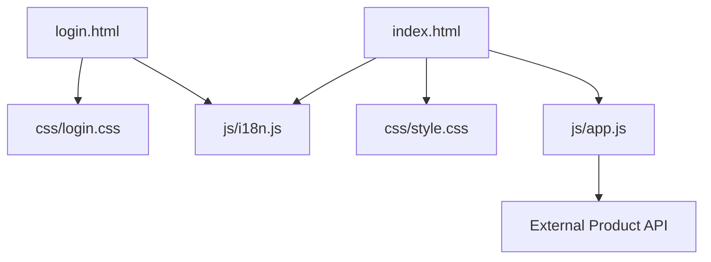

# User Authentication

<cite>
**Referenced Files in This Document**
- [login.html](file://login.html)
- [index.html](file://index.html)
- [js/app.js](file://js/app.js)
- [css/login.css](file://css/login.css)
- [css/style.css](file://css/style.css)
</cite>

## Table of Contents
1. Introduction
2. Project Structure
3. Core Components
4. Architecture Overview
5. Detailed Component Analysis
6. Dependency Analysis
7. Performance Considerations
8. Troubleshooting Guide
9. Conclusion

## Introduction
This document explains the user authentication system for the AM Market application, focusing on login and signup forms, validation, session persistence, and how authenticated users interact with orders and preferences. It covers the UI components, styling, integration points with the main app, security considerations, error states, and end-to-end user flows for new and returning users.

## Project Structure
The authentication feature spans two primary pages:
- Login/Signup page (login.html) with dedicated styles (css/login.css)
- Main store application (index.html) with global styles (css/style.css) and client-side logic (js/app.js)

**Diagram sources**
- [login.html:1-230](file://login.html#L1-L230)
- [index.html:1-414](file://index.html#L1-L414)
- [js/app.js:1-1048](file://js/app.js#L1-L1048)
- [css/login.css:1-384](file://css/login.css#L1-L384)
- [css/style.css:1-1271](file://css/style.css#L1-L1271)

**Section sources**
- [login.html:1-230](file://login.html#L1-L230)
- [index.html:1-414](file://index.html#L1-L414)
- [js/app.js:1-1048](file://js/app.js#L1-L1048)
- [css/login.css:1-384](file://css/login.css#L1-L384)
- [css/style.css:1-1271](file://css/style.css#L1-L1271)

## Core Components
- Login form: email and password fields, remember me, forgot password link, social sign-in placeholder, validation feedback, loading state, success flow
- Signup form: name, email, password fields, validation feedback, loading state, success flow
- Session persistence: stores a minimal user profile in localStorage to represent an authenticated session
- Navigation integration: main app checks for an existing session and routes accordingly; unauthenticated users are redirected to login when accessing account-related areas

Key behaviors:
- Client-side validation ensures correct email format and minimum password length
- On successful login/signup, a user object is persisted in localStorage and the user is redirected to the main store
- The main app’s mobile “Account” tab redirects to login if no session exists; otherwise it shows orders

**Section sources**
- [login.html:45-97](file://login.html#L45-L97)
- [login.html:190-218](file://login.html#L190-L218)
- [login.html:182-188](file://login.html#L182-L188)
- [index.html:42-53](file://index.html#L42-L53)
- [js/app.js:939-953](file://js/app.js#L939-L953)

## Architecture Overview
Authentication is implemented as a client-side flow using HTML forms, inline scripts, and localStorage for session persistence. There is no server-side authentication endpoint in this repository; validation and success handling occur in the browser.

**Diagram sources**
- [login.html:190-218](file://login.html#L190-L218)
- [login.html:182-188](file://login.html#L182-L188)
- [js/app.js:939-953](file://js/app.js#L939-L953)

## Detailed Component Analysis

### Login Form
- Fields: email, password
- Validation: email format check; password minimum length
- UX: show/hide password toggle; remember me checkbox; forgot password link (placeholder); social sign-in button (placeholder)
- Feedback: inline error highlighting with shake animation; toast messages; loading spinner on submit
- Success: persists user profile in localStorage and redirects to the main store

**Diagram sources**
- [login.html:190-202](file://login.html#L190-L202)
- [login.html:162-180](file://login.html#L162-L180)
- [login.html:182-188](file://login.html#L182-L188)

**Section sources**
- [login.html:45-72](file://login.html#L45-L72)
- [login.html:190-202](file://login.html#L190-L202)
- [login.html:162-180](file://login.html#L162-L180)
- [login.html:182-188](file://login.html#L182-L188)

### Signup Form
- Fields: full name, email, password
- Validation: name length, email format, password minimum length
- UX: show/hide password toggle; clear error state while typing
- Feedback: inline error highlighting; toast messages; loading spinner
- Success: persists user profile including name and redirects to main store

**Diagram sources**
- [login.html:204-218](file://login.html#L204-L218)
- [login.html:162-180](file://login.html#L162-L180)
- [login.html:182-188](file://login.html#L182-L188)

**Section sources**
- [login.html:74-97](file://login.html#L74-L97)
- [login.html:204-218](file://login.html#L204-L218)
- [login.html:162-180](file://login.html#L162-L180)
- [login.html:182-188](file://login.html#L182-L188)

### Session Management and Persistence
- Session storage: a lightweight user profile object containing email and name is stored in localStorage under a specific key
- Access control: the main app checks for the presence of this key before allowing access to account-related features (e.g., Orders)
- Unauthenticated behavior: clicking “Account” without a session redirects to login.html

**Diagram sources**
- [login.html:182-188](file://login.html#L182-L188)
- [js/app.js:939-953](file://js/app.js#L939-L953)

**Section sources**
- [login.html:182-188](file://login.html#L182-L188)
- [js/app.js:939-953](file://js/app.js#L939-L953)

### User Profile Handling and Relationship to Orders/Preferences
- Profile data: email and name are stored upon successful login/signup
- Orders: placed orders are stored in localStorage and can be viewed after authentication; order records include buyer details, items, totals, and status
- Wishlist: wishlist items are stored in localStorage and accessible after authentication
- Integration: the main app uses these local stores to render personalized content (orders, wishlist) once a session is detected

**Diagram sources**
- [login.html:182-188](file://login.html#L182-L188)
- [js/app.js:834-895](file://js/app.js#L834-L895)
- [js/app.js:897-924](file://js/app.js#L897-L924)

**Section sources**
- [login.html:182-188](file://login.html#L182-L188)
- [js/app.js:834-895](file://js/app.js#L834-L895)
- [js/app.js:897-924](file://js/app.js#L897-L924)

### UI Components and Styling
- Layout: split card with brand panel and form panel; responsive design collapses to single column on small screens
- Inputs: custom input groups with icons, focus states, and error states with shake animation
- Buttons: gradient submit buttons with hover effects; disabled state during loading
- Brand panel: animated bubbles, logo card, perks list; dynamic text updates when switching between login and signup
- Accessibility: labels and placeholders are internationalized; keyboard-friendly interactions

**Diagram sources**
- [login.html:21-99](file://login.html#L21-L99)
- [css/login.css:72-384](file://css/login.css#L72-L384)

**Section sources**
- [login.html:21-99](file://login.html#L21-L99)
- [css/login.css:72-384](file://css/login.css#L72-L384)

### Integration with Main Application
- Header navigation includes “My Account” dropdown with links to login, orders, wishlist, and cart
- Mobile bottom toolbar: “Account” tab enforces authentication by redirecting to login if no session exists
- After authentication, users can access orders and wishlist views within the main app

**Diagram sources**
- [index.html:42-53](file://index.html#L42-L53)
- [js/app.js:939-953](file://js/app.js#L939-L953)

**Section sources**
- [index.html:42-53](file://index.html#L42-L53)
- [js/app.js:939-953](file://js/app.js#L939-L953)

## Dependency Analysis
- login.html depends on:
  - css/login.css for layout and animations
  - Bootstrap and Font Awesome via CDN for UI components and icons
  - js/i18n.js for internationalization
- index.html depends on:
  - css/style.css for global styles
  - js/app.js for routing, product rendering, cart/wishlist/orders management, and session checks
  - js/i18n.js for internationalization
- Shared patterns:
  - Both pages use Bootstrap toasts for feedback
  - Both pages support language toggling via i18n events

**Diagram sources**
- [login.html:1-230](file://login.html#L1-L230)
- [index.html:1-414](file://index.html#L1-L414)
- [js/app.js:1-1048](file://js/app.js#L1-L1048)

**Section sources**
- [login.html:1-230](file://login.html#L1-L230)
- [index.html:1-414](file://index.html#L1-L414)
- [js/app.js:1-1048](file://js/app.js#L1-L1048)

## Performance Considerations
- Client-side validation reduces unnecessary network calls and provides immediate feedback
- LocalStorage usage avoids server round-trips for session and simple user data
- Avoid storing sensitive data (like passwords) in localStorage; current implementation stores only non-sensitive profile info
- Keep session payload minimal to reduce storage overhead

[No sources needed since this section provides general guidance]

## Troubleshooting Guide
Common issues and resolutions:
- Validation errors not clearing: ensure input event listeners remove error classes when users type
- Toast not showing: verify Bootstrap JS is loaded and toast container exists
- Redirect not working: confirm localStorage key presence and that main app checks for session correctly
- Internationalization not updating: ensure i18n event listeners are active and elements have appropriate data attributes

**Section sources**
- [login.html:220-223](file://login.html#L220-L223)
- [login.html:116-119](file://login.html#L116-L119)
- [js/app.js:939-953](file://js/app.js#L939-L953)

## Conclusion
The authentication system provides a streamlined, client-side experience for logging in and signing up, with robust validation, clear feedback, and persistent sessions via localStorage. Authenticated users gain access to personalized features such as orders and wishlist within the main application. For production readiness, consider adding server-side authentication, secure password handling, CSRF protection, and more granular authorization controls.

[No sources needed since this section summarizes without analyzing specific files]