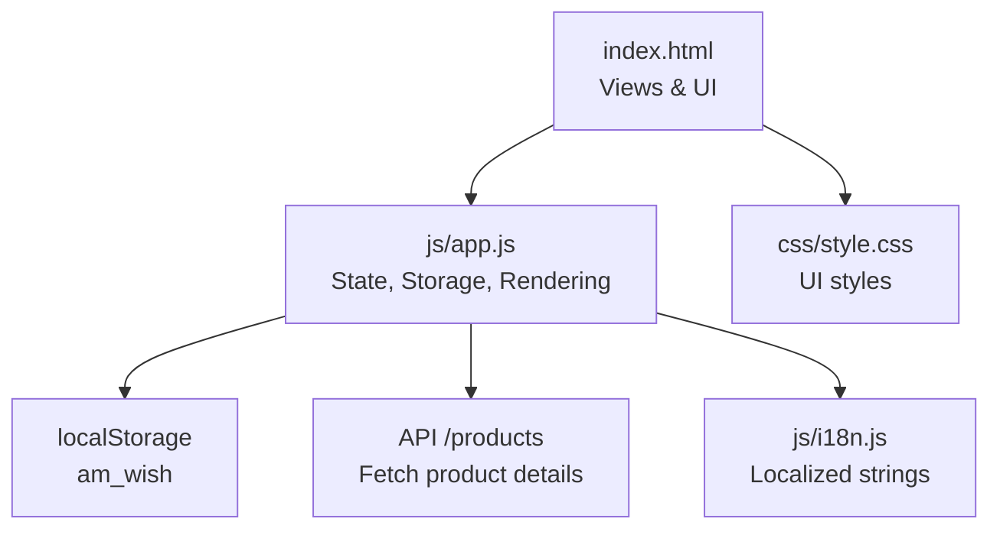
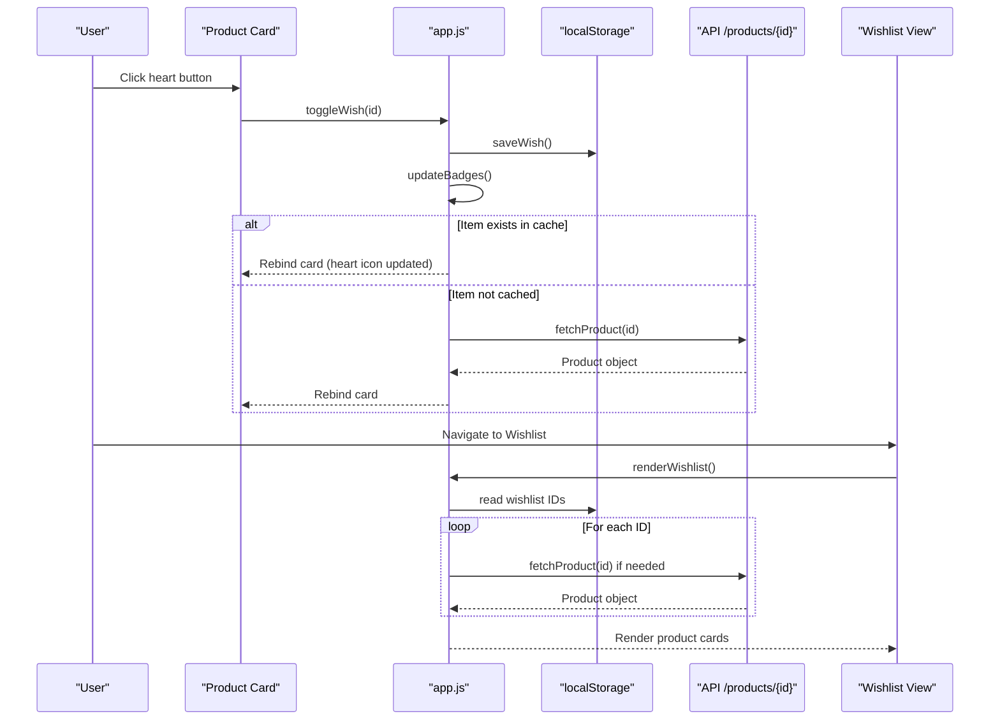
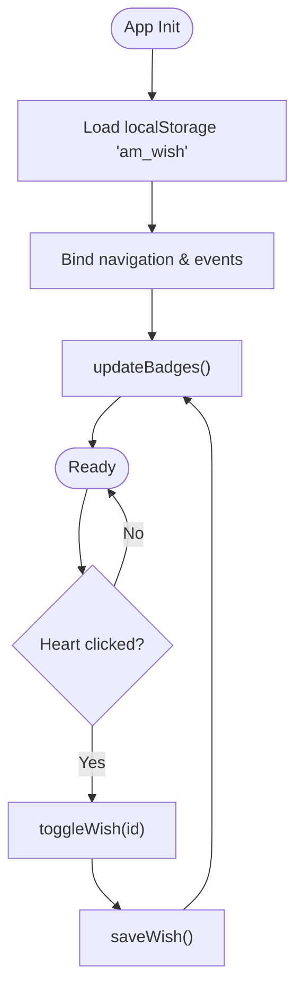
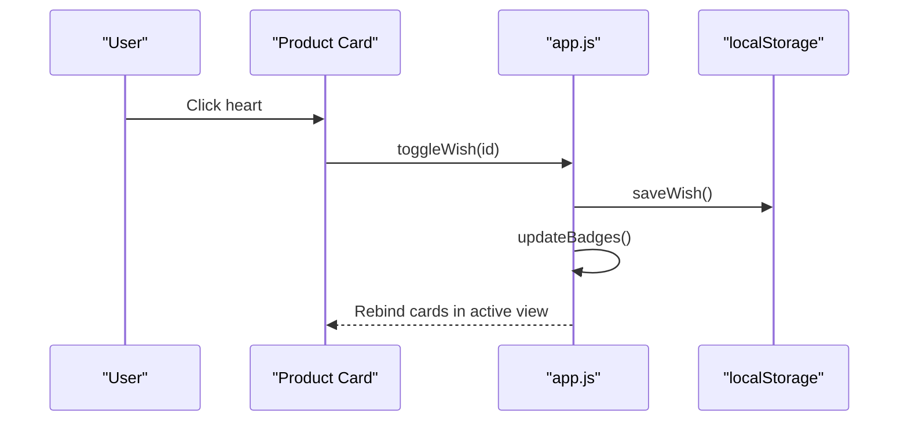
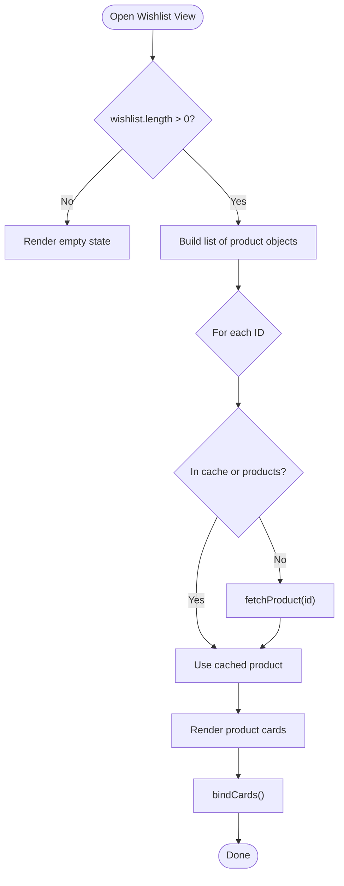
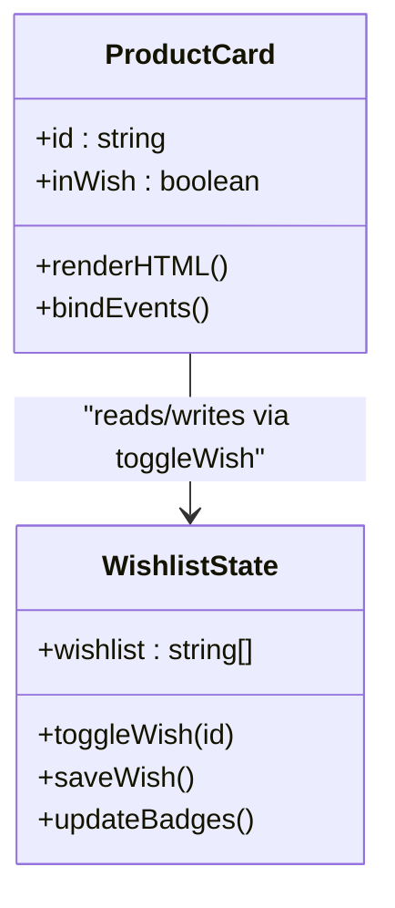
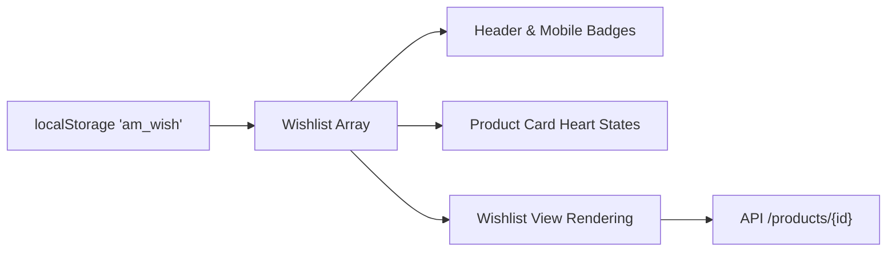

# Wishlist Functionality

<cite>
**Referenced Files in This Document**
- [app.js](file://js/app.js)
- [index.html](file://index.html)
- [style.css](file://css/style.css)
- [i18n.js](file://js/i18n.js)
</cite>

## Table of Contents
1. [Introduction](#introduction)
2. [Project Structure](#project-structure)
3. [Core Components](#core-components)
4. [Architecture Overview](#architecture-overview)
5. [Detailed Component Analysis](#detailed-component-analysis)
6. [Dependency Analysis](#dependency-analysis)
7. [Performance Considerations](#performance-considerations)
8. [Troubleshooting Guide](#troubleshooting-guide)
9. [Conclusion](#conclusion)

## Introduction
This document explains the wishlist feature end-to-end: how users add and remove products, how data persists across sessions using localStorage, and how the UI updates everywhere (product cards, header badge, mobile toolbar, and dedicated wishlist view). It also covers integration with product availability, handling removed or missing products, and seamless switching between shop and wishlist views.

## Project Structure
The wishlist is implemented as part of a single-page application with multiple views. The HTML defines the DOM structure for each view, including the wishlist view container. The JavaScript manages state, persistence, API calls, and rendering. CSS styles define the visual appearance of interactive elements like heart buttons and badges.

**Diagram sources**
- [index.html:284-288](file://index.html#L284-L288)
- [app.js:61-98](file://app.js#L61-L98)
- [app.js:897-924](file://app.js#L897-L924)
- [i18n.js:115-121](file://i18n.js#L115-L121)
- [style.css:147-164](file://style.css#L147-L164)

**Section sources**
- [index.html:284-288](file://index.html#L284-L288)
- [app.js:61-98](file://app.js#L61-L98)
- [style.css:147-164](file://style.css#L147-L164)

## Core Components
- Wishlist state and storage:
  - In-memory array holds wishlist item IDs.
  - Persisted under a dedicated key in localStorage to survive page reloads and browser restarts.
  - Saving triggers badge updates across header and mobile toolbar.
- UI interactions:
  - Heart button on product cards toggles wishlist membership.
  - Detail view includes a wishlist toggle that refreshes the view after change.
  - Dedicated wishlist view renders product cards for saved items and handles empty states.
- Cross-view synchronization:
  - Badge counts update immediately on any wishlist change.
  - Re-rendering occurs in current view context so UI stays consistent.

**Section sources**
- [app.js:61-98](file://app.js#L61-L98)
- [app.js:162-173](file://app.js#L162-L173)
- [app.js:205-263](file://app.js#L205-L263)
- [app.js:585-669](file://app.js#L585-L669)
- [app.js:897-924](file://app.js#L897-L924)

## Architecture Overview
The wishlist feature integrates with the broader SPA architecture:

**Diagram sources**
- [app.js:205-263](file://app.js#L205-L263)
- [app.js:897-924](file://app.js#L897-L924)
- [app.js:135-142](file://app.js#L135-L142)
- [app.js:162-173](file://app.js#L162-L173)

## Detailed Component Analysis

### State Management and Persistence
- Wishlist state:
  - An array stores stringified product IDs.
  - On load, it reads from localStorage; on changes, it writes back and updates UI badges.
- Badges:
  - Header wishlist badge and mobile toolbar badge both reflect the current wishlist length.
  - A small animation class is applied when values change to draw attention.

**Diagram sources**
- [app.js:61-98](file://app.js#L61-L98)
- [app.js:162-173](file://app.js#L162-L173)
- [app.js:897-904](file://app.js#L897-L904)

**Section sources**
- [app.js:61-98](file://app.js#L61-L98)
- [app.js:162-173](file://app.js#L162-L173)
- [app.js:897-904](file://app.js#L897-L904)

### Adding and Removing Products
- From product cards:
  - Each card contains a heart button bound to toggle the item’s presence in the wishlist.
  - After toggling, the current view re-renders its product grid to reflect the new state.
- From detail view:
  - The detail page has a dedicated wishlist toggle button that updates state and refreshes the detail view to show the correct icon and label.

**Diagram sources**
- [app.js:205-263](file://app.js#L205-L263)
- [app.js:897-904](file://app.js#L897-L904)
- [app.js:162-173](file://app.js#L162-L173)

**Section sources**
- [app.js:205-263](file://app.js#L205-L263)
- [app.js:585-669](file://app.js#L585-L669)
- [app.js:897-904](file://app.js#L897-L904)

### Wishlist View Rendering
- Empty state:
  - When no items are saved, the view shows an empty illustration and a call-to-action to browse products.
- Populated state:
  - For each saved ID, the app ensures product details exist (cache or API fetch), then renders standard product cards.
  - Cards are rebound so heart buttons remain functional and consistent with current state.

**Diagram sources**
- [app.js:906-924](file://app.js#L906-L924)
- [app.js:135-142](file://app.js#L135-L142)
- [app.js:205-263](file://app.js#L205-L263)

**Section sources**
- [app.js:906-924](file://app.js#L906-L924)

### Integration with Product Cards
- Heart button state:
  - The card checks whether the product ID is currently in the wishlist to set the active class and icon style.
- Event binding:
  - Click handlers prevent default navigation and trigger toggle logic.
  - After toggling, the active view’s product grid is refreshed to keep UI consistent.

**Diagram sources**
- [app.js:205-263](file://app.js#L205-L263)
- [app.js:897-904](file://app.js#L897-L904)
- [app.js:162-173](file://app.js#L162-L173)

**Section sources**
- [app.js:205-263](file://app.js#L205-L263)

### Badge Updates
- Header and mobile toolbar badges display the current number of wishlist items.
- Any change to the wishlist triggers immediate badge updates with a subtle animation to highlight the change.

**Section sources**
- [index.html:34-37](file://index.html#L34-L37)
- [index.html:392-396](file://index.html#L392-L396)
- [app.js:162-173](file://app.js#L162-L173)

### Relationship with Product Availability
- Wishlist items are stored as IDs only; availability is not persisted.
- When rendering the wishlist view, the app fetches full product details, which include availability status.
- If a product becomes unavailable, the wishlist still lists it; availability is shown per product in the wishlist view.

**Section sources**
- [app.js:906-924](file://app.js#L906-L924)
- [app.js:135-142](file://app.js#L135-L142)

### Handling Removed or Missing Products
- If a product ID remains in the wishlist but cannot be fetched (e.g., deleted from catalog), the render loop skips it gracefully.
- The wishlist view will either show fewer items or fall back to an “no items” message if all fail.

**Section sources**
- [app.js:906-924](file://app.js#L906-L924)

### Seamless Switching Between Views
- Navigation is handled by a central function that toggles view visibility and triggers appropriate render functions.
- The wishlist view is one of the supported destinations, accessible from header, dropdown menu, and mobile toolbar.

**Section sources**
- [index.html:34-37](file://index.html#L34-L37)
- [index.html:46-51](file://index.html#L46-L51)
- [index.html:392-396](file://index.html#L392-L396)
- [app.js:176-194](file://app.js#L176-L194)

## Dependency Analysis
- LocalStorage keys:
  - Wishlist uses a dedicated key to persist IDs across sessions.
- UI dependencies:
  - Header and mobile toolbar badges depend on the wishlist count.
  - Product cards depend on the current wishlist state to render the correct heart icon.
- API dependencies:
  - Wishlist view relies on fetching product details for each saved ID to render accurate information.

**Diagram sources**
- [app.js:61-98](file://app.js#L61-L98)
- [app.js:162-173](file://app.js#L162-L173)
- [app.js:906-924](file://app.js#L906-L924)
- [app.js:135-142](file://app.js#L135-L142)

**Section sources**
- [app.js:61-98](file://app.js#L61-L98)
- [app.js:162-173](file://app.js#L162-L173)
- [app.js:906-924](file://app.js#L906-L924)

## Performance Considerations
- Caching:
  - Product details are cached to avoid repeated API calls during wishlist rendering.
- Efficient re-renders:
  - Only the active view’s product grids are refreshed after toggling, minimizing unnecessary work.
- Lazy loading:
  - Images use lazy loading attributes to improve initial load performance.

[No sources needed since this section provides general guidance]

## Troubleshooting Guide
- Wishlist appears empty after reload:
  - Ensure localStorage is enabled and not cleared by the browser or extensions.
  - Verify that the initialization loads the wishlist from localStorage before rendering.
- Heart icons not updating:
  - Confirm that event bindings are attached to dynamically rendered cards.
  - Check that the active view re-renders after toggling.
- Wishlist view shows missing items:
  - If a product was removed from the catalog, the render loop skips it; this is expected behavior.
- Badge not updating:
  - Ensure save operations call the badge update function and that DOM elements exist.

**Section sources**
- [app.js:61-98](file://app.js#L61-L98)
- [app.js:162-173](file://app.js#L162-L173)
- [app.js:205-263](file://app.js#L205-L263)
- [app.js:906-924](file://app.js#L906-L924)

## Conclusion
The wishlist feature provides a smooth, persistent experience across sessions using localStorage. Users can add or remove items from product cards and the detail view, with immediate feedback through heart icon states and badge updates. The dedicated wishlist view renders saved items efficiently, handles missing or unavailable products gracefully, and integrates seamlessly with the rest of the application’s navigation and UI.