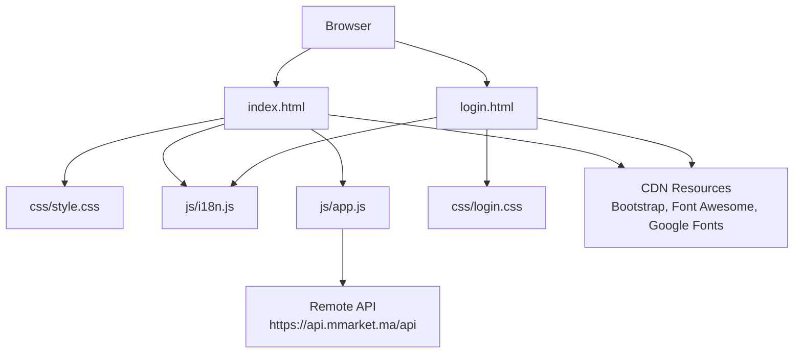
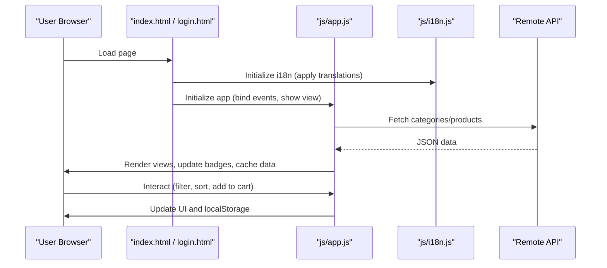
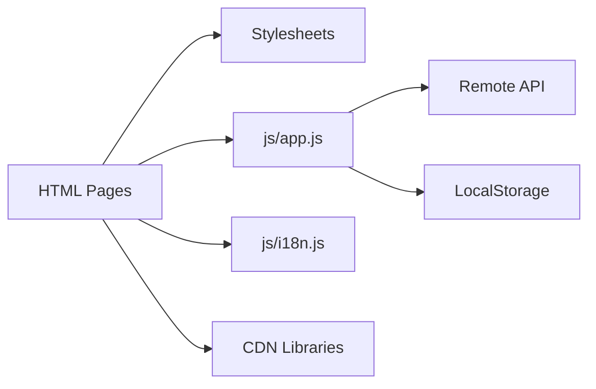

# Deployment and Distribution

<cite>
**Referenced Files in This Document**
- [index.html](file://index.html)
- [login.html](file://login.html)
- [style.css](file://css/style.css)
- [login.css](file://css/login.css)
- [app.js](file://js/app.js)
- [i18n.js](file://js/i18n.js)
</cite>

## Table of Contents
1. [Introduction](#introduction)
2. [Project Structure](#project-structure)
3. [Core Components](#core-components)
4. [Architecture Overview](#architecture-overview)
5. [Detailed Component Analysis](#detailed-component-analysis)
6. [Dependency Analysis](#dependency-analysis)
7. [Performance Considerations](#performance-considerations)
8. [Troubleshooting Guide](#troubleshooting-guide)
9. [Conclusion](#conclusion)

## Introduction
AM MARKET is a client-side static website with two HTML entry points: the main store page and a login/sign-up page. It uses Bootstrap, Font Awesome, and Google Fonts loaded from CDNs, and fetches live product data from a remote API. There is no build step; deployment consists of serving these static files over HTTPS with appropriate caching and security headers.

This document explains how to deploy AM MARKET on GitHub Pages, Netlify, Vercel, and traditional web hosting, how to configure CDN usage for external dependencies, and how to optimize for production performance, security, and maintainability.

## Project Structure
The site is organized as a flat set of static assets:
- Two HTML pages: index.html (store), login.html (authentication UI)
- CSS stylesheets: css/style.css, css/login.css
- Client scripts: js/app.js (store logic and API calls), js/i18n.js (internationalization)
- Images under img/

**Diagram sources**
- [index.html:7-10](file://index.html#L7-L10)
- [index.html:409-411](file://index.html#L409-L411)
- [login.html:7-11](file://login.html#L7-L11)
- [login.html:111-113](file://login.html#L111-L113)
- [app.js:7](file://js/app.js#L7)

**Section sources**
- [index.html:1-12](file://index.html#L1-L12)
- [login.html:1-12](file://login.html#L1-L12)
- [style.css:1-24](file://css/style.css#L1-L24)
- [login.css:1-26](file://css/login.css#L1-L26)
- [app.js:1-10](file://js/app.js#L1-L10)
- [i18n.js:1-6](file://js/i18n.js#L1-L6)

## Core Components
- Static pages: index.html and login.html define the user interface and load external resources via CDN links.
- Styles: css/style.css and css/login.css provide responsive design and animations.
- Logic: js/app.js handles navigation, filtering, pagination, cart/wishlist/orders state (stored in localStorage), and fetching categories/products from the remote API.
- Internationalization: js/i18n.js provides EN/FR translations and persists language preference in localStorage.

Key responsibilities:
- Data loading: app.js fetches categories and products from https://api.mmarket.ma/api.
- State persistence: cart, wishlist, orders, recent items, and language are stored in localStorage.
- UI rendering: views are toggled by adding/removing active classes; content is injected into DOM nodes.

**Section sources**
- [app.js:61-85](file://js/app.js#L61-L85)
- [app.js:117-142](file://js/app.js#L117-L142)
- [i18n.js:376-417](file://js/i18n.js#L376-L417)

## Architecture Overview
AM MARKET is a single-page application built on static HTML/CSS/JS. The runtime architecture is:

**Diagram sources**
- [index.html:409-411](file://index.html#L409-L411)
- [login.html:111-113](file://login.html#L111-L113)
- [app.js:117-142](file://js/app.js#L117-L142)
- [i18n.js:388-417](file://js/i18n.js#L388-L417)

## Detailed Component Analysis

### Build Process
There is no build step. To deploy:
- Ensure all relative paths in HTML/CSS/JS are correct.
- Verify that images exist under img/.
- Confirm that CDN URLs for Bootstrap, Font Awesome, and Google Fonts are reachable from your target region.

No configuration files (e.g., package.json, webpack.config) were found in this repository.

**Section sources**
- [index.html:7-10](file://index.html#L7-L10)
- [login.html:7-11](file://login.html#L7-L11)

### External Dependencies and CDN Configuration
External libraries are loaded from public CDNs:
- Bootstrap CSS and JS
- Font Awesome icons
- Google Fonts (Inter)

Recommendations:
- Pin versions to ensure stability.
- Use integrity hashes where supported to prevent tampering.
- Prefer subresource integrity (SRI) for critical libraries.
- Consider using a private or regional CDN mirror if you need stricter control or lower latency.

**Section sources**
- [index.html:7-10](file://index.html#L7-L10)
- [index.html:409-411](file://index.html#L409-L411)
- [login.html:7-11](file://login.html#L7-L11)
- [login.html:111-113](file://login.html#L111-L113)

### Production Optimization Considerations
- Enable HTTP/2 and serve over HTTPS.
- Configure long-term caching for immutable assets (CSS, JS, images) with cache-busting filenames when possible.
- Set Content-Security-Policy to restrict external resource loading to known CDNs.
- Compress responses (gzip/brotli) on the server.
- Minimize layout shifts by ensuring fonts and images load predictably.
- Defer non-critical scripts and use async/defer attributes where applicable.

[No sources needed since this section provides general guidance]

### Custom Domains and SSL
All listed platforms support custom domains and automatic HTTPS:
- GitHub Pages: Connect a domain in repository settings; enable Enforce HTTPS.
- Netlify: Add a custom domain in Site settings; DNS records will be provided; HTTPS is automatic.
- Vercel: Add a domain in project Settings > Domains; verify DNS; HTTPS is automatic.
- Traditional hosting: Point DNS to your host; install an SSL certificate (e.g., Let’s Encrypt) and enforce HTTPS redirects.

[No sources needed since this section provides general guidance]

### Performance Monitoring
- Use browser DevTools Network and Performance panels to measure TTFB, Largest Contentful Paint, and cumulative layout shift.
- Integrate a lightweight monitoring service (e.g., Web Vitals reporting) to track real-user metrics.
- Monitor CDN availability and error rates for third-party resources.

[No sources needed since this section provides general guidance]

### Browser Compatibility
- Modern browsers that support ES modules, fetch, and CSS variables are expected.
- Ensure graceful degradation for older browsers by testing key flows (navigation, search, filters, cart).
- Validate that polyfills are not required given current usage patterns.

[No sources needed since this section provides general guidance]

### Caching Strategies for Static Assets
- Cache CSS/JS/images with long-lived cache headers (e.g., one year) plus immutable flags.
- Use versioned filenames or query strings for cache busting when updating assets.
- For CDN-hosted libraries, rely on their own caching policies; pin versions to avoid unexpected changes.

[No sources needed since this section provides general guidance]

### Maintenance Procedures
- Periodically review and update pinned CDN versions for Bootstrap, Font Awesome, and Google Fonts.
- Test updates in a staging environment before deploying to production.
- Keep the remote API endpoint stable; monitor for deprecations or rate limits.
- Maintain image assets and ensure alt text remains accurate.

**Section sources**
- [index.html:7-10](file://index.html#L7-L10)
- [login.html:7-11](file://login.html#L7-L11)
- [app.js:7](file://js/app.js#L7)

## Dependency Analysis
AM MARKET depends on:
- Bootstrap and Font Awesome via CDN for UI components and icons.
- Google Fonts for typography.
- Remote API at https://api.mmarket.ma/api for categories and products.
- LocalStorage for client-side state (cart, wishlist, orders, recent items, language).

**Diagram sources**
- [index.html:7-10](file://index.html#L7-L10)
- [index.html:409-411](file://index.html#L409-L411)
- [login.html:7-11](file://login.html#L7-L11)
- [login.html:111-113](file://login.html#L111-L113)
- [app.js:7](file://js/app.js#L7)
- [app.js:61-85](file://js/app.js#L61-L85)

**Section sources**
- [app.js:61-85](file://js/app.js#L61-L85)
- [app.js:117-142](file://js/app.js#L117-L142)
- [i18n.js:376-417](file://js/i18n.js#L376-L417)

## Performance Considerations
- Prefer loading critical CSS early and deferring non-critical scripts.
- Use lazy-loading for images where appropriate.
- Avoid blocking the main thread with heavy computations; keep event handlers efficient.
- Monitor network waterfall to identify slow third-party resources.

[No sources needed since this section provides general guidance]

## Troubleshooting Guide
Common issues and resolutions:

- CDN resources fail to load
  - Symptom: Missing icons, broken layout, console errors about blocked requests.
  - Action: Check internet connectivity, firewall rules, and ad blockers. Verify CDN URLs and consider switching to alternative mirrors or self-hosting critical assets.

- Remote API unreachable
  - Symptom: “Failed to load products” messages; empty listings.
  - Action: Verify network access to https://api.mmarket.ma/api; check CORS policies; implement retry logic and user-friendly error states.

- Language not applied
  - Symptom: Text remains in default language after toggle.
  - Action: Ensure i18n initialization runs on DOMContentLoaded and that language toggle listeners are attached.

- Cart/wishlist counts not updating
  - Symptom: Badges do not reflect changes.
  - Action: Confirm localStorage writes succeed and badge update functions are called after state changes.

- Images not displaying
  - Symptom: Placeholder images appear instead of product images.
  - Action: Verify image URLs returned by the API; handle onerror fallbacks; ensure img/ assets exist for logos and favicons.

**Section sources**
- [index.html:409-411](file://index.html#L409-L411)
- [login.html:111-113](file://login.html#L111-L113)
- [app.js:117-142](file://js/app.js#L117-L142)
- [i18n.js:388-417](file://js/i18n.js#L388-L417)

## Conclusion
AM MARKET is a straightforward static site that can be deployed anywhere that serves static files. Focus on reliable CDN usage, strong caching, HTTPS enforcement, and clear error handling for the remote API. With minimal configuration, you can publish on GitHub Pages, Netlify, Vercel, or any traditional web host while maintaining good performance and a smooth user experience.