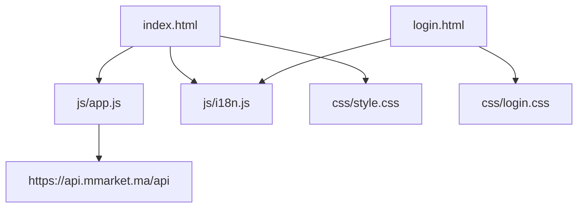
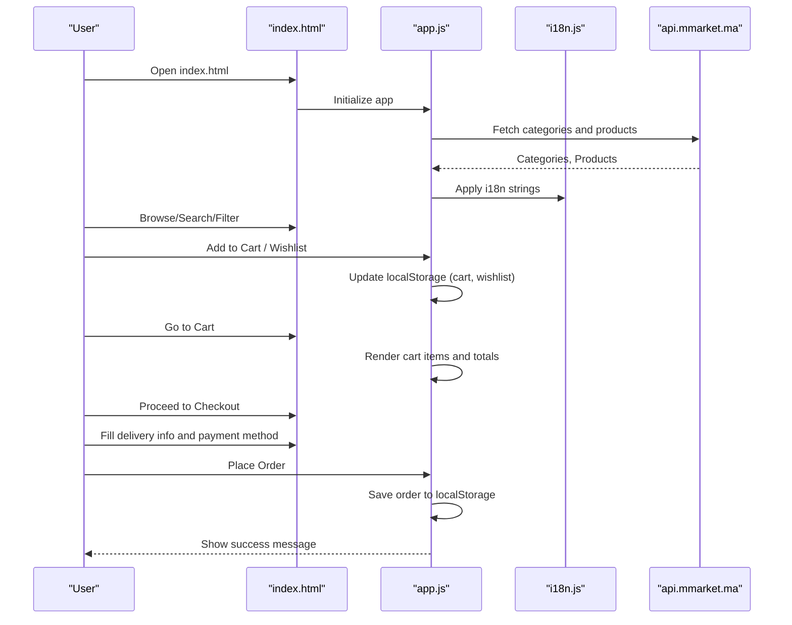

# Getting Started

<cite>
**Referenced Files in This Document**
- [index.html](file://index.html)
- [login.html](file://login.html)
- [app.js](file://js/app.js)
- [i18n.js](file://js/i18n.js)
- [style.css](file://css/style.css)
- [login.css](file://css/login.css)
</cite>

## Table of Contents
1. Introduction
2. Project Structure
3. Prerequisites
4. Browser Compatibility
5. Installation and Setup
6. First-Time Usage Guide
7. Basic Shopping Workflow
8. Troubleshooting
9. Development Environment Notes
10. Conclusion

## Introduction
AM MARKET is a client-side shopping experience that loads product data from a live API, manages your cart, wishlist, and orders locally, and supports English and French languages. You can run it directly in your browser without installing any server software.

## Project Structure
The project is organized into simple folders for HTML pages, JavaScript logic, CSS styles, and images:
- index.html: Main store interface with views for Home, Shop, Product Detail, Cart, Checkout, Orders, and Wishlist
- login.html: Sign In / Create Account page with local validation and user session stored in the browser
- js/app.js: Core application logic (API calls, views, cart/wishlist/orders, filters, pagination)
- js/i18n.js: Internationalization (English/French) and language switching
- css/style.css: Store styling
- css/login.css: Login page styling
- img/: Images (logo, icons)

**Diagram sources**
- [index.html:1-414](file://index.html#L1-L414)
- [login.html:1-230](file://login.html#L1-L230)
- [app.js:1-120](file://js/app.js#L1-L120)
- [i18n.js:1-40](file://js/i18n.js#L1-L40)
- [style.css:1-40](file://css/style.css#L1-L40)
- [login.css:1-40](file://css/login.css#L1-L40)

**Section sources**
- [index.html:1-414](file://index.html#L1-L414)
- [login.html:1-230](file://login.html#L1-L230)
- [app.js:1-120](file://js/app.js#L1-L120)
- [i18n.js:1-40](file://js/i18n.js#L1-L40)
- [style.css:1-40](file://css/style.css#L1-L40)
- [login.css:1-40](file://css/login.css#L1-L40)

## Prerequisites
- Basic knowledge of HTML, CSS, and JavaScript to understand how the app works
- Understanding of RESTful APIs helps when exploring the product catalog and categories
- A modern web browser with internet access (the app fetches data from an external API)

## Browser Compatibility
- Modern browsers: Chrome, Edge, Firefox, Safari (latest versions recommended)
- Features used include Fetch API, localStorage, CSS Grid/Flexbox, and Bootstrap components
- Ensure cookies/local storage are enabled so your cart, wishlist, orders, and language preference persist

## Installation and Setup
You do not need to install anything. Follow these steps:
1. Open the folder containing the project files on your computer
2. Double-click index.html to open it in your default browser
3. If you prefer a different browser, right-click index.html and choose Open with > your preferred browser
4. Keep your device connected to the internet so the app can load product data from the API

Optional: Use a simple local file server if you encounter restrictions when opening files directly (for example, some browsers restrict certain features when using the file:// protocol). Any static file server will work; this step is optional because the app primarily uses fetch() and localStorage.

## First-Time Usage Guide
- Open index.html in your browser
- Explore the header: search bar, language toggle (EN/FR), Wishlist, Cart, and My Account dropdown
- Click “Shop Now” or browse categories to start shopping
- To sign in or create an account, click “Login / Sign In” in the My Account dropdown or go to login.html
- On login.html:
  - Enter a valid email and password (at least 6 characters) to sign in
  - Or create an account by providing name, email, and password
  - The app validates inputs and shows feedback via toast messages
  - After successful sign-in or sign-up, you are redirected back to the store

Language switching:
- Click the globe icon to switch between English and French
- Your language choice is saved in the browser

## Basic Shopping Workflow
Here is the typical flow from browsing to checkout:

**Diagram sources**
- [index.html:15-290](file://index.html#L15-L290)
- [app.js:116-142](file://js/app.js#L116-L142)
- [app.js:175-194](file://js/app.js#L175-L194)
- [app.js:700-798](file://js/app.js#L700-L798)
- [i18n.js:376-418](file://js/i18n.js#L376-L418)

Key interactions:
- Search: Type in the header search box and press the search button
- Filters: In the Shop view, use category, price range, availability, promotion, and brand filters
- Sorting: Choose Default, Price Low to High, Price High to Low, or Name A–Z
- Pagination: Navigate through multiple pages of products
- Product detail: Click a product image or title to see details, quantity selector, add to cart, buy now, and wishlist toggle
- Cart: Adjust quantities, remove items, view subtotal, delivery fee, and total
- Checkout: Provide delivery information and select payment method, then place the order
- Orders: View your placed orders in the Orders view
- Wishlist: Add/remove items and manage favorites

## Troubleshooting
Common issues and solutions:
- Blank page or no products loading
  - Check your internet connection; the app fetches data from the API
  - Look for error messages like “Failed to load products” or “Could not load data from API”
  - Try refreshing the page
- Language not changing
  - Ensure the language toggle button is clicked
  - Confirm localStorage is enabled in your browser settings
- Cart/Wishlist/Orders reset after closing the browser
  - Make sure localStorage is allowed for the site
  - Clearing browser data may remove stored preferences
- Images not showing
  - Some product images may be unavailable; the app falls back to placeholder images
- Login form errors
  - Email must be valid; password must be at least 6 characters
  - The form provides visual feedback and toast messages for errors
- Mobile bottom toolbar not highlighting correctly
  - The active tab updates based on current view; navigate using the top navigation or mobile tabs

If you still face issues:
- Disable browser extensions that might block scripts or network requests
- Try a different browser
- Check the browser console for errors (F12)

**Section sources**
- [app.js:150-154](file://js/app.js#L150-L154)
- [app.js:302-314](file://js/app.js#L302-L314)
- [app.js:545-583](file://js/app.js#L545-L583)
- [login.html:162-218](file://login.html#L162-L218)
- [i18n.js:376-418](file://js/i18n.js#L376-L418)

## Development Environment Notes
- No build tools required; the app runs directly in the browser
- External dependencies loaded via CDN:
  - Bootstrap 5 for layout and components
  - Font Awesome for icons
  - Google Fonts for typography
- Local storage keys used by the app:
  - Cart: am_cart
  - Wishlist: am_wish
  - Orders: am_orders
  - Recently viewed: am_recent
  - Language: am_lang
- API endpoints used:
  - Categories: GET /categories/
  - Products: GET /products/?include_descendants=true&page=...&page_size=12&category=...&search=...
  - Product detail: GET /products/{id}/
- CORS: The app relies on the API allowing cross-origin requests from your browser

[No sources needed since this section provides general guidance]

## Conclusion
You can start using AM MARKET immediately by opening index.html in your browser. Explore the store, search for products, add items to your cart or wishlist, and complete a checkout flow. All personal data (cart, wishlist, orders, language) is stored locally in your browser. For development, no installation is required—just edit the HTML, CSS, and JS files and refresh your browser.

[No sources needed since this section summarizes without analyzing specific files]