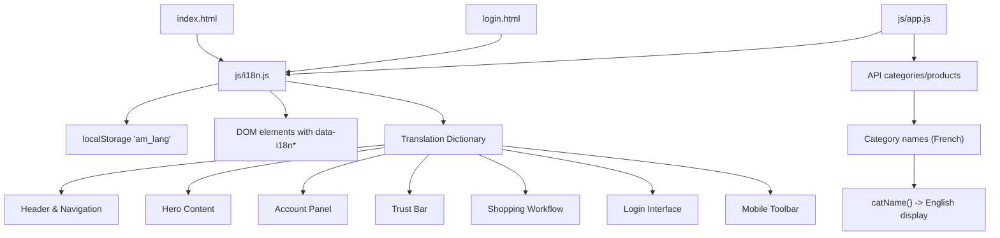
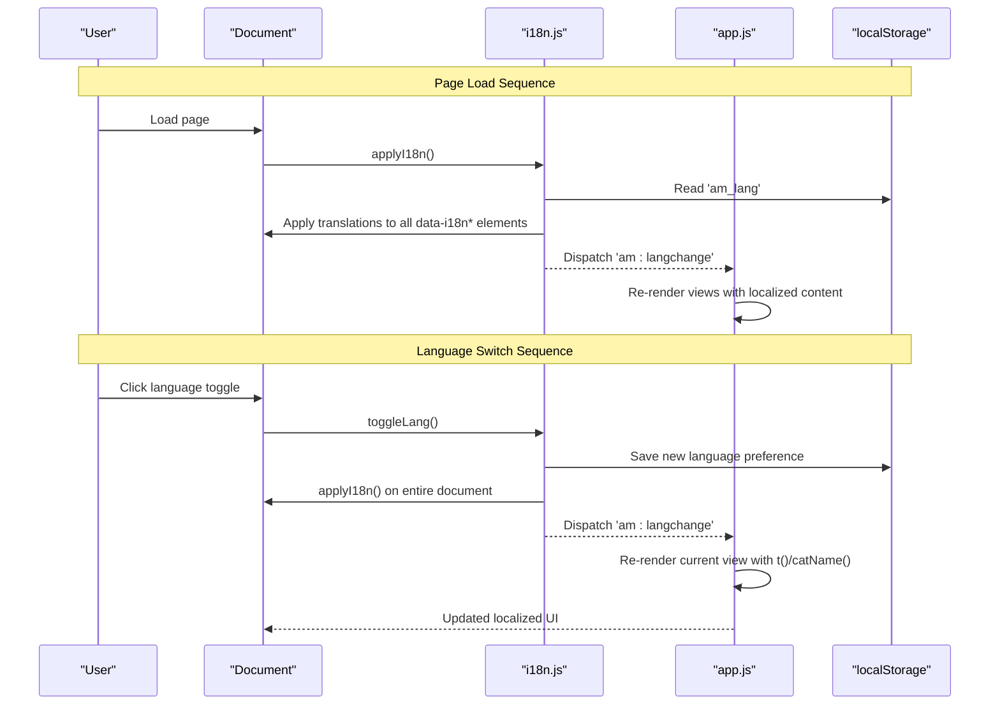
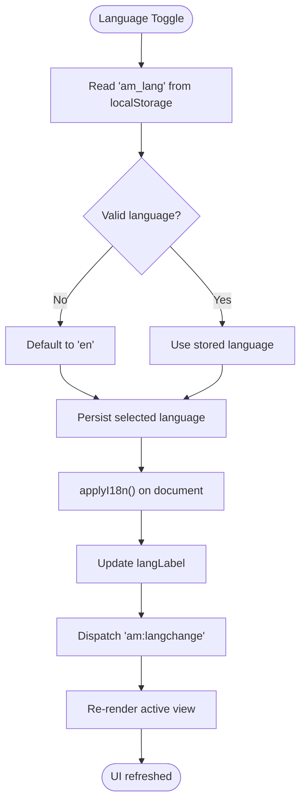
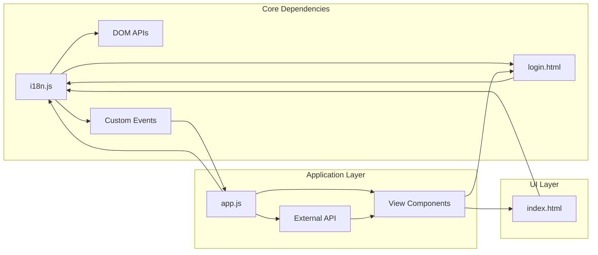

# Internationalization System

<cite>
**Referenced Files in This Document**
- [i18n.js](file://js/i18n.js)
- [app.js](file://js/app.js)
- [index.html](file://index.html)
- [login.html](file://login.html)
</cite>

## Update Summary
**Changes Made**
- Updated translation dictionary section to reflect significantly expanded coverage of headers, navigation, hero content, account panel, trust bar, and various UI interactions
- Enhanced examples of translation key usage across different UI components
- Added comprehensive coverage of new translation keys for login page, checkout process, and mobile interface
- Updated category name mapping system documentation with additional French-to-English mappings
- Expanded troubleshooting guide with new common issues related to expanded UI coverage

## Table of Contents
1. [Introduction](#introduction)
2. [Project Structure](#project-structure)
3. [Core Components](#core-components)
4. [Architecture Overview](#architecture-overview)
5. [Detailed Component Analysis](#detailed-component-analysis)
6. [Dependency Analysis](#dependency-analysis)
7. [Performance Considerations](#performance-considerations)
8. [Troubleshooting Guide](#troubleshooting-guide)
9. [Conclusion](#conclusion)
10. [Appendices](#appendices)

## Introduction
This document explains the comprehensive internationalization (i18n) system used by AM MARKET to support English and French languages. The system provides complete localization coverage across all application features including:
- Header and navigation elements with search functionality
- Hero carousel content with promotional messaging
- Account panel with user management features
- Trust bar displaying service guarantees
- Complete shopping workflow from browsing to checkout
- Login and registration interfaces
- Mobile-responsive bottom toolbar
- Dynamic product categories and filtering systems
- Cart management and order processing
- Wishlist functionality and recent items tracking

The i18n system ensures consistent user experience across both languages while maintaining flexibility for future language additions.

## Project Structure
The i18n system spans a focused set of files with clear separation of concerns:
- js/i18n.js: Core i18n engine containing comprehensive translation dictionaries, utilities, and DOM application logic
- js/app.js: Application logic that integrates i18n functions throughout all views and user interactions
- index.html: Main storefront markup with extensive data-i18n attributes covering all UI components
- login.html: Authentication page with complete translation support for login/signup flows

**Diagram sources**
- [i18n.js:8-379](file://js/i18n.js#L8-L379)
- [app.js:1140-1155](file://js/app.js#L1140-L1155)
- [index.html:15-477](file://index.html#L15-L477)
- [login.html:15-230](file://login.html#L15-L230)

**Section sources**
- [i18n.js:1-462](file://js/i18n.js#L1-L462)
- [app.js:1-1158](file://js/app.js#L1-L1158)
- [index.html:1-477](file://index.html#L1-L477)
- [login.html:1-230](file://login.html#L1-L230)

## Core Components
The internationalization system consists of several integrated components working together to provide seamless language switching:

### Translation Dictionary
- Comprehensive bilingual dictionary with 150+ translation keys covering all UI elements
- Organized by functional areas: header, navigation, hero content, account panel, trust bar, shopping workflow, and authentication
- Support for dynamic placeholders using `{variable}` syntax for personalized content
- HTML-safe rendering for specific keys through whitelisting mechanism

### Language Management
- Persistent language preference stored in localStorage under 'am_lang' key
- Automatic language detection with English as default fallback
- Real-time language switching without page reload
- Visual language indicator showing current locale (EN/FR)

### DOM Integration
- Declarative translation via data attributes: `data-i18n`, `data-i18n-html`, `data-i18n-ph`, `data-i18n-title`
- Automatic scanning and application of translations on page load
- Event-driven updates when language changes
- Safe HTML rendering only for developer-controlled content

### Category Localization
- Dynamic mapping of French API category names to English display names
- Context-aware localization based on current language setting
- Fallback handling for unmapped categories
- Consistent category presentation across all views

**Section sources**
- [i18n.js:8-379](file://js/i18n.js#L8-L379)
- [i18n.js:382-462](file://js/i18n.js#L382-L462)
- [app.js:1140-1155](file://js/app.js#L1140-L1155)

## Architecture Overview
The i18n architecture follows a lightweight, event-driven pattern optimized for performance and maintainability:

**Diagram sources**
- [i18n.js:454-462](file://js/i18n.js#L454-L462)
- [app.js:1140-1155](file://js/app.js#L1140-L1155)

The architecture ensures:
- **Declarative static content**: HTML elements use data attributes for simple text replacement
- **Dynamic content handling**: JavaScript functions provide runtime localization for generated content
- **Event-driven updates**: Centralized language change events trigger appropriate re-renders
- **Graceful degradation**: Missing translations fall back to English or original keys

## Detailed Component Analysis

### Comprehensive Translation Dictionary
The translation dictionary has been significantly expanded to cover all aspects of the marketplace:

#### Header and Navigation
- Search functionality with placeholder text and button labels
- User account menu with profile, orders, wishlist, and cart access
- Language switching controls with visual indicators
- Notification system with order status messages

#### Hero Content Carousel
- Four promotional slides with titles and descriptions
- Call-to-action buttons for shopping engagement
- Dynamic slide navigation with accessibility labels

#### Account Panel and User Management
- Guest vs. authenticated user states
- Profile management and settings access
- Order history and wishlist integration
- Logout functionality with confirmation feedback

#### Trust and Service Guarantees
- Delivery speed and coverage information
- Price competitiveness messaging
- Return policy and customer support details
- Payment security assurances

#### Shopping Workflow
- Product browsing and filtering interfaces
- Category navigation with icon support
- Search suggestions and error handling
- Cart management with quantity controls
- Checkout process with form validation
- Order confirmation and status tracking

#### Authentication Interface
- Login and registration forms with validation
- Social authentication options
- Password visibility toggles
- Success and error messaging

**Section sources**
- [i18n.js:8-379](file://js/i18n.js#L8-L379)
- [index.html:15-477](file://index.html#L15-L477)
- [login.html:15-230](file://login.html#L15-L230)

### Advanced Language Switching Mechanism
The language switching system provides seamless transitions between English and French:

**Diagram sources**
- [i18n.js:454-462](file://js/i18n.js#L454-L462)

Key features include:
- **Persistent preferences**: Language choice saved across browser sessions
- **Instant switching**: No page reload required for language changes
- **Contextual updates**: Only active views are re-rendered for performance
- **Visual feedback**: Language indicator updates immediately

### DOM Translation Application System
The system supports multiple types of content localization through specialized data attributes:

#### Static Text Elements
- `data-i18n`: Direct text content replacement for simple strings
- Used extensively for headings, labels, buttons, and descriptive text

#### Safe HTML Rendering
- `data-i18n-html`: Controlled HTML content for trusted, developer-managed markup
- Whitelisted keys prevent XSS attacks while allowing rich formatting
- Currently supports hero titles and footer copyright information

#### Interactive Element Labels
- `data-i18n-ph`: Placeholder text for input fields
- `data-i18n-title`: Tooltip text for interactive elements
- Ensures consistent user guidance across all languages

#### Accessibility Features
- Automatic `lang` attribute updates on document root
- Screen reader compatibility through proper semantic structure
- Keyboard navigation support maintained during language switches

**Section sources**
- [i18n.js:432-446](file://js/i18n.js#L432-L446)
- [index.html:23-477](file://index.html#L23-L477)

### Enhanced Category Name Translation System
The category localization system handles dynamic API responses with intelligent mapping:

**Diagram sources**
- [i18n.js:414-418](file://js/i18n.js#L414-L418)

The system includes:
- **Comprehensive mapping**: 24+ French-to-English category conversions
- **Case-insensitive matching**: Handles variations in API response formats
- **Graceful fallbacks**: Displays original names when mappings are missing
- **Icon integration**: Category icons work seamlessly with translated names

### Dynamic Content Localization Patterns
The application uses sophisticated patterns for runtime content generation:

#### Template-Based Localization
- String interpolation with `{variable}` placeholders
- Context-aware message formatting for user-specific content
- Error and loading state management with localized feedback

#### Conditional Content Display
- User authentication state affects available options
- Product availability influences displayed actions
- Cart and wishlist contents drive interface changes

#### Performance Optimization
- Efficient DOM scanning with querySelectorAll optimizations
- Selective re-rendering of affected components only
- Caching mechanisms for frequently accessed translations

**Section sources**
- [i18n.js:425-430](file://js/i18n.js#L425-L430)
- [app.js:191-244](file://js/app.js#L191-L244)
- [app.js:1140-1155](file://js/app.js#L1140-L1155)

### Mobile-First Responsive Design
The internationalization system fully supports mobile interfaces:

#### Bottom Navigation Toolbar
- Tab labels translate dynamically with view changes
- Icon tooltips provide contextual help in local language
- Touch-friendly interaction patterns maintained across languages

#### Adaptive Content Layout
- Responsive grid systems preserve translation integrity
- Flexible typography scales appropriately for different languages
- Touch targets remain accessible regardless of text length

**Section sources**
- [index.html:435-466](file://index.html#L435-L466)

### Persistence and State Management
Language preferences are managed through robust storage mechanisms:

#### Local Storage Integration
- Persistent language selection across browser sessions
- Automatic restoration of user preferences on page load
- Cross-page consistency within the same browser context

#### Session Management
- Temporary state preservation during single browsing sessions
- Graceful handling of storage failures or restrictions
- Fallback mechanisms ensure functionality even with storage disabled

**Section sources**
- [i18n.js:420-423](file://js/i18n.js#L420-L423)
- [i18n.js:448-452](file://js/i18n.js#L448-L452)

## Dependency Analysis
The internationalization system maintains clean dependencies while supporting complex application requirements:

**Diagram sources**
- [i18n.js:458-462](file://js/i18n.js#L458-L462)
- [app.js:1114-1125](file://js/app.js#L1114-L1125)
- [index.html:472-474](file://index.html#L472-L474)

Key dependency relationships:
- **i18n.js** depends on browser APIs for persistence and DOM manipulation
- **app.js** consumes i18n functions throughout all business logic
- **HTML files** provide declarative translation hooks via data attributes
- **Event system** enables loose coupling between components

**Section sources**
- [i18n.js:458-462](file://js/i18n.js#L458-L462)
- [app.js:1114-1125](file://js/app.js#L1114-L1125)

## Performance Considerations
The internationalization system is optimized for performance across different device capabilities:

### Efficient DOM Operations
- **Selective Scanning**: Uses targeted selectors rather than full document traversal
- **Batch Updates**: Groups DOM modifications to minimize reflows and repaints
- **Lazy Loading**: Delays translation application until after critical rendering

### Memory Management
- **Translation Caching**: Frequently accessed strings cached in memory
- **Event Listener Cleanup**: Proper removal of temporary event handlers
- **Resource Optimization**: Minimal overhead for unused translation keys

### Mobile Optimization
- **Reduced Processing**: Lightweight operations suitable for mobile processors
- **Network Efficiency**: No additional HTTP requests for translation loading
- **Battery Conscious**: Efficient algorithms minimize CPU usage

### Scalability Planning
- **Modular Design**: Easy addition of new languages without affecting existing code
- **Configuration-Driven**: Translation keys organized for easy maintenance
- **Testing Ready**: Clear separation enables comprehensive unit testing

## Troubleshooting Guide
Common issues and their solutions for the expanded internationalization system:

### Translation Issues
- **Missing Keys**: Symptom shows raw key names instead of translated text
  - Resolution: Add missing keys to both language dictionaries in i18n.js
  - Prevention: Use consistent key naming conventions across all components
  
- **HTML Not Rendering**: Markup appears as escaped text
  - Resolution: Ensure key exists in I18N_HTML_KEYS whitelist for safe HTML rendering
  - Security: Never allow user-generated content in HTML-enabled keys
  
- **Category Names Incorrect**: French names appear in English interface
  - Resolution: Add or correct entries in CAT_EN mapping table
  - Maintenance: Regularly sync category mappings with API changes

### Language Persistence Problems
- **Language Resets**: Preference not saving between sessions
  - Resolution: Verify localStorage permissions and browser storage settings
  - Debugging: Check browser console for storage-related errors
  
- **Inconsistent State**: Different pages show different languages
  - Resolution: Ensure all pages load i18n.js before app.js
  - Testing: Test language switching across all application views

### Performance Issues
- **Slow Language Switching**: Noticeable delay when changing languages
  - Resolution: Optimize DOM queries and reduce unnecessary re-renders
  - Monitoring: Use browser dev tools to identify performance bottlenecks
  
- **Memory Leaks**: Increasing memory usage over time
  - Resolution: Check for improperly removed event listeners
  - Profiling: Use memory profiling tools to identify leaks

### Mobile-Specific Issues
- **Touch Interaction Problems**: Buttons not responding after language switch
  - Resolution: Rebind event listeners after DOM updates
  - Testing: Test on actual mobile devices, not just desktop emulation
  
- **Layout Breakdown**: Translated text causing layout issues
  - Resolution: Use responsive design patterns and flexible layouts
  - Validation: Test with longest possible translations for each language

**Section sources**
- [i18n.js:382-462](file://js/i18n.js#L382-L462)
- [app.js:1140-1155](file://js/app.js#L1140-L1155)

## Conclusion
AM MARKET's comprehensive internationalization system provides robust bilingual support across all application features. The system successfully addresses the complexity of modern web applications while maintaining simplicity and performance:

### Key Achievements
- **Complete Coverage**: All UI elements support both English and French
- **Seamless Experience**: Instant language switching without page reloads
- **Developer Friendly**: Clean API with extensive documentation
- **Future Ready**: Extensible architecture for additional languages

### Technical Excellence
- **Security First**: Safe HTML rendering with strict whitelisting
- **Performance Optimized**: Efficient DOM operations and memory management
- **Mobile Responsive**: Full support for responsive design patterns
- **Accessibility Compliant**: Proper semantic structure and keyboard navigation

### Business Impact
- **Global Reach**: Supports Moroccan market with local language preferences
- **User Satisfaction**: Intuitive interface in preferred language
- **Maintainability**: Clear separation of concerns simplifies updates
- **Scalability**: Foundation ready for additional language support

Following the best practices outlined in this documentation will ensure continued success in maintaining and expanding the internationalization system as the application grows.

## Appendices

### Adding a New Language
Steps to extend the system with additional languages:

1. **Dictionary Expansion**: Add new language object alongside existing en/fr dictionaries
2. **Key Coverage**: Provide translations for all 150+ existing keys
3. **HTML Whitelist**: Update I18N_HTML_KEYS if new HTML-enabled content is needed
4. **Category Mapping**: Extend CAT_EN mapping if category localization is required
5. **Validation Logic**: Update getLang() function to recognize new language code
6. **Testing**: Verify all UI components render correctly in new language

**Section sources**
- [i18n.js:8-379](file://js/i18n.js#L8-L379)
- [i18n.js:420-423](file://js/i18n.js#L420-L423)

### Extending the Translation Dictionary
Best practices for maintaining translation quality:

#### Organization Strategy
- Group related keys by feature area (header, navigation, etc.)
- Use descriptive, stable key names that won't change frequently
- Maintain alphabetical ordering within logical groups

#### Content Guidelines
- Keep translations concise but culturally appropriate
- Use placeholders for dynamic values instead of string concatenation
- Avoid embedding user or network data in HTML-enabled keys
- Test translations with real content to ensure proper formatting

#### Quality Assurance
- Regular audits for missing or outdated translations
- Consistency checks across similar UI elements
- Native speaker review for cultural appropriateness
- Automated testing for translation completeness

**Section sources**
- [i18n.js:8-379](file://js/i18n.js#L8-L379)
- [i18n.js:382-383](file://js/i18n.js#L382-L383)

### Handling Dynamic Content Localization
Patterns for effective runtime localization:

#### Template Strings
- Use `{variable}` placeholders for dynamic content insertion
- Escape user input before interpolation to prevent XSS
- Format numbers and dates according to locale preferences

#### Conditional Logic
- Handle singular/plural forms appropriately
- Manage null or undefined values gracefully
- Provide fallbacks for missing dynamic content

#### Performance Optimization
- Cache frequently used translations in memory
- Batch DOM updates to minimize reflows
- Use efficient selectors for large DOM trees

**Section sources**
- [i18n.js:425-430](file://js/i18n.js#L425-L430)
- [app.js:191-244](file://js/app.js#L191-L244)

### Maintaining Translation Consistency and Best Practices
Recommendations for long-term translation quality:

#### Governance
- Establish translation approval workflows
- Create style guides for consistent terminology
- Implement automated translation completeness checks
- Schedule regular translation audits

#### Development Practices
- Use consistent key naming conventions
- Document translation requirements in code comments
- Include translation considerations in code reviews
- Test internationalization during development, not just deployment

#### User Experience
- Ensure adequate space for longer translations
- Test with right-to-left languages for future expansion
- Validate accessibility with screen readers in different languages
- Monitor user feedback for translation issues

**Section sources**
- [i18n.js:382-383](file://js/i18n.js#L382-L383)
- [i18n.js:414-418](file://js/i18n.js#L414-L418)
- [app.js:1140-1155](file://js/app.js#L1140-L1155)

### Mobile Interface Localization
Special considerations for mobile-responsive designs:

#### Touch Target Sizing
- Ensure translated text doesn't overflow touch targets
- Adjust button sizes for longer translations
- Maintain adequate spacing between interactive elements

#### Layout Adaptation
- Use flexible layouts that accommodate varying text lengths
- Test horizontal scrolling scenarios for long translations
- Validate vertical stacking behavior with multi-line content

#### Performance Optimization
- Minimize DOM manipulation during language switches
- Optimize image alt text and aria-labels for screen readers
- Ensure smooth animations despite language changes

**Section sources**
- [index.html:435-466](file://index.html#L435-L466)

### Testing and Quality Assurance
Comprehensive testing strategies for internationalization:

#### Functional Testing
- Verify all UI elements translate correctly
- Test language switching across all application views
- Validate form inputs and validation messages
- Check dynamic content localization in real-time

#### Compatibility Testing
- Test across different browsers and versions
- Validate on mobile devices and tablets
- Check accessibility with screen readers
- Ensure keyboard navigation works properly

#### Performance Testing
- Measure language switching performance
- Monitor memory usage during extended sessions
- Test with large datasets and many DOM elements
- Validate loading times with different network conditions

**Section sources**
- [i18n.js:458-462](file://js/i18n.js#L458-L462)
- [app.js:1140-1155](file://js/app.js#L1140-L1155)