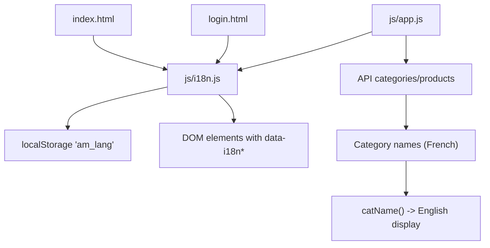
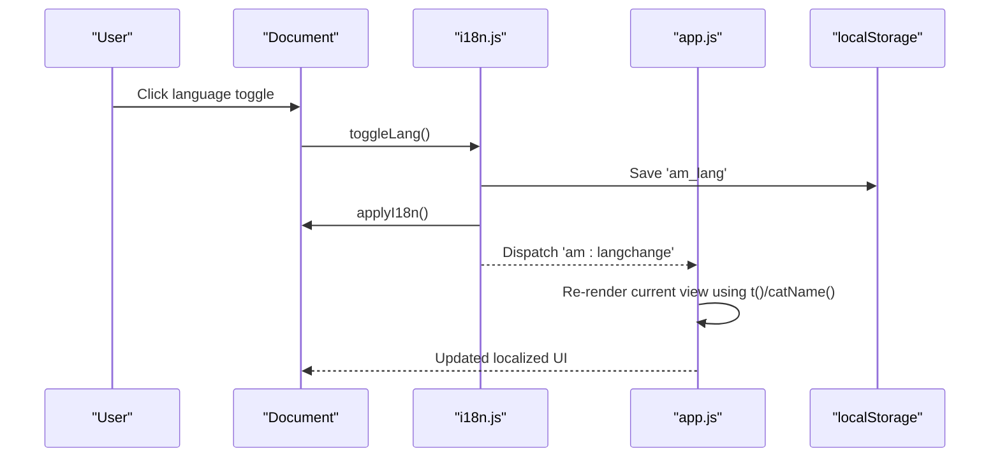
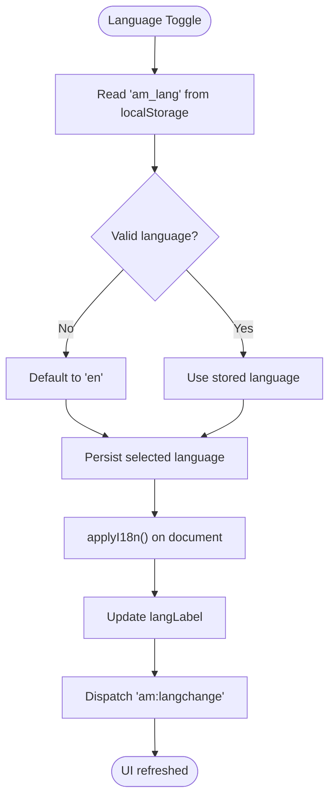
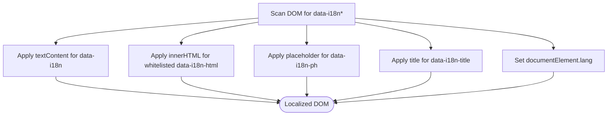
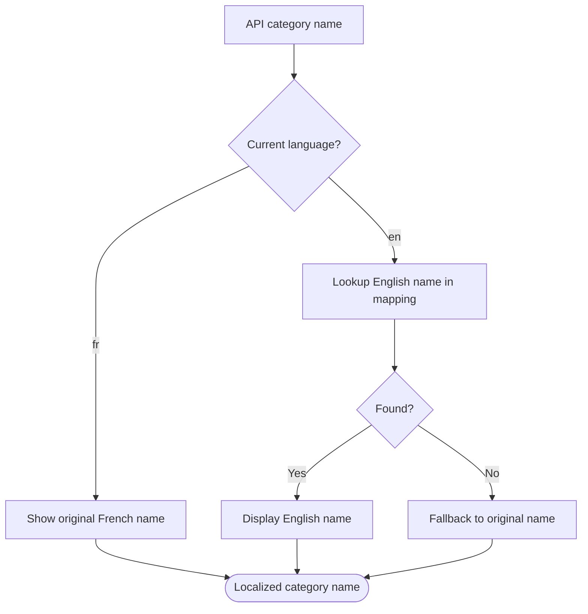
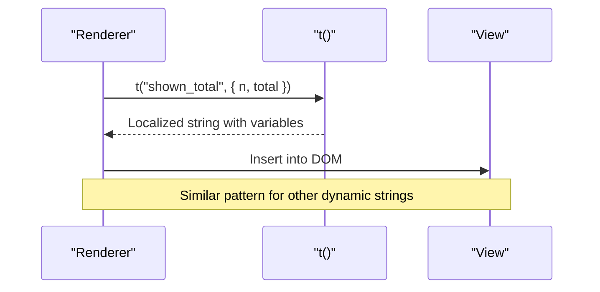
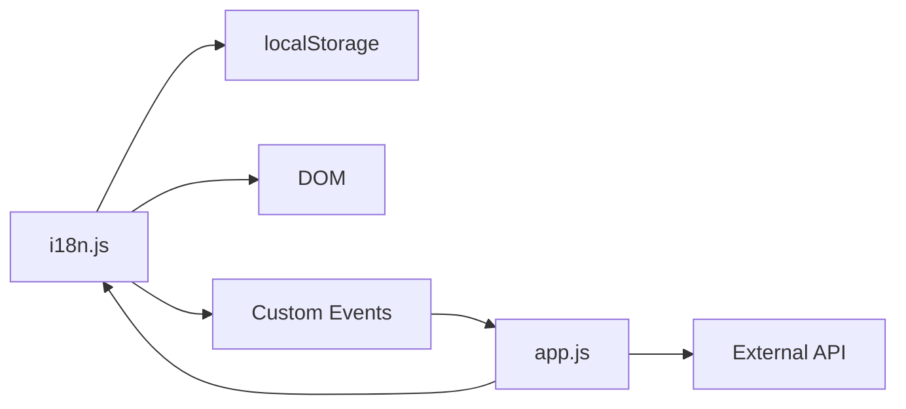

# Internationalization System

<cite>
**Referenced Files in This Document**
- [i18n.js](file://js/i18n.js)
- [app.js](file://js/app.js)
- [index.html](file://index.html)
- [login.html](file://login.html)
</cite>

## Table of Contents
1. [Introduction](#introduction)
2. [Project Structure](#project-structure)
3. [Core Components](#core-components)
4. [Architecture Overview](#architecture-overview)
5. [Detailed Component Analysis](#detailed-component-analysis)
6. [Dependency Analysis](#dependency-analysis)
7. [Performance Considerations](#performance-considerations)
8. [Troubleshooting Guide](#troubleshooting-guide)
9. [Conclusion](#conclusion)
10. [Appendices](#appendices)

## Introduction
This document explains the internationalization (i18n) system used by AM MARKET to support English and French. It covers:
- How language switching works between English and French
- The translation dictionary structure in i18n.js
- How translations are applied to DOM elements using data attributes
- Dynamic category name localization from French API names to English
- Extending the system with new languages, dynamic content localization, and persistence via localStorage
- Fallback behavior for missing translations
- Best practices for maintaining consistent, safe, and scalable localized content

## Project Structure
The i18n system spans a small set of files:
- js/i18n.js: Core i18n engine, dictionaries, utilities, and DOM application logic
- js/app.js: Application logic that uses i18n functions to render UI text and respond to language changes
- index.html: Main storefront markup with data-i18n attributes and a language toggle button
- login.html: Authentication page with data-i18n attributes and a language toggle button

**Diagram sources**
- [i18n.js:376-417](file://js/i18n.js#L376-L417)
- [app.js:117-133](file://js/app.js#L117-L133)
- [index.html:31-33](file://index.html#L31-L33)
- [login.html:17-19](file://login.html#L17-L19)

**Section sources**
- [i18n.js:1-418](file://js/i18n.js#L1-L418)
- [app.js:1-1048](file://js/app.js#L1-L1048)
- [index.html:1-414](file://index.html#L1-L414)
- [login.html:1-230](file://login.html#L1-L230)

## Core Components
- Translation dictionary: Two language objects (English and French) containing all static strings used across the app.
- Language getter/setter: Reads/writes the current language to localStorage under a specific key and provides defaults.
- Translation function: Resolves a key to a string in the current language, supports variable interpolation, and falls back gracefully.
- DOM application: Scans the DOM for data attributes and applies translated text or HTML where appropriate.
- Category name translator: Converts French category names returned by the API into English when needed.
- Event-driven updates: Listens for language change events to re-render views with updated text.

Key responsibilities:
- Static UI text: Managed via data attributes on HTML elements
- Dynamic UI text: Managed via t(key, vars) calls in JavaScript
- Dynamic category labels: Managed via catName(name) for API-provided category names
- Persistence: Current language stored in localStorage and restored on load

**Section sources**
- [i18n.js:8-336](file://js/i18n.js#L8-L336)
- [i18n.js:376-417](file://js/i18n.js#L376-L417)
- [app.js:1031-1045](file://js/app.js#L1031-L1045)

## Architecture Overview
The i18n architecture is lightweight and event-driven:
- On page load, i18n scans the DOM and applies translations based on data attributes
- When the user toggles language, the current language is saved to localStorage and a custom event is dispatched
- App components listen for this event and re-render their content using t() and catName()
- Category names from the API are localized dynamically at render time

**Diagram sources**
- [i18n.js:404-417](file://js/i18n.js#L404-L417)
- [app.js:1031-1045](file://js/app.js#L1031-L1045)

## Detailed Component Analysis

### Translation Dictionary and Keys
- The dictionary contains two top-level language objects: English and French
- Keys represent UI strings such as headers, buttons, messages, and footer content
- Some keys support placeholders for dynamic values (e.g., counts, prices, search terms)
- A whitelist allows safe rendering of HTML for specific keys only

Best practices:
- Keep keys stable and descriptive
- Use placeholders for dynamic parts instead of concatenation
- Avoid embedding user or network data in keys marked for HTML rendering

**Section sources**
- [i18n.js:8-336](file://js/i18n.js#L8-L336)
- [i18n.js:338-339](file://js/i18n.js#L338-L339)

### Language Switching Mechanism
- The current language is read from localStorage; if absent or invalid, it defaults to English
- Toggling switches between English and French, persists the choice, and triggers a language change event
- The page’s root element language attribute is updated to reflect the active locale
- A visible label shows the current language code

**Diagram sources**
- [i18n.js:376-417](file://js/i18n.js#L376-L417)

**Section sources**
- [i18n.js:376-417](file://js/i18n.js#L376-L417)
- [index.html:31-33](file://index.html#L31-L33)
- [login.html:17-19](file://login.html#L17-L19)

### Applying Translations to DOM Elements
- Static text: Elements with data-i18n get their textContent replaced with the translated string
- Safe HTML: Elements with data-i18n-html get innerHTML only for whitelisted keys
- Placeholders: Elements with data-i18n-ph get placeholder text replaced
- Tooltips: Elements with data-i18n-title get title attributes replaced
- Root language: The document element’s lang attribute is set to the current language

**Diagram sources**
- [i18n.js:388-402](file://js/i18n.js#L388-L402)

**Section sources**
- [i18n.js:388-402](file://js/i18n.js#L388-L402)
- [index.html:24-26](file://index.html#L24-L26)
- [index.html:84-86](file://index.html#L84-L86)
- [index.html:128-130](file://index.html#L128-L130)
- [login.html:47-57](file://login.html#L47-L57)

### Category Name Translation System
- Categories are fetched from an external API and may be named in French
- For English users, category names are mapped to English via a dedicated mapping table
- For French users, the original French name is shown
- This ensures consistent display names regardless of API source language

**Diagram sources**
- [i18n.js:341-374](file://js/i18n.js#L341-L374)

**Section sources**
- [i18n.js:341-374](file://js/i18n.js#L341-L374)
- [app.js:266-286](file://js/app.js#L266-L286)
- [app.js:316-336](file://js/app.js#L316-L336)
- [app.js:363-376](file://js/app.js#L363-L376)

### Dynamic Content Localization
- Many UI strings are inserted programmatically via t(key, vars) during rendering
- Variables are interpolated into placeholders within translation strings
- Examples include product counts, search suggestions, order summaries, and status messages
- Error and loading states use localized messages for better UX

**Diagram sources**
- [i18n.js:381-386](file://js/i18n.js#L381-L386)
- [app.js:412-420](file://js/app.js#L412-L420)
- [app.js:422-468](file://js/app.js#L422-L468)

**Section sources**
- [i18n.js:381-386](file://js/i18n.js#L381-L386)
- [app.js:412-468](file://js/app.js#L412-L468)

### Persistence of Language Preferences
- The current language is stored in localStorage under a specific key
- On page load, the stored value is read and validated; invalid values default to English
- The language preference persists across sessions and pages

**Section sources**
- [i18n.js:376-379](file://js/i18n.js#L376-L379)
- [i18n.js:404-407](file://js/i18n.js#L404-L407)

### Fallback Mechanisms for Missing Translations
- If a key is missing in the current language, the system falls back to English
- If the key is also missing in English, the key itself is returned
- This prevents blank UI and aids debugging by surfacing missing keys

**Section sources**
- [i18n.js:381-386](file://js/i18n.js#L381-L386)

## Dependency Analysis
- i18n.js depends on:
  - localStorage for persistence
  - DOM APIs for scanning and updating elements
  - Custom events for notifying other modules of language changes
- app.js depends on:
  - i18n.js functions (t(), catName(), getLang())
  - External API for categories and products
  - Event listeners to re-render views on language change

**Diagram sources**
- [i18n.js:376-417](file://js/i18n.js#L376-L417)
- [app.js:117-133](file://js/app.js#L117-L133)
- [app.js:1031-1045](file://js/app.js#L1031-L1045)

**Section sources**
- [i18n.js:376-417](file://js/i18n.js#L376-L417)
- [app.js:117-133](file://js/app.js#L117-L133)
- [app.js:1031-1045](file://js/app.js#L1031-L1045)

## Performance Considerations
- DOM scanning occurs once per language change; keep the number of data attributes reasonable
- Prefer data-i18n for simple text; reserve data-i18n-html for trusted, developer-managed markup
- Use t() with placeholders to avoid repeated string concatenation in loops
- Cache category mappings and frequently used translations if needed for large datasets
- Debounce rapid re-renders if many dynamic elements are updated simultaneously

[No sources needed since this section provides general guidance]

## Troubleshooting Guide
Common issues and resolutions:
- Missing translations:
  - Symptom: UI shows raw keys
  - Resolution: Add the key to both language dictionaries; verify fallback behavior
- HTML not rendered:
  - Symptom: Markup appears as text
  - Resolution: Ensure the key is whitelisted for data-i18n-html usage
- Category names not localized:
  - Symptom: French names appear in English UI
  - Resolution: Add or correct entries in the category mapping table
- Language not persisting:
  - Symptom: Language resets on reload
  - Resolution: Verify localStorage access and key name; check browser storage settings
- Views not updating after language switch:
  - Symptom: UI remains in previous language
  - Resolution: Ensure app listens to the language change event and re-renders affected views

**Section sources**
- [i18n.js:381-402](file://js/i18n.js#L381-L402)
- [i18n.js:341-374](file://js/i18n.js#L341-L374)
- [app.js:1031-1045](file://js/app.js#L1031-L1045)

## Conclusion
AM MARKET’s i18n system is a compact, robust solution for bilingual support:
- Static UI text is declarative via data attributes
- Dynamic text is managed through a simple translation function with placeholders
- Category names are localized dynamically based on API responses
- Language preferences persist across sessions
- Fallbacks ensure resilience against missing keys
Following the best practices outlined here will help maintain consistency, safety, and scalability as the app grows.

[No sources needed since this section summarizes without analyzing specific files]

## Appendices

### Adding a New Language
Steps:
- Add a new language object to the dictionary alongside existing ones
- Provide translations for all keys used in the UI
- Update the language getter to recognize the new language code
- Extend any conditional logic that checks language codes
- Test data attributes and dynamic t() calls across all views

**Section sources**
- [i18n.js:8-336](file://js/i18n.js#L8-L336)
- [i18n.js:376-379](file://js/i18n.js#L376-L379)

### Extending the Translation Dictionary
Guidelines:
- Use descriptive, stable keys grouped by feature area
- Use placeholders for dynamic values (counts, prices, search terms)
- Avoid embedding user or network data in keys marked for HTML rendering
- Keep translations concise and context-aware

**Section sources**
- [i18n.js:8-336](file://js/i18n.js#L8-L336)
- [i18n.js:338-339](file://js/i18n.js#L338-L339)

### Handling Dynamic Content Localization
Patterns:
- Use t(key, vars) for runtime-generated strings
- Escape user input before inserting into HTML unless using whitelisted HTML keys
- Centralize formatting (e.g., currency) in helper functions and combine with t() for labels

**Section sources**
- [i18n.js:381-386](file://js/i18n.js#L381-L386)
- [app.js:145-160](file://js/app.js#L145-L160)
- [app.js:412-468](file://js/app.js#L412-L468)

### Maintaining Translation Consistency and Best Practices
Recommendations:
- Audit missing keys regularly using fallback behavior as a signal
- Standardize terminology across features
- Review HTML-only keys to ensure they remain developer-managed and safe
- Keep category mappings up-to-date with API changes
- Validate language switching across all views and interactive elements

**Section sources**
- [i18n.js:338-339](file://js/i18n.js#L338-L339)
- [i18n.js:341-374](file://js/i18n.js#L341-L374)
- [app.js:1031-1045](file://js/app.js#L1031-L1045)