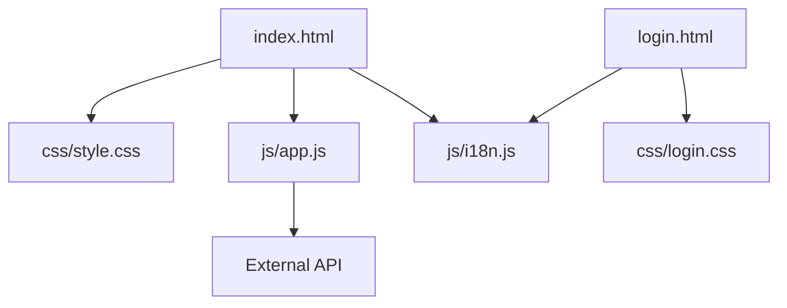
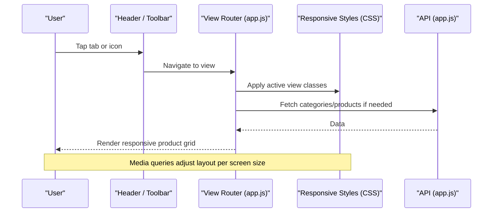
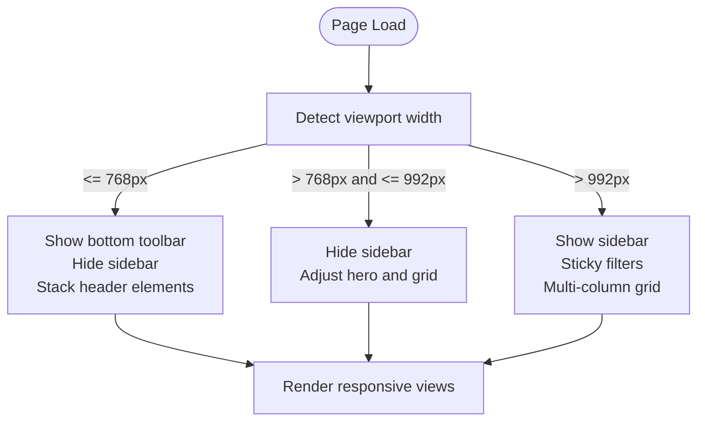
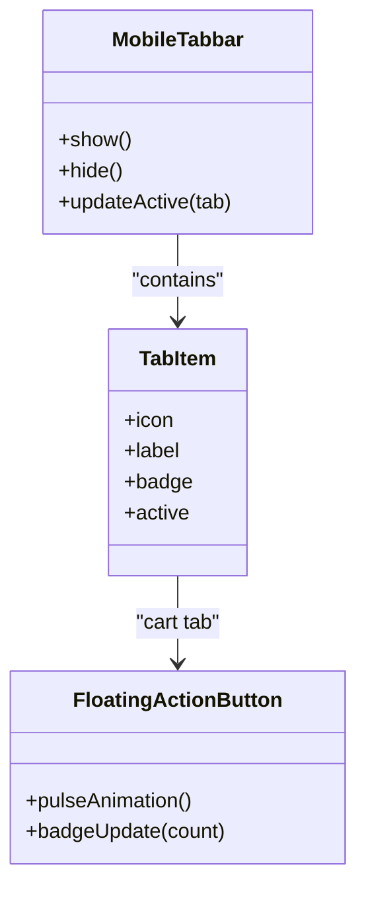
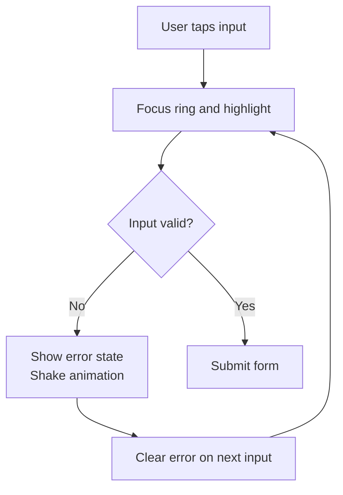
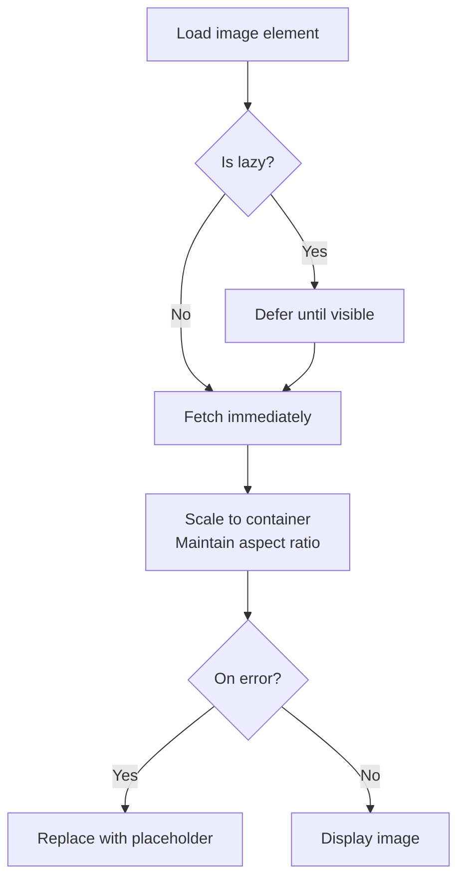
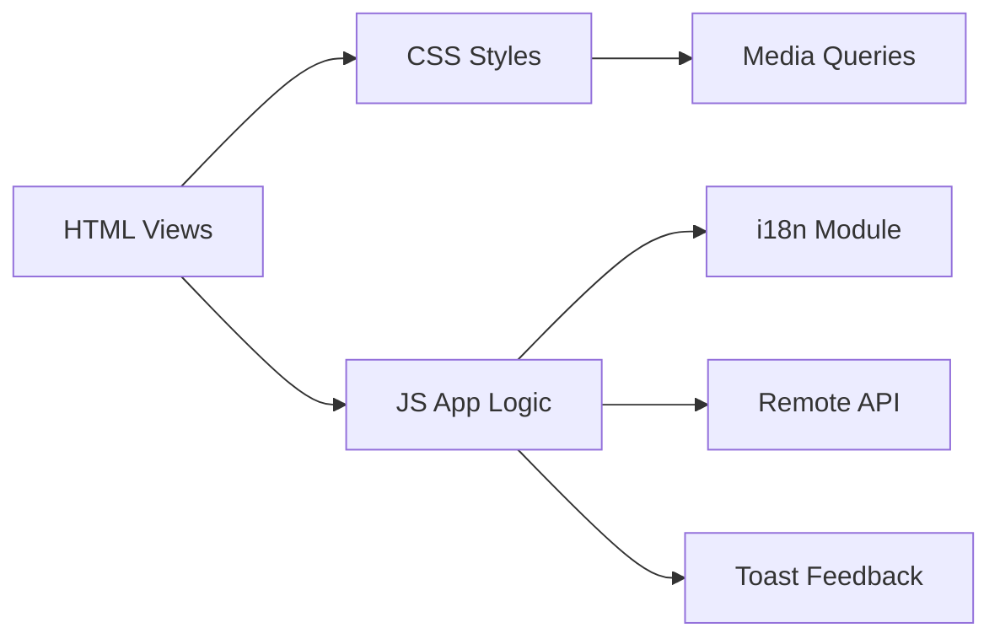

# Mobile Responsiveness

<cite>
**Referenced Files in This Document**
- [index.html](file://index.html)
- [login.html](file://login.html)
- [style.css](file://css/style.css)
- [login.css](file://css/login.css)
- [app.js](file://js/app.js)
- [i18n.js](file://js/i18n.js)
</cite>

## Table of Contents
1. Introduction
2. Project Structure
3. Core Components
4. Architecture Overview
5. Detailed Component Analysis
6. Dependency Analysis
7. Performance Considerations
8. Troubleshooting Guide
9. Conclusion
10. Appendices

## Introduction
This document explains how AM MARKET implements mobile responsiveness across its pages and components. It covers the mobile-first design approach, responsive breakpoints, adaptive layouts, mobile-specific features (bottom navigation toolbar, touch interactions, optimized form inputs), CSS media queries, flexible grid systems, responsive image handling, testing guidelines, accessibility considerations for mobile users, and performance optimizations for mobile networks.

## Project Structure
AM MARKET uses a simple, modular structure:
- HTML entry points define semantic views and mobile UI elements.
- CSS files provide global styles, responsive rules, and page-specific styling.
- JavaScript handles routing between views, data fetching, and interactive behaviors.

**Diagram sources**
- [index.html:1-12](file://index.html#L1-L12)
- [login.html:1-12](file://login.html#L1-L12)
- [style.css:1-28](file://css/style.css#L1-L28)
- [login.css:1-29](file://css/login.css#L1-L29)
- [app.js:1-10](file://js/app.js#L1-L10)
- [i18n.js:1-6](file://js/i18n.js#L1-L6)

**Section sources**
- [index.html:1-12](file://index.html#L1-L12)
- [login.html:1-12](file://login.html#L1-L12)
- [style.css:1-28](file://css/style.css#L1-L28)
- [login.css:1-29](file://css/login.css#L1-L29)
- [app.js:1-10](file://js/app.js#L1-L10)
- [i18n.js:1-6](file://js/i18n.js#L1-L6)

## Core Components
- Responsive viewport configuration via meta viewport tag ensures correct scaling on mobile devices.
- Bootstrap grid system provides flexible column layouts that adapt from mobile to desktop.
- Custom CSS media queries adjust layout, typography, spacing, and visibility at key breakpoints.
- Mobile bottom toolbar replaces header actions on small screens for thumb-friendly navigation.
- Touch-friendly controls include larger tap targets, animated feedback, and accessible labels.
- Optimized images use responsive sizing and lazy loading to improve performance.

Key implementation highlights:
- Viewport meta tag sets width=device-width and initial-scale=1.0 for proper mobile rendering.
- Header reflows into stacked layout with full-width search on small screens.
- Sidebar is hidden on tablets/phones; filters become inline or scrollable within the content area.
- Bottom tab bar appears only on phones, providing Home, Search, Cart (elevated FAB), Favorites, and Account.
- Product grids switch from multi-column to two-column layouts on narrow screens.
- Images scale fluidly with max-width constraints and aspect-ratio containers.

**Section sources**
- [index.html:4-11](file://index.html#L4-L11)
- [index.html:16-57](file://index.html#L16-L57)
- [index.html:60-125](file://index.html#L60-L125)
- [index.html:372-403](file://index.html#L372-L403)
- [style.css:826-857](file://css/style.css#L826-L857)
- [style.css:1149-1270](file://css/style.css#L1149-L1270)
- [app.js:206-241](file://js/app.js#L206-L241)

## Architecture Overview
The application follows a single-page view model driven by JavaScript, with CSS managing responsive behavior and HTML defining semantic regions.

**Diagram sources**
- [index.html:372-403](file://index.html#L372-L403)
- [app.js:176-203](file://js/app.js#L176-L203)
- [app.js:117-142](file://js/app.js#L117-L142)
- [style.css:826-857](file://css/style.css#L826-L857)

## Detailed Component Analysis

### Mobile-First Design and Breakpoints
- The project starts with base styles for mobile and enhances for larger screens using media queries.
- Breakpoints used:
  - Up to ~992px: Hide sidebar, reduce hero padding and headline size.
  - Up to ~768px: Reorder header elements, stack search below icons, disable sticky filters, shrink logo.
  - Up to ~576px: Tighter category grid, smaller icons and spacing.
  - Up to ~768px: Show mobile bottom toolbar, hide header actions that move to toolbar, add bottom body padding to avoid overlap.

These breakpoints ensure progressive enhancement: core content remains usable on small screens while richer layouts appear on larger devices.

**Section sources**
- [style.css:826-857](file://css/style.css#L826-L857)
- [style.css:1260-1270](file://css/style.css#L1260-L1270)

### Adaptive Layouts and Grid Systems
- Bootstrap’s responsive grid drives column arrangements:
  - Two-column product cards on mobile, three on medium, four on large.
  - Category grid uses auto-fill with minimum card widths to adapt to available space.
- On small screens:
  - Sidebar disappears; category selection moves to inline filter panel.
  - Filters panel becomes non-sticky and scrollable to fit content.
  - Hero banner reduces height and font sizes for better readability.

**Diagram sources**
- [index.html:60-125](file://index.html#L60-L125)
- [style.css:826-857](file://css/style.css#L826-L857)
- [style.css:1149-1270](file://css/style.css#L1149-L1270)

**Section sources**
- [index.html:60-125](file://index.html#L60-L125)
- [style.css:328-366](file://css/style.css#L328-L366)
- [style.css:826-857](file://css/style.css#L826-L857)

### Mobile Bottom Navigation Toolbar
- A fixed bottom toolbar appears on phones with five tabs: Home, Search, Cart (elevated FAB), Favorites, Account.
- Active state is synchronized with the current view, including mapping shop/detail/account to appropriate tabs.
- The cart tab includes an animated floating action button with badge counts that animate when updated.
- The toolbar avoids overlapping content by adding bottom padding to the body on small screens.

**Diagram sources**
- [index.html:372-403](file://index.html#L372-L403)
- [style.css:1149-1270](file://css/style.css#L1149-L1270)
- [app.js:196-203](file://js/app.js#L196-L203)

**Section sources**
- [index.html:372-403](file://index.html#L372-L403)
- [style.css:1149-1270](file://css/style.css#L1149-L1270)
- [app.js:196-203](file://js/app.js#L196-L203)

### Touch Interactions and Form Inputs
- Buttons and links have adequate tap targets and visual feedback (hover/active states).
- Input fields are styled with clear focus rings and accessible placeholders.
- Password visibility toggles improve usability on mobile keyboards.
- Range sliders and checkboxes are enhanced for touch with larger thumbs and labels.
- Validation errors provide immediate visual cues (shake animation and border highlighting).

**Diagram sources**
- [login.css:237-284](file://css/login.css#L237-L284)
- [login.html:49-97](file://login.html#L49-L97)
- [login.html:152-180](file://login.html#L152-L180)

**Section sources**
- [login.css:237-284](file://css/login.css#L237-L284)
- [login.html:49-97](file://login.html#L49-L97)
- [login.html:152-180](file://login.html#L152-L180)

### Responsive Image Handling
- Images scale fluidly with max-width constraints and aspect-ratio containers to maintain proportions.
- Product images use lazy loading to defer offscreen images and reduce initial load time.
- Detail images fit within constrained boxes without distortion.
- Placeholder fallbacks prevent broken image visuals during network issues.

**Diagram sources**
- [style.css:26-27](file://css/style.css#L26-L27)
- [style.css:410-438](file://css/style.css#L410-L438)
- [style.css:515-530](file://css/style.css#L515-L530)
- [app.js:213-220](file://js/app.js#L213-L220)

**Section sources**
- [style.css:26-27](file://css/style.css#L26-L27)
- [style.css:410-438](file://css/style.css#L410-L438)
- [style.css:515-530](file://css/style.css#L515-L530)
- [app.js:213-220](file://js/app.js#L213-L220)

### Accessibility Considerations for Mobile Users
- Semantic landmarks and headings structure content for assistive technologies.
- Icons include aria-labels where necessary (e.g., social links).
- Language toggle updates document language attribute for screen readers.
- Keyboard navigation remains functional; focus states are visible.
- Alt text is provided for images; placeholders handle missing assets gracefully.

**Section sources**
- [index.html:306-310](file://index.html#L306-L310)
- [i18n.js:388-402](file://js/i18n.js#L388-L402)
- [app.js:213-220](file://js/app.js#L213-L220)

### Common Mobile UX Patterns Implemented
- Collapsible/hidden sidebar on small screens replaced by inline filters.
- Sticky header keeps navigation accessible while scrolling.
- Back-to-top button improves long-page navigation on mobile.
- Toast notifications provide concise feedback for user actions.
- Pagination adapts to small screens with compact page links.

**Section sources**
- [style.css:826-857](file://css/style.css#L826-L857)
- [style.css:906-933](file://css/style.css#L906-L933)
- [style.css:877-899](file://css/style.css#L877-L899)
- [index.html:405-407](file://index.html#L405-L407)

## Dependency Analysis
- HTML depends on CSS for responsive styling and JS for interactivity.
- JS orchestrates view switching, data fetching, and UI updates.
- i18n module centralizes translations and applies them to DOM attributes.
- External libraries (Bootstrap, Font Awesome) provide grid utilities and icons.

**Diagram sources**
- [index.html:1-12](file://index.html#L1-L12)
- [style.css:1-28](file://css/style.css#L1-L28)
- [app.js:1-10](file://js/app.js#L1-L10)
- [i18n.js:1-6](file://js/i18n.js#L1-L6)

**Section sources**
- [index.html:1-12](file://index.html#L1-L12)
- [style.css:1-28](file://css/style.css#L1-L28)
- [app.js:1-10](file://js/app.js#L1-L10)
- [i18n.js:1-6](file://js/i18n.js#L1-L6)

## Performance Considerations
- Use lazy loading for images to reduce initial payload and improve perceived performance on mobile networks.
- Avoid heavy animations on low-end devices; prefer subtle transitions and hardware-accelerated properties.
- Keep media queries minimal and targeted to reduce CSS parsing overhead.
- Cache product details locally to minimize repeated API calls.
- Ensure fonts and external resources are loaded efficiently; consider preloading critical assets.

[No sources needed since this section provides general guidance]

## Troubleshooting Guide
Common issues and resolutions:
- Bottom toolbar overlaps content: Ensure body has sufficient bottom padding on small screens and check media query ranges.
- Sidebar not appearing on desktop: Verify breakpoint conditions and that sidebar display is not overridden by !important rules.
- Images not loading: Check network connectivity and confirm fallback placeholders are applied on error.
- Form validation not clearing: Ensure input event listeners remove error classes when typing resumes.
- Language not updating: Confirm i18n apply function runs after DOM changes and that lang attribute is set correctly.

**Section sources**
- [style.css:1260-1270](file://css/style.css#L1260-L1270)
- [style.css:826-857](file://css/style.css#L826-L857)
- [app.js:213-220](file://js/app.js#L213-L220)
- [login.css:275-284](file://css/login.css#L275-L284)
- [i18n.js:388-402](file://js/i18n.js#L388-L402)

## Conclusion
AM MARKET employs a robust mobile-first strategy with well-defined breakpoints, adaptive layouts, and mobile-specific features like a bottom navigation toolbar and touch-friendly controls. Responsive images, efficient caching, and careful CSS organization contribute to a smooth experience across devices. Following the testing and accessibility guidelines outlined here will help maintain high quality as the application evolves.

[No sources needed since this section summarizes without analyzing specific files]

## Appendices

### Testing Guidelines for Mobile Responsiveness
- Test on real devices and emulators across common breakpoints:
  - Small phones (~320–480px)
  - Large phones (~576–767px)
  - Tablets (~768–991px)
  - Desktop (>992px)
- Verify:
  - Bottom toolbar visibility and interaction on phones.
  - Sidebar hiding and filter panel behavior on tablets/phones.
  - Header reflow and search placement on small screens.
  - Image scaling and lazy loading behavior.
  - Touch target sizes and keyboard usability.
  - Language switching and accessibility attributes.

[No sources needed since this section provides general guidance]