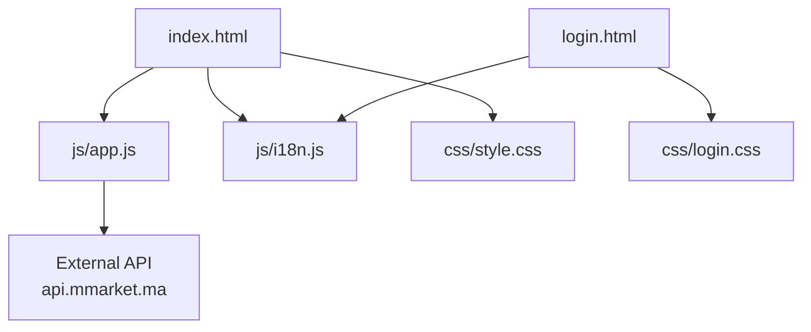
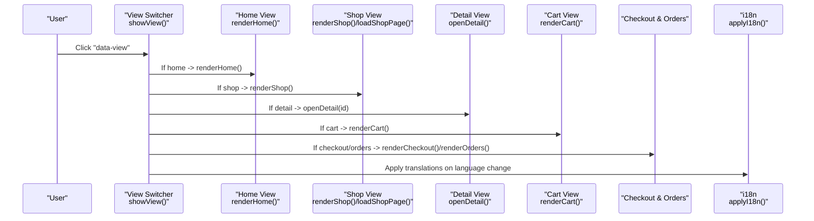
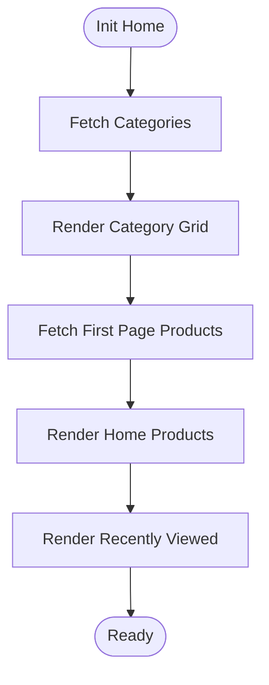
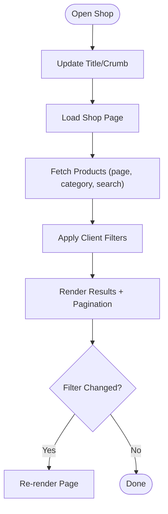
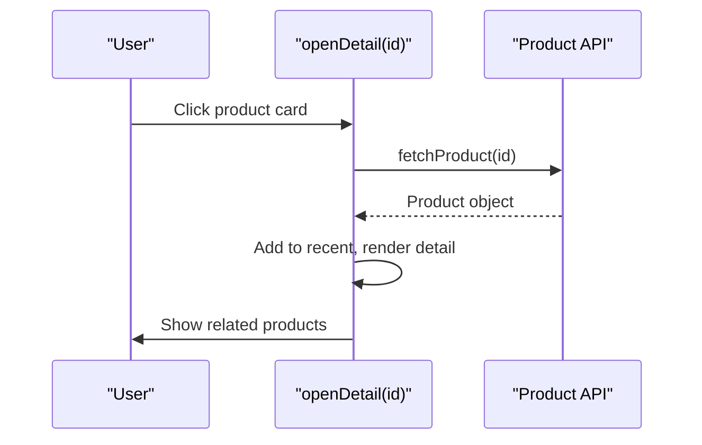
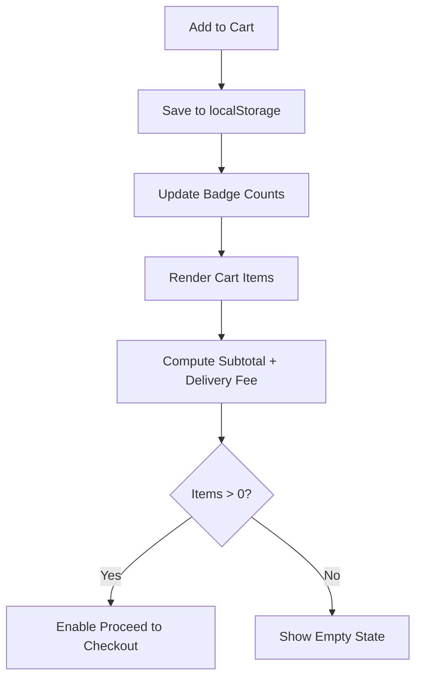
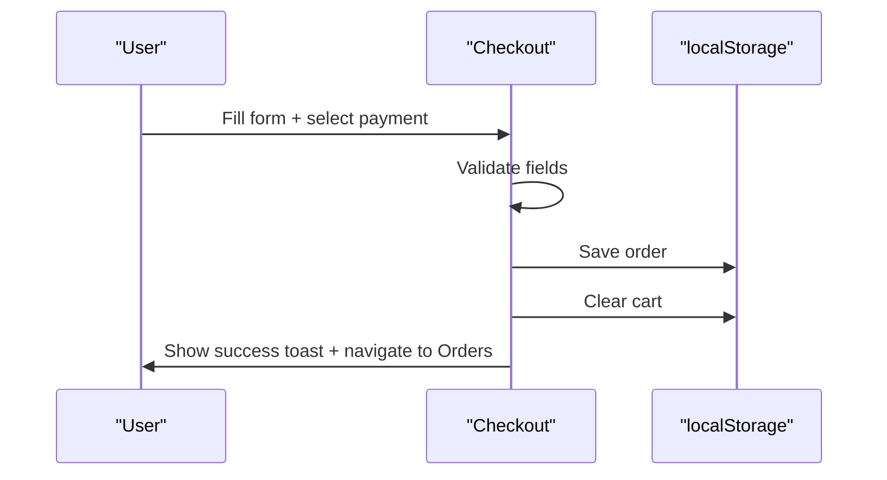
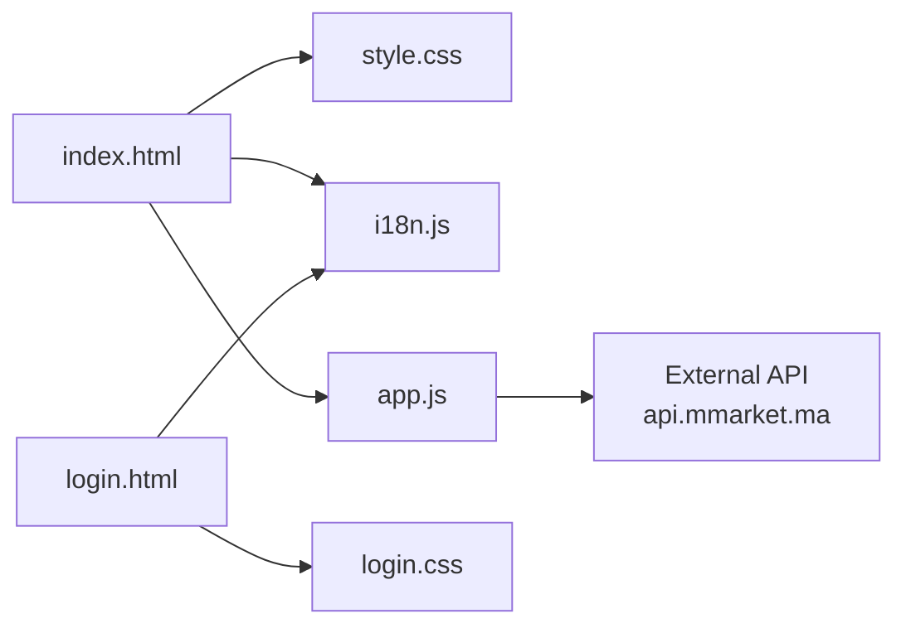

# Project Overview

<cite>
**Referenced Files in This Document**
- [index.html](file://index.html)
- [login.html](file://login.html)
- [app.js](file://js/app.js)
- [i18n.js](file://js/i18n.js)
- [style.css](file://css/style.css)
- [login.css](file://css/login.css)
</cite>

## Table of Contents
1. [Introduction](#introduction)
2. [Project Structure](#project-structure)
3. [Core Components](#core-components)
4. [Architecture Overview](#architecture-overview)
5. [Detailed Component Analysis](#detailed-component-analysis)
6. [Dependency Analysis](#dependency-analysis)
7. [Performance Considerations](#performance-considerations)
8. [Troubleshooting Guide](#troubleshooting-guide)
9. [Conclusion](#conclusion)
10. [Appendices](#appendices)

## Introduction
AM MARKET is a Moroccan marketplace frontend that lets users browse products, manage a shopping cart and wishlist, and place orders with delivery information and payment method selection. It targets shoppers looking for everyday products across categories such as food, beverages, hygiene, home, and more. The application emphasizes a clean, modern UI, responsive design, and bilingual support (English/French).

Key features:
- Product browsing by category and search
- Filtering by price range, availability, promotions, and brand
- Sorting by default, price, or name
- Cart management with quantity controls and order summary
- Wishlist to save favorite items
- Checkout flow with delivery details and payment method selection
- Order history stored locally
- Bilingual interface with persistent language preference

Technology stack:
- HTML5, CSS3, JavaScript ES6+
- Bootstrap 5.3.3 for layout and components
- Font Awesome icons
- Client-side routing via view switching
- LocalStorage for cart, wishlist, orders, recent views, and user session
- External API integration for categories and products

## Project Structure
The project is organized into pages, client-side logic, internationalization, and styles:
- index.html: Main SPA shell containing header, sidebar, footer, mobile tabbar, and multiple views (home, shop, detail, cart, checkout, orders, wishlist)
- login.html: Authentication page with sign-in/sign-up forms and localized branding
- js/app.js: Core application logic (routing, data fetching, rendering, state management)
- js/i18n.js: Internationalization module for EN/FR strings and utilities
- css/style.css: Styles for the main application
- css/login.css: Styles for the authentication page

**Diagram sources**
- [index.html:1-414](file://index.html#L1-L414)
- [login.html:1-230](file://login.html#L1-L230)
- [app.js:1-1048](file://js/app.js#L1-L1048)
- [i18n.js:1-418](file://js/i18n.js#L1-L418)
- [style.css:1-1271](file://css/style.css#L1-L1271)
- [login.css:1-384](file://css/login.css#L1-L384)

**Section sources**
- [index.html:1-414](file://index.html#L1-L414)
- [login.html:1-230](file://login.html#L1-L230)
- [app.js:1-1048](file://js/app.js#L1-L1048)
- [i18n.js:1-418](file://js/i18n.js#L1-L418)
- [style.css:1-1271](file://css/style.css#L1-L1271)
- [login.css:1-384](file://css/login.css#L1-L384)

## Core Components
- Views and Routing: Single-page views toggled by data-view attributes; navigation updates active view and mobile tabbar state.
- Data Layer: Fetches categories and products from an external API; caches product details; maintains local state for cart, wishlist, orders, and recently viewed items.
- Rendering: Dynamic generation of product cards, filters, pagination, detail pages, cart items, and order summaries using template literals and DOM manipulation.
- Internationalization: Centralized translation dictionary and runtime string interpolation; supports English and French with persistence.
- Styling: Responsive layout with Bootstrap grid, custom CSS variables, animations, and component-specific styles.

**Section sources**
- [app.js:175-194](file://js/app.js#L175-L194)
- [app.js:116-142](file://js/app.js#L116-L142)
- [app.js:205-263](file://js/app.js#L205-L263)
- [i18n.js:8-336](file://js/i18n.js#L8-L336)
- [style.css:1-1271](file://css/style.css#L1-L1271)

## Architecture Overview
AM MARKET follows a client-side single-page architecture:
- The main shell (index.html) defines all views and shared chrome (header, sidebar, footer, mobile tabbar).
- app.js initializes the app, loads categories and products, binds events, and switches between views.
- i18n.js provides translations and applies them to elements marked with data-i18n attributes.
- CSS files define visual themes and responsive behavior.

**Diagram sources**
- [app.js:175-194](file://js/app.js#L175-L194)
- [app.js:265-336](file://js/app.js#L265-L336)
- [app.js:539-583](file://js/app.js#L539-L583)
- [app.js:585-669](file://js/app.js#L585-L669)
- [app.js:740-805](file://js/app.js#L740-L805)
- [app.js:807-895](file://js/app.js#L807-L895)
- [i18n.js:388-418](file://js/i18n.js#L388-L418)

## Detailed Component Analysis

### Home View
- Displays hero banner, trust badges, category grid, recently viewed section, and initial product listing.
- Loads categories and first page of products on initialization.
- Sidebar lists top-level categories excluding a specific excluded category.

**Diagram sources**
- [app.js:265-336](file://js/app.js#L265-L336)
- [app.js:116-133](file://js/app.js#L116-L133)

**Section sources**
- [index.html:62-125](file://index.html#L62-L125)
- [app.js:265-336](file://js/app.js#L265-L336)

### Shop View and Filters
- Supports filtering by category, price range, availability, promotion status, and brand.
- Sorting by default, price ascending/descending, and name.
- Pagination with smart windowing around current page.
- Smart search suggestion when full query returns no results.

**Diagram sources**
- [app.js:338-410](file://js/app.js#L338-L410)
- [app.js:412-583](file://js/app.js#L412-L583)

**Section sources**
- [index.html:132-199](file://index.html#L132-L199)
- [app.js:338-583](file://js/app.js#L338-L583)

### Product Detail View
- Shows product image, name, brand, category, stock status, pricing, description, and quantity selector.
- Adds to cart or buy now; toggles wishlist; shows related products from same category.

**Diagram sources**
- [app.js:585-669](file://js/app.js#L585-L669)

**Section sources**
- [index.html:201-215](file://index.html#L201-L215)
- [app.js:585-669](file://js/app.js#L585-L669)

### Cart Management
- Adds/removes items, adjusts quantities, calculates subtotal and delivery fee, and enables checkout.
- Persists cart in localStorage and updates badge counts.

**Diagram sources**
- [app.js:700-805](file://js/app.js#L700-L805)

**Section sources**
- [index.html:217-235](file://index.html#L217-L235)
- [app.js:700-805](file://js/app.js#L700-L805)

### Checkout Flow
- Collects delivery information and payment method.
- Validates required fields, builds order object, stores in localStorage, clears cart, and navigates to orders view.

**Diagram sources**
- [app.js:807-872](file://js/app.js#L807-L872)

**Section sources**
- [index.html:237-276](file://index.html#L237-L276)
- [app.js:807-872](file://js/app.js#L807-L872)

### Orders View
- Lists previously placed orders with date, items, total, and payment method.
- Uses localized status labels.

**Section sources**
- [index.html:278-282](file://index.html#L278-L282)
- [app.js:874-895](file://js/app.js#L874-L895)

### Wishlist
- Toggles items in/out of wishlist, persists list, and renders saved items with product details.

**Section sources**
- [index.html:284-288](file://index.html#L284-L288)
- [app.js:897-924](file://js/app.js#L897-L924)

### Authentication Page
- Provides sign-in and sign-up forms with validation, password visibility toggle, and animated transitions.
- Stores user info in localStorage and redirects to store after successful action.

**Section sources**
- [login.html:1-230](file://login.html#L1-L230)
- [login.css:1-384](file://css/login.css#L1-L384)

## Dependency Analysis
- index.html depends on:
  - Bootstrap CSS/JS via CDN
  - Font Awesome icons via CDN
  - Custom CSS (style.css)
  - i18n.js and app.js scripts
- app.js depends on:
  - External API at api.mmarket.ma for categories and products
  - i18n.js for translations
  - DOM APIs for rendering and event handling
  - localStorage for persistence
- login.html depends on:
  - Bootstrap JS for toasts
  - i18n.js for translations
  - login.css for styling

**Diagram sources**
- [index.html:1-414](file://index.html#L1-L414)
- [login.html:1-230](file://login.html#L1-L230)
- [app.js:1-1048](file://js/app.js#L1-L1048)
- [i18n.js:1-418](file://js/i18n.js#L1-L418)
- [style.css:1-1271](file://css/style.css#L1-L1271)
- [login.css:1-384](file://css/login.css#L1-L384)

**Section sources**
- [index.html:1-414](file://index.html#L1-L414)
- [login.html:1-230](file://login.html#L1-L230)
- [app.js:1-1048](file://js/app.js#L1-L1048)
- [i18n.js:1-418](file://js/i18n.js#L1-L418)

## Performance Considerations
- Product caching: Product details are cached in memory to avoid repeated API calls for the same item.
- Pagination: Products are fetched in pages of 12 to reduce payload size and improve load times.
- Client-side filtering: After initial fetch, filters and sorting are applied locally for responsiveness.
- Lazy loading images: Images use lazy loading to defer offscreen resources.
- Minimal reflows: View transitions use simple class toggles and smooth scrolling to keep interactions snappy.
- Avoid heavy computations: Filtering uses straightforward array operations suitable for moderate dataset sizes.

[No sources needed since this section provides general guidance]

## Troubleshooting Guide
Common issues and resolutions:
- API connectivity errors: If categories or products fail to load, check network connectivity and ensure the external API endpoint is reachable. Error messages are displayed in both languages.
- Missing images: Image fallbacks are set to placeholder URLs if original images fail to load.
- Empty results: When search yields no results, suggestions are provided to refine queries; clear filters and try again.
- Language switch not applying: Ensure data-i18n attributes are present and i18n.js is loaded; language preference is persisted in localStorage.
- Login form validation: Fields must meet minimum requirements; error states are visually indicated with shake animation and border highlighting.

**Section sources**
- [app.js:1008-1017](file://js/app.js#L1008-L1017)
- [app.js:422-481](file://js/app.js#L422-L481)
- [i18n.js:388-418](file://js/i18n.js#L388-L418)
- [login.html:190-218](file://login.html#L190-L218)
- [login.css:275-284](file://css/login.css#L275-L284)

## Conclusion
AM MARKET delivers a streamlined, bilingual e-commerce experience focused on Moroccan shoppers. Its SPA architecture, robust client-side routing, and modular components enable smooth navigation and fast interactions. With integrated search, filtering, cart/wishlist management, and order processing, it covers essential marketplace workflows while maintaining a clean, responsive UI built on modern web standards.

[No sources needed since this section summarizes without analyzing specific files]

## Appendices

### User Workflows

#### Browse and Search Products
- Open the store homepage and use the search bar to enter keywords.
- Navigate to the shop view to see results, apply filters (category, price, availability, promotion, brand), and sort.
- Use pagination to explore additional results.

**Section sources**
- [index.html:23-28](file://index.html#L23-L28)
- [index.html:132-199](file://index.html#L132-L199)
- [app.js:955-971](file://js/app.js#L955-L971)
- [app.js:975-1006](file://js/app.js#L975-L1006)

#### Add to Cart and Checkout
- From product cards or detail pages, add items to the cart and adjust quantities.
- Review the cart summary, proceed to checkout, fill delivery details, choose payment method, and place the order.

**Section sources**
- [index.html:217-276](file://index.html#L217-L276)
- [app.js:700-872](file://js/app.js#L700-L872)

#### Manage Wishlist
- Toggle items to/from the wishlist from product cards or detail pages.
- View saved items in the wishlist view and move them to the cart as needed.

**Section sources**
- [index.html:34-37](file://index.html#L34-L37)
- [index.html:284-288](file://index.html#L284-L288)
- [app.js:897-924](file://js/app.js#L897-L924)

#### Sign In / Create Account
- Access the login page, validate inputs, and either sign in or create an account.
- Upon success, user info is stored locally and you are redirected back to the store.

**Section sources**
- [login.html:45-97](file://login.html#L45-L97)
- [login.html:190-218](file://login.html#L190-L218)