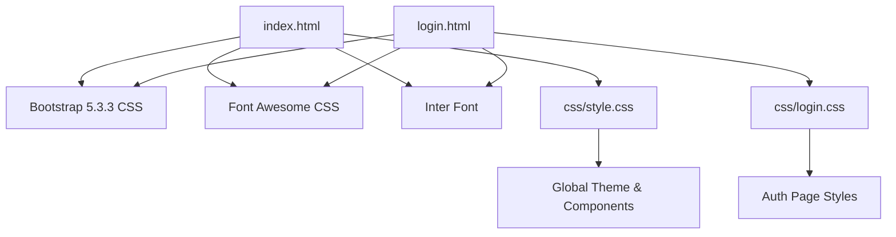
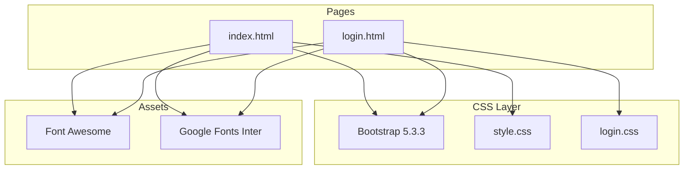
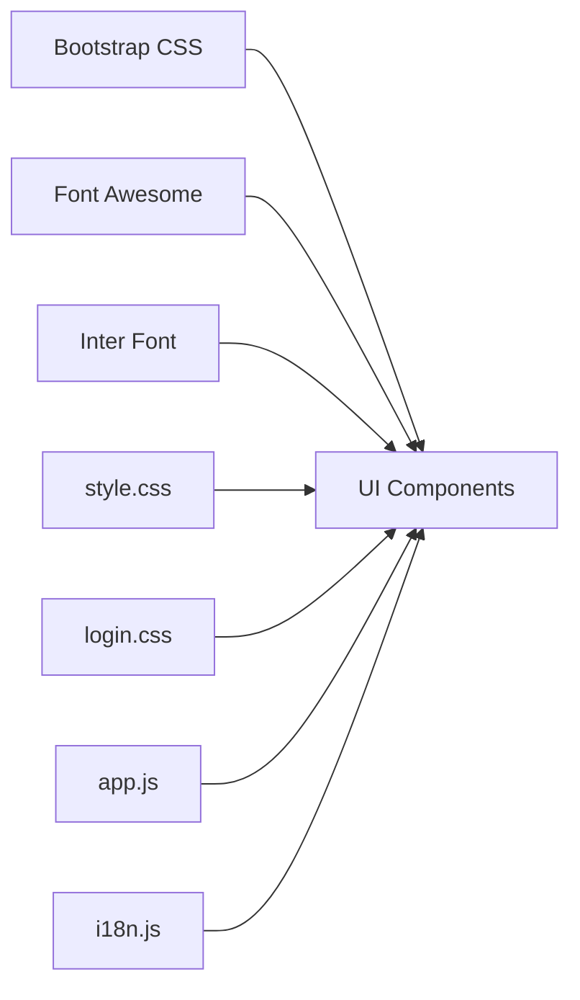

# Styling and Design System

<cite>
**Referenced Files in This Document**
- [index.html](file://index.html)
- [login.html](file://login.html)
- [style.css](file://css/style.css)
- [login.css](file://css/login.css)
- [app.js](file://js/app.js)
- [i18n.js](file://js/i18n.js)
</cite>

## Table of Contents
1. [Introduction](#introduction)
2. [Project Structure](#project-structure)
3. [Core Components](#core-components)
4. [Architecture Overview](#architecture-overview)
5. [Detailed Component Analysis](#detailed-component-analysis)
6. [Dependency Analysis](#dependency-analysis)
7. [Performance Considerations](#performance-considerations)
8. [Troubleshooting Guide](#troubleshooting-guide)
9. [Conclusion](#conclusion)
10. [Appendices](#appendices)

## Introduction
This document explains the styling and design system used by AM MARKET. The application is built on Bootstrap 5.3.3 with a custom CSS layer that introduces consistent variables, tokens, and marketplace-specific components. It follows a mobile-first responsive approach, uses Google Fonts Inter for typography, Font Awesome for icons, and defines a cohesive color scheme centered around an orange primary and blue secondary palette. The documentation covers how to maintain consistency, create new components that match the system, adapt themes, and optimize CSS delivery.

## Project Structure
The project organizes styles into two main CSS files:
- style.css: Global theme, layout, and marketplace components (header, hero, categories, product cards, cart, footer).
- login.css: Dedicated styles for the authentication page (brand panel, forms, animations).

HTML pages include Bootstrap 5.3.3, Font Awesome, and Inter font via CDN links, then apply the custom CSS. JavaScript modules handle dynamic content and interactions but do not alter the core design tokens.

**Diagram sources**
- [index.html:7-10](file://index.html#L7-L10)
- [login.html:7-10](file://login.html#L7-L10)

**Section sources**
- [index.html:1-12](file://index.html#L1-L12)
- [login.html:1-12](file://login.html#L1-L12)

## Core Components
- Color tokens and spacing are centralized in CSS custom properties for consistent theming across pages.
- Typography uses Inter with a clear hierarchy and line-height for readability.
- Buttons, badges, and input groups follow consistent sizing, focus states, and transitions.
- Marketplace components include:
  - Header with search, language toggle, wishlist/cart badges, and account dropdown
  - Hero banner with floating bubbles and animated text
  - Category grid and sidebar navigation
  - Product cards with image hover effects, discount badges, and action buttons
  - Detail view with quantity controls and related products
  - Cart and checkout layouts using Bootstrap grid and custom cards
  - Footer with brand info, navigation, newsletter form, and payment logos

Key implementation references:
- Custom properties and base styles: [style.css:1-28](file://css/style.css#L1-L28)
- Header and search box: [style.css:31-103](file://css/style.css#L31-L103)
- Hero banner and animations: [style.css:202-287](file://css/style.css#L202-L287)
- Product card styles: [style.css:376-513](file://css/style.css#L376-L513)
- Footer structure and styles: [style.css:587-799](file://css/style.css#L587-L799)
- Login page theme and form styles: [login.css:1-384](file://css/login.css#L1-L384)

**Section sources**
- [style.css:1-28](file://css/style.css#L1-L28)
- [style.css:31-103](file://css/style.css#L31-L103)
- [style.css:202-287](file://css/style.css#L202-L287)
- [style.css:376-513](file://css/style.css#L376-L513)
- [style.css:587-799](file://css/style.css#L587-L799)
- [login.css:1-384](file://css/login.css#L1-L384)

## Architecture Overview
The design system architecture layers Bootstrap utilities with custom CSS variables and component classes. Pages compose these layers to achieve consistent UI across views. JavaScript dynamically renders components using predefined class names and data attributes, ensuring visual consistency without inline styles.

**Diagram sources**
- [index.html:7-10](file://index.html#L7-L10)
- [login.html:7-10](file://login.html#L7-L10)

## Detailed Component Analysis

### Theme Tokens and Variables
- Primary color set as an orange-blue tone with light/dark variants for interactive states and backgrounds.
- Muted and border colors provide subtle contrast for inputs and dividers.
- Radius tokens standardize rounded corners across components.
- Shadow tokens define elevation levels for cards and overlays.

Guidelines:
- Always use CSS variables for colors, radii, and shadows to ensure consistency.
- Extend the :root variables when introducing new shades; avoid hardcoding hex values in components.

References:
- Variables definition: [style.css:1-14](file://css/style.css#L1-L14), [login.css:1-10](file://css/login.css#L1-L10)

**Section sources**
- [style.css:1-14](file://css/style.css#L1-L14)
- [login.css:1-10](file://css/login.css#L1-L10)

### Typography
- Base font family is Inter with fallbacks to system fonts for performance.
- Headings use higher weights and tighter letter-spacing for modern look.
- Body text maintains comfortable line-height for readability.

Guidelines:
- Use semantic HTML headings and rely on Bootstrap utility classes for spacing.
- Keep font sizes modular and aligned with the token scale.

References:
- Body and link/button resets: [style.css:16-28](file://css/style.css#L16-L28), [login.css:12-29](file://css/login.css#L12-L29)

**Section sources**
- [style.css:16-28](file://css/style.css#L16-L28)
- [login.css:12-29](file://css/login.css#L12-L29)

### Buttons and Interactive Elements
- Primary buttons use the orange variable with hover and active states for feedback.
- Outline variant provides secondary actions with matching focus behavior.
- Icon buttons have consistent padding, radius, and hover background using theme tokens.
- Badges display counts with compact sizing and visibility rules.

Guidelines:
- Prefer .btn-orange and .btn-outline-orange for marketplace actions.
- Use .btn-icon for tool-like actions; keep accessible titles via data-i18n-title or title attributes.

References:
- Button styles and badge: [style.css:105-164](file://css/style.css#L105-L164)

**Section sources**
- [style.css:105-164](file://css/style.css#L105-L164)

### Header and Search
- Sticky header with subtle shadow ensures persistent navigation.
- Search input group has rounded borders, focus highlight, and integrated icon button.
- Language toggle updates i18n labels and persists selection.

Guidelines:
- Maintain sticky positioning and z-index to avoid overlap with modals.
- Ensure search input retains focus ring and accessible placeholder text.

References:
- Header and search: [style.css:31-103](file://css/style.css#L31-L103)
- Language toggle wiring: [i18n.js:388-417](file://js/i18n.js#L388-L417)

**Section sources**
- [style.css:31-103](file://css/style.css#L31-L103)
- [i18n.js:388-417](file://js/i18n.js#L388-L417)

### Hero Banner
- Gradient background with decorative floating circles and staggered rise-in animations.
- Text and call-to-action elements animate sequentially for engaging entry.

Guidelines:
- Keep animations lightweight; prefer transform and opacity changes.
- Ensure contrast between text and background for accessibility.

References:
- Hero styles and keyframes: [style.css:202-287](file://css/style.css#L202-L287)

**Section sources**
- [style.css:202-287](file://css/style.css#L202-L287)

### Categories and Sidebar
- Grid-based category cards with hover lift and border accent.
- Sidebar list items highlight active state with theme color and subtle background.

Guidelines:
- Use grid utilities for responsive columns; keep icons and labels aligned.
- Active states should be visually distinct and keyboard accessible.

References:
- Categories grid and cards: [style.css:329-366](file://css/style.css#L329-L366)
- Sidebar list items: [style.css:167-199](file://css/style.css#L167-L199)

**Section sources**
- [style.css:329-366](file://css/style.css#L329-L366)
- [style.css:167-199](file://css/style.css#L167-L199)

### Product Cards
- Card container with rounded corners, shadow, and hover elevation.
- Image area uses aspect ratio and gradient backdrop; images scale on hover.
- Discount badges and promo tags differentiate offers.
- Action buttons for wishlist and add-to-cart with consistent sizing and transitions.

Guidelines:
- Use lazy loading for images and provide fallback placeholders.
- Keep price and brand information concise; ensure truncation for long titles.

References:
- Product card styles: [style.css:376-513](file://css/style.css#L376-L513)

**Section sources**
- [style.css:376-513](file://css/style.css#L376-L513)

### Detail View
- Large image area with aspect ratio and contained scaling.
- Quantity control box with plus/minus buttons and input field.
- Related products section rendered dynamically.

Guidelines:
- Ensure quantity controls are keyboard navigable and accessible.
- Provide clear stock status indicators and disabled states for unavailable items.

References:
- Detail image and quantity box: [style.css:515-554](file://css/style.css#L515-L554)

**Section sources**
- [style.css:515-554](file://css/style.css#L515-L554)

### Cart and Checkout
- Cart items displayed in cards with image, pricing, and quantity controls.
- Order summary uses Bootstrap grid and highlights totals with theme color.
- Checkout form sections grouped with cards and clear labels.

Guidelines:
- Keep summaries readable and totals prominent.
- Ensure form fields have proper labels and error states.

References:
- Cart item styles: [style.css:557-574](file://css/style.css#L557-L574)
- Checkout layout usage: [index.html:238-276](file://index.html#L238-L276)

**Section sources**
- [style.css:557-574](file://css/style.css#L557-L574)
- [index.html:238-276](file://index.html#L238-L276)

### Footer
- Brand block with logo and description.
- Navigation lists with icons and hover effects.
- Newsletter form with input wrap and themed submit button.
- Payment logos and bottom bar with copyright.

Guidelines:
- Keep footer links accessible and visually separated from content.
- Use consistent icon containers and hover states.

References:
- Footer styles: [style.css:587-799](file://css/style.css#L587-L799)

**Section sources**
- [style.css:587-799](file://css/style.css#L587-L799)

### Authentication Page
- Split layout with brand panel and form side.
- Floating bubbles animation and branded gradient background.
- Form inputs wrapped in styled groups with focus states and error shake animation.
- Submit button with gradient and hover lift effect.

Guidelines:
- Maintain high contrast for text over gradients.
- Use accessible error messages and clear validation feedback.

References:
- Auth card and brand panel: [login.css:72-184](file://css/login.css#L72-L184)
- Input groups and errors: [login.css:237-284](file://css/login.css#L237-L284)
- Submit button and socials: [login.css:298-374](file://css/login.css#L298-L374)

**Section sources**
- [login.css:72-184](file://css/login.css#L72-L184)
- [login.css:237-284](file://css/login.css#L237-L284)
- [login.css:298-374](file://css/login.css#L298-L374)

## Dependency Analysis
- CSS dependencies:
  - Bootstrap 5.3.3 provides grid, utilities, and base components.
  - Font Awesome supplies icons used throughout headers, buttons, and lists.
  - Google Fonts Inter loads the typeface for consistent typography.
- JavaScript integration:
  - app.js renders components using predefined class names and data attributes, relying on CSS for appearance.
  - i18n.js manages language switching and updates labels without altering styles.

**Diagram sources**
- [index.html:7-10](file://index.html#L7-L10)
- [login.html:7-10](file://login.html#L7-L10)

**Section sources**
- [index.html:7-10](file://index.html#L7-L10)
- [login.html:7-10](file://login.html#L7-L10)
- [app.js:1-1048](file://js/app.js#L1-L1048)
- [i18n.js:1-418](file://js/i18n.js#L1-L418)

## Performance Considerations
- CSS Delivery:
  - Load Bootstrap and Font Awesome via CDN for caching and reduced payload.
  - Keep custom CSS minimal and scoped; avoid redundant overrides.
  - Use CSS variables to reduce repetition and enable efficient theme updates.
- Animations:
  - Prefer transform and opacity for smooth animations; avoid heavy layout thrashing.
  - Limit number of simultaneous animations to reduce repaint cost.
- Images:
  - Use lazy loading for product images to improve initial load time.
  - Provide appropriate aspect ratios to prevent layout shifts.
- JavaScript Rendering:
  - Reuse DOM nodes where possible; minimize reflows during bulk updates.
  - Cache product details to avoid repeated network requests.

[No sources needed since this section provides general guidance]

## Troubleshooting Guide
- Inconsistent Colors:
  - Verify that components use CSS variables instead of hardcoded colors.
  - Check :root definitions for correct values.
- Broken Layouts:
  - Ensure Bootstrap grid classes are applied correctly and containers have proper padding.
  - Confirm sticky headers do not overlap content due to z-index conflicts.
- Animation Issues:
  - Inspect keyframe names and ensure they are not overridden elsewhere.
  - Test on low-power devices to verify performance.
- Accessibility:
  - Validate focus states for interactive elements.
  - Ensure sufficient color contrast, especially on gradient backgrounds.

**Section sources**
- [style.css:1-28](file://css/style.css#L1-L28)
- [style.css:31-103](file://css/style.css#L31-L103)
- [style.css:202-287](file://css/style.css#L202-L287)
- [login.css:72-184](file://css/login.css#L72-L184)

## Conclusion
AM MARKET’s design system combines Bootstrap 5.3.3 with a robust custom CSS layer that centralizes tokens, enforces consistent components, and supports a mobile-first responsive experience. By adhering to the established variables, typography, and interaction patterns, developers can extend the system confidently while maintaining visual coherence. The integration of Font Awesome and Inter ensures a polished interface, and thoughtful performance practices keep the application fast and accessible.

[No sources needed since this section summarizes without analyzing specific files]

## Appendices

### Creating New Components That Match the System
- Start with Bootstrap utilities for layout and spacing.
- Define any new tokens in :root if necessary; otherwise reuse existing variables.
- Follow naming conventions: descriptive class names aligned with component purpose.
- Include focus states, hover effects, and accessible labels.

References:
- Variable usage patterns: [style.css:1-14](file://css/style.css#L1-L14)
- Button and input patterns: [style.css:105-164](file://css/style.css#L105-L164), [login.css:237-284](file://css/login.css#L237-L284)

**Section sources**
- [style.css:1-14](file://css/style.css#L1-L14)
- [style.css:105-164](file://css/style.css#L105-L164)
- [login.css:237-284](file://css/login.css#L237-L284)

### Adapting the Theme for Different Use Cases
- Modify :root variables to shift primary/secondary colors while preserving contrast ratios.
- Update button and accent classes to reflect new brand tones.
- Ensure all components reference variables rather than hardcoded colors.

References:
- Theme variables: [style.css:1-14](file://css/style.css#L1-L14), [login.css:1-10](file://css/login.css#L1-L10)

**Section sources**
- [style.css:1-14](file://css/style.css#L1-L14)
- [login.css:1-10](file://css/login.css#L1-L10)

### Mobile-First Responsive Guidelines
- Use Bootstrap grid breakpoints to adjust layouts for smaller screens.
- Hide non-essential elements on mobile; prioritize critical actions.
- Ensure touch targets are adequately sized and spaced.

References:
- Grid usage in pages: [index.html:59-291](file://index.html#L59-L291)
- Mobile toolbar and responsive behaviors: [index.html:372-403](file://index.html#L372-L403)

**Section sources**
- [index.html:59-291](file://index.html#L59-L291)
- [index.html:372-403](file://index.html#L372-L403)