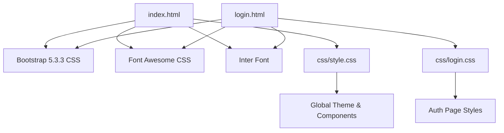
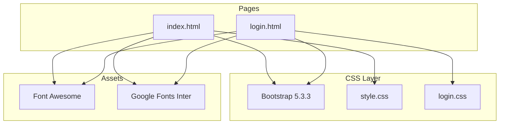
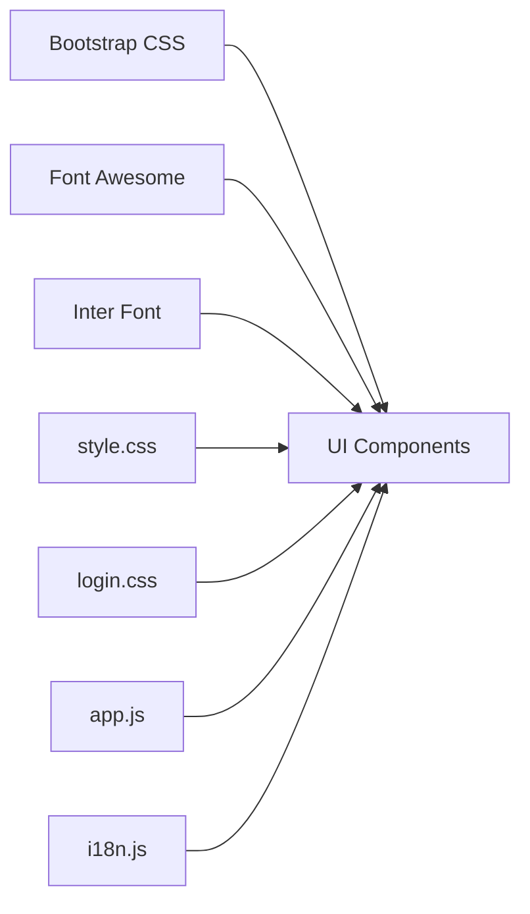

# Styling and Design System

<cite>
**Referenced Files in This Document**
- [index.html](file://index.html)
- [login.html](file://login.html)
- [style.css](file://css/style.css)
- [login.css](file://css/login.css)
- [app.js](file://js/app.js)
- [i18n.js](file://js/i18n.js)
</cite>

## Update Summary
**Changes Made**
- Updated header section to document new floating card design with enhanced search functionality
- Added comprehensive notification system documentation
- Enhanced account panel dropdown styling documentation
- Updated hero carousel implementation details
- Expanded trust bar component documentation
- Added mobile bottom toolbar navigation system
- Enhanced internationalization support documentation
- Updated responsive design patterns for mobile-first approach

## Table of Contents
1. [Introduction](#introduction)
2. [Project Structure](#project-structure)
3. [Core Components](#core-components)
4. [Architecture Overview](#architecture-overview)
5. [Detailed Component Analysis](#detailed-component-analysis)
6. [Dependency Analysis](#dependency-analysis)
7. [Performance Considerations](#performance-considerations)
8. [Troubleshooting Guide](#troubleshooting-guide)
9. [Conclusion](#conclusion)
10. [Appendices](#appendices)

## Introduction
This document explains the styling and design system used by AM MARKET. The application is built on Bootstrap 5.3.3 with a custom CSS layer that introduces consistent variables, tokens, and marketplace-specific components. It follows a mobile-first responsive approach, uses Google Fonts Inter for typography, Font Awesome for icons, and defines a cohesive color scheme centered around an orange primary and blue secondary palette. The documentation covers how to maintain consistency, create new components that match the system, adapt themes, and optimize CSS delivery.

## Project Structure
The project organizes styles into two main CSS files:
- style.css: Global theme, layout, and marketplace components (header, hero, categories, product cards, cart, footer).
- login.css: Dedicated styles for the authentication page (brand panel, forms, animations).

HTML pages include Bootstrap 5.3.3, Font Awesome, and Inter font via CDN links, then apply the custom CSS. JavaScript modules handle dynamic content and interactions but do not alter the core design tokens.

**Diagram sources**
- [index.html:7-10](file://index.html#L7-L10)
- [login.html:7-10](file://login.html#L7-L10)

**Section sources**
- [index.html:1-12](file://index.html#L1-L12)
- [login.html:1-12](file://login.html#L1-L12)

## Core Components
- Color tokens and spacing are centralized in CSS custom properties for consistent theming across pages.
- Typography uses Inter with a clear hierarchy and line-height for readability.
- Buttons, badges, and input groups follow consistent sizing, focus states, and transitions.
- Marketplace components include:
  - **Enhanced Header** with floating card design, advanced search functionality, language toggle, wishlist/cart badges, notifications, and improved account dropdown
  - **Hero Carousel** with floating bubbles, animated text, and slide navigation
  - **Trust Bar** with service guarantees and hover animations
  - **Account Panel** with user profile management and menu items
  - Category grid and sidebar navigation
  - Product cards with image hover effects, discount badges, and action buttons
  - Detail view with quantity controls and related products
  - Cart and checkout layouts using Bootstrap grid and custom cards
  - **Mobile Bottom Toolbar** with floating action button and tab navigation
  - Footer with brand info, navigation, newsletter form, and payment logos

Key implementation references:
- Custom properties and base styles: [style.css:1-28](file://css/style.css#L1-L28)
- **Enhanced Header and Search**: [style.css:31-225](file://css/style.css#L31-L225)
- **Hero Carousel Implementation**: [style.css:289-408](file://css/style.css#L289-L408)
- **Trust Bar Component**: [style.css:409-439](file://css/style.css#L409-L439)
- **Account Panel**: [style.css:440-501](file://css/style.css#L440-L501)
- **Mobile Bottom Toolbar**: [style.css:1323-1445](file://css/style.css#L1323-L1445)
- Product card styles: [style.css:549-687](file://css/style.css#L549-L687)
- Footer structure and styles: [style.css:761-973](file://css/style.css#L761-L973)
- Login page theme and form styles: [login.css:1-384](file://css/login.css#L1-L384)

**Section sources**
- [style.css:1-28](file://css/style.css#L1-L28)
- [style.css:31-225](file://css/style.css#L31-L225)
- [style.css:289-408](file://css/style.css#L289-L408)
- [style.css:409-439](file://css/style.css#L409-L439)
- [style.css:440-501](file://css/style.css#L440-L501)
- [style.css:1323-1445](file://css/style.css#L1323-L1445)
- [style.css:549-687](file://css/style.css#L549-L687)
- [style.css:761-973](file://css/style.css#L761-L973)
- [login.css:1-384](file://css/login.css#L1-L384)

## Architecture Overview
The design system architecture layers Bootstrap utilities with custom CSS variables and component classes. Pages compose these layers to achieve consistent UI across views. JavaScript dynamically renders components using predefined class names and data attributes, ensuring visual consistency without inline styles.

**Diagram sources**
- [index.html:7-10](file://index.html#L7-L10)
- [login.html:7-10](file://login.html#L7-L10)

## Detailed Component Analysis

### Theme Tokens and Variables
- Primary color set as an orange-blue tone with light/dark variants for interactive states and backgrounds.
- Muted and border colors provide subtle contrast for inputs and dividers.
- Radius tokens standardize rounded corners across components.
- Shadow tokens define elevation levels for cards and overlays.

Guidelines:
- Always use CSS variables for colors, radii, and shadows to ensure consistency.
- Extend the :root variables when introducing new shades; avoid hardcoding hex values in components.

References:
- Variables definition: [style.css:1-14](file://css/style.css#L1-L14), [login.css:1-10](file://css/login.css#L1-L10)

**Section sources**
- [style.css:1-14](file://css/style.css#L1-L14)
- [login.css:1-10](file://css/login.css#L1-L10)

### Typography
- Base font family is Inter with fallbacks to system fonts for performance.
- Headings use higher weights and tighter letter-spacing for modern look.
- Body text maintains comfortable line-height for readability.

Guidelines:
- Use semantic HTML headings and rely on Bootstrap utility classes for spacing.
- Keep font sizes modular and aligned with the token scale.

References:
- Body and link/button resets: [style.css:16-28](file://css/style.css#L16-L28), [login.css:12-29](file://css/login.css#L12-L29)

**Section sources**
- [style.css:16-28](file://css/style.css#L16-L28)
- [login.css:12-29](file://css/login.css#L12-L29)

### Enhanced Header with Floating Card Design
- **Floating Card Header**: Modern card-based header with rounded corners, subtle shadow, and sticky positioning
- **Advanced Search Box**: Full-width search input with integrated icon, focus states, and gradient background
- **Language Toggle**: Persistent language switcher with globe icon and current language display
- **Action Buttons**: Wishlist, cart, and notifications with badge counts and labeled options
- **Improved Account Dropdown**: Enhanced dropdown menu with avatar, profile management, and organized menu items

Guidelines:
- Maintain floating card design with proper z-index and shadow hierarchy
- Ensure search input has proper focus states and accessible placeholder text
- Keep badge counts synchronized with actual data through JavaScript updates

References:
- **Header floating card**: [style.css:31-44](file://css/style.css#L31-L44)
- **Search functionality**: [style.css:86-124](file://css/style.css#L86-L124)
- **Notification system**: [style.css:195-206](file://css/style.css#L195-L206)
- **Account dropdown**: [style.css:180-194](file://css/style.css#L180-L194)
- **JavaScript integration**: [app.js:217-244](file://js/app.js#L217-L244)

**Section sources**
- [style.css:31-44](file://css/style.css#L31-L44)
- [style.css:86-124](file://css/style.css#L86-L124)
- [style.css:195-206](file://css/style.css#L195-L206)
- [style.css:180-194](file://css/style.css#L180-L194)
- [app.js:217-244](file://js/app.js#L217-L244)

### Hero Carousel Implementation
- **Multi-slide Carousel**: Four promotional slides with unique gradient backgrounds and floating bubble decorations
- **Slide Navigation**: Dot-based navigation with active state indicators and smooth transitions
- **Animated Content**: Staggered rise-in animations for text elements and floating bubble effects
- **Responsive Images**: Aspect-ratio maintained images with mask effects and floating animations

Guidelines:
- Keep animations lightweight using transform and opacity for smooth performance
- Ensure proper contrast between text and gradient backgrounds for accessibility
- Implement lazy loading for images to improve initial load time

References:
- **Carousel structure**: [style.css:289-314](file://css/style.css#L289-L314)
- **Slide animations**: [style.css:315-328](file://css/style.css#L315-L328)
- **Navigation dots**: [style.css:329-348](file://css/style.css#L329-L348)
- **Content animations**: [style.css:349-407](file://css/style.css#L349-L407)
- **JavaScript control**: [app.js:246-262](file://js/app.js#L246-L262)

**Section sources**
- [style.css:289-314](file://css/style.css#L289-L314)
- [style.css:315-328](file://css/style.css#L315-L328)
- [style.css:329-348](file://css/style.css#L329-L348)
- [style.css:349-407](file://css/style.css#L349-L407)
- [app.js:246-262](file://js/app.js#L246-L262)

### Trust Bar Component
- **Service Guarantees**: Four key trust indicators (Fast Delivery, Best Price, Easy Returns, Secure Payment, 24/7 Support)
- **Interactive Icons**: Hover animations with pop effects and color transitions
- **Responsive Layout**: Flexible wrapping with proper spacing and mobile adaptations
- **Internationalized Text**: All content supports English and French languages

Guidelines:
- Maintain consistent icon sizing and spacing across all trust items
- Ensure sufficient color contrast for accessibility
- Keep text concise and impactful for quick scanning

References:
- **Trust bar structure**: [style.css:409-439](file://css/style.css#L409-L439)
- **Icon animations**: [style.css:429-435](file://css/style.css#L429-L435)
- **Responsive behavior**: [style.css:438-439](file://css/style.css#L438-L439)

**Section sources**
- [style.css:409-439](file://css/style.css#L409-L439)

### Account Panel with Enhanced Dropdown
- **User Profile Display**: Avatar, name, and profile link with conditional rendering based on login status
- **Organized Menu Items**: Grouped navigation with icons, separators, and hover effects
- **Dynamic Content**: Real-time updates for user status and logout functionality
- **Accessibility Features**: Proper ARIA labels and keyboard navigation support

Guidelines:
- Ensure proper state management for logged-in vs guest users
- Maintain consistent icon sizing and spacing throughout the menu
- Provide clear visual feedback for interactive elements

References:
- **Panel structure**: [style.css:440-501](file://css/style.css#L440-L501)
- **Menu items**: [style.css:478-500](file://css/style.css#L478-L500)
- **JavaScript logic**: [app.js:232-244](file://js/app.js#L232-L244)

**Section sources**
- [style.css:440-501](file://css/style.css#L440-L501)
- [app.js:232-244](file://js/app.js#L232-L244)

### Mobile Bottom Toolbar
- **Floating Navigation**: Fixed bottom toolbar with backdrop blur and elevated design
- **Tab Navigation**: Five main tabs (Home, Search, Cart, Favorites, Account) with active state indicators
- **Floating Action Button**: Elevated cart button with pulse animation and count badge
- **Responsive Behavior**: Automatically appears on mobile devices with safe area support

Guidelines:
- Ensure proper touch target sizing for mobile interactions
- Maintain consistent spacing and alignment across all tabs
- Implement smooth animations for tab switching and FAB interactions

References:
- **Toolbar structure**: [style.css:1323-1340](file://css/style.css#L1323-L1340)
- **Tab items**: [style.css:1341-1374](file://css/style.css#L1341-L1374)
- **FAB button**: [style.css:1375-1399](file://css/style.css#L1375-L1399)
- **Badge system**: [style.css:1401-1427](file://css/style.css#L1401-L1427)
- **Mobile responsiveness**: [style.css:1434-1445](file://css/style.css#L1434-L1445)

**Section sources**
- [style.css:1323-1340](file://css/style.css#L1323-L1340)
- [style.css:1341-1374](file://css/style.css#L1341-L1374)
- [style.css:1375-1399](file://css/style.css#L1375-L1399)
- [style.css:1401-1427](file://css/style.css#L1401-L1427)
- [style.css:1434-1445](file://css/style.css#L1434-L1445)

### Categories and Sidebar
- Grid-based category cards with hover lift and border accent.
- Sidebar list items highlight active state with theme color and subtle background.

Guidelines:
- Use grid utilities for responsive columns; keep icons and labels aligned.
- Active states should be visually distinct and keyboard accessible.

References:
- Categories grid and cards: [style.css:502-541](file://css/style.css#L502-L541)
- Sidebar list items: [style.css:1110-1169](file://css/style.css#L1110-L1169)

**Section sources**
- [style.css:502-541](file://css/style.css#L502-L541)
- [style.css:1110-1169](file://css/style.css#L1110-L1169)

### Product Cards
- Card container with rounded corners, shadow, and hover elevation.
- Image area uses aspect ratio and gradient backdrop; images scale on hover.
- Discount badges and promo tags differentiate offers.
- Action buttons for wishlist and add-to-cart with consistent sizing and transitions.

Guidelines:
- Use lazy loading for images and provide fallback placeholders.
- Keep price and brand information concise; ensure truncation for long titles.

References:
- Product card styles: [style.css:549-687](file://css/style.css#L549-L687)

**Section sources**
- [style.css:549-687](file://css/style.css#L549-L687)

### Detail View
- Large image area with aspect ratio and contained scaling.
- Quantity control box with plus/minus buttons and input field.
- Related products section rendered dynamically.

Guidelines:
- Ensure quantity controls are keyboard navigable and accessible.
- Provide clear stock status indicators and disabled states for unavailable items.

References:
- Detail image and quantity box: [style.css:688-729](file://css/style.css#L688-L729)

**Section sources**
- [style.css:688-729](file://css/style.css#L688-L729)

### Cart and Checkout
- Cart items displayed in cards with image, pricing, and quantity controls.
- Order summary uses Bootstrap grid and highlights totals with theme color.
- Checkout form sections grouped with cards and clear labels.

Guidelines:
- Keep summaries readable and totals prominent.
- Ensure form fields have proper labels and error states.

References:
- Cart item styles: [style.css:730-749](file://css/style.css#L730-L749)
- Checkout layout usage: [index.html:300-339](file://index.html#L300-L339)

**Section sources**
- [style.css:730-749](file://css/style.css#L730-L749)
- [index.html:300-339](file://index.html#L300-L339)

### Footer
- Brand block with logo and description.
- Navigation lists with icons and hover effects.
- Newsletter form with input wrap and themed submit button.
- Payment logos and bottom bar with copyright.

Guidelines:
- Keep footer links accessible and visually separated from content.
- Use consistent icon containers and hover states.

References:
- Footer styles: [style.css:761-973](file://css/style.css#L761-L973)

**Section sources**
- [style.css:761-973](file://css/style.css#L761-L973)

### Authentication Page
- Split layout with brand panel and form side.
- Floating bubbles animation and branded gradient background.
- Form inputs wrapped in styled groups with focus states and error shake animation.
- Submit button with gradient and hover lift effect.

Guidelines:
- Maintain high contrast for text over gradients.
- Use accessible error messages and clear validation feedback.

References:
- Auth card and brand panel: [login.css:72-184](file://css/login.css#L72-L184)
- Input groups and errors: [login.css:237-284](file://css/login.css#L237-L284)
- Submit button and socials: [login.css:298-374](file://css/login.css#L298-L374)

**Section sources**
- [login.css:72-184](file://css/login.css#L72-L184)
- [login.css:237-284](file://css/login.css#L237-L284)
- [login.css:298-374](file://css/login.css#L298-L374)

### Enhanced Internationalization Support
- **Bilingual Interface**: Complete English and French translations for all interface elements
- **Dynamic Language Switching**: Real-time language changes without page reload
- **Localized Content**: Category names, product descriptions, and user-facing text
- **Persistent Preferences**: Language selection stored in localStorage

Guidelines:
- Use data-i18n attributes for static text and t() function for dynamic content
- Ensure all new UI elements include proper translation keys
- Test both language modes thoroughly for completeness

References:
- **Translation system**: [i18n.js:8-380](file://js/i18n.js#L8-L380)
- **Language switching**: [i18n.js:420-462](file://js/i18n.js#L420-L462)
- **Integration points**: [app.js:1139-1155](file://js/app.js#L1139-L1155)

**Section sources**
- [i18n.js:8-380](file://js/i18n.js#L8-L380)
- [i18n.js:420-462](file://js/i18n.js#L420-L462)
- [app.js:1139-1155](file://js/app.js#L1139-L1155)

## Dependency Analysis
- CSS dependencies:
  - Bootstrap 5.3.3 provides grid, utilities, and base components.
  - Font Awesome supplies icons used throughout headers, buttons, and lists.
  - Google Fonts Inter loads the typeface for consistent typography.
- JavaScript integration:
  - app.js renders components using predefined class names and data attributes, relying on CSS for appearance.
  - i18n.js manages language switching and updates labels without altering styles.

**Diagram sources**
- [index.html:7-10](file://index.html#L7-L10)
- [login.html:7-10](file://login.html#L7-L10)

**Section sources**
- [index.html:7-10](file://index.html#L7-L10)
- [login.html:7-10](file://login.html#L7-L10)
- [app.js:1-1158](file://js/app.js#L1-L1158)
- [i18n.js:1-462](file://js/i18n.js#L1-L462)

## Performance Considerations
- CSS Delivery:
  - Load Bootstrap and Font Awesome via CDN for caching and reduced payload.
  - Keep custom CSS minimal and scoped; avoid redundant overrides.
  - Use CSS variables to reduce repetition and enable efficient theme updates.
- Animations:
  - Prefer transform and opacity for smooth animations; avoid heavy layout thrashing.
  - Limit number of simultaneous animations to reduce repaint cost.
- Images:
  - Use lazy loading for product images to improve initial load time.
  - Provide appropriate aspect ratios to prevent layout shifts.
- JavaScript Rendering:
  - Reuse DOM nodes where possible; minimize reflows during bulk updates.
  - Cache product details to avoid repeated network requests.

[No sources needed since this section provides general guidance]

## Troubleshooting Guide
- Inconsistent Colors:
  - Verify that components use CSS variables instead of hardcoded colors.
  - Check :root definitions for correct values.
- Broken Layouts:
  - Ensure Bootstrap grid classes are applied correctly and containers have proper padding.
  - Confirm sticky headers do not overlap content due to z-index conflicts.
- Animation Issues:
  - Inspect keyframe names and ensure they are not overridden elsewhere.
  - Test on low-power devices to verify performance.
- Accessibility:
  - Validate focus states for interactive elements.
  - Ensure sufficient color contrast, especially on gradient backgrounds.
- **Mobile Toolbar Issues**:
  - Check viewport meta tag for proper mobile scaling.
  - Verify safe area insets for devices with notches.
- **Language Switching Problems**:
  - Ensure all new UI elements have corresponding translation keys.
  - Verify localStorage persistence for language preferences.

**Section sources**
- [style.css:1-28](file://css/style.css#L1-L28)
- [style.css:31-225](file://css/style.css#L31-L225)
- [style.css:289-408](file://css/style.css#L289-L408)
- [style.css:1323-1445](file://css/style.css#L1323-L1445)
- [login.css:72-184](file://css/login.css#L72-L184)

## Conclusion
AM MARKET's design system combines Bootstrap 5.3.3 with a robust custom CSS layer that centralizes tokens, enforces consistent components, and supports a mobile-first responsive experience. The recent comprehensive UI redesign includes an enhanced floating card header, advanced search functionality, notification system, improved account panel, hero carousel, trust bar, and mobile bottom toolbar. By adhering to the established variables, typography, and interaction patterns, developers can extend the system confidently while maintaining visual coherence. The integration of Font Awesome and Inter ensures a polished interface, and thoughtful performance practices keep the application fast and accessible.

[No sources needed since this section summarizes without analyzing specific files]

## Appendices

### Creating New Components That Match the System
- Start with Bootstrap utilities for layout and spacing.
- Define any new tokens in :root if necessary; otherwise reuse existing variables.
- Follow naming conventions: descriptive class names aligned with component purpose.
- Include focus states, hover effects, and accessible labels.

References:
- Variable usage patterns: [style.css:1-14](file://css/style.css#L1-L14)
- Button and input patterns: [style.css:125-164](file://css/style.css#L125-L164), [login.css:237-284](file://css/login.css#L237-L284)

**Section sources**
- [style.css:1-14](file://css/style.css#L1-L14)
- [style.css:125-164](file://css/style.css#L125-L164)
- [login.css:237-284](file://css/login.css#L237-L284)

### Adapting the Theme for Different Use Cases
- Modify :root variables to shift primary/secondary colors while preserving contrast ratios.
- Update button and accent classes to reflect new brand tones.
- Ensure all components reference variables rather than hardcoded colors.

References:
- Theme variables: [style.css:1-14](file://css/style.css#L1-L14), [login.css:1-10](file://css/login.css#L1-L10)

**Section sources**
- [style.css:1-14](file://css/style.css#L1-L14)
- [login.css:1-10](file://css/login.css#L1-L10)

### Mobile-First Responsive Guidelines
- Use Bootstrap grid breakpoints to adjust layouts for smaller screens.
- Hide non-essential elements on mobile; prioritize critical actions.
- Ensure touch targets are adequately sized and spaced.
- Implement the mobile bottom toolbar for essential navigation functions.

References:
- Grid usage in pages: [index.html:74-355](file://index.html#L74-L355)
- Mobile toolbar and responsive behaviors: [style.css:1007-1031](file://css/style.css#L1007-L1031), [style.css:1434-1445](file://css/style.css#L1434-L1445)

**Section sources**
- [index.html:74-355](file://index.html#L74-L355)
- [style.css:1007-1031](file://css/style.css#L1007-L1031)
- [style.css:1434-1445](file://css/style.css#L1434-L1445)

### Internationalization Best Practices
- Use data-i18n attributes for static text elements
- Implement t() function for dynamic content with variable interpolation
- Ensure complete translation coverage for all user-facing strings
- Test language switching functionality thoroughly

References:
- Translation system: [i18n.js:432-462](file://js/i18n.js#L432-L462)
- Integration examples: [app.js:1139-1155](file://js/app.js#L1139-L1155)

**Section sources**
- [i18n.js:432-462](file://js/i18n.js#L432-L462)
- [app.js:1139-1155](file://js/app.js#L1139-L1155)