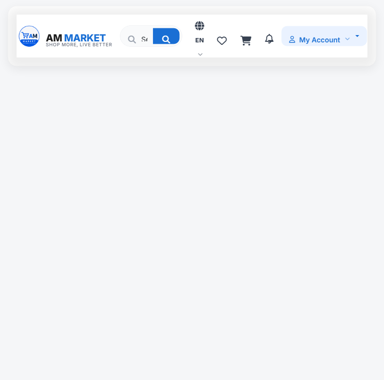

# AM MARKET — Shop More, Live Better

E-commerce storefront front-end for **AM MARKET**, a Moroccan online supermarket. It is fully static — no build step, no framework — and loads its real product catalog from [api.mmarket.ma](https://api.mmarket.ma), with automatic public CORS-proxy fallbacks so pages keep working even when opened straight from disk (`file://`).



## Pages

| Page | Purpose | Own assets |
|---|---|---|
| `index.html` | Home — hero carousel, categories, recently viewed, products | `js/home.js`, `css/home.css` |
| `all-categories.html` | Category directory | `js/all-categories.js`, `css/all-categories.css` |
| `categories.html` | Catalog — filters, sorting, pagination (`?cat=`, `?q=`, `?page=`) | `js/categories.js`, `css/categories.css` |
| `product.html` | Product detail (`?id=`) + related products | `js/product.js`, `css/product.css` |
| `cart.html` | Cart with quantity management and order summary | `js/cart.js`, `css/cart.css` |
| `checkout.html` | Delivery form + order placement | `js/checkout.js`, `css/checkout.css` |
| `orders.html` | Order history | `js/orders.js`, `css/orders.css` |
| `wishlist.html` | Saved products | `js/wishlist.js`, `css/wishlist.css` |
| `settings.html` | Profile, dark mode, language, payment & delivery preferences | `js/settings.js`, `css/settings.css` |
| `help.html` | Help center — delivery, payment, returns and order guidance | `css/help.css` |
| `login.html` | Sign in / create account (demo) | `css/login.css` |

Shared infrastructure lives in **`js/core.js`** (API client, localStorage state, header/footer/mobile-toolbar injection, product-card rendering) and **`css/common.css`**. Translations (EN/FR) live in **`js/i18n.js`**.

## Frontend admin prototype

The separate admin experience starts at **`admin/login.html`**. Its dashboard, products, categories, orders, customers, inventory, promotions, delivery, analytics, and settings sections are plain HTML/CSS/JS and reuse the storefront design tokens, theme, language, and read-only catalog utilities.

Demo credential and session handling is isolated in **`admin/js/admin-auth.js`**. This is a frontend UX prototype, not secure authentication: there is no backend, API write, database, role enforcement, or server persistence.

All admin mutations are deliberately browser-local. Product/category edits are local overlays, order statuses modify the existing `am_orders` browser data, customers and analytics are derived from local orders, and inventory/promotions/delivery/store settings use separate `am_admin_*_v1` localStorage records. These mutations do not publish to or alter the storefront catalog.

## Running locally

Just double-click `index.html` — the site works straight from disk (`file://`). Blocked API calls and product images automatically fall back to public CORS proxies, so no server is needed.

Optionally, a local server gives slightly faster first loads (no proxy hop):

```bash
npx serve .
# or
python -m http.server 8000
```

## Features

- Real catalog: categories, products, search with smart suggestions, pagination
- Cart, wishlist and order history persisted in `localStorage` (keys `am_cart`, `am_wish`, `am_orders`), shared across all pages
- Catalog state lives in the URL — results are bookmarkable and shareable
- Bilingual English / French, language choice persisted
- Dark / light theme, persisted and applied before first paint (no flash)
- Guest-friendly: browsing, cart and checkout all work without an account;
  a saved profile (name, delivery details, default payment) pre-fills checkout
- Mobile-first: bottom toolbar navigation, single-line responsive header
- Plain HTML/CSS/JS + Bootstrap 5 and Font Awesome via CDN

## Notes & limitations

- Authentication and orders are client-side demos — nothing is written back to the API.
- The admin area is also a frontend-only prototype; every write is local to the current browser origin.
- Delivery is free over 200 DH, otherwise 20 DH.
- The smoking category is excluded on purpose (`EXCLUDE_CAT` in `js/core.js`).
